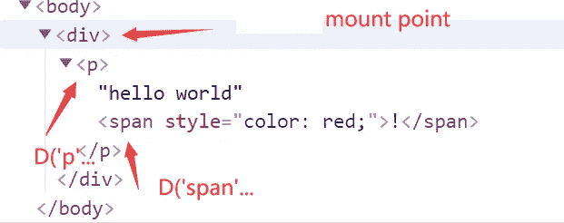
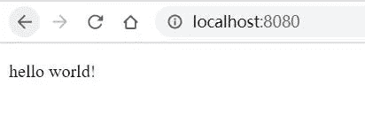
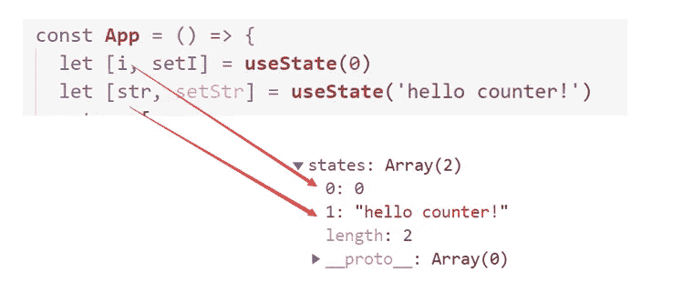
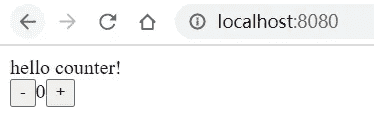

# 从头开始构建自己的类似 React 的库

> 原文：<https://javascript.plainenglish.io/build-a-react-like-lib-from-scrach-b54878a12c3d?source=collection_archive---------5----------------------->


## 反应

几乎每个软件开发者或多或少都知道 React。甚至一些后端开发者或者机器学习开发者——甚至一些非开发者。是的，很好的图书馆，优雅，有前途。每一个前端开发者都在谈论它的 API，它的优化，它的内部机制。

## 内在机制

内部机制是最重要的部分，但如何理解它们呢？阅读 React 源代码当然是一个选择，但可能会感到力不从心。那么，我们是否会从一个读过所有源代码的人那里读到一些摘要呢？我想知道我们要读多少文摘才能完全理解。所以，我的建议是自己建立 React！

## 建立你自己的反应

听起来很疯狂？可能就一点点。我们只需要编写一些必要的部分，就可以让一个微小的程序工作——仅此而已。你可以尝试自己打造自己感兴趣的部分。如果你不知道 React 是如何工作的，也不知道如何构建一个 React，你可以跟我来。我的源代码可以在这里找到:

[](https://github.com/postor/build-react-like-lib-from-scrach) [## post or/build-react-like-lib-from-scrach

### 手撸 react 框架 | build react-like from scrach lib 目录下一共 200 行代码，功能不多，旨在方便大家理解视图框架的机制 | 200 line of codes under lib folder…

github.com](https://github.com/postor/build-react-like-lib-from-scrach) 

## 第一步。渲染组件

假设我们有这样一个组件:

```
<p>hello world
  <span style={{color:'red'}}>!</span>
</p>
```

它是 JSX 格式的，所以在 React 中，代码应该是:

```
React.createElement('p',null,'hello world',
  React.createElement('span',{style:{color:'red'}},'!')
)
```

我不方便。我只是用了一个 D 类来代替，所以我需要使用`new`关键字。而且我用固定键`children`把孩子换成道具参数。因此，组件的定义和用法应该是这样的:

```
import { D, render } from '../lib'let el = document.createElement('div')
document.body.append(el)render(el, new D('p', {
  children: [
    'hello world',
    new D('span', {
      children: '!',
      style: { color: 'red' }
    })
  ]
}))
```

我们预计它会这样呈现:



所以，我们只需要递归地将 D 实例转换成元素，并将它们附加到 DOM 树中。

```
// lib/d.jsexport class D {
  ...
  init(parent) {
    this.parent = parent
    if (!this.component) {
      // text
      this.el = document.createTextNode(this.props.children)
    } else if (typeof this.component == 'string') {
      // html element 
      this.el = document.createElement(this.component)
      let { children, ...rest } = this.props
      assignProps(this.el, rest)
      this.children = normalizeDArr(children)
    } else {
      // component
      setREACT_LIKE_CUR_COMPONENT(this)
      setREACT_LIKE_CUR_COMPONENT_STATEI(0)
      this.children = normalizeDArr(this.component(this.props))
    }
    // append to DOM tree
    if (this.el) this.parent.append(this.el)
    // init children recursively
    this.children.forEach(x => x.init(this.el || this.parent))
  }
  ...
}
```

如果您检查我的代码并运行`npm run dev1`，您可以得到以下结果:



这在某种程度上代表了虚拟 DOM，每个 HTML 元素都绑定了一个 D 实例。

## 第二步。用状态渲染

我们现在逐字地或者用包含相同值的变量来呈现`hello world`。然后，我们唯一需要做的就是存储它。`useState`在数组中存储数据。



当调用`useState`和状态数组的相应索引时，你需要知道哪个组件正在渲染。

```
// lib/hooks.js
export function useState(initalValue) {
  let d = getREACT_LIKE_CUR_COMPONENT() // **get component**
  let i = getREACT_LIKE_CUR_COMPONENT_STATEI() // **get index**
  if (d.states[i] === undefined) d.states[i] = initalValue
  let v = d.states[i]
  setREACT_LIKE_CUR_COMPONENT_STATEI(i + 1) return [v, v1 => {
    d.states[i] = v1
    d.updateState()
  }]
}
```

`useState`在`App`组件内部被调用。所以在调用`App`组件之前，我们需要存储`component`并将状态数组`index`重置为`0`。

```
// lib/d.js
export class D {
  constructor(component, props = {}) {
    ...
    this.states = []
    ...
  } init(parent) {
    ...
      // render component
      setREACT_LIKE_CUR_COMPONENT(this)
      setREACT_LIKE_CUR_COMPONENT_STATEI(0)
      this.children = normalizeDArr(this.component(this.props))
    ...
  }
}
```

现在，您可以使用`useState`并在 render 中使用该状态。

## 第三步。处理事件

React 事件是全局管理的，因此我们用委托来模拟它:

```
// lib/event.js
const EVENT_TYPES = ['click']
// **delegate from mount point**
export function listen(el) {
  return EVENT_TYPES.map(eventType => {
    let listener = e => {
      let key = 'on' + capitalize(eventType)
      bubble(e.target, e, key)
    }
    el.addEventListener(eventType, listener)
  })
}// **bubble event until it's handled**
function bubble(el, e, key) {
  if (!el) return
  if (el[key]) return el[key](e)
  bubble(el.parentElement, e, key)
}
```

然后将`onClick`道具添加到按钮:

```
// step2/App.jsimport { D, useState } from "../lib"const App = () => {
  let [i, setI] = useState(0)
  let [str, setStr] = useState('hello counter!')
  return [
    str,
    new D('div', {
      children: [
        new D('button', {
          children: '-',
          // **onClick assigned to element as prop**
          onClick: () => setI(i - 1)
        }),
        i + '',
        new D('button', {
          children: '+',
          // **onClick assigned to element as prop**
          onClick: () => setI(i + 1)
        })
      ]
    })
  ]
}export default App
```

React 与其说是一个反应器，不如说是一个调度器，那么它如何合并状态/属性变化并同时处理它们呢？这里我用了`Promise.resolve`。

```
// lib/d.js
export class D {
  ...
  updateState() {
    this.stateChangeCount++
    // **wait for changes to merge**
    Promise.resolve().then(() => {
      if (!this.stateChangeCount) return
      this.stateChangeCount = 0
      if (this.el) {
        let { children, ...rest } = this.props
        assignProps(this.el, rest)
        if (!this.component) {
          return this.el.data = children
        }
      }
      let children = this.getChildren(this.props)
      ...
  }
  ...
}
```

这不是一个很难的问题，对不对？如果你用我的代码运行`npm run dev`，你会得到这个结果。试着点击按钮。



## 重要的一点

React 可以做更多的事情。例如，如果某些渲染花费太多时间，React 可以将渲染延迟到下一帧，这样就不会出现无响应的站点。它还可以进行列表比较、转换、暂停等等。但是你不能指望 200 行代码做这么多。这只是一个制作类似 React 的库的指南和底层 React 机制的简单解释。

*更多内容尽在*[plain English . io](http://plainenglish.io/)