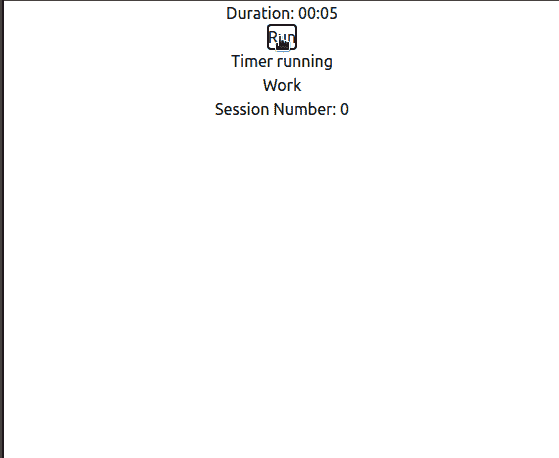
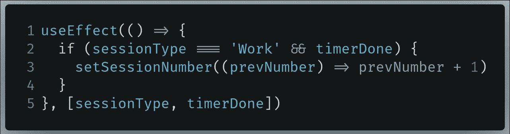

# 用 Material-UI 和 TailwindCSS 构建一个 React Pomodoro 应用程序

> 原文：<https://javascript.plainenglish.io/build-a-react-pomodoro-app-with-material-ui-and-tailwindcss-e4bab98e30ae?source=collection_archive---------10----------------------->

## 如何在 React Web 应用程序中使用材质组件和 TailwindCSS

[Source: David Cohen On Unsplash](https://unsplash.com/photos/FUVPpOyjAvQ)

在本文中，我们将在 React 中使用来自 [Material-UI](https://material-ui.com/) 的组件构建一个番茄定时器。此外，我们将使用 [TailwindCSS](https://tailwindcss.com/) 库，不仅使我们的应用程序看起来更好，而且使网站设计更具响应性，也就是说，使我们的 web 应用程序在大屏幕和移动屏幕上看起来都更好。

在本教程结束时，我们的应用在桌面和移动设备上都将是这样的:

(Left to right): Website on desktop and mobile devices

在开始之前，我们先讨论一下常规番茄定时器的功能。

# 什么是番茄定时器？

这个计时器允许用户把他的工作分成几个间隔。这些间隔也可以称为会话。它是这样工作的:

*   第一个间隔是`Work`时段。这通常持续 25 分钟。
*   在`Work`间隔之后是`Break`间隔。`Break`间隔持续 5 分钟。
*   每个*番茄红素*时段由一个`Work`和一个`Break`间歇组成
*   在四次番茄大战后，我们将开始一次`Long Break`大战。`Long Break`环节持续 15 分钟。
*   在`Long Break`间歇之后，我们将再次从番茄工作法第 1 节开始。

# 入门指南

## 初始化项目

让我们首先告诉`create-react-app`初始化我们的应用程序的存储库。为此，运行以下终端命令:

Command to initialize the project

我们现在已经初始化了项目。现在让我们继续安装所需的库。

## 安装所需的库

对于这个项目，我们将安装以下模块:

*   `luxon`:这个包将帮助以正确的格式显示主定时器。为什么不用`moment`代替？由于`moment.js` [现在是一个遗留项目](https://momentjs.com/docs/#/-project-status/)，我们不会在我们的应用中使用这个库。安全漏洞绝对是我们最不想要的。
*   `@material-ui/core`:这个包允许我们使用 Material-UI 提供的元素。在本教程中，我们将使用材质的`Button`组件。
*   `@material/icons`:我们将在这个项目中使用的图标将来自这个包。

要安装这些库，请运行以下终端命令:

Command to install required packages

接下来，我们需要安装 TailwindCSS。为此，请遵循本页上的说明。

完成后，让我们获取这个项目所需的音频文件。

## 获取所需的音频文件

我们将使用材料中的[声音资源。IO 网站](https://www.material.io/design/sound/sound-resources.html#)。在那里，下载`.zip`文件，然后将其解压缩到您的电脑中。从这个提取的文件夹，我们将使用以下声音文件:

*   `alert_simple.wav`位于`material_product_sounds/material_product_sounds/wav/02 Alerts and Notifications`文件夹中。
*   `notification_simple-01.wav`位于`material_product_sounds/material_product_sounds/wav/02 Alerts and Notifications`内

我们现在需要将这些文件移动到我们的项目中。为此，请执行以下步骤:

*   在项目的`src`文件夹中，创建一个名为`Audio`的新文件夹。
*   现在将上述声音文件复制到您的`Audio`目录中。

最后，您的文件层次结构应该如下所示:

我们结束了！现在让我们继续编写一些代码。

# 主定时器:Timer.js 文件

在项目的`src`文件夹中，创建一个名为`Timer.js`的文件。`Timer.js`文件将是一个组件，它将作为我们的主 Pomodoro 定时器。换句话说，这将是我们项目的基础。

当上面提到的步骤完成后，让我们继续将必要的库导入到我们的项目中。

由于`Timer`将是一个组件，请确保文件末尾有以下一行:

Ensure this line stays at the end of the file at all times

这确保了我们可以使用`Timer`组件

## 导入所需模块

在`Timer.js`中，在文件顶部写下以下代码:

Code to import required modules

*   `Line 1` : `React`是必需的，因为`Timer`是将被渲染到 DOM 的组件。此外，我们还引入了`useState`，因为我们将把我们的定时器长度和其他附加信息存储在状态变量中。
*   `Line 2`:来自`luxon`包的`Duration`类将用于以正确的格式显示我们的定时器长度。

我们现在完成了。现在让我们继续声明我们将在项目中使用的状态。

## 宣布各州

在`Timer.js`中，我们将使用以下状态变量:

*   `timerLength`:以秒为单位存储计时器的长度。它的初始值将是 1500 秒，相当于 25 分钟。这是因为用户将首先从工作部分开始。然而，为了节省开发时间，让我们把它设置为 25 秒。
*   `timerOn`:这将由一个布尔值组成，它将告诉番茄钟定时器运行或暂停。它的初始值将是`false`，以确保当用户打开应用程序时，主定时器不会运行。
*   `timerDone`:`timerDone`变量将存储一个布尔值，该值将指示番茄定时器是正在运行还是已经完成。因此，这个变量也将帮助我们向用户提供声音反馈，让他们知道计时器是否已经完成。它的初始值将是`true`，因为这将确保定时器不运行。
*   `sessionType`:该状态将存储一个字符串值，该字符串值将指示用户是否有一个`Break`间隔、正在进行一个`Work`会话或者正在经历一个`Long Break`会话。`sessionType`的值将在三个字符串之间交替:`Work`、`Break`和`Long Break`。它的初始值将是`Work`。这是因为客户端将首先从`Work`会话开始。
*   `sessionNumber`:这将存储一个整数值，告诉我们 pomodoro 会话的当前号码。它的初始值将是 0。

既然我们已经讨论了我们的想法，让我们用代码实现它。转到`Timer.js`，在导入之后，编写以下代码:

Code to declare variables in Timer.js

当这些完成后，让我们继续为我们的用户界面打下基础。

## 显示状态

在`Timer.js`中，在声明您的状态后，现在在`Timer()`函数中编写以下代码:

这段代码实际上将我们的状态值呈现给 DOM。

*   `Lines 4–6`:这里，我们告诉`luxon`以秒为单位显示`timerLength`的值，以`minutes:seconds`格式显示`timerLength`的值。
*   `Lines 7–9`:点击`button`元素，在`true`或`false`之间切换`timerOn`状态。如果`timerOn`是`true`，那么按钮的文字会说`Pause`，否则会说`Run`。
*   `Lines 10–12`:这些行将呈现状态`timerDone`、`sessionType`和`sessionNumber`的值。

运行程序之前，转到`App.js`并将`Timer.js`导入到您的项目中，如下所示:

Importing Timer into App.js

现在，停留在`App.js`中，找到下面这段代码:

Code to find in App.js

现在像这样替换它:

Code to replace with in App.js

在`Line 4`的代码告诉 React 在 DOM 上显示`Timer`组件。

现在用下面的终端命令运行程序:

Terminal command to run the code

这将是代码的输出:

Output of the code

太好了，我们的代码成功了！现在让我们继续让我们的主定时器工作。

最后，`Timer.js`应该是这样的:

## 运行番茄定时器

为了让我们的计时器运行，我们需要做以下事情:

*   创建一个函数，将`timerLength`的值减 1。
*   使用`setInterval`使该方法每秒运行一次。
*   使用`timerOn`状态暂停或恢复该间隔。因此，这意味着我们现在可以暂停或恢复番茄定时器了。
*   此外，如果`timerOn`的值为`true`，我们也将`timerDone`设置为`false`。

现在让我们编写代码来实现这些步骤。

在`Timer`函数中，编写以下代码:

这里，我们运行`useEffect`钩子来告诉 React 查找`timerOn`状态的变化。如果值`timerOn`改变了，那么这段代码应该运行。

*   `Line 2`:这里我们声明一个叫做`interval`的变量，它等同于一个`setInterval`函数。
*   `Line 3–5`:如果`timerOn`的值为`true`，则将`timerLength`的值减 1。否则，不要减少计时器会话的长度。这意味着我们在番茄定时器中增加了暂停功能。
*   `Line 7-9`:这是一个清理功能，仅在组件卸载时运行。这里，我们清除 interval 函数以防止内存泄漏。

最后，我们的输出看起来是这样的:

Output of the code

瞧啊。我们的代码有效！你可以看到，每次`timerOn`是`true`，那么定时器就会运行。否则它会自动暂停。

现在让我们继续处理计时器结束时的事件，也就是说，当`timerLength`的值达到 0 时。

最后，`Timer.js`应该是这样的:

## 处理计时器完成事件

要在计时器完成时处理事件，我们必须执行以下操作:

*   检测剩余时间(`timerLength`)是否为 0。
*   如果上述条件为`true`，则将`timerOn`改为假。这样做是为了不让计时器运行。
*   将`timerDone`设置为`true`。这将产生一种声音。我们将在本教程的后面部分讨论这个问题。
*   将`sessionType`更改为`Work`、`Break`或`Long Break`以显示下一个会话。我们将在本教程的后面讨论这个问题。

现在我们需要将这个想法实现到代码中。

在`Timer`函数中，编写以下代码:

Code to write in Timer.js

如`Line 5`所示，我们告诉 React 只有在`timerLength`的值改变时才运行上面的代码。

现在运行代码。这将是结果:

Output of the code

太好了，我们的代码成功了！然而，目前我们的代码存在一个主要问题。

计时器计时完成后，尝试运行计时器。这将是结果:

Output of the code

显然，在现实世界中，我们不希望我们的计时器达到负值！在后面的部分中，我们将减少这种错误。在下一节中，我们将学习如何改变音程类型。

最后，`Timer.js`应该是这样的:

## 切换会话类型

为了切换我们的区间类型，我们需要像这样改变`sessionType`的值:

*   如果`sessionType`的值为`Work`，则切换到`Break`
*   如果`sessionType`的值为`Break`，则切换到`Work`
*   如果`sessionType`的值是`Long Break`，则切换到`Work`。在本教程的后面部分，我们将更多地学习长休息时间。

在您的`Timer`函数中，找到下面这段代码:

Code to find in Timer.js

现在，用下面的代码片段替换它:

唯一的变化出现在`Lines 5 to 10`

*   `Line 5`:先前`sessionType`的值存储在`prevType`变量中。
*   `Line 6`:如果`sessionType`状态之前的值为`Work`，则将`sessionType`的值改为`Break`。
*   `Line 7`:将`sessionType`的最后一个值与字符串`Break`进行比较。如果两者相等，则将`sessionType`的值改为`Work`
*   `Line 8`:如果`prevType`为`Long Break`，则将`sessionType`的值改为`Work`。在本教程的后面部分，我们将更多地研究`Long Break`间隔。

这将是代码的输出:

Output of the code

我们可以看到，`sessionType`的值变成了`Break`。这意味着我们的代码有效！

既然我们已经切换了会话，我们将继续根据之前的会话类型在`Work`、`Break`和`Long Break`定时器之间切换。

最后，`Timer.js`应该是这样的:

## 切换定时器:从工作模式切换到休息模式

为了在不同的定时器之间切换，我们需要做的是:

*   如果`sessionType`的当前值为`Work`，则将`timerLength`设置为 25 分钟。
*   但是如果`sessionType`设置为`Break`，则`timerLength`的值设置为 5 分钟。
*   此外，假设`sessionType`为`Long Break`，则将定时器长度更改为 15 分钟。

现在让我们编写代码来实现我们的过程。

在您的`Timer`功能中，编写以下代码:

*   `Lines 2–4`:如果`sessionType`的当前值为`Work`，则将 Pomodoro 定时器的时长设置为 25 分钟。为了节省时间，我们暂时将其更改为 25 秒。
*   `Lines 5-7`:假设`sessionType`的值为`Break`，则将主定时器的长度设置为 5 秒。
*   `Lines 8–10`:否则，将主定时器的时长设置为 15 秒，这是`Long Break`会话的默认时长。

运行程序。这将是输出:

Output of the code

如您所见，当`sessionType`从`Work`切换到`Break`时，定时器也立即从`Work`会话切换到`Break`模式！这意味着我们的代码可以工作。太好了。

在下一节中，我们将根据用户已经经历的会话数编写切换到`Long Break` 会话的代码。

最终，`Timer.js`应该是这样的:

## 切换定时器:从中断模式到长时间中断模式

要将主定时器切换到`Long Break`，我们需要做以下工作:

*   每个疗程在一个`Break`间隔后结束**。这意味着每次`timerDone`状态为`true` **、当前`sessionType`值为`Work.`时，都要将`sessionNumber`状态增加 1****
*   检查用户是否完成了 4 个会话(`sessionNumber > 4`)
*   如果上述条件为`true`，则将`sessionType`的值改为`Long Break`。

现在让我们用代码实现它。

在您的`Timer`函数中，找到下面这段代码:

现在将其替换为以下内容:

唯一的变化来自`Lines 11 to 14`。

*   `Line 11`:检查用户是否在`Work`会话中，以及`timerDone`是否为`true`。这表明他已经经历了一个`Break`会话。
*   `Line 12`:如果上述条件为`true`，则递增`sessionNumber`
*   `Line 14`:将`timerDone`添加到`useEffect`依赖数组意味着现在 React 也必须检测到`timerDone`状态的变化。如果检测到任何变化，那么运行下面的代码。

这将是代码的输出:

Output of the code

正如您所看到的，当用户完成一个会话时，我们的`sessionNumber`状态会自动增加。这意味着我们的代码起作用了！

剩下的工作就是编写代码来获得 Pomodoro 应用程序中的`Long Break`会话。

在您的`Timer`函数中，编写以下代码:

Code to find in Timer.js

*   `Line 2`:检查`sessionNumber`的值是否大于 4。
*   `Line 3`:如果该条件为`true`，则将间隔类型设置为`Long Break`。
*   `Line 4`:将间隔数重置为 0。
*   `Line 6`:将`sessionNumber`添加到我们的依赖数组意味着 React 将在检测到`sessionNumber`状态的任何变化时运行这段代码。

这将是代码的结果:

Output of the code

大家可以看到，第四节之后，不是`Work`节，而是`Long Break`区间上来了。此外，请注意，在`Long Break`会话之后，`Work`会话也随之而来。这意味着我们的代码有效！

如果您想知道`Work`会话是如何自动出现的，让我们回顾一下。回想一下我们之前编写的这段代码:

The piece of code that caused the output

你可以看到，根据`Line 8`，如果`sessionType`之前的值是`Long Break`，那么`sessionType`的新值应该自动为`Work`。

我们现在完成了这一部分！在下一节中，我们将介绍对定制我们的`Work`、`Break`和`Long Break`会话长度的支持。

最后，`Timer.js`应该是这样的:

# 自定义计时器:Customizer.js 文件

在您的`src`目录中，创建一个名为`Customizer.js`的新 React 组件。该组件将允许用户定制其间隔会话的计时器。我们将使用上下文 API 来实现这一点。我们将在本教程的后面详细讨论这一点。

让我们从在`Customizer.js`中编写以下代码开始:

Code to write in Customizer.js

这里，我们导入`React`，因为`Customizer.js`将是一个 React 组件。此外，我们还引入了`createContext`方法，因为我们将依靠上下文 API 向其他 React 组件发送状态。此外，我们还导入了`useState`,因为我们将使用状态来处理计时器数据的操作和存储。

此外，确保这一行位于文件的末尾:

Ensure that this line stays at the end of the file

完成后，让我们继续在`Customizer.js`文件中声明状态。

## 声明国

这里，我们有三种状态:

*   `breakLength`:我们`Break`会话类型的定时器长度。它的初始值将是 5 分钟。
*   `workLength`:我们`Work`区间类型的长度。它的初始值将是 25 分钟。
*   `longBreakLength`:我们`Long Break`会话类型的定时器长度。它的初始值将是 5 分钟。

在您的`Customizer.js`文件中，编写以下代码:

Code to write in Customizer.js

*   `Line 1`:这里，我们将`props`作为参数传入，这样我们就可以使用上下文 API。我们将在本教程的后面使用上下文。

完成后，让我们继续创建按钮来操作我们的状态。

## 操纵状态

在本节中，我们将创建三对按钮。每对将增加或减少`breakLength`、`workLength`或`longBreakLength`的值。

在您的`Customizer`函数中，编写以下代码:

这可能看起来像一个很长的代码片段，但这真的很容易理解。我们本质上是在创建增加或减少我们状态的`button`元素。

*   `Lines 5-8, 18-20 and 30–32`:这里，我们减少了`breakLength`、`workLength` 和 longBreakLength 状态。在这几行代码中，`prevLength`存储了我们状态的前一个值。如果`prevLength`为 0，那么让状态的当前值停留在 0。换句话说，我们不想让我们的计时器长度为负值。
*   `Lines 13, 24 and 37`:这里，我们增加了状态的值。

在运行代码之前，转到`App.js`并像这样导入`Customizer`:

Code to write in App.js

现在我们来渲染一下。在`App.js`中找到下面这段代码:

现在像这样替换它:

`Line 4`处的代码告诉 React 将`Customizer`功能组件呈现到 DOM 上。

这将是代码的输出:

Output of the code

瞧啊。我们的代码有效。在下一节中，我们将通过使用 React 的上下文 API 将这些状态变量发送给`Timer.js`。

最后，`Timer.js`应该是这样的:

这就是`Customizer.js`应该看起来的样子:

## 将状态从 Customizer.js 转移到 Timer.js

我们现在在`Customizer.js`中有我们的状态，并希望这些变量被发送到`Timer.js`。这样，我们的应用程序中终于有了自定义定时器。然而，有一个小问题:我们如何发送这些数据？

一种方法是通过道具。然而，在我们的项目中使用道具似乎是一项极其乏味的任务。另一种方法是将`Customizer.js`的所有代码放到`Timer.js`中。结果，这会让`Timer.js`看起来像一大堆杂乱的代码。为了缓解这个问题，让我们使用上下文 API。

就在`Customizer`函数声明之前，编写以下代码:

Exporting Contexts in Customizer.js

这里，我们为每个状态变量创建一个上下文对象，然后导出它们，以便它们可以与`Timer`组件一起使用。

现在转到`Customizer.js`中的`return`块，编写下面这段代码:

Code to write in Customizer.js

这里，我们导出状态变量的所有值。

现在转到您的`Timer.js`文件，并执行以下步骤:

*   从`Customizer`组件中导入上下文变量，如下所示:

Code to write in Timer.js

*   此外，确保您已经将`useContext`添加到您的导入列表中:

Code to write in Timer.js

*   现在，在您的状态声明之后添加以下代码行，

Code to write in Timer.js

状态`longBreak`、`breakLength`和`workLength`的值现在已经存储在这些变量中。这意味着我们几乎完成了将状态变量的值从`Customizer.js`导入`Timer.js`的工作。

*   现在将这段代码添加到您的`return`块中:

Code to write in Timer.js

最后，转到您的`App.js`文件，找到下面这段代码:

Code to find in App.js

然后将其替换为以下内容:

Code to write in App.js

这意味着现在`Timer.js`可以访问`Customizer.js`中的状态数据。

运行代码。这将是输出:

Output of the code

太好了！我们的代码有效！如您所见，`Timer.js`呈现了我们在`Customizer.js`中定义的状态值。

在下一节中，我们将在 Pomodoro 应用程序中引入对自定义计时器的支持。

最后，`Customizer.js`应该是这样的:

这就是`Timer.js`应该看起来的样子:

最后，`App.js`应该是这样的:

## 获取自定义计时器

在这里，我们必须对`Timer.js`做一些改动。这是我们必须做的:

*   用`workLength`、`breakLength`和`longBreakLength`替换硬编码的定时器长度。
*   检测用户是否点击了长度计时器的递增和递减按钮。
*   如果用户点击了这些按钮，那么使用番茄工作灯计时器中的新长度。

在`Timer.js`中，找到下面这段代码:

现在将其替换为以下内容:

在这里，我们告诉 React 在`workLength`、`breakLength`和`longBreakLength`状态的值改变时运行这段代码。换句话说，这段代码将在用户点击递增或递减按钮时运行。

这将是代码的结果:

Output of the code

如您所见，我们的代码有效！但是有一个主要的缺陷。尝试在番茄红素计时器运行时改变计时器。

Output of the code

如您所见，无论谁的状态值被更改，计时器都会自动重置。

如果你想知道为什么，让我们回到我们最近在`Timer.js`模块中写的这段代码:

Code that causes the problem in Timer.js

为什么这段代码会导致问题？举个例子，假设用户在`Work`会话中。后来，当`Work`间隔类型运行时，他决定改变`breakLength`状态。因此，这个钩子中的代码被执行。`if`语句将首先获得`sessionType`状态的值。因为在这种情况下，`sessionType`的值是`Work`，因此运行来自`Line 2 to Line 4`的代码段，该代码段将定时器长度再次设置回`workLength`，本质上是重置定时器。

要防止此问题，请找到这段代码:

Code to find in Timer.js

现在将其替换为以下内容:

现在这段代码确保了如果不相关的计时器长度被改变，Pomodoro 计时器不会重置。

这将是代码的结果:

Output of the code

太好了！我们的代码有效！

然而，在进入下一部分之前，让我们整理一下我们的用户界面。

转到`Timer.js`，删除以下代码:

Code to remove in Timer.js

现在转到`Customizer.js`并将这段代码片段移动到`return`块的顶部。

Move this code to the top of your return block in Customizer.js

最后，您的输出应该是这样的:

Output of the code

我们现在完成了这一部分！在下一节中，我们将向 React 应用程序添加 Material-UI 和 Tailwind CSS。此外，我们还将增加声音资产。

最后，`Customizer.js`应该是这样的:

这就是`Timer.js`应该看起来的样子:

# 收尾

## 材料-用户界面

在本节教程中，我们将使用由 [Material-UI](http://material-ui.com) 提供的图标和`Button`元素。

进入`Customizer.js`，从`@material-ui/core/Button`导入`Button`，从`@material-ui/icons`导入一些图标:

Code to write in Customizer.js

*   `LaptopChromebookOutlinedIcon`将代表`Work`间隔
*   `FreeBreakfastOutlinedIcon`将代表`Break`间隔
*   `LocalHotelOutlinedIcon`将代表`Long Break`会话
*   `AddIcon`和`RemoveIcon`将用作`Button`组件上的图标，以显示增量和减量选项。

在同一个文件中，找到下面这段代码:

现在用下面的块替换它:

该代码执行以下任务:

*   渲染`p`元素旁边的图标。例如，我们在`Line 37`上渲染了`LaptopChromebookOutlinedIcon`。
*   用 Material-UI 提供的`Button`组件替换`button`元素。`Line 40`提供了一个示例。
*   将按钮的图标(`startIcon`属性)设置为`AddIcon`或`RemoveIcon`。一个例子在`Line 44`和`Line 55`处。
*   它们的颜色可以是蓝色(`color=”primary`)或红色(`color=”secondary”` )。在`Line 52`和`Line 65`处的例子。
*   给他们`contained`变种，这样他们就可以吃饱了。在`Line 18`举个例子。
*   注意，我们还用`div`元素包装了每个组(例如 `Line 11` 到`Line 34`)。我们这样做是为了在本教程的后面使用 TailwindCSS

运行代码。结果应该是这样的:

Output of the code

太好了！我们的代码有效！按钮看起来明显更好，我们现在有图标。现在让我们继续对我们的`Timer.js`文件做同样的事情。

如前所述，将`Button`和这些图标导入`Timer.js`:

Code to write in Timer.js

完成后，转到`Timer`函数中的`return`块:

现在像这样替换它:

*   `Line 4–12`:在这里，我们只是创建一个`Button`元素。然而，关注`Line 8`。在`Line 8`上，我们告诉 Material 如果`timerOn`状态的值是`true`(定时器当前正在运行)，那么渲染暂停图标。否则呈现播放图标，告诉用户定时器已经暂停。
*   `Line 19-23`:这里，我们去掉了显示`sessionType`值的功能，代之以图标。在这些行中，如果`sessionType`的值是`Break`，我们告诉 React 渲染`FreeBreakfastOutlinedIcon`。然而，如果间隔类型是`Work`，则渲染`LaptopChromebookOutlinedIcon`。否则显示`LocalHotelOutlinedIcon`。

运行程序。这将是结果:

Output of the code

太好了！我们的代码有效！在下一节中，我们将在这个 React web 应用程序中集成 TailwindCSS。

最后，`Customizer.js`应该是这样的:

这就是`Timer.js`应该看起来的样子:

## TailwindCSS:设置颜色

在开始本节之前，让我们先改变顺风的`primary`和`secondary`颜色值。

为此，请转到项目文件夹根目录下的`tailwind.config.js`。在那里，找到下面这段代码:

Code to find in tailwind.config.js

现在将其替换为以下内容:

*   `Line 4`:这里，我们告诉 TailwindCSS，当我们将背景色设置为`bg-primary`时，将页面的背景色替换为`#3b4252`。
*   `Line 7`:将`text-primary`、`text-secondary`和`text-sessionNumber`的文字颜色更改为相应的值。

现在让我们继续设置这个页面的背景颜色。

转到您的`public`目录并找到`index.html`文件。在那里，找到开始的`body`标记:

Code to find in index.html

现在给它一个类名`bg-primary`:

Attach the bg-primary class to the body tag in index.html

运行代码。这将是结果:

Output of the code

太好了！我们的代码有效。现在让我们自定义我们的文本样式，使文本更具可读性。

让我们首先让我们的计时器看起来更突出。为此，首先转到`Timer.js`并找到呈现`timerLength`状态值的`p`标签:

Code to find in Timer.js

现在给`p`标签添加一个`className`属性，如下所示:

Code to write in Timer.js. The change is highlighted in yellow

在这里，我们将以下类名分配给这个段落元素:

*   `font-sans`:将文本的字体系列改为`Sans`
*   `tracking-widest`:设置最宽的字母间距，以确保最大的可读性。
*   `text-6xl`:将文本尺寸设置为特大号。
*   `text-primary`:改变字体颜色，吸引最大的注意力。记得我们之前在`tailwind.config.js`中定义了`text-primary`颜色。

现在让我们改变显示`sessionNumber`的`p`标签的文本样式。在您的`Timer.js`文件中，在您的`return`块中找到以下行:

Code to find in Timer.js

将以下类名附加到它，如下所示:

Code to write in Timer.js. The changes are highlighted in yellow

*   `text-sessionNumber`:我们之前在`tailwind.config.js`文件中定义了这个颜色。这种颜色使我们的文本易读
*   `text-2xl`:使我们的文本看起来更大。

现在让我们对我们的`Customizer`组件做同样的事情。去`Customizer.js`找到第一个开口`div`标签:

Code to find in Customizer.js

现在附上如下类名:

Code to write in Customizer.js. The changes are highlighted in yellow

*   这将使文本变大。
*   `text-secondary`:改变文本颜色，使其可读。我们在`tailwind.config.js`中定义了这个颜色。本质上使我们的文本变白。

运行代码。这将是我们的结果:

Output of the code

最后，让我们现在使会话类型图标更加可见。

在`Timer.js`中，找到执行条件渲染的代码段，根据间隔类型显示图标:

Code to find in Timer.js

向每个图标组件添加下面的`style`属性，将图标变成白色:

这将是代码的输出:

Output of the code

太好了！我们的文本是可见的，我们的应用程序看起来真的很好。在下一节中，我们将在 React 应用程序中引入响应式网页设计。

最终，`Timer.js`应该是这样的:

`Customizer.js`应该是这样的:

## 响应性网页设计

第一步，去`Timer.js`。让我们从使用 Flexbox 定位我们的组件开始。我们会像一个柱子一样垂直放置我们的物品。

在`Timer.js`中，找到第一个打开`div`的标签:

Code to find in Timer.js

将以下类别附加到该`div`元素上:

Add these classes in Timer.js. The changes are highlighted in yellow

*   `flex`:告诉 TailwindCSS 我们的`div` HTML 元素将是一个 flex 容器。
*   `flex-col`:这个属性可以垂直放置我们的物品。

这将是您的代码输出:

Output of the code

太好了。我们的代码起作用了。让我们现在开始`Customizer.js`。

在`Customizer.js`中，我们也将利用 flex 容器的力量。然而，这个组件的元素应该根据我们应用程序使用的设备来定位。让我们讨论如何渲染`Customizer`组件中的元素。

在移动设备上，我们想要一个`flex-col`容器，否则在更大的设备上，我们想要一个`flex-row`容器。换句话说，我们希望我们的组件在手持屏幕上垂直放置，而在大屏幕上，我们希望我们的组件水平放置。此外，容器中的所有项目应在横轴的中心对齐。

走到`Customizer.js`中您的`Customizer`功能组件处，找到第一个`div`开口标签:

Code to find in Customizer.js

让我们先告诉 TailwindCSS 把这个`div`容器变成一个灵活的盒子，它应该垂直放置子元素:

Add these classes in Customizer.js. The changes are highlighted in yellow

这应该是程序的输出:

Output of the code

现在让我们增加子元素之间的垂直空间，并在顶部添加一些填充。将以下类添加到同一个`div`元素中:

Code to write in Customizer.js. The change is highlighted in yellow

*   `space-y-10`:每个子元素有 10 个单位的垂直空间。
*   `mt-6`:`div`集装箱上边距应为 6 个单位。

这将是代码的输出:

Output of the code

我们的子元素现在有了彼此之间的空间，这无疑使我们的程序看起来更好。这意味着我们的代码可以工作！

现在让我们通知 TailwindCSS，我们想将它水平放置在一个更大的设备上。将下列类附加到同一个`div`元素:

Code to write in Customizer.js. The changes are highlighted in yellow

*   在一个不小的屏幕上，也就是说，在一个更大的显示器上，水平显示元素——就像一行一样。

这将是输出:

Output of the code

如您所见，我们的元素现在已经被水平放置，这表明我们的代码起作用了。但是，第一个子组件没有正确对齐。为此，我们先通知 TailwindCSS 在大屏幕上查看页面时删除子元素之间的垂直空格。

将以下类添加到同一个`div`类中:

Class to add in Customizer.js. The change is highlighted in yellow

*   `sm:space-y-0`:在大屏幕上，子`div`元素之间不应该有垂直空间。

这将是结果:

Output of the code

太好了！现在让我们调整这些项目，使每个项目周围有相等的空间。

Add the following class to Customizer.js. Change is highlighted in yellow

这将是输出:

Output of the code

太好了！现在让我们通过调整窗口大小来测试我们的设计响应能力。

正如你所看到的，我们的`Customizer`功能组件根据窗口的大小将自己从`flex-col`容器转换到`flex-row`，反之亦然。这意味着我们的设计是可行的！

在最后一部分，让我们现在添加音频到我们的应用程序。

最后，`Timer.js`应该是这样的:

这就是`Customizer.js`应该有的样子:

## 添加音频

在本教程的开始，我们在我们的项目中引入了一些音频资源。让我们现在使用它们。

让我们将这些文件导入到`Timer.js`中。编写下面几行代码`Timer.js`:

Add these imports into Timer.js

这里，我们从位于`src`文件中的`Audio`文件夹导入`wav`文件。

*   `startedAudio`将在用户启动番茄定时器时播放。
*   `endedAudio`将在计时器结束时播放。

现在在您的`Timer`函数中声明几个`Audio`实例:

Code to write in Timer.js

这段代码允许浏览器将我们的`wav`文件识别为`Audio`对象，以便可以播放它们。

在`Timer.js`中，找到检测`timerDone`和`timerDone`变化的`useEffect`挂钩:

Code to find in Timer.js

现在在这个钩子中用下面的代码替换它:

Code to write in Timer.js

这些变化出现在`Line 5 to Line 7`中。

*   `Line 5`:检测`timerDone`的值是`true`还是`false`。
*   `Line 6`:如果是`true`，则播放`endedSound`音频文件。这表明定时器已经完成。

现在让我们播放`startedSound`文件。在`Timer`组件的`return`模块中，找到播放或暂停定时器的`Button`组件。

Code to find in Timer.js

像这样改变它:

Code to replace with in Timer.js

变化出现在`Line 8`中。这里，我们告诉 React 在用户点击按钮时播放`startedSound`音频文件。

现在让我们运行代码。这将是输出:

Output of the code

请注意，浏览器的标题栏显示我们的应用程序在计时器启动和结束时都会播放声音。这意味着我们的代码是成功的。

我们终于完成了我们的项目！在下一部分，我们将讨论如何扩展这款应用的功能。

最后，`Timer.js`应该是这样的:

这就是`Customizer.js`应该看起来的样子:

# 让这个应用程序更好的想法

*   在明亮和黑暗模式之间切换:你可以为这个应用程序添加明亮模式，这样如果用户在白天或早上使用这个应用程序，对眼睛来说会更容易。这个教程可以帮助你切换你的明暗模式。
*   添加闹铃功能:请注意，在我们的应用程序中，每次计时器结束或开始时，只会播放一次声音。为了让这个应用程序更好，你可以在计时器结束时播放声音，然后当用户点击停止按钮时让它停止。
*   PWA:你也可以把这个 web 应用做成渐进式 Web 应用，这样用户即使离线也可以运行它。

# 结论

这是一个很长的教程！我鼓励你玩代码和解构程序来更好地理解代码。如果你有困惑，也鼓励你广泛研究。不要放弃！

谢谢你坚持到最后！祝你愉快。

# Github 链接和更多学习资源

## Github 链接

这是我们项目的存储库。

## 进一步阅读

*   [React 的上下文 API 解释](https://medium.com/better-programming/reacts-context-api-explained-baebcee39d2f)
*   [材质-UI 反应教程-穿越媒体](https://www.youtube.com/watch?v=vyJU9efvUtQ)
*   [使用带有 React-codingsmarway 的 TailwindCSS】](https://www.youtube.com/watch?v=hRFbqdJKRvQ)
*   [React And TailwindCSS 图片库- Traversy Media](https://www.youtube.com/watch?v=FiGmAI5e91M)

下一篇: [React 路由器，已解释](https://medium.com/better-programming/react-routers-explained-ff89153a6405)
上一篇:[在 NodeJS 中构建一个带有 Google 认证的 Notes 应用](https://medium.com/better-programming/build-a-notes-app-with-google-authentication-in-node-js-e0c3dea761e1)