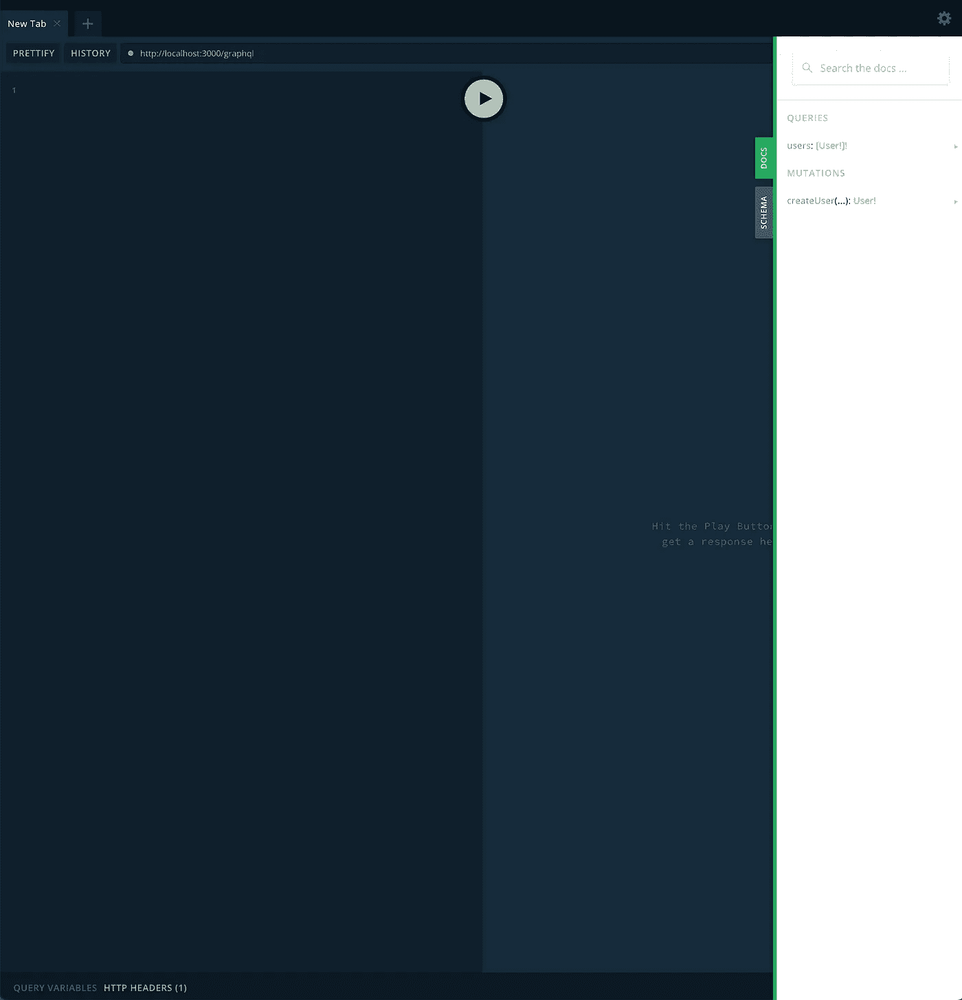

# 用 NestJS、MongoDB 和 TypeScript 构建一个可伸缩的 GraphQL 服务器

> 原文：<https://javascript.plainenglish.io/build-a-scalable-graphql-server-with-nestjs-mongodb-typescript-1eeda049f7c8?source=collection_archive---------1----------------------->

在本指南中，我们将使用[nestj](https://nestjs.com/)构建一个 GraphQL API。NestJS 是一个 NodeJS 框架，旨在构建可伸缩、高效和可靠的应用程序。该框架是开源的，并且有易于遵循的文档。


遵循本指南的结果是，您将拥有一个构建在 NestJS 之上的 GraphQL API，它可以部署在 Docker 容器中。GraphQL 层将使用 [TypeGraphQL](https://typegraphql.com/) 开发，减少了对 TypeScript & GraphQL 样板文件的需求。

**⭐You 可以找到成品库 here⭐:**[https://github . com/tomanagle/graph QL-nestjs-MongoDB-typescript-tutorial](https://github.com/tomanagle/GraphQL-NestJS-MongoDB-TypeScript-Tutorial)

⚠️警告⚠️:·内斯特带有很多样板文件。如果你以前没用过，跟着这个教程你就知道我的意思了。不要因此而放弃 NestJS，它是一个很棒的框架。样板文件意味着您的代码组织得非常好，非常适合有很多开发人员参与的大型应用程序。因此，初创公司和大公司可能会越来越多地使用 NestJS，所以现在学习如何使用它是一个好主意。

## 第一部分。项目设置

全局安装 NestJS 并创建一个新的 NestJS 应用程序:

```
npm i -g @nestjs/clinest new my-project
```

打开项目目录并安装所需的依赖项:

```
cd my-projectyarn add @nestjs/graphql graphql-tools graphql apollo-server-express mongoose
```

给你的`tsconfig.json`文件设置两个属性，`esModuleInterop` & `skipLibCheck`为真。您的`tsconfig.json`文件现在应该如下所示:

`esModuleInterop: true`告诉 TypeScript 我们希望能够将 CommonJS 模块导入到 ES6 模块代码库中。参考:[https://www.typescriptlang.org/tsconfig#esModuleInterop](https://www.typescriptlang.org/tsconfig#esModuleInterop)

`skipLibCheck: true`告诉 TypeScript 我们想要跳过`node_modules`文件夹中的类型检查 ob 库。这可以节省编译时间，并防止节点模块中的冲突类型破坏编译。参考:[https://www.typescriptlang.org/tsconfig#skipLibCheck](https://www.typescriptlang.org/tsconfig#skipLibCheck)

我也喜欢把`package.json`中的开始命令从`start`改成`dev`。

## 第二部分。MongoDB & Mongoose 设置

1.  生成数据库模块:

```
nest g mo database
```

2.生成数据库提供程序:

```
touch src/database/database.providers.ts
```

3.创建一个常量文件:

`touch src/constants.ts`

4.将以下代码添加到您的`database.module.ts`中:

5.将数据库连接字符串添加到常量文件中:

5.将以下代码添加到`database.providers.ts`文件中:

打开`app.module`,确保代码如下所示:

**文档:**[https://docs.nestjs.com/recipes/mongodb](https://docs.nestjs.com/recipes/mongodb)

## 第三部分。创建 GraphQL 服务器

这是 NestJS 样板文件的开始。在我们开始生成所需的文件之前，有必要了解用户的请求将如何在应用程序中流动，如何得到解决，以及如何从应用程序返回到用户界面。


上面的图表，从 GraphQL 框往下，显示了我们在这一步将构建什么。

以下命令来自 [NestJS CLI](https://docs.nestjs.com/cli/usages) 。这些命令使用别名，所以例如`s`指的是一个服务。

1.  **生成用户服务:**

```
nest g s User
```

服务层是一个薄层，包括创建、更新、读取和删除数据库中的数据所需的方法。它通过提供程序直接连接到数据库。

**2。生成用户模块**

```
nest g mo User
```

NestJs 模块用于组织应用程序的结构。

**3。生成用户解析器**

```
nest g r User
```

因为 API 使用的是 TypeGraphQL，所以解析器将负责查询、变异、订阅和解析器。因此，如果我们在解析器中定义一个查询，我们只需要用`@Query`对它进行注释，它就会被添加到 GraphQL 模式中。

**4。创建用户模式:**

```
touch src/user/user.schema.ts
```

用户模式包括 Mongoose 模式和用户类型定义。你可以把这两个分开，但是，我们已经有足够多的文件，我发现它们经常一起使用，足以保证它们在同一个文件中。

**5。创建用户输入文件:**

```
touch src/user/user.input.ts
```

输入包括由`@InputType`装饰器注释的输入定义。通常创建数据传输对象(DTO)文件来保存输入定义和类型定义，例如用户类型定义，这种风格只是个人偏好。

6。创建用户提供商

```
touch src/user/user.providers.ts
```

最后，提供者用于注入依赖项。在这种情况下，我们将使用提供者将数据库连接依赖注入到用户服务中。

打开`user.schema.ts`并添加以下代码:

可以修改用户模式以适合您的用户类型。您的用户类型需要扩展可以从 mongoose 包导入的`Document`。

要了解更多关于集成 mongose 和 TypeScript 的信息，请阅读[使用 mongose 和 TypeScript 的强类型模型](https://tomanagle.medium.com/strongly-typed-models-with-mongoose-and-typescript-7bc2f7197722)

打开`user.service.ts`文件并添加以下代码:

上述服务包括创建一个用户、查找一个用户和查找多个用户的三种方法。

🔥热点建议🔥:使用来自 Mongoose 的输入类型使服务更容易使用。在这里可以看到强类型服务的相关文章:[https://tomanagle . medium . com/even-strong-typed-models-with-mongose-and-typescript-916 f 0 a 9 e 5c 3 c](https://tomanagle.medium.com/even-stronger-typed-models-with-mongoose-and-typescript-916f0a9e5c3c)

打开`user.input.ts`并添加以下代码:

输入文件指定解析器函数将接收什么类型的 TypeScript 和 GraphQL。

打开`user.resolver.ts`文件并添加以下代码。

解析器是定义所有查询、变异和订阅的地方。每个查询、变异和下标都将被标注上相应的修饰符`@Query`、`@Mutation`或`@Subscription`。

将以下内容添加到`user.providers.ts`文件中:

用户提供者将把数据库连接注入用户服务。

将用户提供者添加到应用程序模块:

在 NestJS 中，模块将应用程序的不同部分粘合在一起。用户模块将所有部件粘合在一起以提供这个模块，然后用户模块将被插入到应用程序模块中。

使用`yarn start`或`yarn dev`启动服务器，如果您有启动脚本。在[http://localhost:3000/GraphQL](http://localhost:3000/graphql)访问 graph QL 游乐场

您将能够看到包含带有`users`查询和`createUser`变异的文档的运动场。



要测试 API，请创建一个具有以下变体的用户:

```
mutation createUser($input: CreateUserInput!) {
  createUser(input: $input) {
    email
    age
    name
  }
}
```

上面的变化表明我们将提供符合`CreateUserInput!`定义的输入。

在`QUERY VARIABLES`输入中使用以下输入:

```
{
  "input": {
    "age": 30,
    "name": "Tom",
    "email": "[test@exmaple.com](mailto:test@exmaple.com)"
  }
}
```

用户现在应该在数据库中了，让我们通过查询所有用户来测试它。

使用`users`查询来查找所有用户:

```
query getUsers {
  users {
    age
    name
    email
  }
}
```

您应该会看到上面的用户返回到用户数组中。

## 第四部分。用 Docker 将应用程序容器化

既然标题说应用程序将是可伸缩的，它应该用 Docker 容器化。

我假设您已经安装了 Docker，如果没有，请按照[获取 Docker](https://docs.docker.com/get-docker/) 页面上的说明进行操作。

因为我们的应用程序有一个 MongoDB 数据库，所以我们需要在应用程序旁边运行一个 MongoDB 实例，或者使用一个外部数据库提供者，比如 MongoDB Atlas。最简单和最安全的方法是使用外部数据库提供者。

我假设你有一个 [MongoDB Atlas](https://www.mongodb.com/cloud/atlas) 账户，并且已经建立了一个数据库。

1.  **创造一个**

在根目录下创建一个名为`Dockerfile`的文件:

`touch Dockerfile`

**2。在根目录下创建一个名为**的文件

`touch docker-compose.yml`

**3。可选:在根目录下创建一个流程文件**

`touch process.json`

`process.json`文件将包括 [PM2](https://pm2.keymetrics.io/) 的配置，一个 Node.js 的进程管理器

您可以使用 node，`node dist/main.js`运行应用程序，但是，如果应用程序在容器中死亡，就没有重新启动它的机制。更高级的实现将终止容器，将流量路由到另一个容器，并启动一个新容器。然而，我们不会在这篇文章中讨论这样的实现。

**4。将下面的代码添加到** `**Dockerfile**` **:**

**5。将以下代码添加到** `**docker-compose.yml**` **文件中:**

确保取消注释并用 MongoDB 连接字符串替换第 9 行的字符串。

**6。将以下内容添加到** `**process.json**` **文件中:**

流程文件将告诉 PM2 生成尽可能多的节点应用程序实例。因为 Node 是单线程的，所以它将只使用一个内核。如果您的机器有多个内核，您会希望它为每个内核生成一个实例。

https://pm2.keymetrics.io/docs/usage/quick-start/PM2 文献

**7。开始你的应用**

要启动应用程序运行，请执行以下操作:

`docker-compose up`

## 进一步阅读

⭐ **完整资源库:**[https://github . com/tomanagle/graph QL-nestjs-MongoDB-typescript-tutorial](https://github.com/tomanagle/GraphQL-NestJS-MongoDB-TypeScript-Tutorial)

🏁**带 NextJs 启动器的 NestJS graph QL:**[https://github.com/tomanagle/NextJS-NestJS-GraphQL-Starter](https://github.com/tomanagle/NextJS-NestJS-GraphQL-Starter)

🐈 **NestJS 文档:**[https://docs.nestjs.com/](https://docs.nestjs.com/)

🌞 **TypeGraphQL 文档:**[https://typegraphql.com/docs/introduction.html](https://typegraphql.com/docs/introduction.html)

🎼【https://docs.docker.com/compose/】Docker-compose documentation:T23

[](https://plainenglish.io/blog/how-to-build-a-graphql-ecommerce-app-from-scratch) [## 如何从头开始构建一个 GraphQL 电子商务应用程序

### 这就是你要建造的东西！埃森哲的一项调查(19 个国家的 20，000 多名消费者)发现，47%的人…

简明英语. io](https://plainenglish.io/blog/how-to-build-a-graphql-ecommerce-app-from-scratch) 

如果您有任何问题或反馈，请留下评论。我阅读了所有的评论，并在需要的地方进行了调整。感谢您的阅读。

## 🌎让我们保持联系

[在 YouTube 上订阅](https://www.youtube.com/TomDoesTech)
[不和](https://discord.gg/4ae2Esm6P7)
[推特](https://twitter.com/tomdoes_tech)
[抖音](https://www.tiktok.com/@tomdoestech)
[脸书](https://www.facebook.com/tomdoestech)
[insta gram](https://www.instagram.com/tomdoestech)
[给我买杯咖啡](https://www.buymeacoffee.com/tomn)

*更多内容请看*[***plain English . io***](https://plainenglish.io/)*。报名参加我们的* [***免费周报***](http://newsletter.plainenglish.io/) *。关注我们关于*[***Twitter***](https://twitter.com/inPlainEngHQ)[***LinkedIn***](https://www.linkedin.com/company/inplainenglish/)*[***YouTube***](https://www.youtube.com/channel/UCtipWUghju290NWcn8jhyAw)*[***不和***](https://discord.gg/GtDtUAvyhW) *。对增长黑客感兴趣？检查* [***电路***](https://circuit.ooo/) *。***