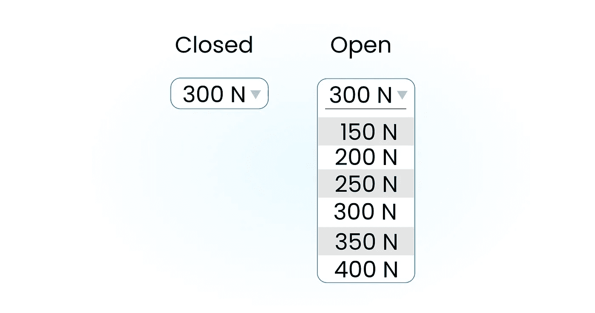
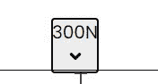
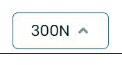
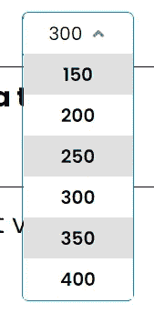

# 在 React 中构建一个简单的自定义下拉菜单

> 原文：<https://javascript.plainenglish.io/build-a-simple-customized-dropdown-menu-in-react-9e469b06d7c9?source=collection_archive---------6----------------------->

Photo by [Markus Spiske](https://unsplash.com/@markusspiske?utm_source=unsplash&utm_medium=referral&utm_content=creditCopyText) on [Unsplash](https://unsplash.com/s/photos/dropdown-menu?utm_source=unsplash&utm_medium=referral&utm_content=creditCopyText)

有很好的方法来制作一个漂亮的下拉菜单。其中一个就是用 [react-select](https://react-select.com/home) 。但是，如果你想让你自己的实践或建立自己的项目组件只是跟着走。

对于那些没有时间通读的人来说，在这一页的底部写下了完整的代码。:)

# 目标

我们的目标是制作一个组件，它将带有一个**标题**(这可以是下拉菜单的标题，或者在我们的例子中是一个 od 300N 的初始值)和一个**列表**，它们将是菜单项，作为**道具**。当调用我们的组件时，它应该看起来像这样:

当菜单项被点击时，菜单标题也应该动态改变。我们需要能够在单击下拉标题时切换菜单项，并在下拉菜单外单击时关闭。

此外，下拉菜单中每隔一个菜单项应该有一个灰色背景。

Figma prototype

# 让我们开始编码吧

像往常一样，让我们首先制作一个`Dropdown.js`和`Dropdown.css`文件。

下拉菜单由标题和菜单项组成，我们的 HTML 代码最后看起来会像这样:

我们需要向组件添加`isMenuOpen`状态(用于切换菜单)和`header`状态。

由于我们正在制作我们自己的组件，可以定制，每个下拉菜单将有自己的一套项目，我们需要跟踪选定的项目。我们将从列表中创建一个带有属性的对象映射:id、item 和 selected。如果 header 也包含在给定列表中，则在地图中将其选中。

## 制作下拉菜单

首先，我们将制作一个`header`按钮，带有值、图标(如果关闭它将是三角形向下，如果打开它将是三角形向下)和 onClick 函数。

我写过一篇关于如何将 SVG 图标导入 React 项目的文章:

 [## 如何在 React 中显示图标

### 在学习 React.js 的时候，我多次问自己，在网站上显示图标的最佳实践是什么？

medium.com](https://medium.com/javascript-in-plain-english/how-to-display-icons-in-react-e1b650ee8015) 

我们将使用 react-icons 包，如上面的文章中所解释的。

Please, ignore this line from now on! :)

我们的标题按钮代码现在看起来像这样:

CSS

如果我们放一些 CSS，应该是这样的:

现在，唯一缺少的是菜单中的其他项目。我们将使用`map`功能展示它们:

如果你想知道更多关于在 React 中有条件地应用一个类的信息，我写了一个关于它的故事:

 [## 如何在 React 中有条件地应用一个类

### 有几个方法可以有条件地应用一个类，让我们看看如何去做！

medium.com](https://medium.com/javascript-in-plain-english/how-to-conditionally-apply-a-class-in-react-d0e7e34cccf4) 

当然，我们需要编写`onClick`函数`selectItem`，它将改变 header 和 isMenuOpen 的状态，因为如果我们单击菜单项，该菜单项应该是我们的下一个 header，单击后我们希望菜单关闭。

这就够了。

# 最终解决

Finished dropdown

## 下拉菜单。JS 文件

## CSS 文件