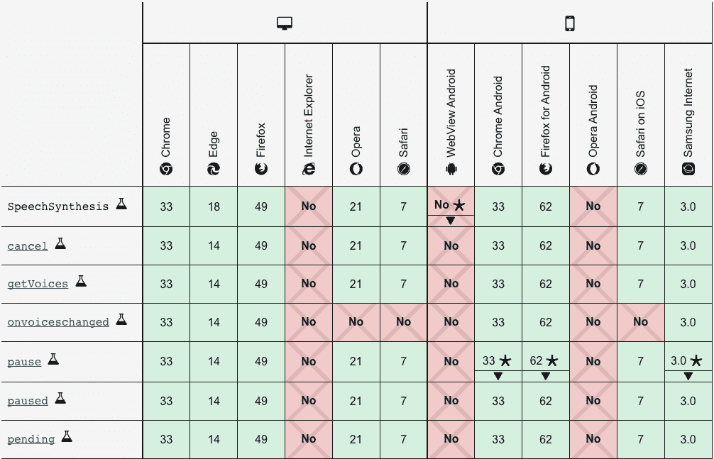
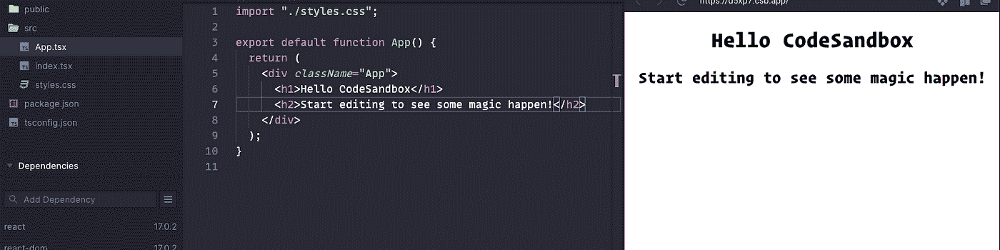
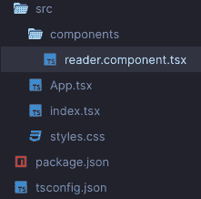
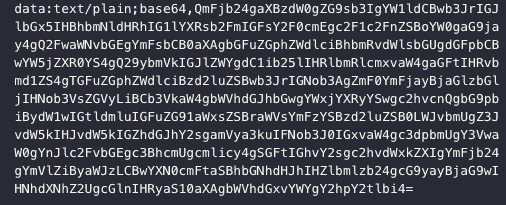
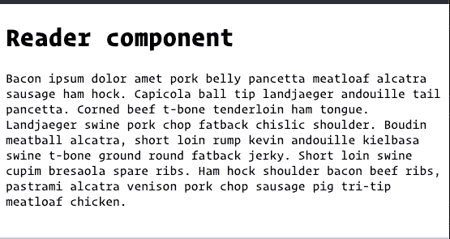

# 使用 Web 语音 API 构建一个简单的文本到语音转换应用程序

> 原文：<https://javascript.plainenglish.io/build-a-simple-text-to-speech-app-with-the-web-speech-api-7a6303ff4f9?source=collection_archive---------9----------------------->


Photo by [Andrea De Santis](https://unsplash.com/@santesson89?utm_source=medium&utm_medium=referral) on [Unsplash](https://unsplash.com?utm_source=medium&utm_medium=referral)

有没有想过构建自己的屏幕阅读器会是什么样子？有了 Web Speech API，这是一个可以实现的任务。在本文中，我们将构建一个基本的文本到语音阅读器，同时探索一些我们也可以使用的其他功能。然而，这种技术也有一些丑陋的缺点，但是我们将继续探索这些缺点。现在，让我们来看看这项技术是什么，我们可以用它做什么。

# 网络语音 API 🗣

Web 语音 API 是由浏览器提供的音频接口，用于处理音频输入和输出。这意味着，虽然我们将主要关注音频输出特性，作为本文的一部分，但我们也可以通过单独的`SpeechRecognition`输入控制器来完成语音识别等任务。Web Speech API 公开了一个`SpeechSynthesis`控制器，它为我们提供了一些基本的定制选项来设置我们的音频文本阅读器。

# 和睦相处🤷🏽‍♂️

虽然 Web Speech API 已经出现了一段时间，但它并不与所有浏览器兼容。事实上，目前，整个 Web Speech API 整体上还处于实验阶段。这意味着虽然这些解决方案现在可以工作，但是 API 可能会在将来发生变化，导致不必要的错误。基本上，您可以自行决定使用这个 API，如果您想避免这些问题，就不要将它包含在产品代码中。在这一点上，`SpeechSynthesis` API 比`SpeechRecognition` API 支持更多的浏览器。



# 我们将会建造什么


animated text to speech player

我们将使用`SpeechSynthesis API`和 React 构建一个简单的阅读器。你可以只用 JavaScript 来做这个，但是这并不有趣。CodeSandbox 示例的代码将在本文末尾，以防您遇到困难。该应用程序将执行以下操作:

*   显示一个播放按钮，允许用户听到音频提要
*   展开以显示自开始读取以来经过的时间
*   如果再次按下播放按钮或完成阅读，则关闭
*   播放时显示小动画
*   清理`SpeechSynthesis`以确保它不会导致内存泄漏

# 入门指南

本文将假设您已经安装了节点/NPM。如果您不确定，请打开终端并键入以下内容，然后检查输入后的结果:

```
$npm -v
```

这应该会显示您当前的 npm 版本。如果您在这里看到一个错误，那么您需要转到 Node.js 网站，并按照那里的安装说明进行操作。Npm 将与 Node 打包在一起。

如果你们都很好，那么我们可以继续创建我们的 React 应用程序。让我们从创建 React 应用程序脚本开始。

```
$npx create-react-app text-reader
# or
$yarn create react-app text-reader# if you would like to use TypeScript
$npx create-react-app my-app --template typescript
```

这将创建一个名为`text-reader`的项目，其中将包含我们所有的基本 React 代码以及一些示例代码。我将在我的项目中使用 CodeSandbox，所以一些样板代码看起来会有所不同，但最终是一样的。要运行您的应用程序并查看它在本地环境中的加载情况，请在您的终端中运行以下脚本:

```
$npm run start
```



App.tsx in CodeSandbox

如果您不熟悉 React，没关系，因为我们将更详细地介绍我们的步骤。现在，找到您的`App.js`和`styles.css`文件，用下面的代码替换组件中的所有样板代码。

```
import "./styles.css";export default function App() {
  return (
    <div className="reader_wrapper">
      <div> hello World</div>
    </div>
  );
}
```

然后让我们开始在我们的`styles.css`中添加下面的样式

```
.reader_wrapper {
  margin: 1em 0;
  width: 100%;
  border-radius: 30px;
}
```

以上内容的主要目的只是检查我们环境中的任何错误，并确保在前进之前一切正常。接下来，我们将创建一个目录来存放我们的组件，并将一个新的`Reader.component.js`文件放入其中。让我们现在做那件事。



reader.component.js

在 Reader 组件内部，添加以下代码以确保其正常工作。

```
const Reader = () => {
  return (
    <h1>Reader component</h1>
  )
}export default Reader;
```

然后将其导入到您的`App.js`文件中，以查看它在您的浏览器中的加载情况。

```
import "./styles.css";
import Reader from './components/reader.component'export default function App() {
  return (
    <div className="reader_wrapper">
      <Reader />
    </div>
  );
}
```

现在，您应该可以在浏览器中看到 Reader 呈现的`h1`文本。现在，让我们创建一个`sample_text.md`文件，并加入下面的 lorem ipsum 文本。

```
Bacon ipsum dolor amet pork belly pancetta meatloaf alcatra sausage ham hock. Capicola ball tip landjaeger andouille tail pancetta. Corned beef t-bone tenderloin ham tongue. Landjaeger swine pork chop fatback chislic shoulder. Boudin meatball alcatra, short loin rump kevin andouille kielbasa swine t-bone ground round fatback jerky. Short loin swine cupim bresaola spare ribs. Ham hock shoulder bacon beef ribs, pastrami alcatra venison pork chop sausage pig tri-tip meatloaf chicken.
```

我们将用它作为我们的小应用程序的示例文本。如果您想使用输入来收集用户反馈，您可以跳过下面的代码，在那里实现它。

如果您想继续使用这种方法，我们将在`App.js`中添加一些代码来处理降价

> *注意，如果您使用 typescript，您将必须创建一个* `*.d.ts*` *文件，并添加以下代码来声明 md 类型。如果您不确定如何做到这一点，请查看本文底部的解决方案代码。*

```
declare module '*.md' {
  const value: string; // markdown is just a string
  export default value;
}
```

在`App.js`中添加以下代码以获得示例代码。

```
import { useEffect, useState } from 'react';
import "./styles.css";
import Reader from './components/reader.component'
import mdText from './sample_text.md'export default function App() {
  const [textToRead, setTextToRead] = useState('');useEffect(() => {
  console.log(mdText)
}, []); return (
    <div className="reader_wrapper">
      <Reader />
    </div>
  );
}
```

上面的代码将注销 MD 文件内容的 base64 哈希，如下所示；



base64 data hash

这种方法是通过 HTTP 协议传输数据对象的一种方式。我们需要获取它并解析数据。我们可以通过使用`fetch API`很容易地做到这一点。

```
import { useEffect, useState } from 'react';
import "./styles.css";
import Reader from './components/reader.component'
import mdText from './sample_text.md'export default function App() {
  const [textToRead, setTextToRead] = useState('');useEffect(() => {
  fetch(mdText)
    .then((response) => response.text())
    .then((text) => {
      setTextToRead(text);
    });
}, []); return (
    <div className="reader_wrapper">
      <Reader />
      <p>{textToRead}</p>
    </div>
  );
}
```

我们现在应该在浏览器中看到 markdown 文本呈现。



lorem ipsum rendered on the page

我们将把这个文本作为`prop`传递给我们的`Reader`组件。

```
<div className="reader_wrapper">
      <Reader textToRead={textToRead} />
    </div>interface IReader {
  textToRead: string
}const Reader = ({ textToRead }: IReader) => {
// handles in case no text is loaded
  if (!textToRead) {
    return (
      <p>Awaiting Text</p>
    )
  }
  return (
    <h1>Reader component</h1>
  )
}export default Reader;
```

# 有趣的部分🎶

既然基本设置已经完成，我们可以创建一个文件来存放我们的`SpeechSynthesis`功能。我们希望将它分开，以保持可维护性。让我们创建一个`speech-synth.utils.js`文件。您可以随意将它放入您的组件目录中，或者为它创建一个单独的 utils 目录。

我们将直接进入该文件，并开始添加一些逻辑。第一段代码将获取我们可以使用的声音列表。如果您想创建一个允许用户选择他们想要使用的声音的特性，这将非常有用。

> *跳过这一步可能会导致一个错误，即没有为您的语音合成提供声音。不使其异步将导致语音合成器开始尝试读取时声音可能中断或没有准备好的问题。*

现在让我们添加我们的主要`speak`功能。这个函数将被调用并为我们处理语音操作。

```
// the func that will be called by your component
export async function speak(textToRead: string, onEndCallback: (status: string) => void, synth: SpeechSynthesis) {
  if (speechSynthesis.onvoiceschanged !== undefined) {
    speechSynthesis.onvoiceschanged = () => populateVoiceList
  } if (synth.speaking) {
    console.error("speechSynthesis.speaking")
    return
  }
  if (textToRead !== "") {
    const utterThis = new SpeechSynthesisUtterance(textToRead)
    utterThis.onend = function (event) {
      onEndCallback("_play")
    }
    utterThis.onerror = function (event) {
      console.error("SpeechSynthesisUtterance.onerror")
    }
    // utterThis.voice = voices[0]
    utterThis.pitch = pitch
    utterThis.rate = rate
    synth.speak(utterThis)
  }
```

关于上面的代码需要注意一些事情。这些参数是用 TypeScript 类型编写的，以帮助识别阅读目的，如果您只是使用 JavaScript，请随意删除它。但是，如果您决定使用 TypeScript，可以导出以下枚举来帮助您处理状态。

```
export enum PLAY_STATUS {
  PLAY = '_play',
  STOP = '_stop'
}// use it in components as
PLAY_STATUS.PLAY;
PLAY_STATUS.STOP;
```

然后，只要用适当的枚举值交换您看到的任何地方的`_play`和`_stop`。

# 连接在一起

现在我们已经完成了语音合成逻辑的基本设置，我们可以将它放入我们的`reader.component.js`文件中。

```
import { useState } from 'react'
import { speak } from '../utils/speech-synth.utils'interface IReader {
  textToRead: string
}const Reader = ({ textToRead }: IReader) => {
  const [playStatus, setPlayStatus] = useState("_play") const handleClick = () => {
    speechSynthesis.cancel()
      setPlayStatus(prev => {
        if (prev === "_play") {
				// if uncommenting code above, replace textToRead with text here
          speak(textToRead, setPlayStatus, window.speechSynthesis)
          return "_pause"
        }
        return "_play"
      })
  } return (
    <div className="loader">
      <div className="wrapper">
        <div
          className="player_main_control"
          onClick={() => handleClick()}
          onKeyPress={() => handleClick()}
          aria-hidden="true"
        >
          <div className="control_play_pause">
            <div className={`control_icon_${playStatus}`}>
              {playStatus === "_play" ? (
                <p>stopped</p>
              ) : (
                <p>playing</p>
              )}
            </div>
          </div>
        </div>
      </div>
    </div>
  )
}export default Reader;
```

# 样式和动画

虽然我们能够播放文本，听到语音合成并大声读出来，但没什么可看的。目前，它只有呈现播放状态的文本。我们想把这个风格化一点，并最终给它一些很酷的动画。让我们从 CSS 开始。我将把它们都放到`styles.css`文件中，但是如果你愿意的话，可以随意为组件制作单独的样式表。让我们添加以下样式，在可点击区域周围创建一个漂亮的蓝色圆圈:

```
.wrapper {
  height: 100%;
  width: 8em;
  margin: 0 auto;
  color: var(--color-text);
  display: flex;
  align-items: center;
  justify-content: flex-start;
  position: relative;
}.player_main_control {
  display: flex;
  flex: 0 0 55px;
  justify-content: center;
  align-items: center;
  width: 55px;
  height: 55px;
  margin-right: 10px;
  background-color: hsla(217, 89%, 61%, 1);
  color: white;
  border-radius: 50%;
  box-shadow: rgb(0 0 0 / 20%) 0px 2px 1px -1px,
    rgb(0 0 0 / 14%) 0px 1px 1px 0px, rgb(0 0 0 / 12%) 0px 1px 3px 0px;
  z-index: 1;
}.control_play_pause {
  width: 100%;
  height: 100%;
  display: flex;
  align-items: center;
  justify-content: center;
  cursor: pointer;
}.control_icon__play {
  margin-left: 4px;
  display: flex;
  align-items: center;
  justify-content: center;
}.read_spectrum__pause {
  width: 800px;
  transition: 3s all ease-in;
}.read_spectrum__play {
  width: 0%;
  overflow: hidden;
  transition: 3s all ease-out;
}
```

您的可点击区域应该看起来像下面这样


正如我们所看到的，它看起来好一点了，但除了基本的样式之外，并没有真正解决任何问题。我们将开始为我们的“播放”动作设置默认外观。如果你有一个你喜欢的“播放”图像，请随意使用并调整它的样式，我将使用 FontAwesome 来获得播放按钮。让我们为 FontAwesome 安装 React 包，并将其放到我们的应用程序中。

```
$npm i @fortawesome/react-fontawesome @fortawesome/free-solid-svg-icons @fortawesome/fortawesome-svg-core
```

现在回到我们的`reader.component.js`文件，我们可以在页面顶部导入以下内容:

```
...
import { FontAwesomeIcon } from "@fortawesome/react-fontawesome"
import { faPlay } from "@fortawesome/free-solid-svg-icons/faPlay"...
<div className="control_play_pause">
            <div className={`control_icon_${playStatus}`}>
              {playStatus === "_play" ? (
                <FontAwesomeIcon icon={faPlay} /> // <--- here
                ) : (
                <p>playing</p>
              )}
            </div>
          </div>
```


现在我们有了超级酷的播放按钮。有趣的事情开始了。该过程的下一步是，我们需要一个同步动作，一旦点击播放按钮，就会发生以下情况:

*   一个书架伸出来，告诉我们从它开始阅读起已经过了多长时间
*   图标变成一个模拟的声谱，向用户显示它正在阅读一些东西

让我们从动画光谱开始。

# 动画声谱

语音合成 API 非常酷，但是缺少很多我们最终想要的完整包中的关键特性。我想添加的几个功能是:

*   能够知道阅读一个提供的文本字符串需要多长时间
*   获得实际光谱数据的波长流

因为我们缺少这两个特性，它限制了我们在表现方面可以做的许多其他事情。这就是为什么我们将在光谱动画中使用 SVG。

让我们从在我们的`components`目录中创建一个`read-spectrum.component.js`文件开始。

```
const ReadSpectrum = () => {
  return (
    <div className="loader">
      <svg
        className="wave"
        data-name="Layer 1"

        viewBox="0 0 50 38.05"
      >
        <title>Audio Wave</title>
        <path
          className="line_1"
          data-name="Line 1"
          d="M0.91,15L0.78,15A1,1,0,0,0,0,16v6a1,1,0,1,0,2,0s0,0,0,0V16a1,1,0,0,0-1-1H0.91Z"
        />
        <path
          className="line_2"
          data-name="Line 2"
          d="M6.91,9L6.78,9A1,1,0,0,0,6,10V28a1,1,0,1,0,2,0s0,0,0,0V10A1,1,0,0,0,7,9H6.91Z"
        />
        <path
          className="line_3"
          data-name="Line 3"
          d="M12.91,0L12.78,0A1,1,0,0,0,12,1V37a1,1,0,1,0,2,0s0,0,0,0V1a1,1,0,0,0-1-1H12.91Z"
        />
        <path
          className="line_4"
          data-name="Line 4"
          d="M18.91,10l-0.12,0A1,1,0,0,0,18,11V27a1,1,0,1,0,2,0s0,0,0,0V11a1,1,0,0,0-1-1H18.91Z"
        />
        <path
          className="line_5"
          data-name="Line 5"
          d="M24.91,15l-0.12,0A1,1,0,0,0,24,16v6a1,1,0,0,0,2,0s0,0,0,0V16a1,1,0,0,0-1-1H24.91Z"
        />
      </svg>
    </div>
  )
}export default ReadSpectrum
```

这是一个非常基本的 SVG，它绘制一些相邻的线。目前，他们除了漂亮地坐在那里什么也不会做，所以我们需要添加我们的动画样式。同样，您可以将它放入您的`styles.css`或者添加到组件样式表中。

```
.loader {
  width: 100%;
  height: 100%;
  display: flex;
  align-items: center;
  justify-content: center;
  cursor: pointer;
  margin-left: 0.2em;
}.wave {
  height: 55px;
  width: 55px;
  fill: #fff;
  margin-left: 1.2em;
  display: flex;
  align-items: center;
  justify-content: center;
}.line_1 {
  -webkit-animation: pulse 1s infinite;
  animation: pulse 1s infinite;
  -webkit-animation-delay: 0.15s;
  animation-delay: 0.15s;
}.line_2 {
  -webkit-animation: pulse 1s infinite;
  animation: pulse 1s infinite;
  -webkit-animation-delay: 0.3s;
  animation-delay: 0.3s;
}.line_3 {
  -webkit-animation: pulse 1s infinite;
  animation: pulse 1s infinite;
  -webkit-animation-delay: 0.45s;
  animation-delay: 0.45s;
}.line_4 {
  -webkit-animation: pulse 1s infinite;
  animation: pulse 1s infinite;
  -webkit-animation-delay: 0.6s;
  animation-delay: 0.6s;
}.line_5 {
  -webkit-animation: pulse 1s infinite;
  animation: pulse 1s infinite;
  -webkit-animation-delay: 0.75s;
  animation-delay: 0.75s;
}@-webkit-keyframes pulse {
  0% {
    transform: scaleY(1);
    transform-origin: 50% 50%;
  }
  50% {
    transform: scaleY(0.7);
    transform-origin: 50% 50%;
  }
  100% {
    transform: scaleY(1);
    transform-origin: 50% 50%;
  }
}@keyframes pulse {
  0% {
    transform: scaleY(1);
    transform-origin: 50% 50%;
  }
  50% {
    transform: scaleY(0.7);
    transform-origin: 50% 50%;
  }
  100% {
    transform: scaleY(1);
    transform-origin: 50% 50%;
  }
}
```

现在我们可以返回到我们的`reader.component.tsx`文件中，导入我们新的`read-spectrum`组件。

```
import ReadSpectrum from './read-spectrum.component'
```

然后，在 JSX 内三元组的 else 子句中，我们可以替换“playing”文本。

```
<div className={`control_icon_${playStatus}`}>
              {playStatus === "_play" ? (
                <FontAwesomeIcon icon={faPlay} />
                ) : (
                <ReadSpectrum />
              )}
            </div>
```

现在，您应该能够单击 reader 按钮，在阅读文本时看到 SVG 动画。一旦文本阅读完毕，它应该返回到播放按钮。为了更快地测试这一点，您可以返回到`sample_text.md`文件并删除一些 lorem ipsum 文本。


# 收尾😤

我们相当快地解决了语音合成阅读器的问题，甚至添加了一些波谱动画来模拟声音。现在我们可以添加拼图的最后一块了，那是存放逝去时间的滑出式抽屉。

让我们从跳转到我们的`components`目录并创建一个`read-tim.component.js`文件开始。请随意给它重新命名，因为我通常不太擅长给这些东西命名😅。

```
import React, { useState, useEffect } from "react"// counter value
let totalSeconds = 0const ReadTime = ({ loaded }) => {
  const [displayTime, setDisplayTime] = useState("00:00")// will use to pad our start and end when formatting our elapsed time
  const pad = (val: string) => {
    let valString = `${val}`
    if (valString.length < 2) {
      return "0" + valString
    } else {
      return valString
    }
  }useEffect(() => {
    if (loaded) {
      let timer = setInterval(() => {
        ++totalSeconds;
        const minutes = `${parseInt(`${totalSeconds / 60}`, 10)}`;
        const seconds = `${parseInt(`${totalSeconds % 60}`, 10)}`;
        setDisplayTime(`${pad(minutes)}:${pad(seconds)}`);
      }, 1000);// important to clean up our timers to avoid memory leaks
      return () => clearInterval(timer)
    } else {
      setDisplayTime("00:00")
      totalSeconds = 0
    }
// we want this to run any time there a change to the loaded status
// so this needs to be a dependency of our useEffect
  }, [loaded]) return (
    <div
      className={`read_spectrum_container ${
        loaded ? 'open' : 'closed'
      }`}
    >
      <div className="player_container">
        <p>{displayTime}</p>
      </div>
    </div>
  )
}export default ReadTime
```

太好了！！现在，让我们像以前一样添加 CSS。

```
.read_spectrum_container {
  position: relative;
  z-index: 0;
  margin-left: -2.5em;
  height: 52px;
  width: 100%;
  position: relative;
  background-color: rgb(233, 233, 233);
  border-radius: 0 20px 20px 0;
  display: flex;
  box-shadow: rgb(0 0 0 / 20%) 0px 2px 1px -1px,
    rgb(0 0 0 / 14%) 0px 1px 1px 0px, rgb(0 0 0 / 12%) 0px 1px 3px 0px;
}.open {
  width: 100%;
  transition: 0.3s all ease-out;
}.closed {
  width: 0%;
  overflow: hidden;
  transition: 0.3s all ease-in;
}
```

# 把它扔进锅里🍯

现在我们可以把它放到我们的`reader.component.js`文件中。如果你一直在关注我们已经放弃的 CSS 样式，你会注意到一些奇怪的定位和伸缩。这个最新的将基本上有读者的主要造型和`ReadTime`组件坐在一起。然后我们将使用`margin-left: -2.5em`把它移到播放按钮后面一点(在它的中间)。这使得曲线很好地融合在一起，使得元素看起来像是阅读器组件的扩展。因此，让我们添加收尾工作，以完成该组件并准备发货。

在`reader.component.js`中，用下面的代码替换 JSX，引入`ReadTime`组件。

```
return (
    <div className="loader">
      <div className="wrapper">
        <div
          className="player_main_control"
          onClick={() => handleClick()}
          onKeyPress={() => handleClick()}
          aria-hidden="true"
        >
          <div className="control_play_pause">
            <div className={`control_icon_${playStatus}`}>
              {playStatus === '_play' ? (
                <FontAwesomeIcon icon={faPlay} />
              ) : (
                <ReadSpectrum />
              )}
            </div>
          </div>
        </div>
        <ReadTime loaded={playStatus === PLAY_STATUS.STOP} />
      </div>
    </div>
  );
```

现在你应该可以看到我们所有工作的全部效果。我们有一个语音合成文本阅读器和一些很酷的动画。如果你遇到困难或者想看看解决方案的代码，我把它放在下面。

# 结论

虽然 Web Speech API 仍然是实验性的技术，但是发现我们可以将 Web 技术推向多远来解决我们面临的新挑战总是很有趣的。虽然我试图让这篇文章看起来容易理解，但在解决一些常见问题和限制的同时，要让它发挥作用还有很多挑战。探索技术的很大一部分是潜入兔子洞，记录它是什么和不是什么。语音合成不一定意味着阅读整个博客文章的文本。这意味着阅读短字符串文本。这种微小的差异意味着它能做什么和它能为你提供什么有很大的限制。例如，您无法使用前进或后退选项。这意味着，如果不添加处理这些情况的干扰逻辑，就不能用滑块或按钮来控制起点。您也不会被授予“这需要多长时间来读取”属性，以便您可以创建一个很酷的滑块，并知道它会停在哪里。这些限制可能意味着你选择一个不同的，更昂贵的解决方案，或者找到一个不同的方法来推出你自己的。您还可以做一些额外的优化，比如清除路由，以确保在重定向或加载新页面时语音合成被适当清除。

如果你喜欢这篇文章，请随时分享或联系我，让我知道你的想法。

*更多内容看* [*说白了. io*](http://plainenglish.io/) *。在这里注册我们的* [*免费周报*](http://newsletter.plainenglish.io/) *。*