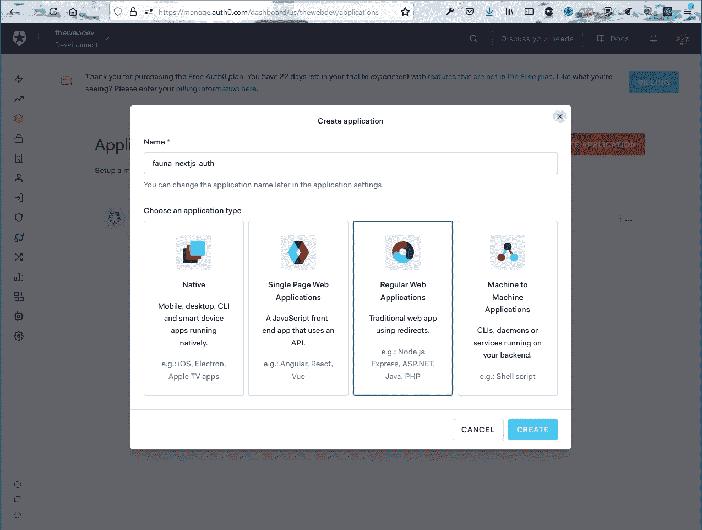

# 使用 Next.js、FaunaDB、Tailwind CSS 和 Auth0 构建 Snippets 应用程序

> 原文：<https://javascript.plainenglish.io/build-a-snippets-app-with-nextjs-faunadb-tailwind-css-auth0-413c52273ba9?source=collection_archive---------3----------------------->


FaunaDB

在这篇文章中，我们将在 Next.js 中构建一个 Snippet 应用程序。我们将存储和检索来自 FaunaDB 的数据，并在项目中使用 Tailwind CSS。我们还将在项目中使用 Auth0 的强大认证服务

因此，打开您的终端，使用下面的命令创建一个新的 Next.js 应用程序。

```
npx create-next-app snippet-app-nextjs
```

现在，按照说明，切换到新创建的文件夹。我也用 VS 代码打开了这个项目。之后，运行`**npm run dev**`启动项目。


config

但是在继续之前，我们将由 npm 安装所需的软件包。这里，我们为数据库安装了 FaunaDB，为表单验证安装了 react-hook-form，为实时获取数据安装了 SWR。你可以在这里阅读更多关于 SWR 的信息。

因此，打开您的终端并安装软件包。

```
npm i faunadb react-hook-form swr
```

我们还将在项目中设置 Tailwind CSS。因此，打开终端并安装下面的依赖项。

```
npm install --save-dev tailwindcss postcss-preset-env postcss
```

下面是初始化 Tailwind 运行的下一个命令。

```
npx tailwindcss init
```

它会在我们的根目录下创建一个 **tailwind.config.js** 文件。之后，在根目录下创建一个 **postcss.config.js** 文件，并添加以下代码。

```
module.exports = {
    plugins: ['tailwindcss', 'postcss-preset-env'],
}
```

最后，我们需要转到 **styles** 文件夹中的 **globals.css** 文件，删除所有内容，并为 tailwind 添加以下内容。

```
@tailwind base;
@tailwind components;
@tailwind utilities;body {
    margin: 0;
    padding: 0;
}
```

之后，更新**页面**文件夹中的 **_app.js** 文件，如下所示。这里，我们使用了所有的顺风 CSS 元素。

```
import '../styles/globals.css'function MyApp({ Component, pageProps }) {
  return (
    <div className="bg-yellow-600 w-full p-10 min-h-screen">
        <div className="max-w-2xl mx-auto">
            <Component {...pageProps} />
        </div>
    </div>
  );
}export default MyApp
```

现在，也删除 **pages** 文件夹中 **index.js** 中的所有内容，并更新为以下内容。

```
import Head from 'next/head'
import Link from 'next/link';export default function Home() {
  return (
    <div>
      <Head>
        <title>Snippet App</title>
        <link rel="icon" href="/favicon.ico" />
      </Head>
      <main>
        <div className="my-12">
          <h1 className="text-red-100 text-2xl">
            TheWebDev Code Snippets
          </h1>
          <p className="text-red-200">
            Create and browse snippets in Web Development!
          </p>
          <Link href="/new">
            <a className="mt-3 inline-block bg-yellow-800 hover:bg-yellow-900 text-white font-bold py-2 px-4 rounded focus:outline-none focus:shadow-outline">
              Create a Snippet!
            </a>
          </Link>
        </div>
      </main>
    </div>
  )
}
```

我们现在将在本地主机中看到这个漂亮的页面，带有一个按钮。


localhost

在前进之前，我们将建立 FaunaDB。所以，去 fauna.com 报名吧。注册后，您将被带到这个屏幕，在这里您需要点击**新建数据库**按钮。


Database

接下来，我们需要给数据库一个名称。我将它命名为**片段-应用程序-动物群**。之后，点击保存按钮。


Database name

在下一个屏幕上，点击**新收藏**按钮。


New Collection

在这里，我将集合名称命名为**片段**，并点击**保存**按钮。


snippets

现在，我们将首先从数据库创建一个文档，然后将逻辑移到前端。所以，点击**新建文档**按钮。


New Document

在下一个窗口中，我们将有一个编辑器，在这里我们将以 JSON 格式给出数据。稍后，我们将从前端发送这些数据。


Editor

接下来，在 Collection -> Snippet 中，我们可以看到我们的文档。


Document

接下来我们需要设置 API 键。所以，点击**安全**标签，然后点击**新钥匙**按钮。


NEW KEY

在下一个屏幕中，从角色下拉列表中，单击**服务器**，然后命名为 **snippet_app_key** 。然后点击**保存**按钮。


snippet key

下一个屏幕将给出我们需要复制的 API 密钥，因为它不会再次显示。


Secret Key

现在，回到我们的代码中，在根目录中创建一个文件. env.local，并将密钥添加到变量 FAUNA_SECRET 中。


.env.local

现在，在将我们的 FaunaDB 连接到前端代码之前，我们将添加文件来显示它。

在根目录下创建一个 **components** 文件夹，并在其中创建一个文件 **Snippet.js** 。把下面的内容放进去。

在这里，我们将获得片段道具，其中我们将显示名称、语言和描述。我们将代码传递给另一个组件**代码**。

我们还展示了一个编辑和删除按钮。

```
import React from 'react';
import Code from './Code';
import Link from 'next/link';export default function Snippet({ snippet }) {const deleteSnippet = async () => {
    };

    return (
        <div className="bg-gray-100 p-4 rounded-md my-2 shadow-lg">
            <div className="flex items-center justify-between mb-2">
                <h2 className="text-xl text-gray-800 font-bold">
                    {snippet.data.name}
                </h2>
                <span className="font-bold text-xs text-red-800 px-2 py-1 rounded-lg ">
                    {snippet.data.language}
                </span>
            </div>
            <p className="text-gray-900 mb-4">{snippet.data.description}</p>
            <Code code={snippet.data.code} />
            <Link href={`/edit/${snippet.id}`}>
                <a className="text-gray-800 mr-2">Edit</a>
            </Link>
            <button onClick={deleteSnippet} className="text-gray-800 mr-2">
                Delete
            </button>
        </div>
    );
}
```

现在，在同一个文件夹中创建一个文件 **Code.js** ，并在其中添加以下内容。这里，我们将显示单击按钮时的代码。我们还有一个复制功能，将代码复制到剪贴板。

```
import React, { useState } from 'react';export default function Code({ code }) {
    const [showCode, setShowCode] = useState(false);
    const [copyText, setCopyText] = useState('Copy');
    const copyCode = async () => {
        await navigator.clipboard.writeText(code);
        setCopyText('✅ Copied!');
        setTimeout(() => {
            setCopyText('Copy');
        }, 1000);
    };

    return (
        <div>
            <button
                className="bg-red-800 text-xs hover:bg-red-900 text-white font-bold py-1 px-2 rounded focus:outline-none focus:shadow-outline mb-2"
                type="submit"
                onClick={() => setShowCode(!showCode)}
            >
                {showCode ? 'Hide the Code' : 'Show the Code 👇'}
            </button>
            {showCode && (
                <div className="relative">
                    <pre className="text-gray-800 bg-gray-300 rounded-md p-2">
                        {code}
                    </pre><button
                        className="bg-gray-500 text-xs hover:bg-gray-600 text-white font-bold py-1 px-2 rounded focus:outline-none focus:shadow-outline mb-2 absolute top-0 right-0 transform -translate-x-1 translate-y-1"
                        type="submit"
                        onClick={copyCode}
                    >
                        {copyText}
                    </button>
                </div>
            )}
        </div>
    );
}
```

现在，使用 Next.js，我们也可以使用服务器端路由代码，就像我们在 Node.js 中所做的一样。因此，在 **pages- > api** 文件夹中，创建一个新文件 **snippets.js** 并在其中添加以下内容。我们将很快在其中创建 API 端点。

```
import { getSnippets } from '../../utils/Fauna';
export default async function handler(req, res) {
    if (req.method !== 'GET') {
        return res.status(405);
    }try {

    } catch (err) {
        console.error(err);
        res.status(500).json({ msg: 'Something went wrong.' });
    }
}
```

现在，是时候将我们的前端连接到 FaunaDB 了。因此，在根目录下创建一个文件夹 **utils** 并在其中创建一个文件 **Fauna.js** 。把下面的内容放进去。

这里，我们首先进行所需的导入，然后，我们有一个 **getSnippets** 函数。在该函数中，我们首先遍历我们之前创建的集合**片段**，并获取**数据**变量中的所有内容。

我们需要从 ref 中提取每个片段的 id，所以我们通过它映射并更改它。最后，我们导出 getSnippets 函数。

```
const faunadb = require('faunadb');
const faunaClient = new faunadb.Client({ secret: process.env.FAUNA_SECRET });
const q = faunadb.query;const getSnippets = async () => {
    const { data } = await faunaClient.query(
        q.Map(
            q.Paginate(q.Documents(q.Collection('snippets'))),
            q.Lambda('ref', q.Get(q.Var('ref')))
        )
    );const snippets = data.map(snippet => {
        snippet.id = snippet.ref.id;
        delete snippet.ref;
        return snippet;
    });return snippets;
};module.exports = {
    getSnippets,
};
```

现在，我们将通过调用 **getSnippets** ()并返回 **snippets** 数组来更新 **snippets.js** 文件中的代码。


snippets.js

接下来，我们将更新我们的 **index.js** 页面，使用 **SWR** 获取所有代码片段。在这里，我们使用 **useSWR** 钩子来调用 **/api/snippets** 端点并获取 snippets 数组。之后，我们对其进行映射，并将其传递给我们之前创建的**片段**组件。


index.js

现在，我们的主页显示我们的片段已经从 FaunaDB 数据库中获取。


FaunaDB data

现在，我们将添加创建代码片段的功能。我们将首先在**动物群. js** 文件中创建一个新函数 **createSnippet** 。它将在 FaunaDB 中添加一个包含值代码、语言、描述和名称的新代码片段。


Fauna.js

接下来，在 **api** 文件夹中创建一个文件 **createSnippet.js** ，并在其中添加以下内容。它与我们的 **snippets.js** 文件非常相似，但是用于调用 **createSnippet** 函数。

```
import { createSnippet } from '../../utils/Fauna';export default async function handler(req, res) {
    const { code, language, description, name } = req.body;
    if (req.method !== 'POST') {
        return res.status(405).json({ msg: 'Method not allowed' });
    }try {
        const createdSnippet = await createSnippet(code, language, description, name);
        return res.status(200).json(createdSnippet);
    } catch (err) {
        console.error(err);
        res.status(500).json({ msg: 'Something went wrong.' });
    }
}
```

现在，我们需要显示一个表单来接收用户的输入，并为此在 **pages** 文件夹中创建一个新文件 **new.js** 。把下面的内容放进去。它只是调用了我们接下来将创建的组件 SnippetForm。

```
import Head from 'next/head';
import SnippetForm from '../components/SnippetForm';export default function Home() {
    return (
        <div>
            <Head>
                <title>Create Next Snippet</title>
                <link rel="icon" href="/favicon.ico" />
            </Head><main className="max-w-lg mx-auto">
                <h1 className="text-red-100 text-2xl mb-4">New Snippet</h1>
                <SnippetForm />
            </main>
        </div>
    );
}
```

接下来，在 **components** 文件夹中创建一个文件 **SnippetForm.js** ，并将以下内容放入其中。我们在其中使用了包 **react-hook-form** ，这对于维护表单状态和进行验证非常有用。

把下面的内容放进去。这里，我们在 react-hook-form 的帮助下创建一个表单。注意，我们已经使用了来自 react-hook-form 的**寄存器**、**句柄**。

注册代码用于每个字段，我们需要用表单中的 **handleSubmit** 包装我们的函数 createSnippet。

现在，在 createSnippet 函数中，我们将向之前创建的/api/createSnippet 发送一个 POST 请求，并将代码、语言、描述、名称作为主体发送。

```
import React from 'react';
import { useForm } from 'react-hook-form';
import { useRouter } from 'next/router';
import Link from 'next/link';export default function SnippetForm() {
    const {register, handleSubmit} = useForm();
    const router = useRouter();const createSnippet = async (data) => {
        const { code, language, description, name } = data;
        try {
            await fetch('/api/createSnippet', {
                method: 'POST',
                body: JSON.stringify({ code, language, description, name }),
                headers: { 'Content-Type': 'application/json'}
            })
            router.push('/');
        } catch (err) {
            console.error(err);
        }
    };return (
        <form onSubmit={handleSubmit(createSnippet)}>
            <div className="mb-4">
                <label
                    className="block text-red-100 text-sm font-bold mb-1"
                    htmlFor="name"
                >
                    Name
                </label>
                <input
                    type="text"
                    id="name"
                    name="name"
                    className="w-full border bg-white rounded px-3 py-2 outline-none text-gray-700"
                    {...register('name', { required: true })}
                />
            </div>
            <div className="mb-4">
                <label
                    className="block text-red-100 text-sm font-bold mb-1"
                    htmlFor="language"
                >
                    Language
                </label>
                <select
                    id="language"
                    name="language"
                    className="w-full border bg-white rounded px-3 py-2 outline-none text-gray-700"
                    {...register('language', { required: true })}
                >
                    <option className="py-1">JavaScript</option>
                    <option className="py-1">HTML</option>
                    <option className="py-1">CSS</option>
                </select>
            </div>
            <div className="mb-4">
                <label
                    className="block text-red-100 text-sm font-bold mb-1"
                    htmlFor="description"
                >
                    Description
                </label>
                <textarea
                    name="description"
                    id="description"
                    rows="3"
                    className="resize-none w-full px-3 py-2 text-gray-700 border rounded-lg focus:outline-none"
                    placeholder="What does the snippet do?"
                    {...register('description', { required: true })}
                ></textarea>
            </div>
            <div className="mb-4">
                <label
                    className="block text-red-100 text-sm font-bold mb-1"
                    htmlFor="code"
                >
                    Code
                </label>
                <textarea
                    name="code"
                    id="code"
                    rows="10"
                    className="resize-none w-full px-3 py-2 text-gray-700 border rounded-lg focus:outline-none"
                    placeholder="ex. console.log('helloworld')"
                    {...register('code', { required: true })}
                ></textarea>
            </div>
            <button
                className="bg-red-800 hover:bg-red-900 text-white font-bold py-2 px-4 rounded focus:outline-none focus:shadow-outline mr-2"
                type="submit"
            >
                Save
            </button>
            <Link href="/">
                <a className="mt-3 inline-block bg-red-800 hover:bg-red-900 text-white font-bold py-2 px-4 rounded focus:outline-none focus:shadow-outline mr-2">
                    Cancel
                </a>
            </Link>
        </form>
    );
}
```

现在，在主页上，当我们单击“创建片段”按钮时，我们将被带到下面的表单，我们可以在其中填写数据。


Data fill

单击保存按钮后，我们将返回主页，我们的代码片段已被添加。


Snippet added

现在，我们将在应用程序中添加更新功能。所以，再次转到 **Fauna.js** 文件，添加两个新函数 **updateSnippet** 和 **getSnippetById** ，类似于 createSnippet。


接下来，在 **api** 文件夹中创建一个文件 **updateSnippet.js** ，并在其中添加以下内容。它与我们的 createSnippet.js 文件非常相似，但是用于调用 **updateSnippet** 函数。

```
import { updateSnippet } from '../../utils/Fauna';export default async function handler(req, res) {
    if (req.method !== 'PUT') {
        return res.status(405).json({ msg: 'Method not allowed' });
    }
    const { id, code, language, description, name } = req.body;try {
        const updated = await updateSnippet(id, code, language, description, name);
        return res.status(200).json(updated);
    } catch (err) {
        console.error(err);
        res.status(500).json({ msg: 'Something went wrong.' });
    }
}
```

现在，我们需要创建一个动态路由，当用户单击编辑链接时将调用它。因此，在**页面的**文件夹中创建一个文件夹编辑和一个文件 **[id]。js** 在里面。

把下面的内容放进去。这里，我们使用 getSnippetById 来获取片段数据，然后将其传递给 SnippetForm 组件。

```
import Head from 'next/head';
import { getSnippetById } from '../../utils/Fauna';
import SnippetForm from '../../components/SnippetForm';export default function Home({ snippet }) {
    return (
        <div>
            <Head>
                <title>Update Next Snippet</title>
                <link rel="icon" href="/favicon.ico" />
            </Head><main className="max-w-lg mx-auto">
                <h1 className="text-red-100 text-2xl mb-4">Update Snippet</h1>
                <SnippetForm snippet={snippet} />
            </main>
        </div>
    );
}export async function getServerSideProps(context) {
    try {
        const id = context.params.id;
        const snippet = await getSnippetById(id);return {
            props: { snippet },
        };
    } catch (error) {
        console.error(error);
        context.res.statusCode = 302;
        context.res.setHeader('Location', `/`);
        return { props: {} };
    }
}
```

接下来，我们将在我们的 **SnippetForm.js** 文件中添加编辑功能。这里，我们首先取道具片段。之后，在 useForm 钩子中，如果我们获得了代码片段属性，我们将获取默认值。

在表单的 **onSumbit** 中，我们再次检查 snippet prop 是否存在，如果存在，调用 **updateSnippet** 。否则，我们将调用**create snipet**。

**updateSnippet** 与 **createSnippet** 非常相似，只是我们做了一个 PUT 调用并传递了 id。


SnippetForm.js

现在，编辑一些东西并保存在 localhost 中，它将正常工作。现在，我们将添加删除某些内容的逻辑。

因此，再次转到 **Fauna.js** 文件并添加一个新函数 deleteSnippet，它类似于前面的函数。


Fauna.js

接下来，在 **api** 文件夹中创建一个文件 **deleteSnippet.js** ，并在其中添加以下内容。它与我们的 **createSnippet.js** 文件非常相似，但是用于调用 **deleteSnippet** 函数。

```
import { deleteSnippet } from '../../utils/Fauna';export default async function handler(req, res) {
    if (req.method !== 'DELETE') {
        return res.status(405).json({ msg: 'Method not allowed' });
    }const { id } = req.body;
    try {
        const deleted = await deleteSnippet(id);
        return res.status(200).json(deleted);
    } catch (err) {
        console.error(err);
        res.status(500).json({ msg: 'Something went wrong.' });
    }
}
```

现在，在我们的 **Snippet.js** 文件中，我们将在 **deleteSnippet** 函数中添加删除代码片段的逻辑。我们现在也得到一个新道具 **snippetDeleted** 。


Snippet.js

现在，我们将从 **index.js** 文件中传递 prop **snippetDeleted** 。道具触发一个**突变**，从服务器重新获取数据。


index.js

所以，现在我们的删除功能也工作了。


Edit and delete

现在，我们将使用 Auth0 在我们的应用程序中添加受保护的路由和身份验证。所以，去 https://auth0.com/[和](https://auth0.com/)报名吧。

登录后，将鼠标悬停在右侧菜单上，然后点击**应用程序选项卡**，并再次点击**应用程序**。


Applications

在下一个屏幕上，点击**创建应用**按钮。


Create Application

在下一个屏幕上，给应用起一个名字，如**动物-nextjs-auth** ，选择**常规网络应用**，点击**创建**按钮。



Create Application

下一个屏幕将显示我们所有的秘密，这是我们的应用程序所需的。


Secrets

我们为 NextJS 使用 auth0 包，指令在[这个](https://github.com/auth0/nextjs-auth0)链接中。所以，按照说明，复制 **.env.local** 文件中的 secrests。另外，请注意 **AUTH0_SECRET** 可以是任何字符串。


.env.local

现在，再次回到 Auth0 URL 并向下滚动一点，添加**允许的回拨 URL**和**允许的注销 URL**。


Auth0

现在，在继续之前，打开您的终端并安装 Next.js 的 auth0 包。

```
npm install @auth0/nextjs-auth0
```

现在，在 **api** 文件夹中创建一个新文件夹 **auth** 和一个文件 **[…auth0】。js** 在里面。把下面的内容放进去。


[…auth0].js

现在，我们需要用 **UserProvider** 包装 **_app.js** 文件中的所有内容。


_app.js

我们将显示导航栏中的登录链接。因此，在**组件**文件夹中创建一个文件 **Navbar.js** ，并在其中添加以下内容。这里，我们使用变量 **user** ，从 auth0 的 useUser 钩子加载。

根据这个值，我们显示一个登录或注销按钮。

```
import Link from 'next/link';
import { useUser } from '@auth0/nextjs-auth0';const Navbar = () => {
    const { user, isLoading } = useUser();return (
        <nav>
            <Link href="/">
                <a className="text-2xl mb-2 block text-center text-red-200 uppercase">
                    TheWebDev Snippets
                </a>
            </Link>
            <div className="space-x-3 m-x-auto mb-6 flex justify-center">
                {!isLoading && !user && (
                    <Link href="/api/auth/login">
                        <a className="text-red-100 hover:underline">Login</a>
                    </Link>
                )}
                {!isLoading && user && (
                    <>
                    <span className="text-red-100">Hello {user.name}</span>
                    <Link href="/api/auth/logout">
                        <a className="text-red-100 hover:underline">
                            Logout
                            </a>
                    </Link>
                    </>
                )}
            </div>
        </nav>
    )
}export default Navbar
```

现在，将这个导航条组件包含在 **_app.js** 文件中。


_app.js

现在，在 localhost 中，我们将看到登录按钮。点击登录按钮，我们将得到下面的弹出窗口，其中有选择**继续与谷歌**或通过一个 Auth0 帐户登录。


Login

我已经用我的谷歌帐户登录，并回到应用程序，现在，我们可以看到注销链接以及你好用户名。


localhost

现在，我们只想展示创建一个代码片段！按钮，如果用户已登录。因此，为此，在**组件**文件夹中，创建一个文件 **Header.js** 并将以下内容放入其中。

这里，我们再次使用了**用户**钩子，并将从中获取**用户**和**正在加载的**。现在，如果用户在场，我们将显示**创建片段！**按钮或者**登录创建代码片段！**按钮。

```
import { useUser } from '@auth0/nextjs-auth0';
import Link from 'next/link';const Header = ({ title, subtitle }) => {
    const { user, isLoading } = useUser();return (
        <header className="my-12">
            <h1 className="text-red-100 text-2xl">{title}</h1>
            {subtitle && <p className="text-red-100">{subtitle}</p>}{!isLoading && user && (
                <Link href="/new">
                    <a className="mt-3 inline-block bg-red-800 hover:bg-red-900 text-white font-bold py-2 px-4 rounded focus:outline-none focus:shadow-outline">
                        Create a Snippet!
                    </a>
                </Link>
            )}
            {!isLoading && !user && (
                <Link href="/api/auth/login">
                    <a className="mt-3 inline-block bg-red-800 hover:bg-red-900 text-white font-bold py-2 px-4 rounded focus:outline-none focus:shadow-outline">
                        Login to Create Snippets!
                    </a>
                </Link>
            )}
        </header>
    )
}export default Header
```

现在，在 **index.js** 中，我们使用了 **Header** 组件，并将**标题**和**副标题**传递给它。我们还从这里删除了相同的代码。


index.js

现在，我们有一个问题，即使我们没有登录，我们也可以去路由[http://localhost:3000/new](http://localhost:3000/new)。所以，我们需要保护这条路线。


Not logged in

使用 auth0，我们可以通过用 PageAuthRequired 导入并从页面导出来非常容易地保护一个路由，在我们的例子中是 **new.js** 。


new.js

现在，如果您在没有登录的情况下直接尝试前往链接[http://localhost:3000/new](http://localhost:3000/new)，它会将您重定向到 auth0 的登录页面。

接下来，我们还将有一个用户与每个代码片段相关联。所以，我们需要更新 **createSnippet.js** 文件。在这里，我们首先从 auth0 导入带有所需授权的、 **getSession** 的**。**

接下来，用 **withApiAuthRequired** 包装整个函数，因为它是一个高阶函数。接下来，在函数内部，我们将获取 **userId** ，并将其传递给**createdsnipet**。


createSnippet.js

现在，在 **Fauna.js** 文件中，在我们的 **createSnippet** 函数中，我们必须包含 userId。


Fauna.js

接下来，返回 FaunaDB 仪表板并删除所有文档，因为它们是在没有 userId 的情况下创建的。


Deleting

现在，我已经创建了一个新的代码片段，在 faunaDB 文档中，它现在也包含了 userId。


userID

现在，我们将做类似的事情来更新代码片段，只有登录的用户才能编辑代码片段。所以，在**【id】。js** 文件首先用 PageAuthRequired 导入**，然后用它包装 **getServerSideProps** 。**


[id].js

现在，如果您没有登录并直接转到类似[http://localhost:3000/edit/297708572934930951](http://localhost:3000/edit/297708572934930951)的路由，您将被重定向到 auth0 身份验证页面。

现在，我们还需要保护路由上的身份验证，否则有人可以从 Postman 发送请求并使用它。

我们还需要确保只有创建代码片段的用户才能更新它。删除也是如此。

在 **updateSnippet.js** 文件中，我们首先从 auth0 导入带有 piAuthRequired 、 **getSession** 的**。我们还导入了 **getSnippetById** 。**

接下来，用 **withApiAuthRequired** 包装整个函数，并检查用户是否是代码片段的所有者。如果他不是所有者，我们只是返回记录未找到消息。


updateSnippet.js

我们将在 **deleteSnippet.js** 文件中添加一个类似的逻辑。


deleteSnippet.js

现在，我们可以在登录后进行编辑和删除。但是我们希望只向它所属的用户显示编辑和删除按钮。

因此，在 **Snippet.js** 文件中，我们将使用 useUser 钩子中的 user 元素。然后，我们检查登录用户是否与代码片段创建用户是同一用户。


Snippet.js

现在，我使用不同的 Google 帐户登录，创建了一个代码片段，并且只能编辑和删除这个代码片段，而不能编辑和删除其他用户创建的代码片段。


Logged in

这完成了我们的 Snippet 应用程序。你可以在这里找到相同[的代码](https://github.com/nabendu82/snippet-app-nextjs)。

*更多内容看*[***plain English . io***](http://plainenglish.io/)