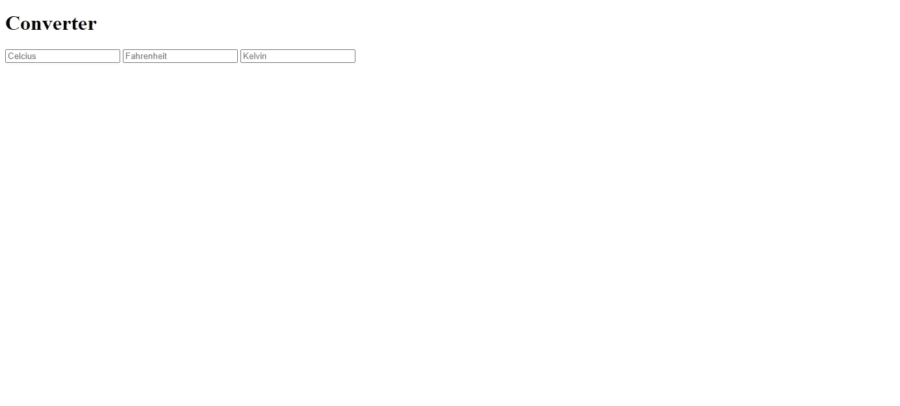
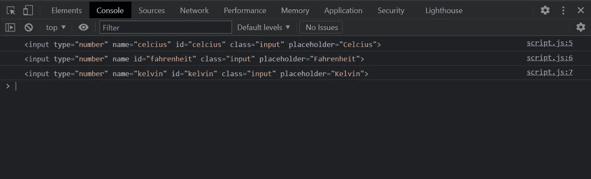
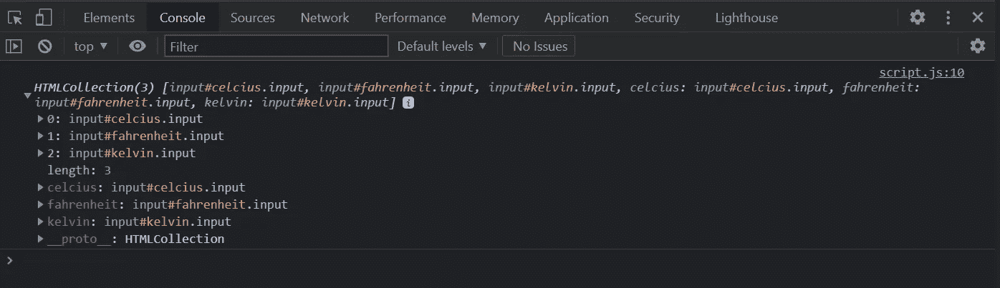

# 用普通的 JavaScript 构建一个温度转换器

> 原文：<https://javascript.plainenglish.io/build-a-temperature-converter-with-vanilla-javascript-635fb0900c14?source=collection_archive---------6----------------------->

## 初级 JavaScript

## 通过构建一个简单的温度转换器来练习 JacaScript


Temperature Converter | Screenshot by author | Background photo by [Brady Knoll](https://www.pexels.com/@trvlust?utm_content=attributionCopyText&utm_medium=referral&utm_source=pexels) from [Pexels](https://www.pexels.com/photo/white-and-brown-mountain-under-gray-clouds-5409751/?utm_content=attributionCopyText&utm_medium=referral&utm_source=pexels)

今天我将和你分享一个初学者友好的项目，你可以用普通的 JavaScript 来构建它。尽管有许多好的 JavaScript 框架可用，但是理解语言的基础还是很重要的。

作为一名 JavaScript 初学者，我在寻找一些有趣的实践项目，我可以构建这些项目来提高我的 JavaScript 基础。这是我建造的项目之一。本文将向您展示构建它的一步一步的过程。

我们开始吧！

```
**Table of Contents:**
· [Overview of the Project](#0875)
· [Project Structure](#cdc7)
· [The HTML](#8582)
· [The CSS](#03fa)
· [Writing the Logic in JS](#f8fe)
· [Conclusion](#8ec0)
· [Resources](#209d)
```

# 项目概述

我们将创建一个温度转换器应用程序，它可以转换:

*   摄氏到华氏和开尔文
*   华氏温度到摄氏温度和开尔文温度
*   开尔文到华氏和摄氏

我们有每个转换的直接公式。使用这些公式，我们可以很容易地从一个公式转换到另一个公式。下面给出了我们需要的公式:

```
Celcius = (Fahrenheit - 32) / 1.8
Celcius = Kelvin - 273.15Fahrenheit = (Celcius * 1.8) + 32
Fahrenheit = ((Kelvin - 273.15) * 1.8) + 32Kelvin = Celcius + 273.15
Kelvin = ((Fahrenheit - 32) / 1.8) + 273.15
```

我们将为摄氏度、华氏度和开尔文创建三个输入字段。一旦给出一个输入，其他两个将自动转换。假设，我们输入一个摄氏温度，华氏温度和开尔文温度，这个输入值会自动改变。

# 项目结构

首先，创建一个项目文件夹。我将我的项目命名为`temp_converter`。在项目文件夹中，创建三个文件。

*   index.html
*   style.css
*   script.js

这是我们将要处理的三个主要文件。

```
└── temp_converter
 ├── img
 │ └── background.jpg
 ├── index.html
 ├── script.js
 └── style.css
```

在我的项目中，我添加了背景图像。这就是为什么有一个文件夹叫做`img`。您可以选择不使用背景图像。或者使用背景色代替图像。所以`img`文件夹不是强制的。

> 注意:我从 [pexels](https://www.pexels.com/) 下载了背景图片。照片由[布雷迪·诺尔](https://www.pexels.com/@trvlust?utm_content=attributionCopyText&utm_medium=referral&utm_source=pexels)拍摄。

# HTML

我们需要这个项目的一些基本的 HTML。主要是我们需要三个数字输入字段。将下面的 HTML 代码放到您的`index.html`中。

我们已经创建了应用程序的基本外观。



The basic look | Screenshot by author

# CSS

我们将添加一些基本的 CSS 来使它看起来更好。用下面的代码填充您的`style.css`。

现在我们得到了我们想要的样子。


The final look | Screenshot by author

# 用 JS 编写逻辑

现在是写逻辑的时候了。打开你的`script.js`文件，开始写代码！

我们需要捕捉三个输入。为此创建三个独立的变量。

进入检查模式，查看`console.log()`的输出。我们通过他们的 id 得到了三个输入。



Individual inputs | Screenshot by author

现在我们需要循环所有的输入。为此，我们必须让他们成为`HTMLCollection`。创建一个变量来访问所有的输入。

我们来看看`console.log()`的输出。



All the inputs as an HTMLCollection | Screenshot by author

现在，我们将逐一遍历`inputs`的每个输入，并为每个输入添加一个事件监听器。

现在我们将为每种类型的输入使用一个[开关声明](https://developer.mozilla.org/en-US/docs/Web/JavaScript/Reference/Statements/switch)并分别转换温度。

我们的代码是完整的！下面是完整的`script.js`:

该项目在 GitHub 页面上直播*。你可以使用下面的链接查看它是如何工作的:*

*   [**https://fahadulshadhin.github.io/temp_converter/**](https://fahadulshadhin.github.io/temp_converter/)

# 结论

虽然这是一个基本项目，但我们通过构建它了解了一些重要的主题。我们学习了如何使用它们的 id 或类来获取 HTML 组件。我们学习了如何遍历 JavaScript 对象。我们学习了如何使用事件监听器。我们还学习了如何在 JavaScript 中使用 switch 语句。

你可以在 GitHub 上找到这个项目的源代码。*在这里查看 GitHub 库:*

[](https://github.com/FahadulShadhin/temp_converter) [## FahadulShadhin/温度转换器

### 使用香草 JS 的温度转换器。为 FahadulShadhin/temp_converter 的开发做出贡献

github.com](https://github.com/FahadulShadhin/temp_converter) 

我希望这对你有帮助。感谢您的阅读。

# 资源

*   [我从 YouTube 上看了这个教程](https://youtu.be/LWoGu5tSeig)
*   [JavaScript 中的 Switch 语句](https://developer.mozilla.org/en-US/docs/Web/JavaScript/Reference/Statements/switch)
*   [JavaScript DOM](https://www.w3schools.com/js/js_htmldom.asp)
*   [寻找 HTML 元素](https://www.w3schools.com/js/js_htmldom_elements.asp)
*   [JavaScript 事件监听器](https://www.w3schools.com/js/js_htmldom_eventlistener.asp)

*更多内容请看*[***plain English . io***](http://plainenglish.io/)