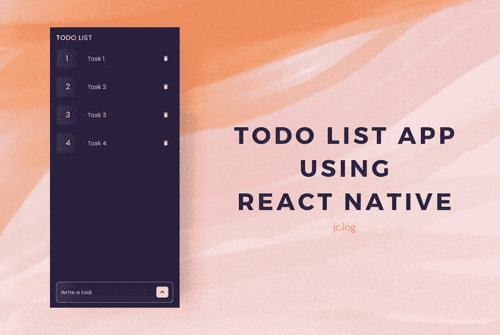
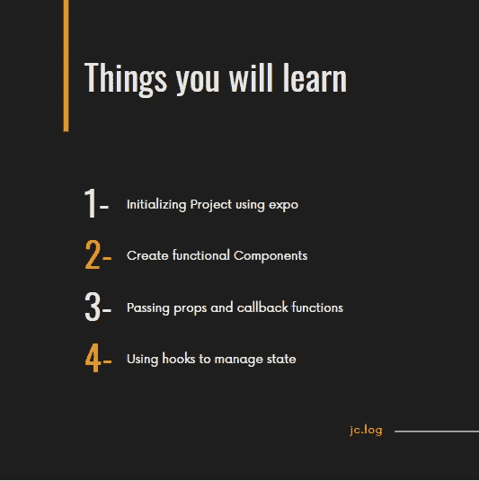
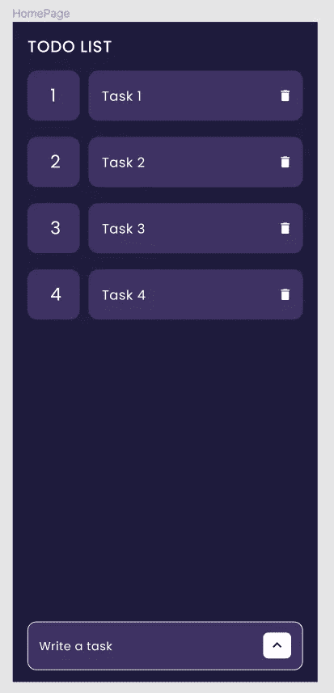
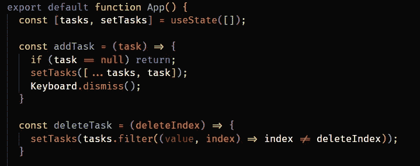
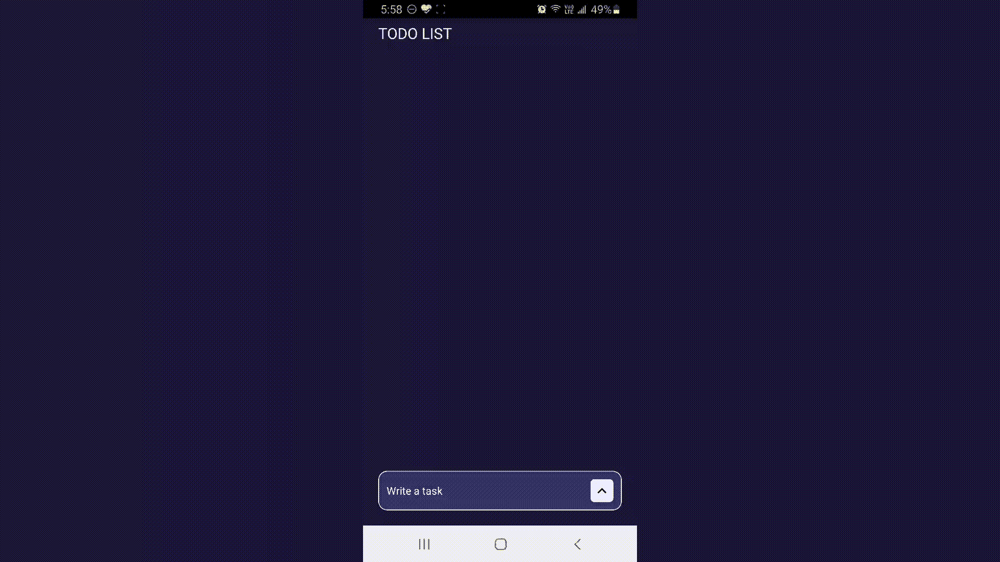

# 使用 React Native 构建待办事项列表应用程序

> 原文：<https://javascript.plainenglish.io/build-a-todo-list-app-using-react-native-526f8fe11ff1?source=collection_archive---------0----------------------->



TodoList App using React-Native

大家好，今天我们将看到如何使用 React Native 构建一个待办事项应用程序。
学习如何构建一个 TodoList 应用程序将有助于教会你很多 React Native 的基本概念。我总是喜欢构建这种类型的小项目来适应框架。

为了得到最好的结果，不要只看帖子。请大家看完帖子自行制作 app，自行理解概念。相信我，自己创建应用程序会消除你所有的疑虑。



让我们从使用下面的命令安装 expo 开始。

```
npm install -g expo-cli
```

之后，我们可以通过在终端中执行以下命令来初始化我们的项目

```
expo init myTodoListApp
```

我们的项目设置已经完成，所以我们可以继续前进，建立我们的 TodoList 应用程序。

这是我们的 TodoList 应用程序的设计:



HomePage Design

这里要构建三个组件:

1.  标题(相当简单)
2.  任务项目
3.  带有按钮的任务输入字段

让我们转到`App.js`文件，开始构建这些组件。

我们将使用一个`Text`组件来构建我们的标题，并赋予它一些样式。

执行这段代码后，您将看到以下输出。


Heading

现在让我们创建一个名为`TaskItem.js`的新文件，它将是每个`task`的单独组件。

这是我们试图构建的 UI 组件。


Task Item

将有一个包装器视图，它将有两个子容器，第一个是索引容器，另一个容器将有任务文本和删除图标。

我们将接受`index`、`task`和`deleteTask`作为该组件的道具。`deleteTask`是从父组件传来的删除特定任务的回调函数。当删除图标被按下时，我们将调用这个回调函数。图标方面，我用的是 expo 提供的内置`MaterialIcons`。

接下来是带有按钮的输入字段，当按下按钮时会将任务添加到列表中。我们将创建一个名为`TaskInputField.js`的新文件，这将是另一个功能组件。

在这个组件中，我们将使用一个钩子来处理输入字段状态。
`const [task, setTask] = useState();`

此外，该组件接受 props 中的回调函数，该函数将任务添加到列表中。添加任务后，我们将清除输入字段。

我已经把`TextInput`包在了`KeyboardAvoidingView`里，以避免从键盘上隐藏它。

这是我们添加这段代码后的结果。


Task Input Field

现在在`App.js`中，我们将在标题组件下添加那些功能组件。

我们将使用下面的代码行创建一个钩子来处理`tasks`的状态。`tasks`最初会是一个空数组。
`const [tasks, setTasks] = useState([]);`

之后，我们将创建两个用于添加和删除任务的函数。



我们将把`addTask`函数传入`TaskInputField`组件，把`deleteTask`函数传入`TaskItem`组件作为道具。

下面是我们把上面提到的都加进去之后的`App.js`的完整代码。

如你所见，我们正在迭代所有的`tasks`并相应地渲染`TaskItem`。我们也使用`ScrollView`来处理滚动。

我们现在结束了。这是最终的输出。



这是该项目的 Github 链接。希望对你有帮助。

[](https://github.com/jagrut-18/react-native-todo-list) [## jag rut-18/react-native-todo-list

### 通过在 GitHub 上创建一个帐户，为 jag rut-18/react-native-todo-list 开发做出贡献。

github.com](https://github.com/jagrut-18/react-native-todo-list) 

这一次到此为止。希望你喜欢。我想通过增加更复杂的功能来扩展这个项目。如果你想在接下来的帖子中关注新特性，请在评论中告诉我。

感谢您阅读至此。请务必留下任何建议和评论👏为了这个故事。

*更多内容请看*[*plain English . io*](http://plainenglish.io/)