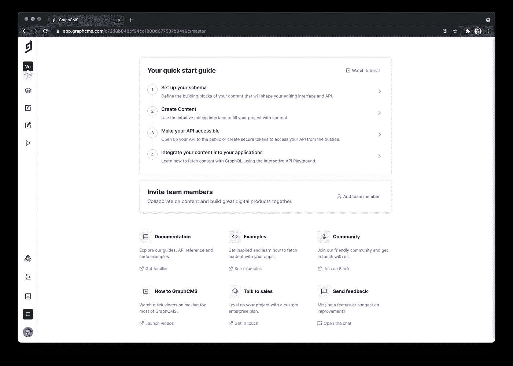
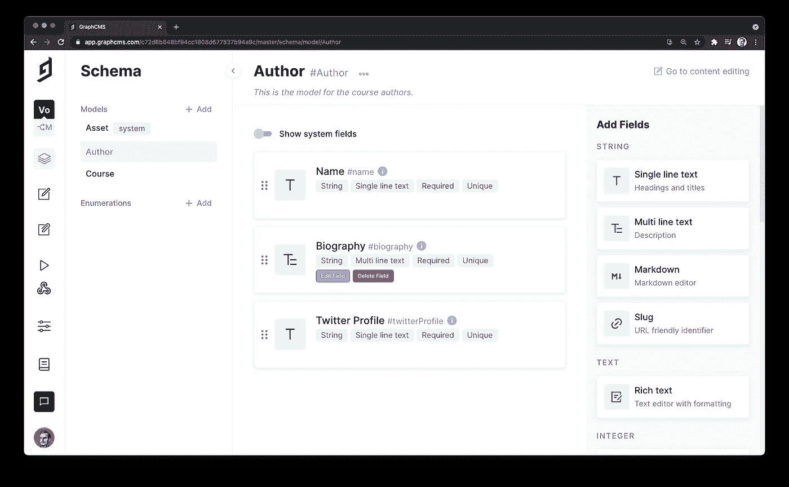

# 用 GraphCMS 和 Nuxt 构建投票应用

> 原文：<https://javascript.plainenglish.io/build-a-voting-app-with-graph-cms-and-nuxt-ac806c1bd1?source=collection_archive---------20----------------------->

## 用 Nuxt.js 和 GraphCMS 构建一个应用程序:投票选出你最喜欢的科技课程


Photo by [Glen Carrie](https://unsplash.com/@glencarrie?utm_source=medium&utm_medium=referral) on [Unsplash](https://unsplash.com?utm_source=medium&utm_medium=referral)

## 视频版本

[https://www.youtube.com/watch?v=bsOHkdYFSK4](https://www.youtube.com/watch?v=bsOHkdYFSK4)

在本教程中，您将为技术课程构建一个投票应用程序。投票应用程序允许人们对技术课程进行投票，这样人们就可以找到优质的课程。

如果你喜欢一门课程，并认为它是一门优质课程，你可以投票支持它。一门课程获得的支持票数越多，它在页面上的位置就越高。

要构建应用程序，您将使用:

*   GraphCMS
*   Nuxt.js
*   尾翼 CSS

事不宜迟，让我们开始构建应用程序吧！

# 关于 GraphCMS

GraphCMS 是第一个 GraphQL 原生无头 CMS。它旨在通过利用 GraphQL 的强大功能来消除传统内容管理的痛点。

让我们看看 GraphQL 的目标是什么。GraphCMS 的一些最显著的特性如下:

*   它有一个支持查询和变异的 GraphQL 端点。
*   它有一个优秀的用户界面。你可以使用它来构建，配置和维护你的应用程序通过他们的用户界面后端。
*   它有内容本地化。这意味着您可以将内容本地化并翻译成任何语言。
*   它支持基于付费计划的环境，这允许您独立地开发新特性，然后将其提升到主环境。
*   智能边缘缓存，这意味着您的查询响应会在全球 190 个边缘点进行缓存。

这些只是让你相信它的力量的一小部分功能。然而，你可以在这里阅读更多关于 GraphCMS 及其特性[的内容。](https://graphcms.com/features)

**简而言之，你可以使用 GraphCMS 作为一个数据库或内容管理系统，这可以从名字**中推断出来。

# 创建一个 GraphCMS 帐户

本教程的第一步是创建一个 GraphCMS 帐户，这样您就可以使用它了。

转到 [GraphCMS](https://graphcms.com/) 网站，点击*“注册”*链接。请参见下面的图 1 以供参考。


> 图 1

之后，它会带你到注册页面。在注册页面上，您可以注册以下内容:

*   使用您的脸书帐户
*   使用您的 GitHub 帐户
*   使用您的 Google 帐户
*   用你的电子邮件，密码和名字

你可以使用任何适合你需要的方法。就我而言，我是用我的 GitHub 账户注册的。


> 图 2

图 2 展示了注册页面。在选择您首选的注册方式之前，请勾选表示您同意其条款和政策的方框。最后，点击*“注册”*按钮。

之后，你就大功告成了。您应该会看到下面图 3 所示的页面。如果您想参加他们的游览，点击*【开始游览】*按钮。如果没有，直接跳到概述。


> 图 3

这就是创建新的 GraphCMS 帐户的方法。如果您点击*“Skip to overview”*(如图 3 所示)，您将被带到一个页面，在这里您可以创建一个新项目或者从现有的启动项目中进行选择。

因此，下一步是为技术课程创建和配置投票应用程序。

# 项目结构

该项目将科技课程与作者放在一起。因此，您将有两个模型:

*   课程模型
*   作家的典范

此外，两者之间还会有多对多的关系。例如，一门课程可以有多个作者，作者也可以有多门课程。

解决了这个问题，让我们开始构建项目吧！

# 创建项目

创建帐户后，您将进入一个新页面，在这里您可以创建新项目。


> 图 4

需要注意的是，您可以从他们的初始项目中进行选择。但是，对于本教程，您将创建一个新项目。

要创建一个新项目，点击 **+** 按钮，上面写着*“从头开始”*。上面的图 4 说明了这一点。

点击按钮将进入新页面，您需要:

*   为项目添加名称和描述
*   选择您首选的 CDN

在下面的图 5 中，您可以看到这个项目的名称和描述。还有，你可以看到我选择的数据中心来自*欧洲(法兰克福)*。


> 图 5

填写完所有详细信息后，单击页面底部的“创建项目”按钮。在图 5 中，您看不到它，但是您应该在您的页面上看到它。

创建项目后，您将被带到定价页面，如图 6 所示。你有四种选择。对于本教程，您只需要免费版本。对于大多数副业项目来说绰绰有余。


> 图 6

选择“永远免费”计划。选择计划后，您将进入一个新页面，在此您可以邀请团队成员。但是，您目前没有任何团队成员，因此请点击页面底部的*“稍后邀请”*。

现在您已经完成并准备好配置您的应用程序了！您可以在下面的图 7 中看到项目仪表板。



> 图 7

让我们进入下一步，即创建模型。

# 创建模型

下一步是创建模型。当您创建模型时，您描述了数据的结构。例如，您需要一个课程模式和一个作者模式。

在项目仪表板上，点击选项*“设置您的模式”*。请参见下面的图 8 以供参考。


> 图 8

单击该选项后，您将进入一个新页面，为您的数据创建模型。例如，您将为课程创建模型。

点击按钮*“创建模型”*，如图 9 所示。


> 图 9

下一步是创建模型。然后，您需要做的就是为您的模型选择一个名称和描述。

对于这个例子，模型的显示名称是`Course`。输入显示名称后，`API ID`和`Plural API ID`字段会自动更新。因此，你可以让它们保持原样。最后，输入模型的描述。

输入所有细节后，点击按钮*“创建模型”*。在图 10 中，您可以看到一个设置`Course`模型的例子。


> 图 10

创建模型之后，您就有了一个用于`Course`的空模型。

作为练习，为`Author`创建模型。转到`Schema`页面，然后点击左侧的 *+添加*按钮。请参见下面的图 11 以供参考。


> 图 11

点击“add”按钮后，您可以像创建`Course`模型一样创建`Author`模型。

下面的图 12 显示了`Author`模型的设置。


> 图 12

下一步是通过添加字段来配置模型。

# 配置课程模型

一旦创建了模型，您需要添加字段。这些字段描述了您存储的有关课程的内容。例如，您至少需要一个名称和描述。

一旦您创建了模型，您就可以访问专用于它的页面。在该页面中，您可以添加和删除字段。图 13 说明了这一点。


> 图 13

对于本教程，`Course`模型将具有以下字段:

*   名字
*   描述
*   作者
*   环
*   投票

如果您查看上面的图 13，您可以看到您可以从页面的右侧选择字段。您可以创建如下字段:

*   多行文本
*   减价
*   富文本编辑器
*   数字

还有很多。

## 名字域

让我们从添加名称字段开始。首先点击“单行文本”字段。单击该字段后，将会出现一个新框，如图 14 所示。


> 图 14

您需要为该字段指定**名称**、 **API ID** 和**描述**。您可以使用与图 14 中相同的细节，也可以使用您自己的细节。

此外，您可能希望显示字段的值，而不是关系中的 ID，所以检查字段是否为**用作标题字段**。

在继续之前，转到*“验证”*选项卡，并填写必填字段。这意味着`name`字段不能为空。请参考图 15。


> 图 15

完成`name`字段的配置后，点击“创建”按钮。创建字段后，您应该会在仪表板中看到它。

## 描述字段

下一步是创建描述字段。因为描述比`name`字段更复杂，所以让我们选择“降价”字段。

单击“Markdown”字段，应该会出现图 16 所示的弹出窗口。像往常一样，为您的字段选择名称、API ID 和描述。


> 图 16

作为验证，让我们将该字段设置为必填字段，并添加 100 到 1000 个单词的字符数。因此，在以下情况下，不能将课程添加到数据库中:

*   描述为空
*   描述少于 100 字或多于 1000 字

参见图 17，它展示了验证。


> 图 17

现在单击按钮创建字段。此时，您应该有两个字段，并且应该在您的仪表板中看到它们。

## 投票字段

`Vote`字段属于数字类型。因此，转到右侧，单击“数字”字段。

图 18 展示了这个字段的信息。但是，对于这个字段，您需要一些验证和一个起始值。


> 图 18

转到“验证”选项卡，将该字段设置为必填字段。您可以按照与其他步骤相同的步骤将该字段标记为必填字段。为了避免重复，我没有包括图片，因为它是相同的东西。

现在转到“高级”选项卡，选中选项“设置初始值”。将初始值设置为“0 ”,以便所有课程的投票从 0 开始。请参见下面的图 19 以供参考。


> 图 19

创建字段，它应该出现在仪表板中。

## URL 字段

对于 URL 字段，您可以简单地使用*“单行文本”*字段。图 20 显示了 URL 字段的基本配置。它遵循与其他字段相同的模式。


> 图 20

另外，让我们将字段设置为必填字段。然后，转到“Validations”选项卡，选中使该字段成为必填字段的选项。

此外，您希望避免恶意或无效的 URL。因此，启用选项*“匹配特定模式”*。当选项处于活动状态时，应用程序只接受匹配特定正则表达式的 URL。

下面的图 21 说明了这一点。


> 图 21

如果您转到仪表板，您应该能够看到您创建的所有字段。图 22 展示了您的仪表板应该是什么样子。


> 图 22

在配置“作者”字段和创建关系之前，让我们配置一下`Author`模型。

# 配置作者模型

对于作者模型，您可能对以下字段感兴趣:

*   全名
*   短篇传记
*   Twitter 个人资料等社交媒体链接

此时，您应该熟悉字段类型。因此，字段将具有以下类型:

*   `Single line text`为全称
*   `Multi line text`为短篇传记
*   `Single line text`对于 Twitter 个人资料

对于字段的验证规则，以下规则适用于所有字段:

*   所有字段都是必填的——每个作者都应该有一个名字，一个简短的传记和一个 Twitter 个人资料
*   所有字段都应该是唯一的——没有两个作者应该有相同的名字、传记或 Twitter 个人资料。

从模式仪表板中，选择*“单行文本”*创建全名。图 23 展示了这个字段的细节。


> 图 23

在下面的图 24 中，您可以看到用于这个字段和其他字段的验证。


> 图 24

下一步是添加**传记**字段。然后，从右侧边栏中选择*“多行文本”*字段。一旦你点击它，一个新的弹出窗口出现。您可以在图 25 中看到这个字段的细节。


> 图 25

**传记**字段有一个额外的验证规则。你不希望作者有一个空的简历或 5000 字的简历。因此，您可以限制`100`和`500`单词之间的字符数。

图 26 展示了如何限制字符数。您还可以看到，您可以自定义错误消息。因此，您可以添加一条描述性的错误消息，这将有助于而不是混淆用户。


> 图 26

最后，您需要为 **Twitter 个人资料 URL** 设置字段。从侧栏中，选择*“单行文本”*字段，并添加显示名称、API ID、描述和验证。

在下面的图 27 中，您可以看到 Twitter profile URL 字段的设置。


> 图 27

像往常一样，您使字段成为必需的和唯一的。因此，人们不能添加没有 Twitter 个人资料或有重复 Twitter 个人资料的作者。此外，您希望避免恶意或无效的 URL。因此，您可以勾选**匹配特定模式**特征的复选框。

请参见下面的图 28。


> 图 28

你也完成了`Author`模型的配置！如果您查看您的仪表板，您应该会看到您创建的字段。下面的图 29 说明了这一点。



> 图 29

既然您已经配置了这两个模型，那么是时候在它们之间创建一个关系了。所以这就是你下一步要做的！

# 建立关系

在使用应用程序之前，最后一步是在`Course`和`Author`模型之间创建多对多关系。概括地说，一门课程可以有多个作者，作者也可以有多门课程。

下面的视频展示了如何创建“课程”和“作者”之间的关系。

Create the relationship preview

创建关系的第一步是从任何模型中选择`Reference`字段。`Reference`字段允许您在模型之间创建不同类型的关系。

单击该字段后，会出现一个新的弹出窗口，您可以在其中定义关系。首先，您选择要引用的模型。然后，您有一个下拉框，您可以从中选择模型。

之后，您可以通过两种方式创建关系:

*   您可以根据需要勾选/取消勾选复选框。当您勾选/取消勾选复选框时，关系会自动更新。
*   您可以点击下拉菜单选择您想要的关系。

图 30 显示了这两个选项。


> 图 30

之后，您可以配置`reference`和`reverse`字段。它们是为您预先配置的，但是如果您愿意，也可以使用自定义选项。对于本教程来说，预先配置的细节就足够了。

最后，按“创建”按钮创建关系。正如您在上面的视频中看到的，关系已经创建。

# 添加内容

在测试和使用应用程序之前，您需要添加内容。

使用 GraphCMS，您可以无缝地从用户界面添加内容。或者，您可以通过编程来实现。因此，在添加内容时，您有两种选择。

要创建内容，单击“笔”图标，如图 31 所示。或者，您可以点击*“您的快速入门指南”*部分的第二个选项。请参考图 31。


> 图 31

点击两个选项中的任何一个，你将进入一个新的页面，在这里你可以添加作者和课程。

图 32 显示了可以添加内容的页面。在左侧，您可以选择想要添加的内容类型。例如，如果你想添加一个新的作者，从栏中选择`Author`。

一旦你决定了你想添加什么类型的内容，点击按钮 *"+创建项目"*。


> 图 32

之后，您可以创建一个新的内容。在图 33 中，您可以看到一个创建作者的例子。这里有您在配置模型时添加的所有字段。

此外，在底部，您可以看到您可以添加**现有课程**或者您可以**创建并添加**新课程。因此，您可以链接一个现有的作者和一门课程。

目前，**保存并发布**作者，因为您将在创建课程后链接作者和课程。


> 图 33

此时，您应该有了第一部分内容——一个作者。干得好！您将按照相同的步骤添加课程。

在左侧，点击“课程”选项。然后再次点击按钮*“+创建项目”*。请参考图 32。

当新页面打开时，可以随意添加您的课程细节，或者您可以使用与图 34 中相同的信息。

在底部，你可以看到你可以为你的课程添加作者。由于您在上一步中创建了一个作者，所以让我们添加一个作者。点击**添加现有作者**。


> 图 34

单击该按钮后，会出现一个新的弹出窗口，您可以在其中选择要添加的作者。例如，在下面的图 35 中，您可以看到您之前创建的作者。

通过勾选框来选择作者，如图中突出显示的。之后，点击*“添加选定作者”*按钮添加作者。


> 图 35

之后，您应该会看到作者嵌入到您的课程中。最后，您应该会看到类似于图 36 的内容。

现在点击绿色按钮*“保存并发布”*来创建关系。作者和课程现在链接了！


> 图 36

现在您已经完成了应用程序的创建和配置，您可以开始使用它了！

# 查询和变异数据

GraphCMS 有一个集成的 GraphQL 平台。这意味着您可以读取和编辑现有数据或添加新数据。

因此，要访问操场，请转到项目的仪表板，然后单击“play”图标，如下面的图 37 所示。


> 图 37

一旦到了游乐场，您可以手动编写查询和变异，也可以使用 explorer。使用 explorer，您可以交互式地构建查询和突变。

点击按钮后，GraphQL playground 打开，您就可以开始玩数据了。

图 38 显示了操场页面。


> 图 38

让我们开始编写一些 GraphQL 查询。第一个 GraphQL 查询显示了所有的课程和作者。您可以看到每门课程的所有详细信息以及每位课程作者的信息。

请参见下面的查询:

```
query Courses {
  courses {
    name
    description
    publishedAt
    url
    vote
    authors {
      name
      biography
      twitterProfile
    }
  }
}
```

以下查询显示了所有作者及其创建的课程。它检索关于作者及其课程的所有细节。

将以下查询复制到操场:

```
query Authors {
  authors {
    name
    biography
    twitterProfile
    courses {
      name
      url
      vote
      description
    }
  }
}
```

交互式构建器可以无缝地创建查询。例如，在下面的视频中，您可以看到我用 GraphCMS explorer 构建了两个查询。

而且，可以用**突变**。这意味着您可以添加和编辑应用程序中的现有数据，或者删除数据。

如果你在“Explorer”标签的底部滚动，你可以看到一个选项，上面写着*“Add New Mutation”*。点击该选项后，您将在“Explorer”选项卡中看到所有可用的突变。

例如，您可以创建一个包含以下变化的新课程:

```
mutation CourseCreation {
  createCourse(data: {name: "Test Course", description: "Add a longer description", vote: 10, url: "https://google.com"}) {
    id
    name
  }
}
```

重要的是要记住，您为一些字段添加了验证，比如描述。因此，您需要添加比示例中的描述更长的描述。之后，您可以成功地将新课程添加到应用程序中。

或者，您可以删除课程。要删除课程(或作者)，您需要将课程的 id(或作者)传递给`deleteCourse`。下面的变化显示了你如何能做到这一点。

```
mutation CourseDeletion {
  deleteCourse(where: {id: "ckqg8wi7s13ko0c56z71xw139"}) {
    id
    name
  }
}
```

创建作者类似于创建课程，只是有不同的字段。下面的突变显示了如何做到这一点。

```
mutation AuthorCreation {
  createAuthor(data: {name: "Test Author", biography: "A short biography.", twitterProfile: "https://twitter.com/testauthor"}) {
    id
    name
  }
}
```

在下面的视频中，你可以看到以下的突变:

*   添加和删除课程
*   添加和删除作者

GraphCMS 的“Explorer”选项非常方便，它使得创建查询和变异的过程非常简单。

既然您已经在本教程中看到了查询和变异的例子，那么也去探索其他例子吧。尝试添加新数据或修改现有数据。

下一步是设置对 API 的访问，这样您就可以从前端应用程序中使用它。

# 设置 API 访问权限

根据 [GraphCMS 文档](https://graphcms.com/docs/authorization#public-api-permissions)，“默认情况下，查询和突变需要一个永久的 Auth Token 令牌”。

因此，在您可以在应用程序中使用 API 之前，您需要设置权限。转到项目仪表板，单击下面图 39 中突出显示的两个选项中的任何一个。


> 图 39

单击任何选项后，将打开一个新页面，您可以在其中配置 API 访问。在新页面上，您应该会看到以下信息:

*   内容和管理 API
*   内容 API 权限
*   永久授权令牌

## 未经验证的用户的权限

如果你在页面底部滚动，你会看到**公共内容 API** 和**永久授权令牌**。使用**公共内容 API** ，您可以为**未认证的**用户设置权限。

对于未经身份验证的用户，您可能只需要“读取”权限。这意味着未经验证的用户只能读取数据。

因此，从**公共内容 API** 中，您可以点击按钮*“Yes，initialize defaults”*，如图 40 所示。

如图 40 所示，默认权限只允许未经身份验证的人读取数据。


> 图 40

单击按钮后，将应用默认权限，您可以为经过身份验证的用户设置权限了。

## 创建身份验证令牌

根据 [GraphCMS 文档](https://graphcms.com/docs/authorization#permanent-auth-tokens)，“永久认证令牌用于控制对查询的访问，改变内容，并以不记名令牌认证的形式出现”。

要为您的应用程序创建新的令牌，请单击页面底部的按钮 *"+ Create token"* 。


> 图 41

单击“创建令牌”按钮后，会出现一个新的弹出窗口。从弹出窗口中，您可以创建新令牌。系统会提示您输入一个**名称**，一个**描述**，以及内容交付的**默认阶段**。您希望用户只能访问发布的数据，因此保留默认选项— `Published`。

图 42 展示了配置令牌的弹出窗口。


> 图 42

## 已验证用户的权限

创建令牌后，您将进入令牌控制面板来配置权限。在新页面上，您应该会看到以下信息:

*   您的令牌名称
*   令牌描述
*   代币价值
*   内容 API
*   管理 API

目前，您只对内容 API 感兴趣。内容 API 权限指定了可以对数据做什么。


> 图 43

让我们创建一些权限。要创建新的权限，点击按钮 *"+ Create permission"* ，如上面的图 43 所示。

单击“create permission”按钮后，会出现一个新的弹出窗口，您可以在其中配置您的模型。有两个重要步骤:

*   从“**型号**”下拉菜单中，单独选择每个型号。不要保留缺省选项“全部”，因为系统还创建了其他模型。分别为每个模型创建权限。
*   勾选**发布**和**取消发布**选项。您需要能够为投票功能发布课程。

最后，您希望能够通过**读取**、**创建**、**编辑**和**删除**数据。因此，勾选适当的方框。

图 44 展示了创建权限的过程。请注意，在图中，没有选择模型。因此，当您创建权限时，应该为每个模型单独创建。


> 图 44

完成所有步骤并创建权限后，您应该会在仪表板中看到它们。例如，您的仪表板应该类似于下面的图 45。


> 图 45

现在您已经有了一个端点并设置了权限，您已经准备好构建前端部分了！

# 如何获得您的端点和身份验证令牌

这是建设前端前的最后一步，我保证。在这一步中，您将收集所有需要的信息，例如:

*   终点
*   你的令牌呢

第一步是进行如下图 46 所示的设置。单击滑块。


> 图 46

点击设置后，您将进入另一个页面。从那里，点击左侧边栏中的`API Access`选项，如图 47 所示。

之后，您应该会看到您的端点。然后，复制下面图 47 中突出显示的`Content API`。


> 图 47

最后，滚动页面底部，您应该会看到一个名为`Permanent Auth Tokens`的部分。一旦您看到它，点击令牌来复制它，如下面的图 48 所示。


> 图 48

既然有了`endpoint`和`auth token`，就可以从外部使用 GraphCMS 应用程序了——例如，从 Nuxt 这样的 JavaScript 框架中。

# 创建和配置 Nuxt 应用程序

对于前端，您将使用 Nuxt.js，这是一个 Vue 框架。如果你想了解更多或看到它的好处，请查看他们的官方网站。

第一步是创建和配置 Nuxt 应用程序。转到您的终端，运行以下命令:

```
npx create-nuxt-app voting-app
```

运行该命令后，您将得到一系列允许您配置项目的问题。

图 49 显示了该项目的设置。您可以使用相同的选项，也可以根据需要配置项目。


> 图 49

一旦安装了所有的依赖项，就可以开始构建应用程序了。但在此之前，你需要清理一下。因此，使用以下命令打开目录:

```
cd voting-app
```

如果您转到`components`文件夹，您应该会看到两个组件:

*   NuxtLogo.vue
*   Tutorial.vue

两个都删。下一步是创建新的组件。创建以下组件:

*   **CourseCard.vue** = >从名字可以推断，这个组件是用来创建课程卡片的。数据库中的每门课程都有它的卡片。
*   该组件呈现数据库中的所有课程。它还利用了`CourseCard.vue`组件来呈现每个课程。
*   **Hero.vue** 和 **Footer.vue**

下面的图 50 显示了组件文件夹应该是什么样子。


> 图 50

## 管理环境变量

在继续之前，您需要设置环境变量，这些变量存储敏感信息，例如:

*   GraphCMS 端点 URL
*   不记名令牌

第一步是安装所需的软件包。转到项目的根目录，安装包`dotenv`，如下所示:

```
npm i @nuxtjs/dotenv
```

一旦你安装了这个包，你需要注册它。转到`nuxt.config.js`并将模块添加到`buildModules`数组。您的构建模块应该如下所示:

```
buildModules: [
    // https://go.nuxtjs.dev/eslint
    '@nuxtjs/eslint-module',
    // https://go.nuxtjs.dev/tailwindcss
    '@nuxtjs/tailwindcss',
    '@nuxtjs/dotenv'
  ],
```

下一步是创建`.env`文件，您将在其中添加您的敏感信息。在项目的根目录下创建`.env`文件。您可以按如下方式操作:

```
touch .env
```

现在打开文件并添加以下几行:

```
GRAPHCMS_ENDPOINT=
BEARER=
```

当然，你需要添加你的信息。添加您的 GraphCMS 端点 URL 和不记名令牌。**在进一步移动**之前，您需要将`.env`文件添加到`.gitignore`中，这样您就不会公开您的敏感信息。

现在，您可以访问敏感信息，例如:

*   `process.env.GRAPHCMS_ENDPOINT`
*   `process.env.BEARER`

让我们进入下一步，这是关于创建 GraphCMS Nuxt 插件。

## GraphCMS Nuxt 插件

在继续之前，您需要添加 GraphCMS 插件。GraphCMS 客户端允许您向 GraphCMS 数据库发出请求。

所以，首先，你需要在项目的根目录下创建一个名为`plugins`的新文件夹。之后，在`plugins`文件夹中创建一个名为`graphcms.js`的文件。

一旦创建了目录和文件，打开`graphcms.js`并添加以下代码:

```
import { GraphQLClient } from 'graphql-request';

const graphcmsClient = new GraphQLClient(process.env.GRAPHCMS_ENDPOINT, {
    headers: {
        authorization: `Bearer ${process.env.BEARER}`
    }
});

export default(_, inject) => {
    inject('graphcms', graphcmsClient);
};
```

上面的代码创建了一个新的 GraphQL 客户端实例，并传递您的`GraphCMS`端点和承载令牌。因此，您可以在 Nuxt.js 应用程序的任何地方使用`graphcms`客户端。

既然已经设置好了一切，下一步就是单独构建每个组件。**在您构建并使用所有组件之前，应用程序将无法运行。**因此，只能尝试在以后运行它。

## 构建 Hero.vue

第一个组件是`Hero.vue`。这个组件只有两行文本。打开它并添加以下代码:

```
<template>
  <div class="flex flex-col items-center text-center mt-10">
      <h1 class="text-3xl">Vote <span class="font-bold">your favourite</span> tech courses</h1>
      <div class="m-4 text-lg">
          <p>Finding the right courses in tech is difficult so we make it easier</p>
      </div>
  </div>
</template>
```

下面的图 51 展示了运行应用程序时您将看到的内容。


> 图 51

现在转到`pages > index.vue`并删除文件中的所有内容。然后，添加以下代码:

```
<template>
    <div class="relative flex flex-col items-top justify-center min-h-screen bg-gray-100 sm:items-center sm:pt-0">
      <Hero/>
    </div>
</template>
```

在上面的代码中，您使用了新创建的组件 Hero。下一步是构建课程卡组件，以便可以在页面上显示课程。

## 构建 CourseCard.vue

课程卡片显示所有课程的信息。它显示名称、描述和其他详细信息。**它还允许你投票支持一门课程。**

让我们从构建模板开始。你在小胡子符号中看到的一切—`{{ }}`—都是来自数据库的数据。

```
<template>
    <div class="max-w-4xl mx-auto px-8 sm:px-6 lg:px-8 flex flex-row justify-center">
        <div class="mt-8 bg-white overflow-hidden shadow sm:rounded-lg p-6">
            <h2 class="text-2xl leading-7 font-semibold">
                <NuxtLink :to='id' class="hover:underline">{{ name }}</NuxtLink>
            </h2>
            <p class="mt-1 font-extralight italic text-gray-600">by {{ authors.toString() }}</p>
            <p class="mt-3 text-gray-600 italic">
                {{ excerpt }} <br>
            </p>
            <div class="flex flex-col items-center border-t border-dashed mt-5">
                <p class="mt-4 pt-4 text-gray-800 font-bold text-xl tracking-wider">
                    The course has <code class="bg-gray-100 text-2xl p-1 rounded border">{{ newVote }}</code> votes.
                </p>
                <p>
                    <button class="bg-white hover:bg-gray-200 mt-5 mb-2 text-gray-800 font-semibold py-2 px-4 border border-gray-400 rounded shadow" @click="fetchData">Vote +1</button>
                </p>
            </div>
        </div>
    </div>
</template>
```

在组件的第二部分，您描述了属性的类型、方法和计算属性。

方法`fetchData`允许用户投票支持课程。当用户点击投票按钮时，调用`fetchData`方法，它向数据库发出 POST 请求。然后，它增加投票数并返回新值。

端点`/upvote/${this.id}`是在 Nuxt 中创建的自定义 API 端点。在下一节中，您将看到如何做到这一点。

由于**变异道具**是一个反模式，我们创建了一个名为`newVote`的新领域。将`vote`道具的值赋给这个新属性。此外，当用户对课程投票时，属性`newVote`被更新并显示在页面上。

最后，您有一个计算属性`excerpt`，它只显示了部分描述。

```
<script>
export default {
    props: {
        id: {
            type: String,
            required: true
        },
        name: {
            type: String,
            required: true
        },
        description: {
            type: String,
            required: true
        },
        url: {
            type: String,
            required: true
        },
        vote: {
            type: Number,
            required: true
        },
        authors: {
            type: Array,
            required: true
        }
    },
    data() {
        return {
            newVote: this.vote
        }
    },
    methods: {
        async fetchData() {
                const options = {
                method: "POST"
            };

            const upvoted = await fetch(`/upvote/${this.id}`, options).then(res => res.json());

            this.newVote = upvoted.votes;
        }
    },
    computed: {
        excerpt() {
            return this.description.substring(0, 150) + "...";
        }
  }
}
</script>
```

图 52 展示了课程卡的外观。此外，当您点击课程名称时，它会将您带到课程页面。


> 图 52

此时，您已经有了每门课程的卡片。所以问题是——如何循环遍历课程列表并呈现它们。

## 用于投票的自定义 API 端点

js 允许您在应用程序中创建自定义 API 端点。例如，您可以在 Nuxt 应用程序中创建一个 Express 服务器。

Nuxt.js 有一个`serverMiddleware`属性，允许您使用额外的定制 API 路由，而不需要外部服务器。如果你想阅读更多关于`[serverMiddlware](https://nuxtjs.org/docs/2.x/configuration-glossary/configuration-servermiddleware)`属性的内容，我推荐官方文档。

因此，**第一步**是在项目的根目录下创建一个文件夹。创建一个名为`server-middleware`的新文件夹。然后，创建一个新文件，`upvoteCourse.js`目录内。

**下一步**是打开文件`nuxt.config.js`并在文件末尾添加以下一行:

```
serverMiddleware: ['~/server-middleware/upvoteCourse.js']
```

您的文件`nuxt.config.js`应该如下所示:

```
export default {
  // Target: https://go.nuxtjs.dev/config-target
  target: 'static',

  // Global page headers: https://go.nuxtjs.dev/config-head
  head: {
    title: 'Vote Tech Courses',
    htmlAttrs: {
      lang: 'en'
    },
    meta: [
      { charset: 'utf-8' },
      { name: 'viewport', content: 'width=device-width, initial-scale=1' },
      { hid: 'description', name: 'description', content: '' },
      { name: 'format-detection', content: 'telephone=no' }
    ],
    link: [
      { rel: 'icon', type: 'image/x-icon', href: '/favicon.ico' }
    ]
  },

  // Plugins to run before rendering page: https://go.nuxtjs.dev/config-plugins
  plugins: [
    '~/plugins/graphcms.js'
  ],

  // Auto import components: https://go.nuxtjs.dev/config-components
  components: true,

  // Modules for dev and build (recommended): https://go.nuxtjs.dev/config-modules
  buildModules: [
    // https://go.nuxtjs.dev/eslint
    '@nuxtjs/eslint-module',
    // https://go.nuxtjs.dev/tailwindcss
    '@nuxtjs/tailwindcss',
  ],

  serverMiddleware: ['~/server-middleware/upvoteCourse.js']
}
```

现在，您已经准备好为投票课程构建自定义 API 端点了。打开文件`upvoteCourse.js`，导入以下包:

```
const express = require('express');
const { GraphQLClient } = require('graphql-request');
```

首先，您需要`express`来创建 API 端点。其次，您需要`graphql-request`向 GraphCMS 服务器发出 GraphQL 请求。

之后，您需要:

*   创建快速实例
*   使用`json()`中间件

导入上述包后，添加以下行:

```
const app = express();

app.use(express.json());
```

在构建 API 端点之前还有一个步骤。您需要创建一个新的 GraphQL 客户端实例。GraphQL 实例需要您的 GraphCMS 内容 API URL 和不记名令牌。

添加以下代码:

```
const client = new GraphQLClient(
    process.env.GRAPHCMS_ENDPOINT,
    {
        headers: {
            authorization: `Bearer ${process.env.BEARER}`,
        }
    }
);
```

此时，您的文件`upvoteCourse.js`应该是这样的:

```
const express = require('express');
const { GraphQLClient } = require('graphql-request');

const app = express();

app.use(express.json());

const client = new GraphQLClient(
    process.env.GRAPHCMS_ENDPOINT,
    {
        headers: {
            authorization: `Bearer ${process.env.BEARER}`,
        }
    }
);
```

现在是时候构建 API 端点了。让我们从函数头开始。

```
app.post('/upvote/:slug', async (req, res) => {

}
```

您需要向`/upvote/:slug`端点发出异步请求。因此，你需要使用`POST`方法。

由于`:slug`是一个动态值，您需要从 URL 中检索它。您可以从 URL 中获取 slug，如下所示:

```
app.post('/upvote/:slug', async (req, res) => {
    const { slug } = req.params;
}
```

您访问了`request`对象的`params`属性。

之后，您将在方法中执行**三个**动作:

*   您可以使用课程 ID`slug`从数据库中获取课程
*   增加选票
*   重新发布课程

因此，您需要一个 GraphQL 查询和两个突变。您可以通过查询从数据库中检索课程。然而，要投票支持并出版一门课程，你需要一个突变。

在下面的代码片段中，您可以看到查询和两个突变:

```
app.post('/upvote/:slug', async (req, res) => {
    const { slug } = req.params;

    const getCourse =
    `
        query getCourse($slug: ID!) {
            course(where: { id: $slug }) {
                id
                vote
                name
            }
        }
    `;

    const upvoteCourse = 
    `
        mutation voteCourse($slug: ID!, $existingVotes: Int) {
            updateCourse(where: { id: $slug }, data: { vote: $existingVotes }) {
                id
                name
                vote
            }
        }
    `;

    const publishCourse = 
    `
        mutation publishCourse($slug: ID!) {
            publishCourse(where: { id: $slug }) {
                id
                name
                vote
            }
        }
    `;
});
```

当您向 GraphCMS 数据库发出请求时，您将使用查询和突变。

最后，使用 GraphQL 客户端发出请求。以下请求从数据库中检索课程:

```
const { course } = await client.request(getCourse, { slug });
```

一旦课程从数据库中返回，就增加投票数并将其存储在一个新的变量中。

```
const existingVotes = course.vote + 1;
```

之后，您通过向数据库发出请求并传递新增加的数字`slug`和`existingVotes`来对课程进行投票。

```
const voteCourse = await client.request(upvoteCourse, { slug, existingVotes });
```

当您对现有数据执行变异时，它会进入`DRAFT`阶段。这意味着更新的数据在前端是不可见的，除非你发布它。

因此，您再次请求服务器发布数据。您通过了 slug，因此数据库知道要更新什么课程。

```
const publishedCourse = await client.request(publishCourse, { slug });
```

最后，在所有操作成功之后，您发送一个 JSON 响应，其中包含:

*   一条信息
*   更新后的投票数

```
res.json({ message: 'Course upvoted successfully!', votes: publishedCourse.publishCourse.vote });
```

下面是`upvoteCourse.js`的完整代码:

```
const express = require('express');
const { GraphQLClient } = require('graphql-request');

const app = express();

app.use(express.json());

const client = new GraphQLClient(
    process.env.GRAPHCMS_ENDPOINT,
    {
        headers: {
            authorization: `Bearer ${process.env.BEARER}`,
        }
    }
);

app.post('/upvote/:slug', async (req, res) => {
    const { slug } = req.params;

    const getCourse =
    `
        query getCourse($slug: ID!) {
            course(where: { id: $slug }) {
                id
                vote
                name
            }
        }
    `;

    const upvoteCourse = 
    `
        mutation voteCourse($slug: ID!, $existingVotes: Int) {
            updateCourse(where: { id: $slug }, data: { vote: $existingVotes }) {
                id
                name
                vote
            }
        }
    `;

    const publishCourse = 
    `
        mutation publishCourse($slug: ID!) {
            publishCourse(where: { id: $slug }) {
                id
                name
                vote
            }
        }
    `;

    const { course } = await client.request(getCourse, { slug });
    const existingVotes = course.vote + 1;
    const voteCourse = await client.request(upvoteCourse, { slug, existingVotes });
    const publishedCourse = await client.request(publishCourse, { slug });

    res.json({ message: 'Course upvoted successfully!', votes: publishedCourse.publishCourse.vote });
});

module.exports = app
```

现在，您可以使用自定义 API 端点来投票支持课程。

## 构建 CourseList.vue

`CourseList.vue`组件遍历课程数组，并单独呈现每个课程。

在下面的代码中，您为每个课程调用了`CourseCard`组件，并且您传递了所需的道具。

```
<template>
    <div>
        <ul>
            <li v-for="course in courses" :key="course.id">
                <CourseCard
                    :id="course.id"
                    :name="course.name"
                    :description="course.description"
                    :url="course.url"
                    :vote="course.vote"
                    :authors="course.authors.map(author => author.name)"
                />
            </li>
        </ul>
    </div>
</template>
```

在组件的第二部分，您可以指定属性细节。你只有这个组件的道具——`courses`。它的类型是 array，它是必需的，默认情况下，它是一个空数组。

```
<script>
export default {
    props: {
        courses: {
            type: Array,
            default: () => {
                return []
            },
            required: true
        }
    },
}
</script>
```

现在，您可以使用`CourseList`组件在页面上呈现数据库中的课程。

## Build Footer.vue

页脚组件只包含两个图标:

*   GitHub 图标
*   推特图标

下面，你可以看到页脚的代码(*它对图标*使用 SVGs):

```
<template>
    <div class="flex justify-center pt-4 space-x-2 mb-10">
        <a href="https://github.com/" target="_blank"><svg
            class="w-6 h-6 text-gray-600 hover:text-gray-800"

            xmlns:xlink="http://www.w3.org/1999/xlink"
            aria-hidden="true"
            role="img"
            width="32"
            height="32"
            preserveAspectRatio="xMidYMid meet"
            viewBox="0 0 24 24"
        ><path d="M12 2.247a10 10 0 0 0-3.162 19.487c.5.088.687-.212.687-.475c0-.237-.012-1.025-.012-1.862c-2.513.462-3.163-.613-3.363-1.175a3.636 3.636 0 0 0-1.025-1.413c-.35-.187-.85-.65-.013-.662a2.001 2.001 0 0 1 1.538 1.025a2.137 2.137 0 0 0 2.912.825a2.104 2.104 0 0 1 .638-1.338c-2.225-.25-4.55-1.112-4.55-4.937a3.892 3.892 0 0 1 1.025-2.688a3.594 3.594 0 0 1 .1-2.65s.837-.262 2.75 1.025a9.427 9.427 0 0 1 5 0c1.912-1.3 2.75-1.025 2.75-1.025a3.593 3.593 0 0 1 .1 2.65a3.869 3.869 0 0 1 1.025 2.688c0 3.837-2.338 4.687-4.563 4.937a2.368 2.368 0 0 1 .675 1.85c0 1.338-.012 2.413-.012 2.75c0 .263.187.575.687.475A10.005 10.005 0 0 0 12 2.247z" fill="currentColor" /></svg></a>
        <a href="https://twitter.com/" target="_blank"><svg
            class="w-6 h-6 text-gray-600 hover:text-gray-800"

            xmlns:xlink="http://www.w3.org/1999/xlink"
            aria-hidden="true"
            role="img"
            width="32"
            height="32"
            preserveAspectRatio="xMidYMid meet"
            viewBox="0 0 24 24"
        ><path d="M22.46 6c-.77.35-1.6.58-2.46.69c.88-.53 1.56-1.37 1.88-2.38c-.83.5-1.75.85-2.72 1.05C18.37 4.5 17.26 4 16 4c-2.35 0-4.27 1.92-4.27 4.29c0 .34.04.67.11.98C8.28 9.09 5.11 7.38 3 4.79c-.37.63-.58 1.37-.58 2.15c0 1.49.75 2.81 1.91 3.56c-.71 0-1.37-.2-1.95-.5v.03c0 2.08 1.48 3.82 3.44 4.21a4.22 4.22 0 0 1-1.93.07a4.28 4.28 0 0 0 4 2.98a8.521 8.521 0 0 1-5.33 1.84c-.34 0-.68-.02-1.02-.06C3.44 20.29 5.7 21 8.12 21C16 21 20.33 14.46 20.33 8.79c0-.19 0-.37-.01-.56c.84-.6 1.56-1.36 2.14-2.23z" fill="currentColor" /></svg></a>
    </div>
</template>
```

# 建立主页

像往常一样，我们把主页分成两部分。主页位于`pages`目录下，名为`index.js`。

主页由以下部分组成:

1.  英雄成分
2.  CourseList 组件，呈现数据库中的所有课程
3.  页脚组件

因此，将它们添加到您的模板中，如下所示:

```
<template>
    <div class="relative flex flex-col items-top justify-center min-h-screen bg-gray-100 sm:items-center sm:pt-0">
      <Hero/>
      <CourseList :courses="courses" />
      <Footer/>
    </div>
</template>
```

如果你看一下`CourseList`组件，你会看到`courses`道具被通过。道具是一个包含对象的数组，每个对象代表一个单独的球场。

您从数据库中获得了`courses`数组。您可以使用`asyncData`钩子从数据库中异步加载数据。此外，您发出一个 GraphQL 请求，因此需要一个特殊的包。

在下面的代码片段中，您使用`graphql-request`包和`asyncData`钩子向 GraphCMS 发出请求。您还可以指定要返回的字段。然后，一旦从数据库中获得了数据，就返回它并将其作为道具传递给`CourseList`。

```
<script>
import { gql } from 'graphql-request';

export default {
  async asyncData({ $graphcms }) {
    const { courses } = await $graphcms.request(
      gql`
        {
          courses(orderBy: vote_DESC) {
            id
            name
            description
            url
            vote
            authors {
              name
            }
          }
        }
      `
    );

    return { courses };
  }
}
</script>
```

如果您运行该应用程序，主页应该以降序显示数据库中的所有课程。这意味着得票最多的课程将首先显示。下面的图 53 展示了一个来自我的数据库的课程的例子。


> 图 53

下一步是为每个课程创建一个单独的页面。在页面上，你会看到所有的课程详情和关于作者的细节。

# 创建个人课程页面

教程的最后一步是为每门课程创建个人页面。个人页面显示了关于课程和作者的更多信息。

在继续之前，对动态页面如何在 Nuxt 中工作有一个概念是很重要的。要在 Nuxt 中创建动态页面，需要在页面名称前使用下划线( **_** )。

因此，在“pages”文件夹中创建一个新页面`_slug.vue`。因为您在它前面加了下划线，所以它将是一个动态页面。**然后，您可以从参数中访问该值。**在这种情况下，您可以通过`params.slug`获得值，如您将在下面的代码中看到的。

现在，让我们进入第一步，即构建模板。你在小胡子符号中看到的一切——`{{ }}`——都是来自数据库的动态数据。

```
<template>
    <div class="relative flex flex-col items-top justify-center min-h-screen bg-gray-100 sm:items-center sm:pt-0">
      <div class="max-w-4xl mx-auto px-8 sm:px-6 lg:px-8 flex flex-col justify-center">
          <Hero/>
          <div class="mt-8 bg-white overflow-hidden shadow sm:rounded-lg p-6">
              <h2 class="text-2xl leading-7 font-semibold">
                {{ course.name }}
              </h2>
              <p class="mt-1 font-extralight italic text-gray-600">by {{ course.authors.map(author => author.name).toString() }}</p>
              <p class="mt-3 text-gray-600">
                  {{ course.description }} <br>
              <br>
                  We recommend you take a look at the <a :href="course.url" target="_blank" class="text-green-500 hover:underline">course</a> page.<br>
              </p>
              <div class="flex flex-col items-center border-t border-dashed mt-5">
                  <p class="mt-4 pt-4 text-gray-800 font-bold text-xl tracking-wider">
                      The course has <code class="bg-gray-100 text-2xl p-1 rounded border">{{ course.vote }}</code> votes.
                  </p>
              </div>
          </div>
      </div>
      <div class="max-w-4xl mx-auto px-8 sm:px-6 lg:px-8 flex flex-col justify-center">
          <div class="mt-8 bg-white overflow-hidden shadow sm:rounded-lg p-6">
              <h2 class="text-2xl leading-7 font-semibold mb-3">
                {{ course.authors.map(author => author.name).toString() }}
              </h2>
              <a :href="course.authors.map(author => author.twitterProfile).toString()" class="mt-1 font-extralight italic text-gray-600"><code class="bg-gray-100 p-2 rounded border">@catalinmpit</code> Twitter</a>
              <div class="flex flex-col items-center border-t border-dashed mt-5">
                  <p class="mt-4 pt-4 text-gray-800 tracking-wider">
                    {{ course.authors.map(author => author.biography).toString() }}
                  </p>
              </div>
          </div>
      </div>
    </div>
</template>
```

在第二部分中，您使用`graphql-request`向 GraphCMS 数据库发出一个 GraphQL 请求。您还将`slug`传递给请求，它代表课程的 ID。

使用这个 ID，GraphCMS 数据库知道检索哪个课程并发回。此外，您还可以检索关于课程作者的信息。

一旦检索到课程，它就返回它，以便您可以在页面上呈现它。

```
<script>
import { gql } from 'graphql-request';

export default {
  async asyncData({ $graphcms, params }) {
    const { slug } = params;
    const query = 
      gql`
        query getCourse($slug: ID!) {
          course(where: { id: $slug }) {
            id
            name
            description
            url
            vote
            authors {
              name
              biography
              twitterProfile
            }
          }
        }
      `
    ;

    const course = await $graphcms.request(query, { slug });
    return course;
  }
}
</script>
```

图 54 展示了个人课程页面的外观。你可以看到关于课程和作者的所有细节。


> 图 54

你完了！

# 结论

构建应用程序做得很好！现在你可以存储科技课程，并允许人们投票。

这个应用程序并不完美，你可以做一些改进。其中一些如下:

*   为课程和作者添加图像
*   允许人们发表评论
*   每个用户只能投一票
*   添加身份验证和授权

还有更多。

> 这里可以看到直播应用[。此外，GitHub 存储库可从](https://vapp-ten.vercel.app/)[链接](https://github.com/catalinpit/vote-tech-courses)获得。

*更多内容请看*[***plain English . io***](http://plainenglish.io)