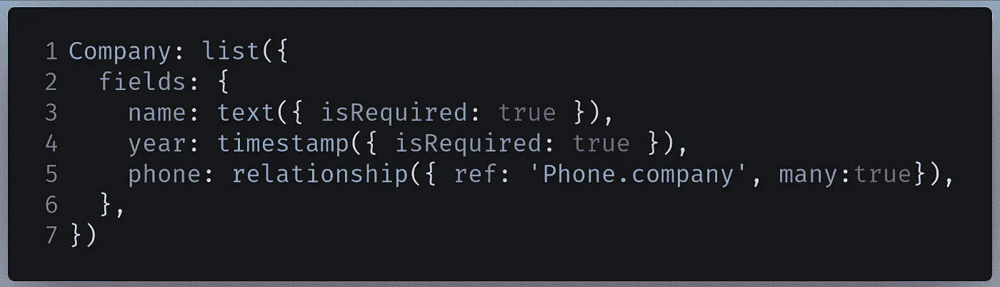

# 用 Keystone Next 和 Next.js 建立一个网站

> 原文：<https://javascript.plainenglish.io/build-a-website-with-keystone-next-and-next-js-6c2618c489f6?source=collection_archive---------1----------------------->

## 用 Keystone Next 创建一个 GraphQL API


Source: [Alfons Morales](https://unsplash.com/@alfonsmc10) On [Unsplash](http://unsplash.com)

在本教程中，您将学习如何使用 Keystone Next，并使用 Next.js 作为前端来使用它的 GraphQL API。

与 Keystone 后端，你将建立一个“电话数据库”。您可以添加制造商和电话数据。稍后，您还将负责将电话和公司数据库连接在一起。


Our Phones and Companies database.

最后，您将学习如何用 Next.js 连接 Keystone 服务器。


End result of this article

# 介绍

要为网站构建 GraphQL API，您需要执行以下步骤:

*   配置您的数据库
*   设置您的后端
*   为您的 GraphQL API 编写字段及其对应的模式
*   稍后，构建查询和变异功能
*   最后，告诉您的代码运行 GraphQL

虽然这是可能的，但它有几个缺陷。例如，如果您想扩展您的应用程序，代码维护就成了一个大问题。它占用了太多的时间和精力。

在一个时间就是金钱的行业，这是不可行的。为了缓解这个问题，这就是[基石](https://next.keystonejs.com/)的用武之地。要使用 Keystone 库，您需要做的就是指定您的字段和模式，它会为您处理其余的事情。

它不仅可以作为 GraphQL 后端，还可以作为 CMS。随着 KeyStone 6 的推出，该团队还开发了一个[文档 API](https://next.keystonejs.com/guides/document-fields) ，这意味着写博客成为可能。我们将在本文的后面了解文档特性。

既然已经谈了它的成果，那就开始吧！

# 入门指南

## PostgreSQL 数据库设置

Keystone 需要一个 PostgreSQL 数据库作为先决条件。我推荐使用 [ElephantSQL](https://www.elephantsql.com/) ，因为它在云中为你建立了一个数据库。它快速可靠。

创建 ElephantSQL 实例后，复制连接 URL 并将其存储在安全的地方。


ElephantSQL ‘Details’ Panel

现在您已经创建了数据库，是时候生成一个 Keystone 项目了。

## 项目初始化

由于项目包含前端和后端，因此最好将项目组织在文件夹中。为此，运行以下终端命令:

```
mkdir keystone-tutorial
cd keystone-tutorial
mkdir frontend #Next.js code goes here
```

## 建筑基石 6

为此，运行以下终端命令:

```
npm init keystone-app
```

这将告诉 NPM 建立一个基石项目。

在构建项目之前，初始化过程会询问您一系列问题。输入您的答案，它将使用您选择的配置创建您的项目:


Terminal command to generate Keystone app

在这里，我将 Keystone 实例生成到我的`backend`文件夹中，以促进正确的文件组织。

我们完事了。在下一节中，我们将研究我们的 Keystone 服务器。

# 我们的 Keystone 服务器

在本文的这一部分，导航到`backend`文件夹，因为这个目录包含我们的 Keystone 代码。

## 用户表

我们将不使用启动代码。转到`schema.ts`，用以下代码替换您的代码:

*   第 1 行:导入`createSchema`和`list`函数，这两个函数将告诉 Keystone 在这个文件中为我们的对象构建模式。
*   第 2 行:这里，`text`、`relationship`、`timestamp`和`password`是我们字段的数据类型。你以后会和他们一起工作。
*   第 3 行:`document`是另一种允许用户输入富文本数据的数据类型。
*   第 5 行:告诉 Keystone 创建我们的模式。
*   第 6 行:我们的第一个字段是`User`字段。
*   第 7-10 行:它将有三个字段:`text`类型的`name`和`text`类型的`email`，它们将具有唯一值。

使用以下终端命令运行代码:

```
npm run dev 
```

现在转到`localhost:3000`。这将是结果:


Output of the code

我们完事了。让我们一起建设我们的公司领域。

## 构建我们的公司表

在`schema.ts`中，将以下代码添加到您的`createSchema`函数中:


Code to write in schema.ts

*   第 1 行:创建一个`Company`模式。
*   第 2–4 行:创建一个类型为`text`的`name`字段，并创建一个类型为`timestamp`的`year`字段。这将允许用户输入时间和日期。我们已经根据需要对这两个字段进行了分类。

现在再次运行代码。这将是输出:


Output of the code

你可以继续做一个`Company`条目:


Entering some data

如果流程成功，它将显示在您公司的主页上:


Entry visible on homepage

我们的代码按预期工作。现在，让我们创建我们的手机领域。

最后，`schema.ts`应该是这样的:

## 打造我们的电话桌

在您的`schema.ts`文件中，在您的`createSchema`函数中编写以下代码:

```
Phone: list({
  fields: {
    name: text({ isRequired: true }),
    company: text({ isRequired: true }),
  },
});
```

这里，我们为我们的`Phone`数据创建一个模式。它将有一个`name`和一个`company`字段。

我们还想给我们的`Phone`数据类型一个`document`字段，这样用户可以输入富文本。

为此，转到[自定义编辑器](https://next.keystonejs.com/guides/document-fields#customize-the-editor)页面，并确保您已经检查了以下设置:


Settings to check in Customize your editor

因此，Keystone 将生成代码，根据我们的喜好定制我们的文档字段。


Keystone-generated code

首先修改这段代码，然后将其复制到您的`Phone`数据类型中，如下所示:

这里，我们告诉 Keystone 添加一个`document`字段，它将被定制为我们之前指定的设置。

最后，您的`Phone`数据类型应该是这样的:

重新启动服务器。结果应该是这样的:


Output of the code

太好了！我们的代码有效。

在下一部分中，您将学习如何在代码中实现关系。

最后，`schema.ts`应该是这样的:

## 实现关系

在我们的代码中，注意我们的`Phone`类型有一个字段`company`。为了更好的用户体验，我们可以尝试链接`Phone`和`Company`表，这样我们就可以拥有一个关系数据库。

为此，将您的`Company`表模式更改如下:



Code to write in Company schema

*   第 5 行:`phone`字段现在是类型`relationship`，它将与`Phone’s` `company`字段链接。`many`属性被设置为`true`，这意味着对于每个`Company`，可以存在多个`Phones`。

接下来，在您的`Phone`表模式中找到下面一行代码:

```
company: relationship({ isRequired: true }),
```

像这样改变它:

```
company: relationship({ ref:"Company.phone" , many: false }),
```

这将告诉 Keystone 与`Company's` `phone`字段建立关系。最后，将`many`属性设置为`false`，这意味着对于每一个`Phone`项，**不能是**的倍数。

运行代码。在继续之前，Keystone 会询问您的表是否会被销毁。简单地输入`y`:


Type ‘y’

现在让我们来测试一下。在您的`Company`页面中，继续创建另一个条目:


Creating an entry in Company

现在转到您的手机页面并创建一个条目:


请注意，在我们公司下面，我们可以在“三星”和“苹果”之间进行选择。这意味着我们成功地创建了一个关系数据库，并且我们的代码像预期的那样工作。

我们现在完成了文章的这一部分。在下一部分，我们将简要讨论如何通过 GraphQL API 使用这些数据。

最后，`schema.ts`应该是这样的:

# 使用 GraphQL

## GraphQL 接口

要使用这些数据，请转到`localhost:3000/api/graphql`。这将允许您运行 GraphQL 命令并从 Keystone 中检索数据。


GraphQL interface

## 运行命令

让我们尝试获取所有公司的数据。为此，请在查询编辑器中编写以下查询:

在这里，我们告诉 Keystone 给我们`id`、`name`、`year`字段。最后，我们也需要这些公司相应的`phone`数据。

这将是输出结果:


Output of query

太好了！如您所见，我们正在获取数据及其关联的电话名称。

我们甚至可以获得特定`Company`的数据。为此，请运行以下查询:

*   第 2 行:从`Company`表中获取数据，该表的`id`为 1。

这将是结果:


Output of the query

以下查询将获取`id`为 1 的`Phone`对象的数据:

```
query {
  Phone(where: {id:1 }) { 
    name 
    company {
      name
    }
  }
}
```

这将是结果:


Output of the query

既然你已经学会了如何在 Keystone 中使用 GraphQL，那么是时候用 Next.js 编写这个应用程序的前端了。

# 构建前端

在文章的这一部分，导航到您的`frontend`文件夹。

## 项目设置

要初始化项目，请键入以下终端命令:

```
npx create-next-app . 
```

现在您已经初始化了我们的项目，您必须删除起始代码。为此，继续删除`/pages/index.js`中`div`标签之间的所有代码。最后，`/pages/index.js`应该是这样的:

```
export default function Home() {
  return (
    <div> 
     <p>Home page </p>
    </div>  
  )
}
```

## 安装所需模块

在这里，我们将安装以下库:

*   `@keystone-next/document-renderer`。这将呈现来自`document`字段的数据。
*   `@apollo/client`:用于对我们的 API 进行 GraphQL 查询。
*   `graphql`:对`@apollo/client`的外部依赖。

为此，运行以下终端命令:

```
npm i @keystone-next/document-renderer @apollo/client graphql
```

## 更改端口

尝试运行全新的 Next 应用程序:

假设您的 Keystone 服务器已经在后台运行，结果将是:


Terminal command error

由于 Next 默认在端口`3000`上运行，我们得到了一个错误。然而，Keystone 服务器已经占用了`3000`端口。我们需要解决这个问题。

在您的`package.json`文件中，找到下面一行:

```
"dev": "next dev",
```

像这样改变它:

```
"dev": "next -p 3001",
```

我们现在已经告诉 Next 在端口`3001`上运行我们的应用程序。尝试再次运行代码。


Successful command

现在去`localhost:3001`。最终结果应该是这样的:


Output of the code

现在让我们组织这个项目的文件结构。

## 项目文件结构

在您的`pages`目录中，创建以下文件夹:

*   `company`:处理从`/company`开始的路线。在这里，创建两个文件:`index.js`和`[id].js`。
*   `phone`:将处理从`/phone`开始的路线。同样，在这里也创建两个文件:`index.js`和`[id].js`。

另外，在这个 app 的根目录下，创建一个`helpers`文件夹，在这个文件夹内，创建一个名为`apollo-client.js`的文件。这将帮助我们连接到我们的 GraphQL API。

最后，您的前端项目的目录应该如下所示:


Final project structure

现在让我们配置我们的 GraphQL 客户端。

## Apollo 客户端配置

在您的`/helpers/apollo-client.js`文件中，编写以下代码:

*   第 3–6 行:创建一个指向 Keystone 服务器 URL 的`ApolloClient`实例。这种情况下是`localhost:3000/api/graphql`。
*   第 8 行:导出这个`ApolloClient`实例及其相关配置。

## 构建主页

在主页上，我们希望将用户重定向到`company`页面或`phone`目录。

在您的`/pages/index.js`页面中，首先导入`[Link](https://nextjs.org/docs/api-reference/next/link)`模块[和](https://nextjs.org/docs/api-reference/next/link)，如下所示:

```
import Link from "next/link";
```

接下来，在同一个文件中找到`return`块:

```
return ( 
  <div>
    <p>Home page</p>
  </div>
);
```

像这样修改它:

运行代码。结果应该是这样的:


Output of the code

完成后，现在是时候开始我们的`/company`路线了。

最后，`/pages/index.js`应该是这样的:

## 显示公司表

当用户转到`/company`时，我们希望向他显示所有可用公司的列表。

转到`pages/company/index.js`并编写以下代码:

```
export default function Companies() {
  return (
    <div>
      <h1> List of all companies shown here.</h1>
    </div>
  );
}
```

这是一个基本的 React 组件。稍后我们将对这个文件进行一些修改。

这将是结果:


Output of the code

第二步，我们现在需要从 Keystone 后端获取数据。

在`/pages/company/index.js`中，首先，进行以下导入:

```
import { gql } from "@apollo/client";
import client from "../../helpers/apollo-client";
import Link from "next/link";
```

`gql`和`client`模块将帮助我们进行 GraphQL 查询，并将结果返回给前端。

现在，将下面这段代码添加到该文件的末尾:

*   第 2–11 行:执行查询以获取所有公司的`name`和`id`字段，并将查询结果存储在`data`变量中。
*   第 15 行:送`data`当道具。

数据现已发送。作为我们的最后一步，我们必须在前端显示它。

在`pages/company/index.js`中，找到你的`Companies`函数声明:

```
export default function Companies() {
  //further code...
```

像这样改变它:

```
export default function Companies({ data }) {
  //further code..
```

这意味着您现在可以在我们的组件中使用`data` prop。这里，您将显示`data`变量的值。

找到您的`return`块:

```
return (
  <div>
    <h1> List of all companies shown here.</h1>
  </div>
);
```

像这样改变它:

*   第 4 行:由于`data`属性是一个数组，我们可以使用`map`函数。
*   第 6 行:`Link`元素将引导用户到`/company/[id]`路线。这里，`id`是具体公司的 ID。
*   第 7 行:显示数组中每一项的`name`字段。

运行代码。这将是结果:


Output of the code

下一步是显示每个公司的电话列表。为此，转到`/pages/company/[id].js`并开始编写以下代码:

```
import { gql } from "@apollo/client";
import client from "../../helpers/apollo-client";
import Link from "next/link";export default function PhoneList() {
  return (
    <div>
      <h1> List of phones</h1>
    </div>
  );
}
```

这意味着无论何时你点击`/companies`页面上的任何一项，Next.js 都会将你重定向到`/companies/[id]`页面。这里，它将呈现`PhoneList`组件。

作为最后一步，您必须呈现每个公司的电话列表。

在此之前，您需要生成静态路径。为此，转到`/pages/company/[id].js`，将以下代码添加到文件末尾:

*   第 2 行:`getStaticPaths`函数将告诉 Next 静态生成我们的动态路由。这为我们的静态站点提供了更好的性能。
*   第 3–11 行:执行 GraphQL 查询，从`Companies`表中获取所有的`id`字段，并将结果存储在`data`变量中。
*   第 13 行:从查询中提取`id`属性，并将它们存储在`paths`数组中。
*   第 19 行:将这些`id’s`发送给 Next。我们还将`fallback`属性设置为`false`，这意味着所有未生成的路由都将返回一个`404`错误。

现在您已经生成了静态路径，是时候从 Keystone 实际获取数据了。在`/pages/company/[id].js`中，在文件末尾添加以下代码:

Working with

*   第 2 行:提取`params`属性以从 URL 获取参数。
*   第 3 行:从 URL 中提取`id`参数。
*   第 4 行:执行 GraphQL 查询，从特定公司获取`phone`字段。
*   第 15 行:在这里，我们将`id`分类为一个参数，它将告诉 GraphQL 参考哪个公司。
*   第 20 行:通过 props 将获取的数据发送给我们的 React 组件。

现在您已经获取了数据，最后一步是实际显示它。为此，首先找到您的`PhoneList`组件声明:

```
export default function PhoneList() {
  //further code..
```

像这样改变它:

```
export default function PhoneList({ data }) {
```

接下来，找到您的`return`块:

```
return (
  <div>
    <h1> List of phones</h1>
  </div>
);
```

像这样改变它:

*   第 4 行:由于`data`是一个数组，我们可以使用`map`方法。
*   第 6 行:单击时，将用户重定向到`/phone/{id}` route，其中`id`是电话的 ID。
*   第 7 行:显示手机名称。

这将产生以下结果:


Output of the code

在下一节中，您将最终在相应的页面上显示手机数据。

不过，在继续之前，我建议您稍微休息一下，或者进一步研究一下代码。

最后，`/pages/company/index.js`应该是这样的:

而`pages/company/[id].js`应该是这样的:

## 使用电话表

当客户端导航到`/phone`页面时，他应该会看到所有可用电话的列表。

为此，转到您的`/pages/phone/index.js`文件，开始编写以下代码:

```
import { gql } from "@apollo/client";
import client from "../../helpers/apollo-client";
import Link from "next/link";export default function AllPhones() {
  return (
    <div>
      <h1>List of all phones</h1>
    </div>
  );
}
```

现在您需要获取数据库中所有可用电话的列表。为此，请在文件末尾编写以下代码:

在这段代码中，我们执行了一个查询来获取数据库中所有电话的`id`和`name`字段。最后在`Line 13`上，我们将数据作为道具发送，这样我们就可以将它们展示给用户。

现在您已经从 Keystone 获取了结果，剩下的工作就是将它们显示到 UI 上。

找到您的`AllPhones`功能组件声明:

```
export default function AllPhones() {
  //further code..
```

像这样改变它:

```
export default function AllPhones({ data }) {
  //further code...
```

接下来，找到你的`return`块:

```
return (
  <div>
    <h1>List of all phones</h1>
  </div>
);
```

像这样改变它:

这将是结果:


Output of the code

我们的代码运行良好。现在是时候显示每部手机的数据了。

转到`/pages/phone/[id].js`，从创建一个基本的 React 组件开始:

*   第 4 行:我们还导入了`DocumentRenderer`,因为 Keystone 需要它来呈现文档字段。

在获取数据之前，Next.js 要求您使用`getStaticPaths`方法生成静态路径。为此，请在文件末尾追加以下代码:

这个代码类似于`company/[id].js`的代码。我们已经从`Phone`项中提取了`id`字段，然后将它们作为路径发送到 Next.js。稍后，Next.js 将使用静态渲染来构建这些路径。

现在您需要使用`getStaticProps`函数从服务器获取`Phone`数据。为此，请编写以下代码:

该功能与`/company/[id].js`类似。注意，在`Line 10`上，我们还提取了`document`字段。这包含了我们想要得到的电话的描述。

最后，您现在必须显示数据。找到您的`PhoneData`组件声明:

```
export default function PhoneData() {
```

像这样改变它:

```
export default function PhoneData({ data }) {
```

现在您已经引入了`data`道具，是时候在您的组件中显示它了。

找到你的`return`块:

```
return (
  <div>
    <h1>Phone name: </h1>
)
```

像这样改变它:

```
return (
  <div>
    <h1>Phone name: {data.name}</h1>
    <h2>Description:</h2>
    <DocumentRenderer document={data.document.document} />
  </div>
);
```

这一次，我们使用了`DocumentRenderer`组件来呈现我们的`Phone`项的文档字段。

我们完事了。再次运行代码。


Output of the code

如您所见，我们的文档字段呈现得很好，这意味着我们的前端可以正确处理富文本。

在本文的下一部分，您将学习如何通过环境变量保护您的应用程序。

最后，`pages/phone/index.js`应该是这样的:

而`pages/phone/[id].js`应该是这样的:

# 安全措施

## 环境变量

转到您前端的项目代码。注意在`/helpers/apollo-client.js`中，您的 GraphQL 端点是公开的:

```
const client = new ApolloClient({
 **uri: "http://localhost:3000/api/graphql"**,
  //further code..
```

因为您的应用程序没有投入生产，所以这是可以的。然而，如果你的服务器在网上，这将导致严重的问题。

```
//if in production, this is NOT OK
const client = new ApolloClient({
 **uri: "https://mykeystone.com/api/graphql"**,
  //further code..
```

这会通过向 Keystone 服务器发送垃圾请求导致 DOS 攻击。让我们通过环境变量来缓解这个问题。

为此，首先，在项目中创建一个`.env.local`文件，如下所示:

```
CONNECT_URI = https://mykeystone.com/api/graphql
```

然后告诉 Apollo 使用您的环境变量:

```
//good to go!
const client = new ApolloClient({
 **uri: process.env.CONNECT_URI**,
  //further code..
```

我们的后端代码也有缺陷。在 Keystone 服务器的代码中，找到`keystone.ts`文件。在那里，找到以下代码:

```
db: {
adapter: "prisma_postgresql",
**url: process.env.DATABASE_URL || "postgres://db://",**
},
//further code...
```

由于我们的数据库在云中，我们需要隐藏它。首先，用下面的终端命令安装`dotenv`:

```
npm install dotenv
```

在`keystone.ts`的开头，写下下面的代码:

```
require("dotenv").config(); //env vars are now exposed.
```

现在，您可以在项目中使用环境变量。在您的`.env`文件中，添加您的连接字符串:

```
DATABASE_URL = postgres://dbURL
```

最后，移除`keystone.ts`中的连接字符串:

```
//connection string is now blank! This is okay. 
db: {
adapter: "prisma_postgresql",
url: process.env.DATABASE_URL **||** **""**,
},
```

# 额外资源

## GitHub 知识库

*   [这里是这个项目的源代码](https://github.com/HussainArif12/keystone-tutorial)

## 进一步阅读

*   [Keystone 下一个文档](https://next.keystonejs.com/)

# 结论

Keystone Next 使用起来绝对轻松。构建表和实现它们之间的关系就像在公园散步一样简单。此外，使用库中的文档字段意味着用户可以编写丰富的文本，这意味着它是一个多功能的软件。

如果您有任何困惑，我建议您查看代码示例来理解这些概念。

非常感谢你坚持到最后！

*更多内容请看*[*plain English . io*](http://plainenglish.io/)