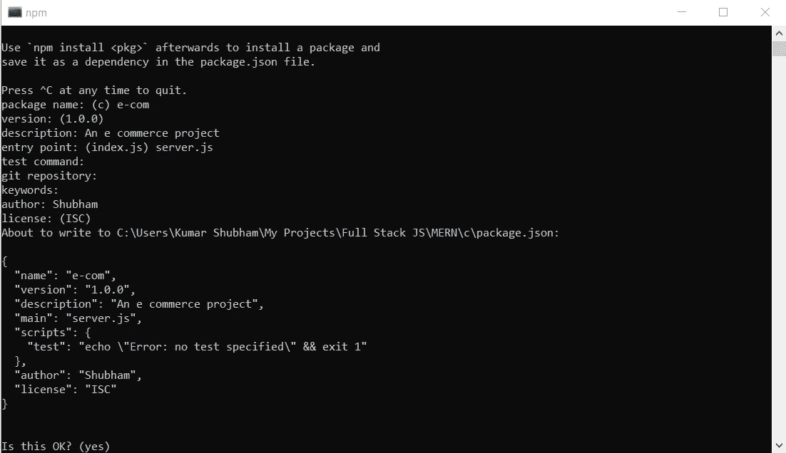

# 让我们构建一个 MERN Stack 电子商务网络应用程序

> 原文：<https://javascript.plainenglish.io/build-an-e-commerce-website-with-mern-stack-part-1-setting-up-the-project-eecd710e2696?source=collection_archive---------1----------------------->

## 第一部分:项目设置

## 让我们用 MERN 栈(MongoDB、Express、React 和 Node)建立一个简单的电子商务网站，用户可以在这里添加商品、付款和订购。


Image by Roberto Cortese on Unsplash

朋友们，你们好！因此，我开始了一个基于 MERN 堆栈的新系列文章，本文是该系列文章的第一部分。本系列将完全专注于 MERN 堆栈(MongoDB、Express、React 和 Node)。之前，我制作了两个系列，一个是社交媒体网站，一个是求职网站，但两者都建立在姜戈框架上，我们当时使用姜戈模板引擎为我们的应用程序创建前端。

但是，现在，我们正在使用全堆栈 Javascript 来设计和开发我们的应用程序。这意味着我们将使用 Node、Express 和 MongoDB 来设计 REST APIs，然后我们将在我们的反应前端中使用这些 API。因此，这将是非常有益的，因为它将教您 REST API 的概念，并将帮助您集成这些框架。

因此，在第一部分，我们将讨论项目的基础知识，并建立项目。

所以，这将是一个简单的电子商务网站。它不具备完整的现代电子商务网站的所有功能，因为它旨在学习和理解一切实际上是如何运作的。我们当然可以在这个项目的基础上增加一些功能，让它变得更好。我们将保持我们的设计简单和最小的前端方面。我们不会处理 CSS，因为我们的重点是理解我们如何在前端处理 API，并将重点放在基础部分。

我们将使用反应自举来最低限度地设计我们的反应前端。我们的目标是打造一个一切运作正常的电子商务网站。

因此，我们将要构建的应用程序中的特性是:-

1.  使用 JSON 网络令牌的身份验证(JWT)。
2.  可以添加、编辑、查看和删除我们商店中的所有商品。
3.  从购物车中添加或移除物品的选项。
4.  显示购物车的总账单，并在用户更新购物车时立即更新。
5.  使用本地存储来存储 JWT，因此我们只允许登录用户购买物品。
6.  可选择付款和结账，从而创建订单并清空购物车。

因此，这些是我们在应用程序中需要具备的基本特性。现在，让我们熟悉一下我们将用来构建这个应用程序的技术堆栈。

**前端—** 在前端，我们将使用 React 作为前端库。我们将使用 Redux 进行状态管理。我们将使用反应引导库进行界面的基本设计。

**后端—** 对于后端，我们将使用 Nodejs 之上的 Express 库。我们将使用 MongoDB 作为 NoSQL 数据库，以 JSON 格式将我们的数据存储为文档。我们将使用*猫鼬*连接到我们的 MongoDB 数据库。

我们将使用 Express 创建 REST APIs，并在 React 前端使用这些端点来与我们的后端部分交互。

要了解更多关于使用 Express、Node 和 MongoDB 创建 REST APIs 的信息，请查看这篇简单而优雅地讨论它的文章。

[](https://towardsdatascience.com/build-a-rest-api-with-node-express-and-mongodb-937ff95f23a5) [## 用 Node，Express 和 MongoDB 构建一个 REST API

### 让我们使用 Node、Express 和 MongoDB 构建一个遵循 CRUD 原则的 REST API，并使用 Postman 测试它。

towardsdatascience.com](https://towardsdatascience.com/build-a-rest-api-with-node-express-and-mongodb-937ff95f23a5) 

本教程将帮助您理解 REST API，您将学习如何轻松地构建它们。

另外，如果您是 React 新手，这篇简单的文章将非常适合您开始使用 React。本文详细介绍了如何使用 React 构建一个简单的 Todo 应用程序。这将有助于理解 CRUD(创建、读取、更新和删除)原则。

[](https://towardsdatascience.com/build-a-simple-todo-app-using-react-a492adc9c8a4) [## 使用 React 构建一个简单的 Todo 应用程序

### 让我们用 React 构建一个简单的 Todo 应用程序，教你 CRUD 的基本原理(创建、读取、更新和…

towardsdatascience.com](https://towardsdatascience.com/build-a-simple-todo-app-using-react-a492adc9c8a4) 

现在，我们对将要构建的内容有了一个大致的了解，所以我们想开始构建这个项目。

首先，我们需要在我们的系统中下载 Nodejs，因为这样我们就可以使用 NPM(节点包管理器)。如果您还没有下载它，[这里有下载它的链接](https://nodejs.org/en/)。

在将 Nodejs 下载并安装到系统中之后，我们就可以开始构建项目了。因此，让我们打开终端，进入我们选择的文件夹，在那里我们想要创建我们的项目。

因此，我们将创建一个新的文件夹来存储所有的项目文件。我把我的文件夹命名为*【电子商务】*。然后移到创建的文件夹中，在终端中键入以下命令，在那里启动一个新的节点项目。

```
npm init
```

然后它会问一系列类似这样的问题



npm init

我们可以为我们的包选择任何名称，我们给出我们选择的任何描述，我们把我们的名字放在作者部分。我们将入口点从 index.js 更改为 server.js，因为我们将把入口文件命名为 server.js，而不是 index.js。我们将所有其他字段留空。

当我们点击*是、*时，它会在那个文件夹中创建一个 *package.json* 文件。在您选择的代码编辑器中打开 *package.json* 文件。为此，我使用了 VS 代码。

我们现在需要使用 *npm，*安装某些依赖项，然后 npm 会自动将它们作为依赖项添加到我们的 *package.json* 文件中。

这是 package.json 文件，其中包含了我们目前为止在这个项目中需要的所有依赖项。我们将在以后需要时添加一些依赖项。

实际上，您可以从 *package.json* 文件中复制依赖项和开发依赖项，并更新您的文件。然后我们可以运行 *npm install* 来安装 *package.json* 文件中列出的所有依赖项。

在您安装了这些依赖项之后，让我们首先了解一下我们刚刚安装的这些包的意义。

1.  bcrypt —我们将在应用程序中验证用户。我们需要在数据库中存储用户的密码。因此，不建议存储纯文本密码，因为它们很容易被破解。因此，在保存密码之前，我们使用 bcrypt 库散列密码。当我们实际使用它时，我们会深入研究它如何工作的更多细节。
2.  **并发** —这个包帮助我们同时运行两个进程；因此，我们将能够同时运行我们的服务器和客户机，而不必使用两个单独的终端来这样做。
3.  这是一个简单的包，帮助我们存储重要的数据，比如密钥、数据库 ID 等等。，在一个单独的 JSON 文件中，它允许我们在任何文件中轻松地访问它。
4.  **express** —这是我们将在 Node 之上使用的库，用于构建我们的 REST APIs。
5.  **jsonwebtoken** —这有助于我们创建用于认证目的的 jwt。
6.  **mongose**—这有助于我们在 MongoDB 和我们的 Express 应用程序之间建立连接。
7.  验证器——它帮助我们验证一些东西，比如电子邮件。它是一个很小的包，对验证很有用。
8.  **nodemon** —它帮助我们保持服务器运行，并让我们在检测到任何更改时立即重新运行服务器，因为我们不需要重启服务器来使更改生效。

我们还添加了一些脚本，使我们更容易运行服务器和客户机。让我们来看看它们:-

1.  **启动** —使用 node 运行 server.js 文件。它需要重启以进行更新。
2.  **服务器** —它使用 nodemon 运行 server.js 文件，这允许它自动更新更改并重启服务器。
3.  **客户端** —运行该命令将运行客户端。我们使用一个前缀让它知道我们想首先移动到客户机文件夹，然后运行命令。
4.  **dev** —它使用并发来同时运行服务器和客户端。

所以，现在让我们在根目录下创建一个 **server.js** 文件。让我们开始构建我们的 server.js 文件。

因此，我们将从导入这个文件中需要的各种库开始。

```
const express = require('express');
const mongoose = require('mongoose');
const path = require('path');
const config = require('config');
```

然后，我们将调用我们的 express 应用程序，并将其设置为在我们的应用程序中使用。

```
const app = express();
app.use(express.json());
```

接下来，我们将设置服务器文件来提供静态内容，这些内容将在生产中从 React 应用程序生成。这只能在生产环境中工作。

```
if(process.env.NODE_ENV === 'production') {
    app.use(express.static('client/build'));
    app.get('*', (req, res) => {
res.sendFile(path.resolve(__dirname,'client','build','index.html'));
    });
}
```

接下来，我们配置我们的服务器文件以连接到 MongoDB 数据库，并开始运行服务器以在端口 4000 上监听我们的请求。

```
const dbURI = config.get('dbURI');
const port = process.env.PORT || 4000;
mongoose.connect(dbURI, { useNewUrlParser: true, useUnifiedTopology: true, useCreateIndex:true })
  .then((result) => app.listen(port))
  .catch((err) => console.log(err));
```

如您所见，我们已经使用了*配置*来获得我们的数据库 URI。我们定义了一个端口变量来使用环境变量中的任何端口值，就像在生产环境中一样，但是在开发中，我们将使用端口 4000。

然后，我们将使用*mongose、*连接到我们的数据库，在我们成功连接到数据库后，我们开始监听端口上的请求，即服务器启动并运行。

这是我们到目前为止构建的 server.js 文件:-

我们还将在根目录下创建一个名为 *config* 的新文件夹。然后，我们将在 *config* 文件夹中创建一个名为 *default.json* 的新文件。

然后，我们将在这个文件中存储我们的重要密钥和秘密。我们在键值对中这样做。

```
{
  "dbURI": "YOUR_DATABASE_URI",
}
```

然后我们会创建不同的文件夹来保存我们的路线，控制器，模型文件。这样做可以减少混乱，保持代码的可读性和可维护性。

因此，我们将在接下来的部分中处理所有这些事情。我们将专门用一部分来理解认证。接下来，我们将在单独的部分中处理与商品、购物车和订单相关的模型、路线和控制器。

完成所有这些将主要总结我们系列的后端部分，然后我们将在完成这些部分后继续前端部分。

这将是一个令人兴奋的系列，我相信我们都将学到一些新的和富有成效的东西，这将有助于我们发展自己的技能。

我希望你们都理解了我们在本文中讨论的第一部分。我希望你们都对即将到来的部分感到兴奋！

[](/build-an-e-commerce-website-with-mern-stack-part-2-designing-the-models-e231b2454aba) [## 让我们建立一个 MERN 堆栈电子商务网络应用程序

### 第 2 部分:设计模型

javascript.plainenglish.io](/build-an-e-commerce-website-with-mern-stack-part-2-designing-the-models-e231b2454aba) 

如果你想访问这个项目的完整代码，请访问这个项目的 [GitHub 库](https://github.com/shubham1710/MERN-E-Commerce)。

如果你对学习 Django 很感兴趣，我有两个很好的系列，可以帮助你学习并使用 Django 构建一些实用的东西。它们分别是 5 集和 6 集系列。另外，在 Django Rest 框架上也有一个新的系列，是关于使用 DRF 构建博客网站的。

在这些项目中，我们探索了 Django 的各种特征。我们还在社交媒体项目中使用 AJAX，在求职项目中使用社交登录功能(Google、Github、LinkedIn)。看看它们吧，因为这些都是令人兴奋的项目，你可以用 Django 来做。

[](https://towardsdatascience.com/build-a-blog-website-using-django-rest-framework-overview-part-1-1f847d53753f) [## 使用 Django Rest 框架构建博客网站——概述(第 1 部分)

### 让我们使用 Django Rest 框架构建一个简单的博客网站，了解 DRF 和 REST APIs 如何工作，以及我们如何添加…

towardsdatascience.com](https://towardsdatascience.com/build-a-blog-website-using-django-rest-framework-overview-part-1-1f847d53753f) [](https://towardsdatascience.com/build-a-social-media-website-using-django-setup-the-project-part-1-6e1932c9f221) [## 使用 Django 构建一个社交媒体网站——设置项目(第 1 部分)

### 在第一部分中，我们通过设置密码来集中设置我们的项目和安装所需的组件…

towardsdatascience.com](https://towardsdatascience.com/build-a-social-media-website-using-django-setup-the-project-part-1-6e1932c9f221) [](https://towardsdatascience.com/build-a-job-search-portal-with-django-overview-part-1-bec74d3b6f4e) [## 用 Django 构建求职门户——概述(第 1 部分)

### 让我们使用 Django 建立一个工作搜索门户，它允许招聘人员发布工作并接受候选人，同时…

towardsdatascience.com](https://towardsdatascience.com/build-a-job-search-portal-with-django-overview-part-1-bec74d3b6f4e) 

## 进一步阅读

[](https://plainenglish.io/blog/how-to-build-a-graphql-ecommerce-app-from-scratch) [## 如何从头开始构建一个 GraphQL 电子商务应用程序

### 这就是你要建造的东西！埃森哲的一项调查(19 个国家的 20，000 多名消费者)发现，47%的人…

简明英语. io](https://plainenglish.io/blog/how-to-build-a-graphql-ecommerce-app-from-scratch) [](https://plainenglish.io/blog/5-use-cases-of-web-scraping-in-ecommerce) [## 电子商务中网络抓取的 5 个用例

### 利用 web scraper 可以让您的组织鸟瞰行业趋势。这有无数…

简明英语. io](https://plainenglish.io/blog/5-use-cases-of-web-scraping-in-ecommerce) 

*更多内容请看*[***plain English . io***](https://plainenglish.io/)*。报名参加我们的* [***免费周报***](http://newsletter.plainenglish.io/) *。关注我们关于*[***Twitter***](https://twitter.com/inPlainEngHQ)[***LinkedIn***](https://www.linkedin.com/company/inplainenglish/)*[***YouTube***](https://www.youtube.com/channel/UCtipWUghju290NWcn8jhyAw)*[***不和***](https://discord.gg/GtDtUAvyhW) *。对增长黑客感兴趣？检查* [***电路***](https://circuit.ooo/) *。***