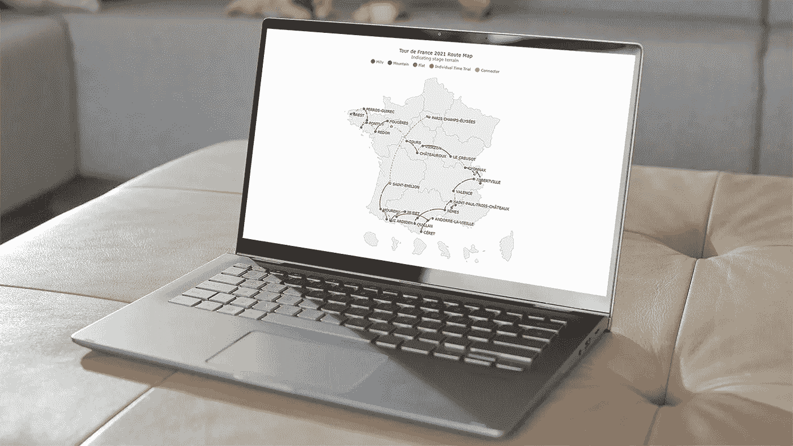
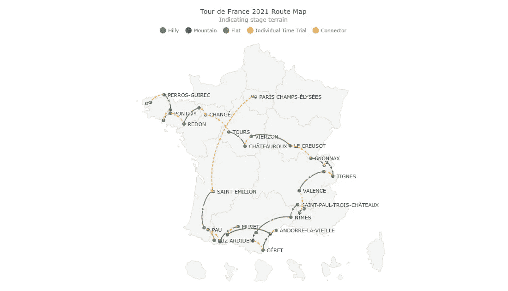
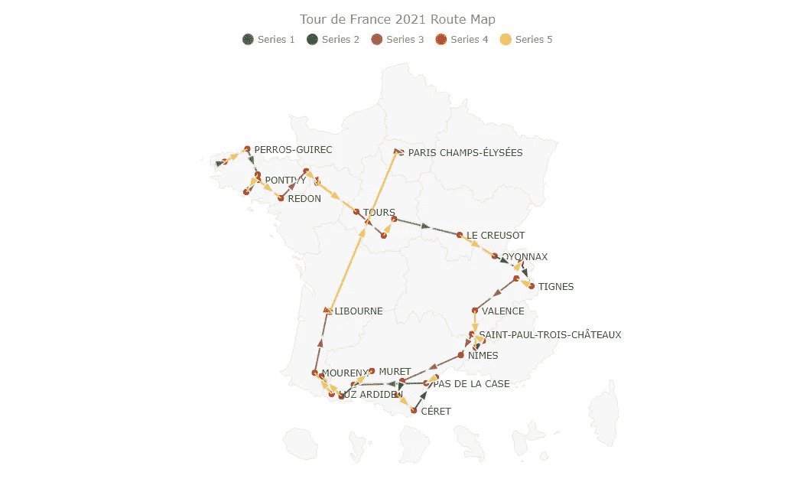
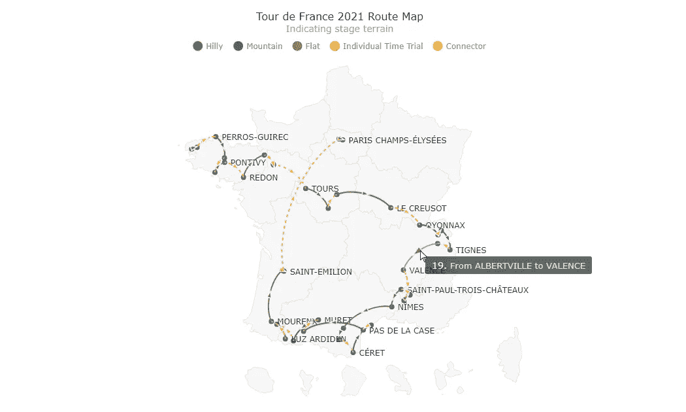

# 构建交互式 JavaScript 连接器映射

> 原文：<https://javascript.plainenglish.io/build-an-interactive-javascript-connector-map-62db24cc2fc4?source=collection_archive---------18----------------------->



**一个** [**连接器地图**](https://www.anychart.com/chartopedia/chart-type/connector-map/) **是一组连接地理地图上各点的直线或曲线。它通常用于以图形方式表示位置之间的路径或任何其他连接。您想了解如何为网页或应用程序构建一个有吸引力的数据可视化吗？**

实际上，使用 JavaScript 创建交互式连接器映射很容易。我现在就准备好让你见识一下！跟随本教程，我以 JS 连接器地图的形式描绘了 [2021 环法自行车赛](https://en.wikipedia.org/wiki/2021_Tour_de_France)的骑行路线，并彻底解释了所有步骤。

这里有一个预览，可以让你对这个旅程感到兴奋，这个漂亮的交互式 JavaScript 连接器地图将在本教程结束时构建完成！



# 通过四个基本步骤创建 JS 连接器映射

用 JavaScript 构建连接器图比其他基本图表要复杂一些。但是当我们使用一个 JS 图表库来创建它时，它就变得简单了。在本教程中，我将使用 [AnyChart](https://www.anychart.com/) ，这是一个这样的库，它有一个特殊的 [AnyMap](https://www.anychart.com/products/anymap/) 产品和良好的[映射文档](https://docs.anychart.com/Maps/Quick_Start)来帮助轻松开发连接器映射，我将从头到尾解释整个过程，以便您完全理解每一步和每一行代码是做什么的。

准备好通过四个基本步骤构建一个令人惊叹的交互式 JavaScript 连接器地图。

## 1.创建 HTML 页面

首先，我需要一个空白的 HTML 页面来保存我的连接器映射。我在 HTML 页面的`<body>`中添加了一个具有唯一 id 的`<div>`元素，我将在后面引用它。

我还使用`<style>`标签将`<div>`的宽度和高度设置为 100%，以使我的地图适合整个屏幕。您可以根据需要调整这些参数。

```
<html>
  <head>
    <title>JavaScript Connector Map</title>
    <style type="text/css">      
      html, body, #container { 
        width: 100%; height: 100%; margin: 0; padding: 0; 
      } 
    </style>
  </head>
  <body>
    <div id="container"></div>
  </body>
</html>
```

## 2.添加必要的脚本

我将使用 AnyChart 库，所以我需要在 HTML 页面的`<head>`部分添加必要的 JS 脚本。

为了创建连接器映射，我需要 AnyChart 的'[核心](https://docs.anychart.com/Quick_Start/Modules#core)和'[映射](https://docs.anychart.com/Quick_Start/Modules#geo_maps)模块。此外，我还添加了法国的[地理数据](https://www.anychart.com/download/cdn#geodata)，因为路线点都在那里。

另一个用于包装地图相关附加功能的脚本是 [Proj4js](http://proj4js.org/) ，这是一个 JavaScript 库，确保在适当的地理区域绘制坐标。

```
<html>
  <head>
    <title>JavaScript Connector Map</title>
    <script src="https://cdn.anychart.com/releases/8.10.0/js/anychart-core.min.js"></script>
    <script src="https://cdn.anychart.com/releases/8.10.0/js/anychart-map.min.js"></script>
    <script src="https://cdn.anychart.com/geodata/latest/countries/france/france.js"></script>
    <script src="https://cdnjs.cloudflare.com/ajax/libs/proj4js/2.3.15/proj4.js"></script>
    <style type="text/css">      
      html, body, #container { 
        width: 100%; height: 100%; margin: 0; padding: 0; 
      } 
    </style>
  </head>
  <body>  
    <div id="container"></div>
    <script>
 ***// All the code for the JS connector map will come here***    </script>
  </body>
</html>
```

## 3.准备数据

我从环法自行车赛的[官方网站](https://www.letour.fr/en/overall-route)收集自行车路线的数据。JS 连接器映射要求数据采用特定的格式，所以我通过添加所需格式的数据创建了一个特定的数据集。你可以在这里查看文件[。](https://gist.githubusercontent.com/shacheeswadia/4a2e84185d754984681a89194b4282df/raw/ec70b11e8f68e5e6df60cff15bff8dd5b05ce22a/connector-map.json)

在连接器地图数据集中，要记住的主要事情是起点和终点由每个位置的纬度和经度定义，其中首先定义纬度，然后定义经度。供您参考，我从[LatLong.net](https://www.latlong.net/)获得了每个点的纬度和经度信息。

为了使用代码中的数据，我需要包含 AnyChart JavaScript 图表库附带的方便的[数据适配器](https://docs.anychart.com/Quick_Start/Modules#data_adapter)脚本来加载文件。

```
<script src="https://cdn.anychart.com/releases/8.10.0/js/anychart-data-adapter.min.js"></script>
```

## 4.编写 JS 代码来绘制连接器图

现在是比赛的最后也是最重要的阶段，编写生成连接器映射本身的 JavaScript 代码主线。

首先，我将所有代码都放在了`anychart.onDocumentReady()`函数中，以确保只有在网页完全加载时才会执行。然后我使用`anychart.data.loadJsonFile()`函数添加数据。

```
<script>
  anychart.onDocumentReady(function () {
    anychart.data.loadJsonFile(
'https://gist.githubusercontent.com/shacheeswadia/4a2e84185d754984681a89194b4282df/raw/ec70b11e8f68e5e6df60cff15bff8dd5b05ce22a/connector-map.json', function (data) {
    });
  });
</script>
```

为了创建一个连接器地图，我使用了`connector()`函数并设置了法国的地理数据。接下来，我只是为地图提供一个标题。

```
***// create a connector map chart*** var map = anychart.connector();***// set the geodata for france*** map.geoData('anychart.maps.france');***// add a title for the map*** map
  .title('Tour de France 2021 Route Map');
```

在显示连接之前，我使用`marker()`功能标出了路线上的所有地点。我用圆形记号笔，用法国国旗的红色填充它。

```
***// create a marker series for the place names*** var citiesSeries = map
  .marker(data[0]['citiesData'])
  .type('circle')
  .fill('#c51923')
  .stroke(0);
```

现在，我使用一个助手函数来表示各种连接，该函数接受地图、系列名称和数据。在本教程的后面你会看到为什么我制作了五个不同的系列。在 helper 函数中，我用`connector()`函数创建了链接，并将线条的颜色设置为法国国旗的蓝色。

```
***// create individual series*** createSeries(map, 'Hilly', data[1]['hillyData']);
createSeries(map, 'Mountain', data[2]['mountainData']);
createSeries(map, 'Flat', data[3]['flatData']);
createSeries(map, 'Individual Time Trial', data[4]['timeTrialData']);
createSeries(map, 'Connector', data[5]['connectorData']);...***// a helper function to create several series*** function createSeries(map, name, data) {
 ***// configure and customize the series***  var connectorSeries = map
    .connector(data)
    .stroke('#3e5ca6')
    .fill('#3e5ca6');
}
```

在最后两步中，我引用容器 div 来显示图表和绘制地图。

```
***// set the container id for the map*** map.container('container');***// command to draw the resulting connector map*** map.draw();
```

那是终点线！一个漂亮的 JavaScript 连接器图就全部做好了！


> **这里是完整的代码，你也可以在** [**AnyChart 游乐场**](https://playground.anychart.com/6Tsj5OI8/) **上查看。**

```
<html>
  <head>
    <title>JavaScript Connector Map</title>
    <script src="https://cdn.anychart.com/releases/8.10.0/js/anychart-core.min.js"></script>
    <script src="https://cdn.anychart.com/releases/8.10.0/js/anychart-map.min.js"></script>
    <script src="https://cdn.anychart.com/geodata/latest/countries/france/france.js"></script>
    <script src="https://cdnjs.cloudflare.com/ajax/libs/proj4js/2.3.15/proj4.js"></script>
    <script src="https://cdn.anychart.com/releases/8.10.0/js/anychart-data-adapter.min.js"></script>
    <style type="text/css">
      html,
      body,
      #container {
        width: 100%;
        height: 100%;
        margin: 0;
        padding: 0;
      }
    </style>
  </head>
  <body>
    <div id="container"></div>
    <script>anychart.onDocumentReady(function () {anychart.data.loadJsonFile(
'https://gist.githubusercontent.com/shacheeswadia/4a2e84185d754984681a89194b4282df/raw/ec70b11e8f68e5e6df60cff15bff8dd5b05ce22a/connector-map.json', function (data) { ***// create a connector map chart***  var map = anychart.connector(); ***// set the geodata for france***  map.geoData('anychart.maps.france'); ***// add a title for the map***  map
    .title('Tour de France 2021 Route Map'); ***// create a marker series for the place names***  var citiesSeries = map
    .marker(data[0]['citiesData'])
    .type('circle')
    .fill('#c51923')
    .stroke(0); ***// create individual series***  createSeries(map, 'Hilly', data[1]['hillyData']);
  createSeries(map, 'Mountain', data[2]['mountainData']);
  createSeries(map, 'Flat', data[3]['flatData']);
  createSeries(map, 'Individual Time Trial', data[4]['timeTrialData']);
  createSeries(map, 'Connector', data[5]['connectorData']); ***// sets the container id for the map***  map.container('container'); ***// command to draw the resulting connector map***  map.draw();});
});***// a helper function to create several series*** function createSeries(map, name, data) {
 ***// configure and customize the series***  var connectorSeries = map
    .connector(data)
    .stroke('#3e5ca6')
    .fill('#3e5ca6');
} </script>
  </body>
</html>
```

# 定制 JavaScript 连接器映射

我认为当前的连接器图看起来已经很棒了。但是我们当然可以包含更多的信息，也可以从美学角度对其进行改进。因此，请和我一起来看看如何定制基于 JavaScript 的连接器地图可视化，并让它变得更棒。

## 1.根据舞台路线地形设置颜色

环法自行车赛的骑行路线穿过不同类型的地形，我想在连接器地图上用不同的颜色突出显示它们。这就是为什么我之前创建了五个不同的系列:现在我可以单独定制它们。

因此，我向 helper 函数添加了一个颜色参数，并在调用每个系列的函数时包含了各自的颜色代码。

我还通过在辅助函数中设置笔画宽度值来增加连接线的宽度。

```
***// create individual series*** createSeries(map, 'Hilly', data[1]['hillyData'], '#57ae12');
createSeries(map, 'Mountain', data[2]['mountainData'], '#318053');
createSeries(map, 'Flat', data[3]['flatData'], '#a4664d');
createSeries(map, 'Individual Time Trial', data[4]['timeTrialData'], '#ef6c00');
createSeries(map, 'Connector', data[5]['connectorData'], '#fac233');...***// a helper function to create several series*** function createSeries(map, name, data, color) {
 ***// configure and customize the series***  var connectorSeries = map
    .connector(data)
    .stroke(function (d) {
      return {
        color: color,
        thickness: 2
      }
    })
    .fill(color);
}
```

然后我修改了位置标记的颜色，将其从红色改为蓝色。

```
***// create a marker series for the place names*** var citiesSeries = map
  .marker(data[0]['citiesData'])
  .type('circle')
  .fill('#3e5ca6')
  .stroke(0);
```

因为我为不同的舞台类型添加了不同的颜色，所以我需要包含一个图例来表示哪种颜色代表哪种类型。您可以选择和取消选择图例项来显示或隐藏编码地形的路线，例如，单独的计时赛。

因此，我添加了图例并排除了路线站点，因为它们都是相同的颜色。在助手函数中，我设置了图例的形状和颜色。

```
***// turn on the legend*** map.legend(true);***// exclude cities from the legend*** citiesSeries.legendItem(false);...***// set the legend shape and color*** connectorSeries.legendItem({
  iconType: 'circle',
  iconFill: color
});
```

如果你是初学者，乍一看可能会很复杂。但是这些快速的动作实际上增强了连接器图，使其信息量更大。所以不要让这些代码困扰你。加载，保持你的注意力，通过每一行来消化，你将能够掌握正在发生的事情。

## 2.格式化标签

如果你注意到，在地图的最初版本中，地名与连接线有相当多的重叠。为了减少重叠并提高可读性，我调整了标签。

```
***// customize the labels for the city names series*** citiesSeries
  .labels()
  .enabled(true)
  .position('center-bottom')
  .fontColor('#263238')
  .offsetY(0)
  .offsetX(5)
  .anchor('left-center')
  .format('{%name}');
```

## 3.更改连接线的曲率

有一个选项可以通过将曲率归零来将连接器从默认的弧形线更改为直线。

```
***// configure and customize the series*** var connectorSeries = map
  .connector(data)
  .stroke(function (d) {
    return {
      color: color,
      thickness: 2
    }
  })
  .fill(color)
  .curvature(0);
```

> **你可以在这里看到它的样子，也可以在** [**AnyChart 游乐场**](https://playground.anychart.com/mQpaROde/) **上查看这个变种的互动版本及其完整代码。**



但说实话，我更喜欢之前的连接器可视化方式。所以我取消了曲率调整，恢复到最初的曲线。

## 4.设置连接线类型的格式

在自行车路线中，一些线路只是将一个赛段的终点城镇与下一个赛段的起点城镇连接起来，并不是赛道的一部分。我通过向 helper 函数添加一个布尔参数来用虚线表示这些连接。如果布尔值为真，我在 stroke 属性中添加破折号值。

```
***// create individual series*** createSeries(map, 'Hilly', data[1]['hillyData'], '#57ae12', false);
createSeries(map, 'Mountain', data[2]['mountainData'], '#318053', false);
createSeries(map, 'Flat', data[3]['flatData'], '#a4664d', false);
createSeries(map, 'Individual Time Trial', data[4]['timeTrialData'], '#ef6c00', false);
createSeries(map, 'Connector', data[5]['connectorData'], '#fac233', true);...***// configure and customize the connector series*** var connectorSeries = map
  .connector(data)
  .stroke(function (d) {
    return {
      color: color,
      thickness: 2,
      dash: isConnector ? '3 6' : '0'
    }
  })
  .fill(color)
  .name(name);
```

## 5.增强工具提示

默认情况下，到目前为止创建的 JavaScript 连接器地图的工具提示显示阶段开始和结束的城市和城镇的纬度和经度，这不是很有用。因此，我使用 HTML 修改了 helper 函数中的连接器工具提示，以显示每条连接线的起点和终点的名称。我还禁用了 place 系列的工具提示，因为每个站点都不需要任何额外的信息。

```
***// customize the destination series tooltip*** connectorSeries
  .tooltip()
  .format('{%full}')
  .title({ useHtml: true })
  .titleFormat(
    '{%number}. <span style="font-size: 13px; color: #E1E1E1"; padding: 10px>{%short}</span>'
  );...***// create a marker series for the place names*** var citiesSeries = map
  .marker(data[0]['citiesData'])
  .type('circle')
  .fill('#3e5ca6')
  .stroke(0)
  .tooltip(false);
```

## 6.修改标记大小

我还想减少连接线上的箭头标记大小，使其更加微妙。这需要在 helper 函数中添加一行代码。

```
***// set the marker size*** var markers = connectorSeries.markers().size(10);
```

## 7.增强标题

最后，我只是让标题更具知识性，并定制文本。这段代码类似于工具提示个性化代码，都使用了 HTML。

```
***// set a title for the map and customize it*** map
  .title()
  .enabled(true)
  .useHtml(true)
  .fontColor('#263238')
  .text(
    'Tour de France 2021 Route Map<br/>' +
    '<span style="color:#a3a3a3; font-size: 14px;">Indicating stage terrain</span>'
  );
```

仅此而已，已获得奖励积分！一个绝对可爱和富有洞察力的 JavaScript (HTML5)连接器地图被构建来展示 2021 年环法自行车赛的自行车路线，这是最负盛名的年度自行车比赛之一！



> **抛光版的完整代码就在这里，也在**[**any chart Playground**](https://playground.anychart.com/S9xXAHth/)**上。**

```
<html>
  <head>
    <title>JavaScript Connector Map</title>
    <script src="https://cdn.anychart.com/releases/8.10.0/js/anychart-core.min.js"></script>
    <script src="https://cdn.anychart.com/releases/8.10.0/js/anychart-map.min.js"></script>
    <script src="https://cdn.anychart.com/geodata/latest/countries/france/france.js"></script>
    <script src="https://cdnjs.cloudflare.com/ajax/libs/proj4js/2.3.15/proj4.js"></script>
    <script src="https://cdn.anychart.com/releases/8.10.0/js/anychart-data-adapter.min.js"></script>
    <style type="text/css">
      html,
      body,
      #container {
        width: 100%;
        height: 100%;
        margin: 0;
        padding: 0;
      }
    </style>
  </head>
  <body>
    <div id="container"></div>
    <script>anychart.onDocumentReady(function () {anychart.data.loadJsonFile(
'https://gist.githubusercontent.com/shacheeswadia/4a2e84185d754984681a89194b4282df/raw/ec70b11e8f68e5e6df60cff15bff8dd5b05ce22a/connector-map.json', function (data) { ***// create a connector map chart***  var map = anychart.connector(); ***// set the geodata for france***  map.geoData('anychart.maps.france'); ***// add a title for the map and customize it***  map
    .title()
    .enabled(true)
    .useHtml(true)
    .fontColor('#263238')
    .text(
      'Tour de France 2021 Route Map<br/>' +
      '<span style="color:#a3a3a3; font-size: 14px;">Indicating stage terrain</span>'
    ); ***// create a marker series for the place names***  var citiesSeries = map
    .marker(data[0]['citiesData'])
    .type('circle')
    .fill('#3e5ca6')
    .stroke(0)
    .tooltip(false); ***// create individual series***  createSeries(map, 'Hilly', data[1]['hillyData'], '#57ae12', false);
  createSeries(map, 'Mountain', data[2]['mountainData'], '#318053', false);
  createSeries(map, 'Flat', data[3]['flatData'], '#a4664d', false);
  createSeries(map, 'Individual Time Trial', data[4]['timeTrialData'], '#ef6c00', false);
  createSeries(map, 'Connector', data[5]['connectorData'], '#fac233', true); ***// customize the labels for the city names series***  citiesSeries
    .labels()
    .enabled(true)
    .position('center-bottom')
    .fontColor('#263238')
    .offsetY(0)
    .offsetX(5)
    .anchor('left-center')
    .format('{%name}'); ***// turn on the legend***  map.legend(true); ***// exclude cities from the legend***  citiesSeries.legendItem(false); ***// set the container id for the map***  map.container('container'); ***// command to draw the resulting connector map***  map.draw();});});***// a helper function to create several series*** function createSeries(map, name, data, color, isConnector) {
 ***// configure and customize the series***  var connectorSeries = map
    .connector(data)
    .stroke(function (d) {
      return {
        color: color,
        thickness: 2,
        dash: isConnector ? '3 6' : '0'
      }
      })
    .fill(color)
    .name(name); ***// set the legend shape and color***  connectorSeries.legendItem({
    iconType: 'circle',
    iconFill: color
  }); ***// set the marker size***  var markers = connectorSeries.markers().size(10); ***// customize the destination series tooltips***  connectorSeries
    .tooltip()
    .format('{%full}')
    .title({ useHtml: true })
    .titleFormat(
      '{%number}. <span style="font-size: 13px; color: #E1E1E1"; padding: 10px>{%short}</span>'
    );
} </script>
  </body>
</html>
```

# 结论

正如您在本教程中看到的，创建交互式 JavaScript 连接器映射实际上是轻松快捷的。如果您想了解如何实现其他内容或查看其他图表类型，请随意钻研[连接器映射文档](https://docs.anychart.com/Maps/Connector_Maps)。

无论是竞技体育还是交互式数据可视化，实践是成功的关键。所以，继续尽可能多地练习构建 JS 图形。一定要问我关于本教程或其他数据视觉效果的问题，如果有的话。

***在***[***Chartopedia***](https://www.anychart.com/chartopedia/chart-type/connector-map/)***上查看更多关于连接器地图，不要错过其他***[***JavaScript 制图教程***](https://www.anychart.com/blog/category/javascript-chart-tutorials/) ***。***

***如果你有一个很酷的客座博文的想法，欢迎来到*** [***让我们知道***](https://www.anychart.com/support/) 。

*原载于 2021 年 9 月 21 日 https://www.anychart.com*[](https://www.anychart.com/blog/2021/09/21/connector-map-javascript/)**。**

**更多内容请看*[***plain English . io***](http://plainenglish.io/)*