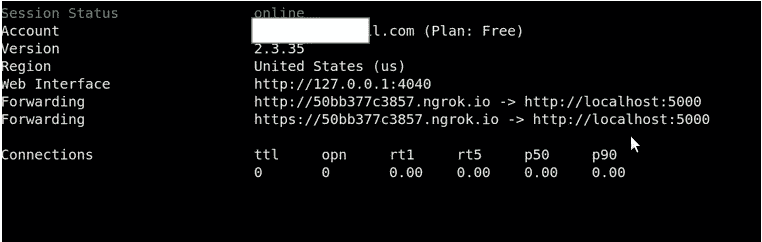
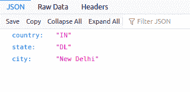

# 使用 Node.js 构建一个 IP 查找微服务

> 原文：<https://javascript.plainenglish.io/build-an-ip-lookup-microservice-using-node-js-67d7aaaf4b34?source=collection_archive---------7----------------------->

## 提取用户的位置，时区和更多。


Photo by [**Wendy van Zyl**](https://www.pexels.com/@wendy-van-zyl-312082?utm_content=attributionCopyText&utm_medium=referral&utm_source=pexels) from [**Pexels**](https://www.pexels.com/photo/brown-book-page-1112048/?utm_content=attributionCopyText&utm_medium=referral&utm_source=pexels)

在这个演示中，我们将构建一个微服务，使用 Node.js 和 Express 从用户 IP 地址中提取详细信息。有些情况下，我们需要获取应用程序用户的一些信息，以便为他们提供更好的用户体验，比如交付基于位置的内容等等。

不用浪费太多时间，让我们把手弄脏吧！

# 实现服务✨

首先，让我们通过运行`npm init -y`命令来初始化我们的项目。

现在，我们需要安装依赖项。

`npm install express geoip-lite --save`

Express 模块将用于处理来自客户端的 http 请求。

[Geoip-lite](https://www.npmjs.com/package/geoip-lite) 将用于 ip 查找。我们可以使用这个库通过传递 IP 地址来获取各种信息。

安装完依赖项后，在项目的根目录下创建一个文件“app.js”。在 app.js 文件中添加以下内容。

现在保存文件。

您可以根据需要重构这个端点。为了简单起见，我只返回用户所在的城市、州和国家。

从你的终端运行`node app.js`。

您的输出应该显示消息: **IP 查找服务已启动！**

如果我们尝试在不使用代理的情况下检索 IP 地址，我们将得到类似这样的 IP 地址 **::ffff:127.0.0.1**

如果不使用代理，我们无法在本地主机上测试这个应用程序。因此我们将使用 NGROK。您可以参考这个[链接](https://ngrok.com/download)来安装和配置 NGROK。

可以通过运行命令- `./ngrok http 5000`来启动 ngrok。确保节点应用程序在端口 5000 上启动并运行。

如果一切正常，ngrok 的输出应该是这样的。



现在，打开浏览器，导航到您的 ngrok 根 URL，后跟`/lookup`端点。

在我的例子中，根 url 是[https://50bb 377 c 3857 . ngrok . io](https://50bb377c3857.ngrok.io)所以完整的 URL 是 be[https://50bb377c3857.ngrok.io/lookup](https://50bb377c3857.ngrok.io/lookup)

输出将如下所示:



如果`req.ip`不起作用，您可以尝试下面的代码从请求中获取 IP 地址。

```
const ip = (req.headers["x-forwarded-for"] || "").split(",").pop()||
          req.connection.remoteAddress ||
          req.socket.remoteAddress ||
          req.connection.socket.remoteAddress;
```

***注意*** *:如果想在 AWS EB 这样的云服务提供商上托管这个服务，需要配置* `*nginx.config*` *文件来检索请求源 IP。*

这是所有的乡亲。一如既往，请在评论区自由表达你的想法。✨

编码快乐！