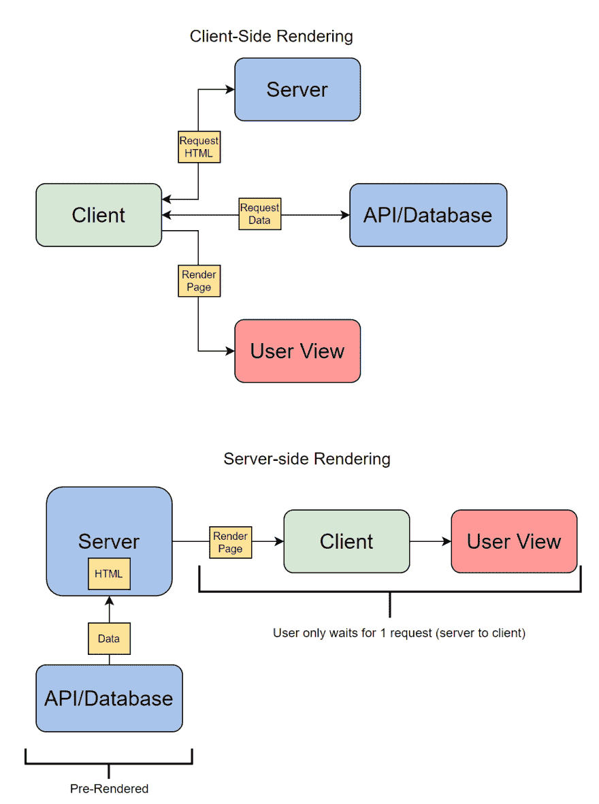
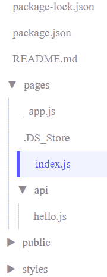
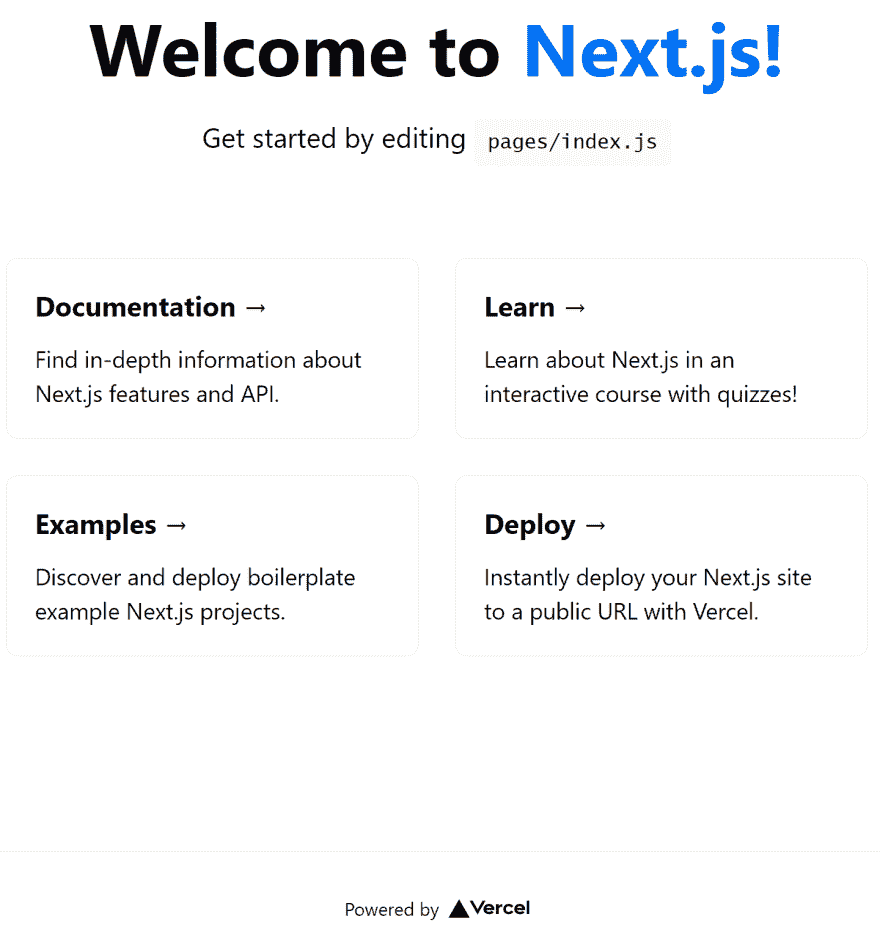

# 使用 Next.js 构建更好的 React 应用

> 原文：<https://javascript.plainenglish.io/build-better-react-apps-with-next-js-d7bc7b495006?source=collection_archive---------2----------------------->

## 包含示例的 Next.js 教程


Image Source: Author

Next.js 是一个 React 前端框架，允许您通过额外的预渲染功能(如现成的服务器端渲染和静态生成)来优化性能和用户体验。Next.js 被全栈开发人员用来构建反应式网站，因为它需要很好地理解客户端 React 和服务器端架构。

今天，我们将帮助你开始使用 Next.js，包括你在开始构建优化站点之前需要知道的主要概念。

**这是我们今天要讲的:**

*   Next.js 是什么？
*   Next.js 示例
*   Next.js 入门
*   使用 Next.js 构建的项目

# Next.js 是什么？

Next.js 是一个开源的 React 前端框架，增加了额外的优化功能，如**服务器端呈现** (SSR)和**静态站点生成**。Next.js 建立在 React 库的基础上，这意味着 Next.js 应用程序利用了 React 的优势，只是增加了额外的特性。

**服务器端渲染。** SSR 允许服务器访问所有需要的数据，并一起处理 JavaScript 以呈现页面。然后，页面被完整地发送回浏览器并立即呈现。SSR 允许在很短的时间内加载网页，并通过提高响应速度来改善用户体验。

**搜索引擎优化(SEO)。使用 SSR 还能让你在 SEO 上获得优势，这有助于你的网站在搜索引擎结果页面上显示得更高。SSR 使网站在 SEO 中排名更好，因为它们加载更快，更多的网站内容可以被 SEO 追踪器扫描到。**

`**<head>**` **标记。** Next.js 还允许你编辑一个站点的`<head>`标签，这在 React 中是做不到的。`<head>`标签是网页元数据的核心部分，有助于网站的 SEO 排名。

总的来说，Next.js 被认为是 React 的一个功能更全面的版本，它保持了 React 框架的直观性。

# 为什么要用 Next.js？

Next.js 的主要优势是内置的 SSR 支持，以提高性能和 SEO。
服务器端渲染通过**改变 React 应用程序的请求流**来工作，使得除了客户端之外的所有组件都向服务器发送它们的信息。

有了服务器上的所有信息，它可以预先呈现页面的 HTML。客户端可以向服务器发送一个请求并接收完整的 HTML 页面，而不是通过客户端渲染分别请求每个组件。



Image Source: Author

赞成者:

*   由于现成的服务器端渲染，Next.js 应用程序的加载速度比 React 应用程序快得多。
*   支持静态站点导出功能。
*   对于以前有 React 经验的人来说，可以快速学习。
*   页面的自动代码分割。
*   通过内置 API 路由轻松构建内部 API 并创建 API 端点。
*   内置对页面路由、CSS、JSX 和 TypeScript 的支持。
*   快速添加插件来定制 Next.js 以满足您特定页面的需求。
*   保留了 React 的优点，如直观的组件驱动创建、前端状态系统和高受欢迎度。

**Con** :

Next.js 唯一真正的缺点是它是一个固执己见的框架，这意味着它有一个特定的方法和工具集，希望你用来构建你的应用程序。

然而，Next.js 的偏好将非常适合大多数项目的范围。

> ***趣闻*** *: Educative 最近在 React 上面切换到 Next.js。如果您在过去几个月中使用过 Educative，那么您已经享受到了 Next.js 的一些好处！*

# 何时使用 Next.js

Next.js 最适合制作一个**优化的登陆或主页**以及任何其他依赖有机搜索流量的页面。这些页面将从 Next.js 的 SEO 改进中获得最大收益。

Next.js 也比 web 应用更适合网站，因为 SSR 允许它具有相同的性能，而不管客户端使用的是什么设备。

对于创建需要身份验证的 web 应用程序或安全应用程序来说，Next.js 不太理想，因为它们不利于服务器端呈现。

# Next.js 示例

让我们看一个完整的 Next.js 应用程序的例子，这样您就可以看到它是如何布局的。
我们将使用新项目生成的默认 Next.js 应用程序。



Image Source: Author

代表该项目的单个页面的`index.js`文件如下所示:

```
import Head from 'next/head'
import styles from '../styles/Home.module.css'
export default function Home() {
  return (
    <div className={styles.container}>
      <Head>
        <title>Create Next App</title>
        <link rel="icon" href="/favicon.ico" />
      </Head>
      <main className={styles.main}>
        <h1 className={styles.title}>
          Welcome to <a href="https://nextjs.org">Next.js!</a>
        </h1>
        <p className={styles.description}>
          Get started by editing{' '}
          <code className={styles.code}>pages/index.js</code>
        </p>
        <div className={styles.grid}>
          <a href="https://nextjs.org/docs" className={styles.card}>
            <h3>Documentation &rarr;</h3>
            <p>Find in-depth information about Next.js features and API.</p>
          </a>
          <a href="https://nextjs.org/learn" className={styles.card}>
            <h3>Learn &rarr;</h3>
            <p>Learn about Next.js in an interactive course with quizzes!</p>
          </a>
          <a
            href="https://github.com/vercel/next.js/tree/master/examples"
            className={styles.card}
          >
            <h3>Examples &rarr;</h3>
            <p>Discover and deploy boilerplate example Next.js projects.</p>
          </a>
          <a
            href="https://vercel.com/new?utm_source=create-next-app&utm_medium=default-template&utm_campaign=create-next-app"
            className={styles.card}
          >
            <h3>Deploy &rarr;</h3>
            <p>
              Instantly deploy your Next.js site to a public URL with Vercel.
            </p>
          </a>
        </div>
      </main>
      <footer className={styles.footer}>
        <a
          href="https://vercel.com?utm_source=create-next-app&utm_medium=default-template&utm_campaign=create-next-app"
          target="_blank"
          rel="noopener noreferrer"
        >
          Powered by{' '}
          
        </a>
      </footer>
    </div>
  )
}
```

`index`文件是这个应用程序的核心，因为它只包含这一个页面。真正的网站会在`pages`文件夹下包含多个页面，每个页面代表一个不同的网页。

# Next.js 入门

现在让我们从一些实际操作的 Next.js 代码开始。我们将介绍在默认应用程序中可见的 5 个基本概念，您将需要这些概念来创建自己的 Next.js 项目。

# 要求和环境

在我们开始之前，让我们设置好您需要的一切。在下载 Next.js 之前，你需要 Node.js、`npm`和`npx`

你可以在他们的官方网站上安装 Node.js。要确认下载正确，请在命令提示符下输入`node -v`。通常，`npm`和`npx`会作为 Node.js 安装的一部分出现。

> *确认已经正确安装，进入* `*npm -v*` *和* `*npx -v*` *命令提示符。每个人将分别返回他们的版本。*

如果这三个工具都安装正确，您可以使用 Node 安装 Next.js。
在命令提示符下输入`npm install next react react-dom`。

一旦成功安装，您将收到以下带有当前“下一步”和“反应”版本的消息:

```
+ react@16.13.1
+ react-dom@16.13.1
+ next@9.4.4
added 831 packages from 323 contributors and audited 834 packages in 172.989s
```

# 创建下一个. js 应用程序

您可以使用`create-next-app`命令或手动创建新的 Next.js 应用程序。
使用`create-next-app`更简单，您只需要在命令提示符下输入`npm create-next-app <app-name>`。

或者，您可以打开`package.json`文件，输入以下脚本:

```
"scripts": {
  "dev": "next dev",
  "start": "next start",
  "build": "next build"
}
```

这允许您以不同的模式启动新的应用程序:

*   `dev`在开发模式下启动 Next.js。
*   `start`在生产模式下启动 Next.js。
*   `build`为生产构建您的 Next.js 应用程序。无论您选择哪种方法，这都将生成我们前面看到的基本的 Next.js 应用程序模板。

如果您使用`next dev`运行该应用程序，您会在`[http://localhost:3000](http://localhost:3000.)` [上看到默认的 Next.js 页面。](http://localhost:3000.)



Image Source: Author

# Next.js 文件夹结构

Next.js 使用极简主义的文件系统来避免混乱的项目文件，这意味着起点只包含运行应用程序所需的最少部分。了解这个文件夹结构将有助于您对其进行操作，以适合您自己的项目。

每个 Next.js 项目从 3 个文件夹开始:`pages`、`public`和`styles`。

下面是一个新的 Next.js 项目的例子:

```
// other files and folders, .gitignore, package.json, next.config.js...
- pages
  - api
    - hello.js
  - _app.js
  - index.js
- public
  - favicon.ico
  - vercel.svg
- styles
  - globals.css
  - Home.module.css
```

**页**

pages 文件夹包含您的页面文件。每个页面文件都是一个反应组件，具有根据文件名自动创建的唯一路径。例如，Next.js 页面`hello.js`会出现在`pages/hello.js`。

有些页面，像上面的`_app.js`一样，在其名称中包含下划线前缀，以将其标记为自定义组件。Next.js 使用这些组件与其他组件一起工作。

比如`_app.js`是用来启动每个页面的，不作为自己的网页。

**公开**

此文件夹用于静态文件服务，这意味着这些文件不会更改，只能被引用。该文件夹通常包含网站使用的图像或图标，以及内部信息，如谷歌网站验证。

在我们的`public`文件夹中，我们有`favicon.ico`和`vercel.svg`，前者是在浏览器标签上使用的小图标，后者显示平台公司的图标。

> ***Vercel*** *和****Netlify****是 Next.js* 最受欢迎的托管和无服务器服务

**款式**

这个文件夹包含我们的 CSS 样式表，它决定了所有页面元素的外观。`globals.css`文件设定了项目中所有页面将使用的通用标准。

您还可以使用以后缀`module`、`<componentName>.module.css`命名的模块文件来添加特定于组件的样式。

# 应用程序中的路线/导航

导航是指用户可以通过 Next.js 网站导航的方式。路线和链接是您可以用来定义站点导航的两种主要方法。

由于每个组件的内置路由定义，Next.js 中的路由是可访问的。要优化您的应用程序路由，了解索引、嵌套和动态路由非常重要。

**索引**

像`index.js`这样的索引文件被路由到应用程序的起始点`/`，而不是`/index`。您可以通过创建多个`index`文件来利用这一点，这些文件作为站点内不同导航路径的登录页面或起始点。

```
- pages
  - index.js # found at `/`
  - users
    - index.js # found at `/users`
    - account.js # `/users/account`
```

例如，仅在`pages`下的`index.js`页面是在没有输入额外路线的情况下到达的站点的主页。`users`下的第二个`index.js`是`users`路径的登陆页面，进入`<siteName>/users`即可到达。

**嵌套**

嵌套路由是只能通过共享父路由访问的路由，如`/users/account`。您可以将嵌套路由视为计算机上的嵌套文件，因为您必须浏览所有更高的组件才能到达嵌套组件。

**动态给药途径**

我们还可以在路由中包含参数，以允许可变行为。动态页面用方括号定义。这个功能本质上允许我们像传递函数一样将信息传递给页面。

例如，我们可以改造我们的`user`组件，让每个用户都有自己的账户页面。

```
# ...
  - users
    - index.js
    - [account.js] # `/users/[accountName]`
```

通过这种设置，用户可以在 URL 中输入他们的账户名称，并立即进入他们的账户信息页面，而不是从`users`开始。换句话说，我可以输入我的帐户名`/users/educative`，进入一个动态页面，其中填充了与输入的帐户名相关的信息。

`account.js`文件需要包含条件语句，这些语句根据传递的参数告诉它要做什么。

```
if(id == 'one'){
      return postOne;
   }else if(id == 'two'){
      return postTwo;
   }
```

**连接**

您也可以引入客户端点击链接，允许用户在没有网址栏的情况下浏览网站。“链接反应”组件是 Next.js 中链接的关键。

链接组件采用一个填充了目标组件的文件路径的`href`参数。这将在当前页面和在输入的路线上找到的页面之间创建一个链接。例如，如果您将`<Link href= "/users/">`添加到`hello.js`中，您将创建一个从`hello.js`到`users`登录页面的链接。

```
import Link from 'next/link'
import Head from 'next/head'
function HomePage(props) {
   return (
      <>
         <Head>
            <title>Welcome to Next.js!</title>
         </Head>
         <div>Welcome to Next.js!</div>
         <Link href="/users">> <a>Users</a></Link>
         <br/>
         
      </>        
   )
}
export async function getServerSideProps(context) {
   const res = await fetch('https://api.github.com/repos/vercel/next.js')
   const json = await res.json()
   return {
      props: { stars: json.stargazers_count }
   }
}
export default HomePage
```

# Next.js 数据获取

当 Next.js 从服务器请求数据以生成页面时，就会进行数据提取。选择正确的预渲染方法和提取功能对于制作用户友好的应用程序至关重要

该页面可以通过 SSR 生成，即服务器在接收到请求时呈现整个页面，也可以通过静态生成来生成，即缓存页面的先前呈现，以便可以立即传递。

*   **SSR** :更适合交互性强或快速变化的页面，这些页面不能静态生成。
*   **SG** :更适合纯文本页面或不变的页面，因为静态渲染总是能够满足用户的需求。

您可以使用一种或另一种获取方法，或者您可以实现一个混合系统。
Next.js 有 3 个异步数据获取函数，作为传统 React 方法的集中获取替代。这些功能是:

`getStaticProps`:与 SG 配合使用，从外部数据中提取页面内容。

```
export async function getStaticProps() {
  // This is a real endpoint
  const res = await fetch('https://sampleapis.com/fakebank/api/Accounts');
  const accounts = await res.json();
  return {
    props: {
      accounts: accounts.slice(0, 10),
    },
  };
}
```

`getStaticPaths`:与 SG 配合使用，从外部数据中提取页面路径。

```
export async function getStaticPaths() {
  // Fetch the list of states
  const res = await fetch("https://sampleapis.com/the-states/api/the-states");
  const states = await res.json();
  // Create a path from their ids: `/states/1`, `/states/2` ...
  const paths = states.map((state) => `/states/${state.id}`);
  // Return paths, fallback is necessary, false means unrecognized paths will
  // render a 404 page
  return { paths, fallback: false };
}
```

`getServerSideProps` -与 SSR 一起使用，在构建时提取预渲染页面。

```
export async function getServerSideProps(context) {
   const res = await fetch('https://api.github.com/repos/vercel/next.js')
   const json = await res.json()
   return {
      props: { stars: json.stargazers_count }
   }
}
export default HomePage
```

# 使用 Next.js 构建的项目

既然您已经掌握了 Next.js 的基础知识，是时候投入到您自己的项目中了。以下是一些初学者项目想法，可以帮助您开始:

*   **练习使用外部数据:** Giphy 搜索应用程序，从外部数据库提取结果
*   **练习静态生成:**显示每个国家的国旗、人口和地理面积的国家信息网站
*   **练习导航:**类似 Instagram 的社交媒体网页，在账户页面上显示用户的图片，并对每张图片进行点赞/评论

*快乐学习！*