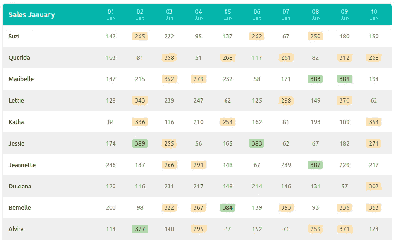
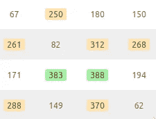
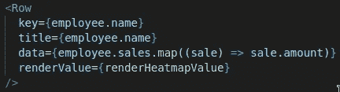

# 像专业人员一样构建定制的 React 组件

> 原文：<https://javascript.plainenglish.io/build-custom-react-components-like-a-professional-c1de0303e6c8?source=collection_archive---------7----------------------->

## 如何从零开始构建自定义 React 组件，同时像专业人员一样思考。


Photo by [Linus Ekenstam](https://unsplash.com/@linusekenstam?utm_source=medium&utm_medium=referral) on [Unsplash](https://unsplash.com?utm_source=medium&utm_medium=referral)

## 目录

*   介绍
*   设置
*   规划我们的组件
*   获取并解析数据
*   主要成分
*   行组件
*   自定义渲染函数
*   一锤定音

一如既往，有很多漂亮的截图和图片！

## 介绍

React 开发人员有三种类型:

*   乐高拼装玩具
*   乐高积木套装创作者
*   乐高技术套装创造者

有些人只用 Bootstrap、语义 UI 之类的库来创建自己的接口。这些大型组件集带有预定义的样式和功能，在快速构建界面时非常有用。最重要的是，他们是寻找和使用最好的第三方库的大师。他们非常有效，我称他们为**乐高积木组装师**:他们把积木组装在一起。

其他人除了是组装者之外，还能够在 React 中创建相对简单的定制组件:**乐高玩具创建者**。

> 但是像专业人员一样从头开始构建更高级的组件需要什么呢？

…并成为一名**乐高技术套装创造者**？自己创造更复杂的部分，定义它们如何工作，它们看起来像什么？

在本文中，**我们将构建一个定制数据表，呈现来自 JSON 文件的销售数据**。在这个过程中，我将解释您应该如何在专业事务中构建这样一个组件。

当看到下面的图片时，你们中的一些人可能会点击离开。
但是等等！*这与最终产品*无关。**这只是一个帮助我们解释某些概念的例子**。这篇文章的价值在于所有的评论。我们如何做事，为什么。以及我们如何开始像专业人士一样思考。



This custom component will help us explain certain concepts.

## 设置

我们将使用 **Next.js** (带有 **TypeScript** )来初始化一个新项目。如果你之前只用过 Create React App，也不要害怕。Next.js 和 TypeScript 都很好用。只是跟着走。

> 你可以在 Gitlab 的[我的知识库](https://gitlab.com/gvanderput/gerard-data-tables)中找到最终结果。

但是我会快速总结一下我们如何初始化这个项目。

创建新的 Next.js 项目:

```
$ npx create-next-app MyAppName
```

…并添加打字稿(在[他们的文档](https://nextjs.org/docs/basic-features/typescript)中阅读更多细节)。

```
$ cd MyAppName
$ touch tsconfig.js
$ yarn add --dev typescript @types/react @types/node
$ yarn run dev
```

注意，最后一步也很关键:通过运行 dev 服务器，Next.js 将为我们填充文件 tsconfig.js 和 next-env.d.ts，我们的服务器就可以运行了。

最后，我喜欢在我的项目中添加对 **Sass** 的支持。这是个人喜好。如果你不知道它是什么，看看[他们的网站](https://sass-lang.com/)。它基本上围绕常规 CSS 形成了一个包装器，并添加了一些有用的功能，如嵌套样式、变量、函数等等。

```
$ yarn add sass
```

重启开发服务器，就可以开始了。

## 规划我们的组件

因此，我们将创建一个数据表组件。应该想到的第一个问题是:**数据从哪里来**，这对创建我们的组件有什么影响？

多年来，有一个流行的持续讨论(它可能仍然存在)。最大的问题是，我们应该区分**愚蠢和智能组件**？其他人称之为表示组件和容器组件。我对这些讨论的看法相当直截了当:不要太在意。拜托，拜托，不要创造能征服国家，为未来任何事件做好准备，或者能在高速公路上自主驾驶的组件——可以这么说。**打造您需要的产品。这才是最重要的。**

但是当然，用一点你的大脑。如果您知道组件将在其他地方使用，请考虑这一点。并使其足够灵活。但不太灵活:

作为一个团队领导，我已经数不清有多少次不得不和我的开发人员交谈，希望让他们意识到**他们可能不需要在他们的组件上有 20 多个计划属性**。"*但是在未来，这个组件可能会这样使用，或者那样使用！*”他们说。绝对的。他们可能是对的。但这是当时的一个问题，也是当时必须处理这些问题的人的问题。除非你确定组件会被这样或那样使用，否则不要假设它会被这样使用。不要猜测或假设。**处理摆在你面前的需求**。而不是在未来某个不确定的时刻出现在其他开发商的假想车牌上。反正他们不会喜欢你做事的方式！数一数你自己在使用第三方组件时思考的次数，“他们到底为什么这样做？”

我想我已经表达了我的观点。
回到我们的代码。

> 我们的目标是创建一个数据表，呈现销售人员及其在特定时间跨度(10 天)内的表现。

我们将:

*   在将数据注入组件之前，获取并解析数据
*   创建主 SalesTable 组件
*   创建行组件

## 获取并解析数据

在我们的例子中，数据可以在名为`[data/sales.json](https://gitlab.com/gvanderput/gerard-data-tables/-/blob/master/data/sales.json)`的 JSON 文件中找到，其结构如下:

> [实际档案](https://gitlab.com/gvanderput/gerard-data-tables/-/blob/master/data/sales.json)包含 10 条员工记录和 100 条销售记录。

因此，我们的获取非常简单:

```
import json from 'data/sales.json';
```

文件中没有太多嵌套，所以我们称之为**平面数据结构**。不久前我写了另一篇关于这个原则的文章[，我绝对建议你去读一下。](https://medium.com/p/8d97dd80a9f1)

我们有**员工列表**、销售列表**(T18)这些记录包含员工[、T20【uid】](https://en.wikipedia.org/wiki/Unique_identifier)**、T22**日期**、以及**金额**。让我们从定义他们的*类型*开始:

请注意，我们如何创建一个不代表现有数据结构的类型:`EmployeeWithSales`。这是我们在解析数据时自己创建的东西。

接下来，我们将在`data/utils.ts`内部创建三个相关的功能:

导出功能`getEmployeeSales`将两个列表中的数据合并到一个列表中，记录类型为`EmployeeWithSales`，返回的数据如下:

这是我们将注入到主要组件中的数据。

## 主要成分

我们将在我们的索引页面上呈现我们的主要组件`SalesTable`。但首先，我们必须获取此页面中的数据。在 Next.js 中，我们可以通过使用`getStaticProps`来实现:

现在，我们可以简单地将这些道具传递给我们的`SalesTable`组件(我们将在以后创建)。请注意，我们还使用了一个我们还没有提到的函数:`getSaleDates`。只需返回一个数组，其中包含我们数据中的所有唯一日期(按顺序排列),这将使我们的生活更简单:

```
["2020-01-01", "2020-01-02", ...]
```

我喜欢将这样的逻辑(例如，提取这些日期)保留在我们的组件之外，即使它只是几行代码。

最后， **SalesTable 组件**本身:

它所做的就是:

*   呈现标题行
*   对于每个员工，渲染单独的行

对于这两个任务，我们重复使用相同的行组件。我喜欢这样。每当你遇到必须渲染非常相似的元素的情况时，重用同一个组件！但是不要过度。**如果差异太大，创建两个单独的组件**。

这些行还有一些有趣的属性。接下来让我们看看行组件。

## 行组件

第一，其属性的类型:

第一个属性是可选的`**title**`。其次，最重要的属性叫做`**data**`，是一个数值数组(字符串或数字)。我们将用这些值来呈现单元格(有人称之为列)。第三个，`**isHeader**`，是一个布尔值，指示该行是否应该作为标题行呈现。这将增加一个额外的 CSS 类。

最后，可选的`**renderValue**`属性。这个函数，如果给定的话，用数据数组中的每个值来调用，并且应该返回一个`React.ReactNode`(任何可呈现的对象)。**我们可以用它来定制我们的值如何呈现**。

你可以在许多第三方库中看到这样的功能；能够通过传递函数来自定义组件某些方面的呈现。我真的很喜欢这个。

**行组件**本身看起来像这样:

> 请注意**我们所有的组件**或实用功能**都很小**。它们由很少几行代码组成。我相信每个优秀的 JavaScript 开发者都应该以此为目标。它消除了复杂性，使我们的代码更容易测试，并确保我们的代码很容易有一个心理图像。这是函数式编程的一个基本方面。

正如您所看到的，row 组件是一个简单的组件:它呈现一个标题单元格(它具有 CSS 属性`flex: 1`，因此它是一个响应元素)，它遍历`data`属性中的给定值，并为它们创建单独的单元格(具有固定的宽度)。可选地，用传递的`renderValue`函数呈现该值，或者直接呈现。

## 自定义渲染函数

正如您在屏幕截图中看到的，我们表中的值呈现为热图:



我们可以通过向 SalesTable 组件传递自定义呈现函数来实现这一点:



Notice the renderValue property.

`renderHeatmapValue`函数看起来像这样:

## 一锤定音

> 可以查看资源库中的少量 CSS:[row . module . scss](https://gitlab.com/gvanderput/gerard-data-tables/-/blob/master/styles/Row.module.scss)。

通过规划我们的组件并保持组件的各个方面都很小，我们可以实现很多事情。**我们的代码是可测试的、可扩展的、可重用的**(也就是说，我们可以在其他地方轻松地重用 renderHeatmapValue 函数)**看一看就很容易理解发生了什么**。

当您的应用程序越来越大时，这些品质变得越来越重要。

感谢您的宝贵时间！

杰勒德