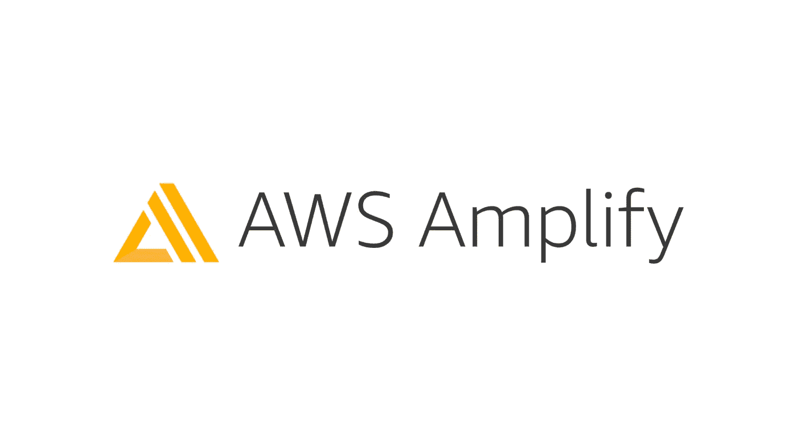
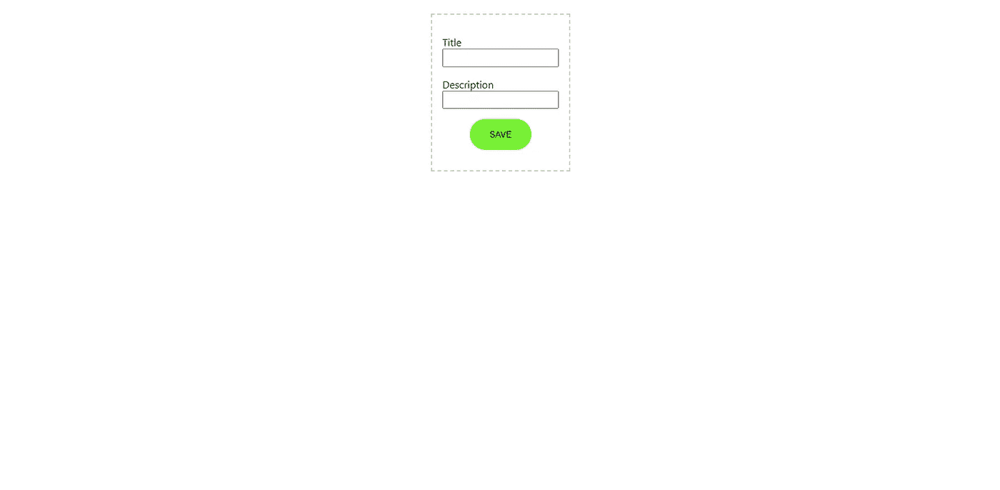
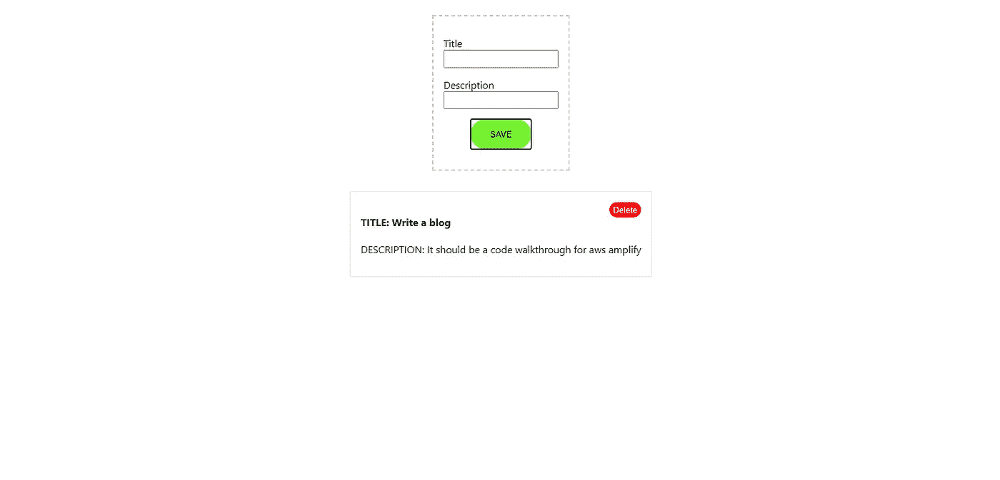
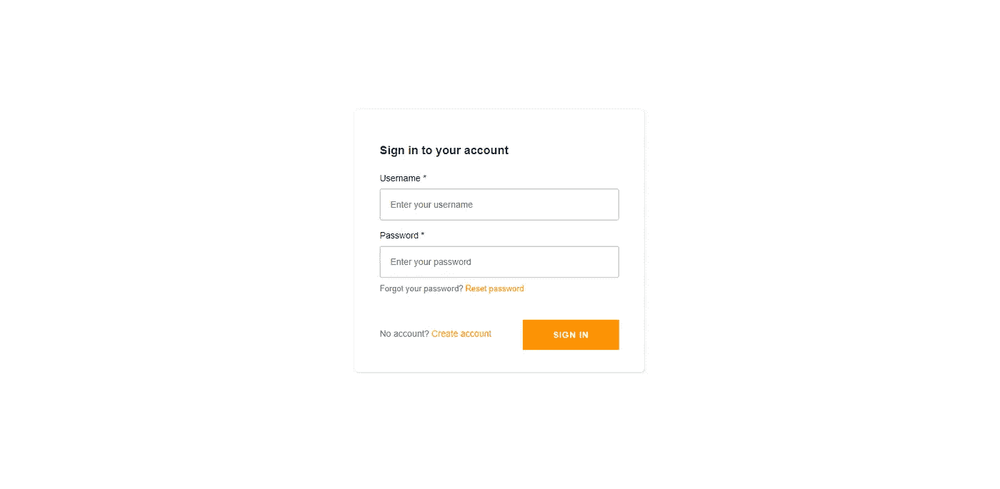
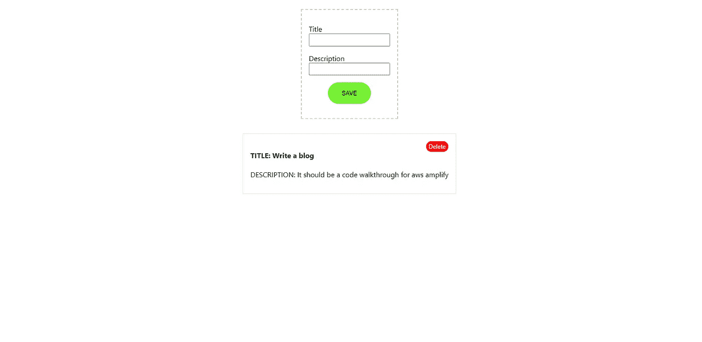

# 使用 React 和 AWS Amplify 构建快速的生产就绪型应用

> 原文：<https://javascript.plainenglish.io/build-fast-and-production-ready-apps-with-react-and-aws-amplify-48a97b5e3bed?source=collection_archive---------0----------------------->



AWS Amplify

不久前，我为我在大学的朋友为学生开发者俱乐部做了一个[会议](https://www.linkedin.com/posts/yashgarudkar_developerstudentclubs-reactjs-activity-6764391339435077632-CU3i)(你可以在这里观看会议[)。我们陷入其中的话题是针对初学者的反应。在会议快结束时，我用 React 构建了一个 Todo 应用程序，并使用 React 的状态来管理 Todo。](https://www.youtube.com/watch?v=17RqzuFhogg)

我想如果我的 an Amplify 应用程序可以使用相同的前端代码会怎么样！？所以我开始阅读 Amplify 的文档，并请一位经验丰富的朋友分享一些关于这个主题的信息。

所以…让我们开始，并建立应用程序。我建议你们在阅读这篇文章时进行编码。

# 什么是放大？

Amplify 是一个开源框架，它放大了 CLI、库和 UI 组件，以构建 fullstackk iOS、Android、Flutter、Web 和 React 应用程序。它提供 api、auth、函数等。满足任何应用的需求。

Amplify Console 是一个 AWS 服务，它提供了一个基于 git 的工作流，用于全栈 web 应用的持续部署和托管。

## 我们将建造什么

我们将建立一个完整的堆栈应用程序，您可以在其中添加和删除任务。我们将使用 GraphQL 来构建我们的应用程序。最后，我们将使用来自 AWS Amplify 的 Auth，仅用两行代码为我们的应用程序提供登录功能。

## 先决条件

确保在您的机器、git 和您最喜欢的 IDE 上安装了 node 和 npm 来编写代码。我将使用 Visual Studio 代码。你还可以在这里创建或登录[一个 AWS 账户。](https://aws.amazon.com/)


# **第一步。安装和配置 Amplify CLI**

```
npm install -g @aws-amplify/cli
```

这将全局安装 Amplify CLI。

现在使用以下方式登录:

```
amplify configure
```

它会要求您登录 AWS 控制台。登录后，Amplify 会要求您创建一个 IAM 用户。IAM 使您能够创建可以在 AWS 中管理用户和用户权限的配置文件。

```
Specify the AWS Region 
? region:  # Your preferred region
Specify the username of the new IAM user: 
? user name:  # User name for Amplify IAM user 
Complete the user creation using the AWS console
```

使用***administrator access***创建一个新用户，它将允许您使用 AWS 资源。这将添加到用户创建的设置用户权限阶段。

创建用户后，amplify CLI 将要求您提供 accessKeyId 和 secretAccessKey，以将 Amplify CLI 与您的新 IAM 用户连接起来，如下所示:

```
Enter the access key of the newly created user:
? accessKeyId:  # YOUR_ACCESS_KEY
? secretAccessKey:  # YOUR_SECRET_ACCESS_KEY
This would update/create the AWS Profile in your local machine
? Profile Name:  # [default]Successfully set up the new user.
```

# 第二步。创建我们的 React 应用

在这一步中，我们将创建 React 应用程序。请记住，我们还没有添加任何放大配置到我们的应用程序。在最后一步中，我们在本地机器上配置了用户。

让我们使用 create-react-app 创建一个 React 应用程序

```
npx create-react-app amplify-todo-app
cd amplify-todo-app
```

现在我们有了一个 React 前端应用程序，我们可以开始用 Amplify 构建我们的后端。确保使用上面的命令“cd”进入 React 应用程序根目录。

让我们在项目根目录中初始化放大器

```
amplify init
```

现在，让我们告诉 amplify 我们将要开发的应用程序！

```
Enter a name for the project (react-amplified)  
Choose your default editor  (vs code)
Choose the type of app that you're building (javascript)  
What JavaScript framework are you using (react) 
Source directory path (src)  
Distribution directory path (build)  
Build command (npm run build) 
Start command (npm start)  
Do you want to use an AWS profile
```

在最后一步中，选择您之前创建的 IAM 用户。

现在，我们已经为使用 AWS Amplify 的应用程序添加了配置。新的 Amplify 项目初始化后，会发生以下情况:

1.  一个名为 **amplify** 的目录包含了我们应用程序的后端定义。这是我们将添加 GraphQL API 和认证的地方。随着我们添加功能，amplify 文件夹将会更新代码模板，这将有助于我们集成前端和后端 API。
2.  在 **src** 目录下创建了一个名为 **aws-exports.js** 的文件，这个文件保存了我们用 Amplify 创建的服务的所有配置。这就是我们的客户端 React 应用程序将如何在 AWS Amplify 上获取有关后端的必要信息。
3.  的。gitignore 也将随着新特性的增加而更新，这些新特性不需要在库中。
4.  在 AWS Amplify 控制台中为这个项目创建了一个云项目。

# 第三步。向我们的 React 应用程序添加代码

在 React 应用程序中安装放大器库:

```
npm install aws-amplify @aws-amplify/ui-react
```

aws-amplify 是用于与后端交互的主要库。@aws-amplify/ui-react 是一个为 react 提供预建 ui 组件的库。

## 打开 src/index.js，并将以下导入添加到文件的顶部。

瞧啊。这就是现在构建前端所需的所有配置。 **aws-exports.js** 会自动更新。

既然配置部分已经完成。让我们添加一个后端 GraphQL 和数据库。最好的部分是，我们需要做的就是从 CLI 添加 api，amplify 会自动将 DynamoDB 数据库添加到后端。

```
amplify add api
```

按照命令行中的提示接受默认值—

```
? Please select from one of the below mentioned services: # GraphQL ? Provide API name: # todo-api? Choose the default authorization type for the API: # API Key? Enter a description for the API key: # lorem? After how many days from now the API key should expire: # 365(or any number of days you want)? Do you want to configure advanced settings for the GraphQL API:
# No ? Do you have an annotated GraphQL schema? # No ? Choose a schema template: # Single object with fields (e.g., “Todo” with ID, name, description) ? Do you want to edit the schema now? # Yes
```

在最后一个提示中选择 yes 之后—**amplify/back end/API/myapi/schema . graph QL**应该会在 VS 代码或者之前选择的 IDE 中打开。

现在让我们看看上面的 GraphQL 模式。

有一个指令 **Todo** (类型)，它是 GraphQL 的一部分。用 **@model** 指令修饰的类型将为该类型搭建数据库表。CRUD 和操作列表的模式以及 GraphQL 解析器需要使一切工作。

有三个字段 id、名称和描述。所有这些都是模型中必需的，name 将用作 todo 的名称——任务名称和描述是我们将添加与任务相关的数据的地方。

目前给出的模式非常好，因为我们正在构建 Todo 应用程序。因此，让我们继续部署 API。

```
amplify push? Are you sure you want to continue? Y  
? Do you want to generate code for your newly created GraphQL API? Y ? Choose the code generation language target: javascript 
? Enter the file name pattern of graphql queries, mutations and subscriptions: src/graphql/**/*.js
? Do you want to generate/update all possible GraphQL operations - queries, mutations and subscriptions? Y 
? Enter maximum statement depth [increase from default if your schema is deeply nested]: 2
```

API 现在应该是活动的，我们可以与之交互。

现在打开我们的根 React 文件夹 **src/App.js —** 中的文件

## 代码演练—

1.  **fetchTodos** :这是一个异步函数，将为数据库中的 Todos 调用 api 和 setState。
2.  **useEffect():** 一个 React 钩子，我们已经在 componentMount 上使用了它，并调用了 **fetchTodos()** ，所以组件一挂载，列表就保存在状态中。
3.  **handleChange:** 这是一个用于设置当前表单状态的更改函数，每次用户在应用中做任何更改时都会更新。
4.  **handleSubmit:** 它将在提交表单时被调用，try 块将被执行，以使用 GraphQL 将任务添加到数据库中。如果 **try** 模块失败 **catch** 模块将控制错误。添加任务后，调用 **fetchTodos** 函数，并在 Todos 状态下更新列表数组。
5.  **handleDelete:** 为了从后端数据库中删除某个待办事项，该函数将获取该待办事项的 id 并将其删除。
6.  **返回(在 app 函数中):**会返回在浏览器中查看我们的 App 所需的 jsx。

## 应用程序现在已经准备好了！让我们使用 CSS 在。/App.css

确保删除 App.css 文件中的所有样板 css，然后将以下代码添加到该文件中:

# 第四步。运行和测试我们的应用

表演时间到了！现在，在 root React app 目录中运行以下命令，在浏览器中运行 app:

```
npm start
```

这将启动本地服务器，应用程序将在默认浏览器上启动。

这是你应该能在浏览器中看到的—



Todo app initial state

现在添加一个带有一些描述的任务，看看它是否被添加到表单下面。



Added task!

最后，通过单击 delete 按钮尝试删除该任务。应该没问题。

# 第五步。向应用程序添加身份验证

在根文件夹中，我们将使用 CLI 运行以下命令，将 auth 添加到后端服务:

```
amplify add auth? Do you want to use the default authentication and security configuration? Default configuration
? How do you want users to be able to sign in? Username
? Do you want to configure advanced settings?  No, I am done.## now deploy the service run the push command
amplify push
```

使用登录 UI 组件更新 React 应用程序:

这是向应用程序添加 auth 的最好和最快的方法之一。

向我们的应用程序添加 auth 只需要 2 行代码。只需用 Authenticator 从[**' @ AWS-amplify/ui-react '**](https://gist.github.com/yashgkar/29392c3c606a42f732eac5d447c253ad)导入，用它包裹主组件即可。

运行应用程序以查看保护应用程序的新授权流:

```
npm start
```

现在我们应该看到登录表单并创建一个新帐户。Auth 有 30 多种方法来控制用户授权流的各个方面。

这是我们现在将在本地 React 服务器上的浏览器中看到的内容:



Auth component

现在创建一个帐户并输入 OTP。这将使您登录应用程序:



UI after login

# 第六步。托管**应用**

本节将帮助您将应用程序部署到服务器并与其他人共享！

从 root 运行以下命令，并选择下面给出的选项:

```
amplify add hosting? Select the plugin module to execute: # Hosting with Amplify Console
? Choose a type: # Manual Deploymentamplify publish
```


Thats it!

# 就是这样！

点击发布后，React 的构建将被推送到 amplify cloud，应用程序的链接将在命令行中记录。

# 结论

Amplify 是一个很棒的库，与 AWS 一起工作，它成为一个强大的工具，可以用各种框架构建全栈应用程序，就像我们在 React 中所做的那样。授权、功能、托管等特性。让我们专注于我们想要构建的产品，而不是从头开始写。通过编写最少的代码，我们可以构建更快更高效的应用程序。

我希望这篇文章有助于你决定在下一个项目中采用哪种技术。

如果你有建议，请在评论区告诉我🙋‍♂️

谢谢大家！🖤

**GitHub**本文回购:【https://github.com/yashgkar/amplify-react-todo】T5

## 喜欢我的作品吗？给我买杯咖啡怎么样？😉

# 与我联系

GitHub:[https://github.com/yashgkar](https://github.com/yashgkar)
领英:[https://www.linkedin.com/in/yashgarudkar/](https://www.linkedin.com/in/yashgarudkar/)
推特:[https://twitter.com/codeitachi](https://twitter.com/codeitachi)