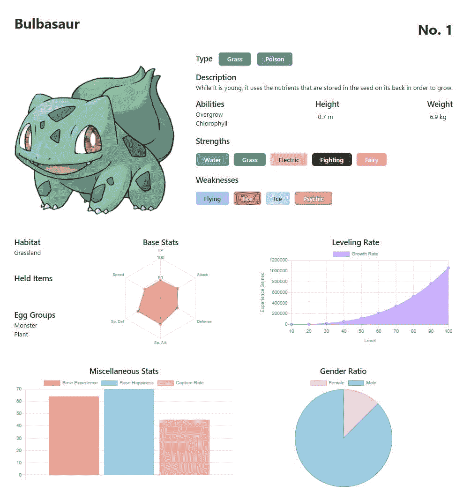
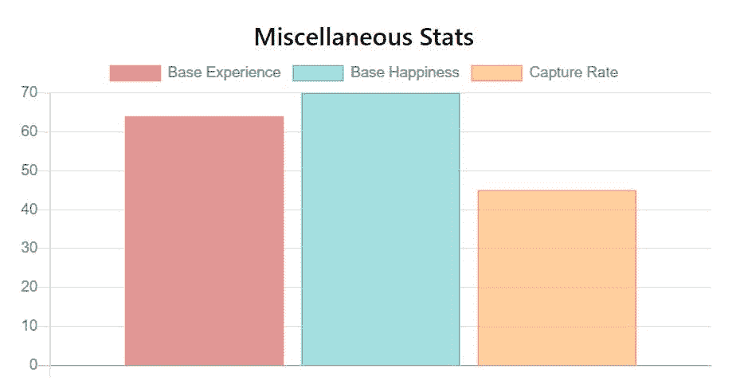
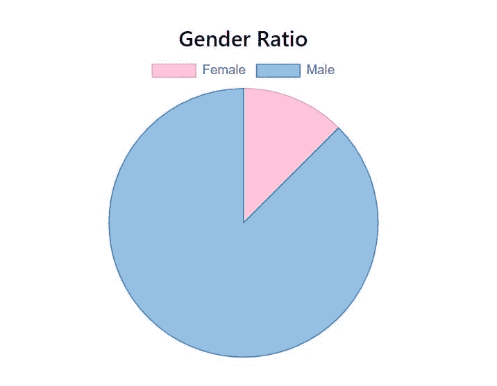
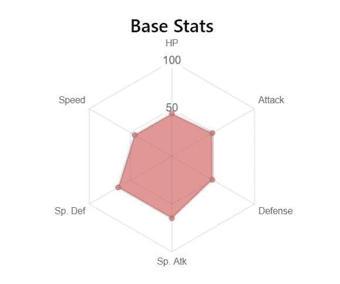
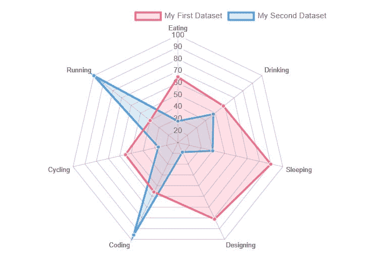
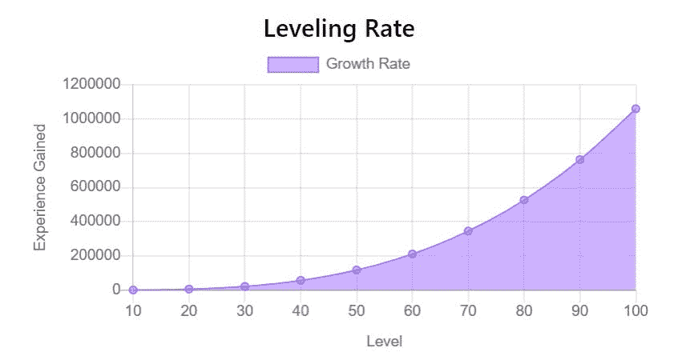

# 使用 Chart.js 构建交互式响应图表

> 原文：<https://javascript.plainenglish.io/build-interactive-and-responsive-charts-with-chart-js-1bc2b6586d8f?source=collection_archive---------18----------------------->


数据可视化是将数据呈现为图形或图表等可视形式的行为。它用于方便地汇总数据，并在需要时与其他数据交流其关系。它有助于组织数据，并允许发现新的见解或模式。

作为开发人员，学习一些数据可视化工具很重要。在我的[如何构建图像分类 Pokedex](https://lo-victoria.com/my-new-year-hackathon-project-image-classification-pokedex-1) 文章中，应用程序从 PokeAPI 获取数据，并将其组织到下面的页面中:



在本文中，我们来看看 Chart.js，我用来制作这些图表的库，它可以用来将任何形式的数据组织成可读的可视化数据。


# 入门指南

在本教程中，当我解释如何制作这些图表时，我将使用 PokeAPI 数据作为示例。使用 Chart.js 可以随意使用任何数据来组织它们。

# 1.条形图

首先，将库导入 HTML 页面:

```
<script src="https://cdn.jsdelivr.net/npm/chart.js@2.8.0"></script>
```

然后，添加带有`bar-chart` id 属性的`canvas` HTML 元素。这将是条形图呈现的地方。

```
<canvas id="bar-chart"></canvas>
```

在一个`script.js`中，创建一个简单的函数从一个 URL 获取数据，如下所示。在本教程中，我不会详细介绍如何获取数据，因为这主要是针对 Chart.js 的。

```
function fetchPokemon(name) {
  return new Promise((resolve, reject) => {
    fetch(`https://pokeapi.co/api/v2/pokemon/${name}`).then((res) => {
      if (res.status === 200) {
        resolve(res.json());
      } else if (res.status === 404) {
        return reject({
          status: 404,
          message: "No pokemon named" + name + " is found.",
        });
      } else {
        reject({
          status: res.status,
          message: "Something went wrong...",
        });
      }
    });
  });
}
```

接下来，创建一个`loadBarChart`函数，它将接受一个`data`参数，以我们想要的方式组织我们的数据。下面是我们实现它的方法。

1.  通过 id 属性获取对`canvas`元素的引用。
2.  获取我们希望显示为条形的数据。
3.  实例化新图表，将其设置为`type: "bar"`并设置`data`。

```
function loadBarChart(data) {
  //1.
  let barChart = document.getElementById("bar-chart");
  //2.
  const { base_experience, base_happiness, capture_rate } = data;
  //3.
  barChart = new Chart(barChart, {
    type: "bar",
    data: {
      datasets: [
        {
          data: [base_experience],
          label: "Base Experience",
          backgroundColor: "rgba(197,48,48,0.5)", //red
          borderColor: "rgba(255, 99, 132, 1)",
          borderWidth: 1,
        },
        {
          data: [base_happiness],
          label: "Base Happiness",
          backgroundColor: "rgba(75, 192, 192, 0.5)", //green
          borderColor: "rgba(75, 192, 192, 1)",
          borderWidth: 1,
        },
        {
          data: [capture_rate],
          label: "Capture Rate",
          backgroundColor: "rgba(255, 159, 64, 0.5)", //yellow
          borderColor: "rgba(255, 159, 64, 1)",
          borderWidth: 1,
        },
      ],
    }
}
```

如你所见，制作条形图就像设置`type`和`data`一样简单。`data`中的`datasets`是单个数据对象的数组，将呈现为一个条形，如下图所示。



在此示例中，`datasets`包含 base_experience、base _ happy 和 capture_rate 数据。您还可以根据每个数据对象的`label`、`backgroundColor`、`borderColor`甚至`borderWidth`属性对其进行定制。例如，我定制了它们的标签，并把它们涂成红、绿、黄色。

当然，还有更多定制选项和造型可供选择。请随意阅读[条形图文档](https://www.chartjs.org/docs/latest/charts/bar.html)了解更多详情。现在让我们来看看饼状图。

# 2.圆形分格统计图表

饼状图非常简单。它以百分比的形式显示两个或多个数据之间的关系。一个完整的馅饼意味着 100%。

对于我的例子，我将以饼状图的形式显示性别比例。首先，为要呈现的饼图创建`canvas`元素。

```
<canvas id="pie-chart"></canvas>
```

从 PokeAPI 获取数据后，获取`femalePercent`数据并将其传递给`loadPieChart`函数。下面是`loadPieChart`的工作原理。

1.  通过 id 属性获取对`canvas`元素的引用。
2.  实例化新图表，设置为`type: "pie"`并设置`data`。

```
function loadPieChart(femalePercent) {
  //1.
  let pieChart = document.getElementById("pie-chart");
  //2.
  pieChart = new Chart(pieChart, {
    type: "pie",
    data: {
      datasets: [
        //only 1 data obj in datasets
        {
          data: [femalePercent, 100 - femalePercent], // female, male
          backgroundColor: [
            "rgba(255,137,180, 0.5)", //pink for female
            "rgba(44, 130, 201, 0.5)", //blue for male
          ],
          borderColor: ["rgba(255,137,180,1 )", "rgba(44, 130, 201,1)"],
          borderWidth: 1, //they share the same value so no need array
        },
      ],
      //add custom labels, female first then male
      labels: ["Female", "Male"],
    },
  });
}
```

对于饼状图，`datasets`中应该只有一个`data`对象，因为`femalePercent`和`100-femalePercent`(男)组合成 1 个整体数据。它们不是彼此没有关系的单独数据。

所以现在`datasets`中的`data`是饼图的数据值数组。在这种情况下，女性百分比和男性百分比是 100-女性百分比。

然后，我们添加自定义样式，如`labels`、`backgroundColor`、`borderColor`和`borderWidth`。它们也是分别代表女性和男性百分比的数组。请记住，这些样式应该在其数组中首先包含女性属性，因为这是它在`data`对象中的排序方式。

我们将得到一个简单的性别比例数据的饼状图！



# 3.雷达图

雷达图有助于从宏观角度展示各个数据之间的差异。对于我的应用程序，我用它来显示神奇宝贝的统计数据，并轻松确定其最佳和最差的统计数据。



制作雷达图很简单。首先，为要呈现的雷达图创建`canvas`元素。

```
<canvas id="radar-chart"></canvas>
```

然后，创建一个`loadRadarChart`函数，如下所示:

1.  通过 id 属性获取对`canvas`元素的引用。
2.  实例化新图表，将其设置为`type: "radar"`，并设置`labels`和`data`属性。

```
function loadRadarChart(data) {
  //1.
  let statsChart = document.getElementById("radar-chart");
  //2.
  statsChart = new Chart(statsChart, {
    type: "radar",
    data: {
      //Will show up on each radar points in clockwise order
      labels: ["HP", "Attack", "Defense", "Sp. Atk", "Sp. Def", "Speed"],
      datasets: [
        {
          //one data obj per set, order same as labels
          data: [
            data[0]["base_stat"], //HP
            data[1]["base_stat"], //Atk
            data[2]["base_stat"], //Def
            data[3]["base_stat"], //SpA
            data[4]["base_stat"], //SpD
            data[5]["base_stat"], //Speed
          ],
          backgroundColor: "rgba(197,48,48,0.5)", // red
        },
        /*Add another set if needed like so
        {
           data: [ ]
        },
        */
      ],
    },
  }
}
```

就像饼图一样，在`datasets`数组中应该有一个`data`对象，除非你想添加另一个单独的数据集，如下图所示。



`data`对象应该包含一个数据值数组。它们将按顺时针方向排列，因此在本例中，HP 将从 12 点钟开始，Atk 将位于其右侧，依此类推。

记住按照与`data`相同的顺序添加`labels`阵列，以便正确标记雷达图上的每个点。然后，您可以像往常一样自定义它。在这里，我将它的`backgroundColor`自定义为红色。

# 4.折线图

最后但同样重要的是，我们将构建一个折线图。这种类型的图表是在一条线上绘制点，以查看趋势并比较是否有多条线。

在我的应用程序示例中，我用它绘制了一个成长图表，使用水平作为 x 轴，获得的经验作为 y 轴。



为了绘制线图，您需要一个 x 和 y 值的数组，如下所示。注意 x 轴属性(即等级)列在 y 轴属性(即经验)之上。

```
data = [
   {
      level:10, //x-axis
      experience:560 //y-axis
   },
   {
      level:20, //x-axis
      experience:5460 //y-axis
   },
   //And so on...
]
```

一旦有了要绘制的数据集，就在将要绘制线图的地方创建`canvas`元素。

```
<canvas id="line-chart"></canvas>
```

通常，创建一个`loadLineChart`函数，如下所示:

1.  通过 id 属性获取对`canvas`元素的引用。
2.  实例化新图表，将其设置为`type: "line"`，并设置`labels`和`data`属性。

```
function loadLineChart(data) {
  //1.
  let growthChart = document.getElementById("growth-chart");
  //2.
  growthChart = new Chart(growthChart, {
    type: "line",
    data: {
      labels: data.map((d) => d.level), //x-axis data
      datasets: [
        {
          label: "Growth Rate",
          data: data.map((d) => d.experience), //y-axis data
          backgroundColor: "rgba(153, 102, 255, 0.5)", //purple
          borderColor: "rgba(153, 102, 255, 1)",
          borderWidth: 1,
        },
      ],
    }
  }
}
```

如上面的代码所示，`labels`属性将绘制 x 轴值(即级别)，而`datasets`中的`data`负责 y 轴值(即经验)。

# 结果

这样，您就可以使用 Chart.js 轻松制作交互式图表了！

感谢阅读！我希望这篇文章简单介绍了如何使用 Chart.js 构建各种类型的图表。如果有帮助，请喜欢并分享这篇文章。当然，Chart.js 中有更多的选项和定制特性，请随意浏览它的文档(在参考资料下)以了解更多信息。下次再见，干杯！

# 资源

*   [chartjs.org](https://www.chartjs.org/)