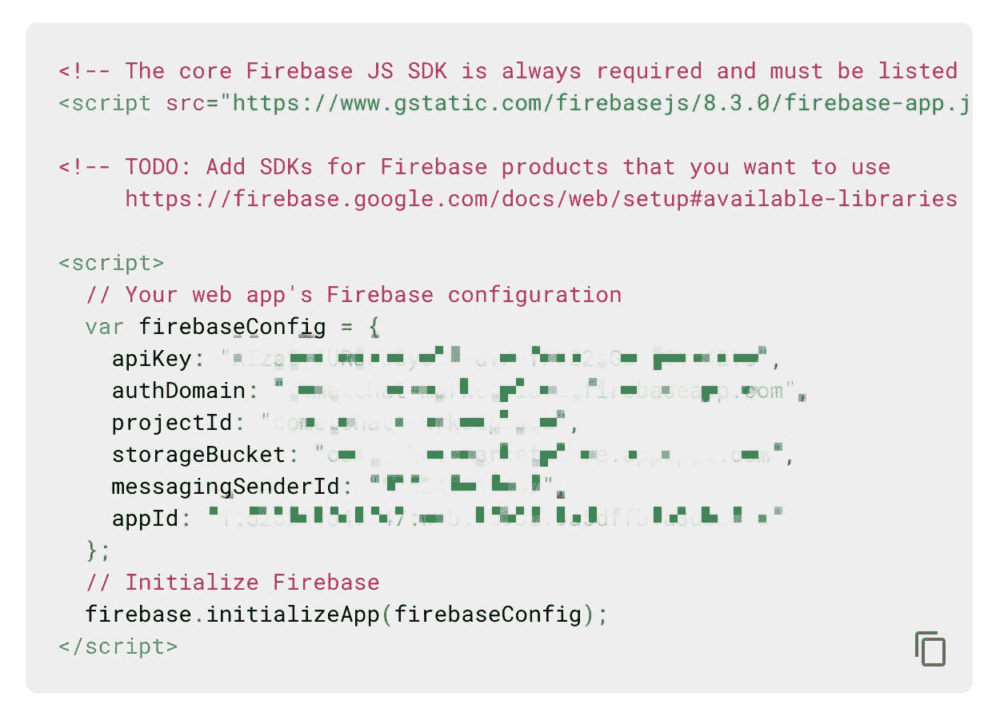

# 使用 React 和实时聊天功能构建市场网站

> 原文：<https://javascript.plainenglish.io/build-marketplace-site-with-react-and-real-time-chat-amazon-clone-16ec7f96730e?source=collection_archive---------6----------------------->

## 在 React 中构建一个亚马逊克隆


# 先决条件

为了完成本教程并拥有一个可用的应用程序，可能需要以下方面的一些知识:

*   React、React 钩子、一般 JavaScript 的基础知识；
*   [火基](https://firebase.google.com)特性知识；
*   [TailwindCSS](https://tailwindcss.com/)；
*   任何文本编辑器(我推荐 [Visual Studio 代码](https://code.visualstudio.com/))。

# 介绍

你有没有浏览过亚马逊网站，试图找到你需要符合特定特征的特定产品？您最终找到了它，但是您有一些产品描述没有回答的问题。

## **如果能和亚马逊上的** **卖家聊天该有多好？**

在本教程中，您将学习如何从头开始创建一个 React 应用程序，该应用程序将作为一个基本的 Amazon 克隆，在产品页面上使用 CometChat 的一些功能和组件以及简单的步骤来实现聊天功能！

在产品页面上，你会有一个按钮开始与卖家聊天。如果您是卖家，所有聊天请求都会到达您的收件箱，您可以在这里帮助客户解决他们的问题。

完美！


*如果你更喜欢直接跳到代码里，可以在这里* *找到* [*。*](https://github.com/igorasilveira/marketplace-cometchat)

# 第一步。创建 React 应用程序

## **创建 React 应用**

我们的第一步应该是创建我们的 vanilla React 应用程序的框架，为此，我喜欢使用`create-react-app`包。因此，使用 *npx* 不需要全局安装软件包，您可以在您希望项目存活的文件夹上运行下面的命令。

```
npx create-react-app chat-marketplace
```

你现在有了一个名为*聊天市场*的新文件夹，它将保存我们所有的代码和配置。

## **安装尾翼**

为了安装我们将用来设计组件样式的 [TailwindCSS](https://tailwindcss.com/) ，请参考与使用 *Create React App* starter、[此处](https://tailwindcss.com/docs/guides/create-react-app)相关的 TailwindCSS 文档的最新官方教程。

设置完成后，将您的`tailwind.config.js`替换为以下内容，以获得最佳效果。

# 第二步。准备 Firebase 集成

为了让它运行起来，你应该采取的下一步是设置你的无服务器后端。对于这个项目，我们使用 Firebase 来处理我们的用户认证和存储我们的应用程序数据。

*如果您复制存储库中的****. env . example****文件，并按照自述文件中的说明对其进行重命名，那么已经提供了一个 Firebase 项目并配置了环境变量，但是如果您选择创建自己的项目，请按照下面的步骤操作。*

## **创建 Firebase 项目**

如果你去 Firebase 的网站[这里](https://firebase.google.com/)，你可以用你的谷歌账户登录并创建一个新项目。给它起个类似`Chat Marketplace`的名字。一旦你在那里，你现在能够添加应用程序到你新创建的项目。选择 **Web App** ，您将看到运行该项目所需的必要项目证书。



在 React 项目的根目录下，创建一个包含以下内容的新文件`.env`，用您自己的项目凭证替换这些值。

## **启用认证**

Firebase 具有管理用户身份验证和状态的内置功能。为了能够利用这一点，我们必须首先在我们的项目中启用**身份验证**，方法是转到侧栏选项并启用**电子邮件和密码登录**方法。


## **初始化数据库**

为了存储数据，我们将使用 [Firebase 的 Firestore 数据库](https://firebase.google.com/docs/firestore)，这是一个云上的非 SQL 数据库。您还可以在项目的侧栏中找到它，并完成配置过程。最后，您应该看到一个空的数据库。我们现在需要向它添加数据，这样我们的应用程序就不会加载为空。

您应该创建两个**集合**，一个名为*类别*，另一个名为*产品*。之后，在第一个集合上创建几个类别文档，为集合的每个文档添加一个`*name*`和`image`属性。

对于*产品*集合，每个条目至少应具有以下属性:`category`(应为之前创建的类别之一的名称)、`description`、`id`、`image`、`price`、`title`。


我们现在应该已经做好了关于无服务器后端的一切准备，可以继续将其与 React 项目集成。

为了无缝集成，我们将使用 [React Firebase](https://react-firebase-js.com/) 包。要安装它，请运行以下命令。

```
npm i firebase && npm i @react-firebase/auth && npm i @react-firebase/firestore
```

配置的下一步是在项目的`src`文件夹中创建一个`firebase.js`文件，firebase 应用程序的配置将在这个文件夹中构建并在以后使用。

# 第三步。准备 CometChat 集成

## **拿好你的钥匙**

正如你现在可能知道的，我们将使用由 [CometChat](https://www.cometchat.com/) 提供的惊人的实时聊天解决方案。

让我们首先进入他们的[注册页面](https://app.cometchat.com/signup)，创建一个 CometChat 帐户。注册后，您将登陆新的 CometChat 仪表板，现在您可以创建一个应用程序。


创建并选择应用程序后，您会在页面顶部找到必要的配置信息。这些是`appId`、`authKey`和`region`。


复制这些值并将其添加到先前创建的`.env`文件中，变量名如下:

## **安装 CometChat 依赖项**

要将 CometChat 所需的依赖项安装到 React 应用程序中，请运行以下命令。

```
npm install @cometchat-pro/chat@2.2.1 --save
```

就是这样。

## **创建一个助手文件**

这一步旨在将 CometChat 所需的大部分步骤抽象化，以便将注册、登录、创建和加入群组转换成简单的功能，这些功能可以在应用程序内的任何地方调用。

在`src`文件夹的根目录下，创建一个名为`cometchat.js`的文件，内容如下。

## **复制 React UI 套件**

因为我们将使用 React 构建我们的 marketplace 应用程序，所以我们将利用预构建的 CometChat React UI 套件，在该套件中，我们获得了所有必要的组件来完成这项工作，而无需我们自己的任何进一步实现和设计！

为此，请前往 [CometChat React UI 套件库](https://github.com/cometchat-pro/cometchat-pro-react-ui-kit)并克隆它。将`CometChatWorkspace`文件夹移动到 React app `src`文件夹，并将存储库的依赖项复制到您的`package.json`文件夹，然后运行`npm install`来安装它们。

现在所有的配置都设置好了，我们可以开始编码我们的前端项目了！

# 第四步。将碎片拼在一起

现在是时候将上述所有内容结合起来，创建具有实时聊天功能的页面，使我们的市场成为现实。

## **创建入口点**

在你的`src`文件夹的根目录下，创建一个`index.js`，如下所示:

这段代码负责初始化 CometChat 和设置 Firebase，并将其提供给应用程序的其余部分。

## **设置我们的路由器**

下一个重要的步骤是创建我们的 React 路由器，它将使我们能够浏览我们的页面。

在`src`目录下应该有一个`App.js`文件，代码如下:

现在，通过在呈现相应的组件之前检查未经身份验证的用户是否登录，您添加了浏览页面和保护路由免受未经身份验证的用户访问的功能！

## **创建布局包装**

这是一个很好的实践，我喜欢这样做，以便将代码重复保持在最低限度，并且易于开发。创建一个高阶组件，您可以使用它来包装每个页面的呈现，处理页脚和导航栏等公共元素，并为每个页面提供公共和必要的道具。

在`src`目录下，创建一个新的`wrappers`文件夹，并在其中创建一个包含以下内容的`layout.js`文件:

现在，任何组件都可以用`withLayout(Component)`包装，并在相同的条件下呈现。

## **创建我们的组件**

在`src`目录下，创建一个`components`文件夹，我们所有的组件都将存在于其中。

让我们首先创建我们的导航栏。用以下内容创建一个`Navbar.js`文件:

接下来，我们正在创建页脚。和前面一样，用这些内容创建一个`Footer.js`文件:

现在，我们最常见的组件(属于我们的`Layout`组件的一部分)已经完成，我们可以继续学习您的特定页面组件了。

让我们从主页上的分类卡片开始。创建一个`CategoryCard.js`并添加以下代码:

对于主页面，让我们创建一个具有水平滚动功能的产品滑块！使用以下内容创建一个`ProductSlider.js`:

当我们在一个特定的类别页面上时，我们有多个产品以一种非常结构化的方式展示。让我们创建那个特定的个性化组件，`ProductCard`。创建文件并添加代码:

就组件而言，剩下的就是我们通常在亚马逊的产品搜索页面上看到的侧过滤器。我们的完全被嘲笑，没有真正的功能，但它服务于它的目的。添加一个新的`SideFilter.js`文件并粘贴内容:

现在都完成了。让我们创建页面！

## **创建页面**

我们已经有了一些组件，但是没有地方显示它们，因为我们的路由器甚至找不到正确管理导航所需的页面，所以让我们来解决这个问题。仍然在`src`文件夹中，创建一个新的目录来保存我们的页面。称之为`pages`。

从登录和注册页面开始，创建两个名为`login.js`和`register.js`的文件，并分别添加以下代码。

**login.js**

**register.js**

现在转到主页面，索引页面是我们第一次求助于 Firestore 集合来呈现它，因为它将显示类别和产品列表！创建一个新的`index.js`文件并粘贴其内容:

其余的页面非常简单。我们将为*类别*、*产品*、*新产品*和一个简单的*注销创建特定的页面。*

**category.js**

**newProduct.js**

**logout.js**

现在是最重要的一页，也是最简单的一页。用于可视化对话的 CometChat 集成，发送和接收消息的能力可以使用 CometChat React UI 工具包缩小到一行代码。我们将 CometChat 集成到它自己的页面中，我们称之为收件箱页面。创建一个新的`inbox.js`文件并粘贴以下几行:

就是这样，你现在有一个完全成熟的聊天窗口！

# 第五步。目睹奇迹的发生

如果一切按计划进行，您现在可以运行下面的命令在本地启动您的 web 应用程序，并在 *localhost:3000* 访问它:

```
npm run start
```

如果它编译了第一次尝试，现在剩下的就是创建一些用户，让他们互相聊天！

# 结论

希望通过本教程，您能够创建一个具有实时聊天功能的工作市场 web 应用程序，并且不需要任何类型的后端编码。

您已经配置了一个全新的 Firebase 项目，将非 SQL 数据插入到云数据源中，对用户进行了身份验证，使用 CometChat 建立了一个实时聊天解决方案，并让您的用户在大约 30 分钟内相互发送消息。

希望本教程对您有所帮助，并且不要忘记查看 [CometChat](https://prodocs.cometchat.com/docs) 的官方文档，以进一步探索并为您的应用程序添加更多功能。本教程的完整源代码可以在 [GitHub](https://github.com/igorasilveira/marketplace-cometchat) 上找到。

【http://github.com】最初发表于[](https://gist.github.com/65b032afb753aa1d5cf12f135fe7d910)**。**