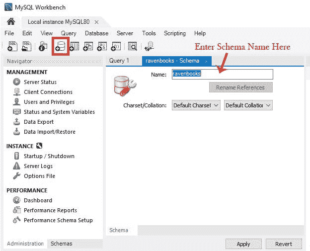

# 构建 MySQL Node.js CRUD 应用程序#1:设置

> 原文：<https://javascript.plainenglish.io/build-mysql-node-js-crud-app-1-setting-up-98505daeb075?source=collection_archive---------11----------------------->


大家好，欢迎来到[的第一篇文章《让我们构建一个 MySQL Node.js CRUD 应用程序系列](https://hashnode.com/series/lets-build-a-mysql-nodejs-crud-app-ckhzrl98g022j99s11xymfqkn)。在这个系列中，我们将使用 MySQL 和 Node.js 构建一个初学者友好的简单 CRUD(创建、读取、更新、删除)应用程序。如果您是 MySQL 和 Node.js 的初学者，我鼓励您跟随我一起构建这个应用程序！

在我们开始之前，这里有一个对这个系列的期望的简要概述。

# 该项目

我们将建立一个简单的书评应用程序。您可以在此应用程序中添加、查看、编辑和删除评论。

# 我们将使用的技术

*   为前端做出反应
*   后端的节点和 express
*   MySQL 数据库
*   邮递员来测试我们的路线

# 推荐的先决条件

*   对 React 和 JavaScript 有基本的了解
*   对后端编程有基本的了解
*   对 SQL(结构化查询语言)和关系数据库有基本的了解
*   Visual Studio 代码或计算机上安装的任何代码编辑器

# 步骤 1:安装 Node.js

在[nodejs.org/en/download](http://nodejs.org/en/download)下载并安装 Node.js(带 npm)

安装后，要检查它是否存在，请转到您的命令提示符:

```
node -v
npm -v
```

# 第二步:安装 MySQL

你可以通过访问[dev.mysql.com/downloads/installer](https://dev.mysql.com/downloads/installer/)来安装 MySQL


选择您的操作系统，然后单击“下载”。然后，您可以打开安装程序，按照上面的步骤完成 MySQL 的安装。

# 步骤 3:创建 React 项目

让我们使用以下命令初始化 React 应用程序:

```
npx create-react-app <app-name>
```

我们将使用 React 作为前端框架来创建我们的应用程序的客户端。

# 步骤 4:安装软件包

对于后端，让我们安装这个项目需要的一些包。

我们将安装以下软件包:

*   整合我们的 MySQL 数据库
*   `express`:node . js 的 web 框架
*   `nodemon`:有新变化时自动重启服务器
*   `dotenv`:使用环境变量

```
npm install mysql express body-parser nodemon dotenv
```

# 步骤 5:初始化 MySQL 数据库

打开机器上安装的 MySQL 工作台。点击“本地实例 MySQL80”以 root 用户身份登录。您的密码是您在安装 MySQL 时设置的。


> 如果你有问题，需要重置或更改你的密码，我发现这篇[文章](https://www.techrepublic.com/article/how-to-set-change-and-recover-a-mysql-root-password/)可以帮助你。

一旦你成功地验证了你自己，点击窗口左上角的图标(见下图)来创建一个新的模式。然后，命名模式。



对于本教程，我将其命名为`ravenbooks`，这是我将构建的书评人应用程序的名称。

接下来，让我们在`ravenbooks`中创建一个表。单击“模式”选项卡，如下图所示。您应该在左侧面板中看到您的模式。


右键单击表格，在`ravenbooks`下创建一个新表格。然后，您可以命名表并开始向表中添加列。

对于此应用程序，我们将有 4 个栏目:

*   `id`:标识数据库中每个评审的主键
*   `book_title`:书评的书名是
*   `book_review`:复习的内容
*   `book_rating`:书籍的评分

下面的屏幕截图显示了这些列及其各自的属性。


# 暂时就这些了！

在[的下一部分](/build-a-mysql-node-js-crud-app-2-mysql-integration-7f3c337a21d1)，我们将学习如何将我们的应用程序连接到我们的 MySQL 数据库，并开始创建一个简单的 GET、POST、DELETE 路径。敬请关注，感谢您阅读这篇文章。请在下面的评论中提出任何问题，如果有帮助，请喜欢或分享。干杯！

# 资源

*   [mysql](https://www.npmjs.com/package/mysql)
*   [快递](https://www.npmjs.com/package/express)
*   [节点门](https://www.npmjs.com/package/nodemon)
*   dotenv


*   [高级 JavaScript](https://bit.ly/3Tw34nC) 课程
*   [通用编程](https://bit.ly/3AZ6NCM)课程
*   [数据结构&算法](https://bit.ly/3KziWkX)课程

*原载于*[*https://lo-victoria.com*](https://lo-victoria.com/build-mysql-nodejs-crud-app-1-setting-up)*。*