# 在服务器上使用 React 构建 PDF 文档

> 原文：<https://javascript.plainenglish.io/build-pdf-documents-with-react-on-the-server-ac7bfed4f56?source=collection_archive---------4----------------------->

生成 PDF 文档或报告是软件开发中非常常见的任务。有许多这样的用例:医院报告、公司时间日志、发票，只要你能想到的。相信我，每个开发人员都面临着相同的任务问题。

*   使用什么方法生成 PDF？
*   如何管理分页符？
*   是否可以立即预览最终文档？
*   我们需要 Java/C#/Python 或任何其他基于语言的服务器吗，或者我们可以用 JavaScript 来实现吗？
*   我们是否应该考虑一些第三方解决方案，以及它是否满足我们的所有要求？
*   也许应该在前端(客户端)而不是后端？

当涉及到 PDF 生成时，这些问题以及许多其他问题是常见的。目标不同，答案也不同。我们的目标是有一个通用的方法，在服务器上使用 React 和 JavaScript(确切地说是 TypeScript)构建 PDF 文档，并在 UI 上提供即时预览。我希望这将是一次你会喜欢的旅行！

# 首先需要回答问题

## 如果我们可以在浏览器的 UI 中打印它，为什么它应该在服务器上？

在客户端的浏览器中从客户端的机器进行渲染是一项挑战。两个用户之间没有一致性，因为最终结果取决于许多因素，如屏幕分辨率、字体的可用性、是否是 retina 屏幕，以及用户可能使用的浏览器之间的差异。这将适用于非常低的需求水平，或者作为第一个版本，因为它很容易实现。

## 我应该在服务器或第三方服务上使用其他编程语言吗？

第三方服务可以很好地处理通用 pdf，可能具有一定程度的灵活性，但很可能永远不会像自定义解决方案那样灵活。这是使用易用性的一个权衡。

此外，使用其他语言限制了我们在 PDF 报告和即时预览中重用 React 组件的能力。稍后，我们将更明确地讨论这一点，但现在—我们可以假设，添加另一种语言会增加代码库的复杂性，需要我们学习/了解该语言，或者专门为此雇用另一名开发人员。

## 有没有办法将 React 用作内容构建器？

是的，绝对的！React 能够在服务器端呈现 HTML 字符串，之后我们可以很容易地将其转换成最终的 PDF。

因此，如果我们使用 React，并且拥有一组专用的文档组件，我们就可以即时预览最终文档，并且还可以在服务器上重用这些组件来创建 PDF 版本。你不觉得这很棒吗？

# 从哪里开始？

## 简介:

我们的目标是获得一个工具，它可以轻松地重用我们在 UI 应用程序中使用的相同组件来创建 PDF 文件。

简而言之，我们将创建 3 个项目:UI 应用程序、共享组件和 PDF 报告服务。想法是定义可能的 PDF 的构建块，分离数据层，并在 UI 应用程序上有即时预览。现在，让我们深入细节。

## 第一步:项目结构

将组件提取到单独的代码库很重要，因为我们需要将它们导入到 Web UI 和报告服务中。你实现它的方式并不重要。它可以是共享组件或 monorepo 或任何其他方法的私有包。主要目标是能够在两端访问相同的共享代码库，UI 和报告服务。下面是该结构的一个简单预览。

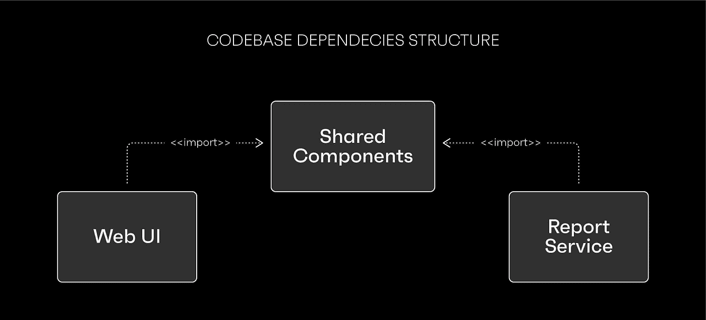

Codebase dependencies structure

在我的例子中，我使用了一个带有 Yarn 工作空间的基本 Lerna monorepo 设置，最终的代码 repo 将在最后被链接。我有 3 个包，如上图所示，所以`component`包被导入到 Web UI 和报告服务。

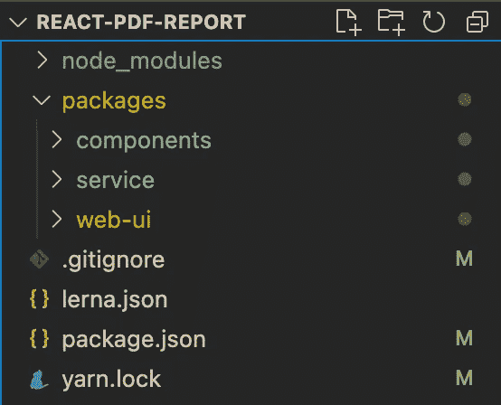

Project folders structure

## 第二步:设置基本的 Web 用户界面布局

出于演示的目的，我们可以在屏幕上有一个非常简单的布局。我们把它分成两半，左边的是数据源，右边的是即时 PDF 文档预览。现在我们只有一个基本的工作输入表单，只需要最少的验证。实际上，这个表单是从`react-hook-form`中复制粘贴[示例](https://react-hook-form.com/get-started)，我在这里也使用了它。

另一半是空的预览容器，我们稍后会更新它。目前，它只是一个具有 A4 文档格式尺寸的占位符。

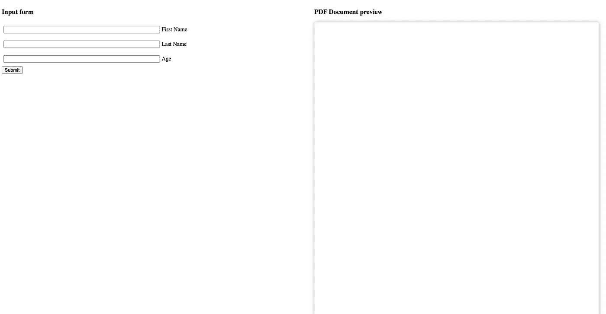

## 第三步:基本报表组件设置

在此步骤中，我们将设置共享组件包。为了简单起见，我再次使用了*创建 React 库*。在我们的例子中，设置并不重要，我们唯一需要的是拥有一个最终的构建文件，其中包含可以在客户端和服务器端重用的组件。

在这一步中，真正重要的是定义我们愿意为 PDF 文档提供什么样的组件。所以，现在我们可以自由地从组件的概念过渡到块。

那么你可能会问，组件和块的区别是什么？从技术上讲，块是一个递归的可序列化的数据结构。它描述了使用哪种 UI 元素，从哪里获取数据，以及是否有任何特定的属性可用于它。我们希望在 PDF 文档中包含的任何类型的 UI 元素——我们应该首先将其描述为一个块。换句话说——每个泛型元素都有一个`BaseBlock`抽象类和大量具体类。把块想象成我们想要看到的东西的描述，比如一个`Title`块或者`Image`块，也可能是一个条目列表的块。

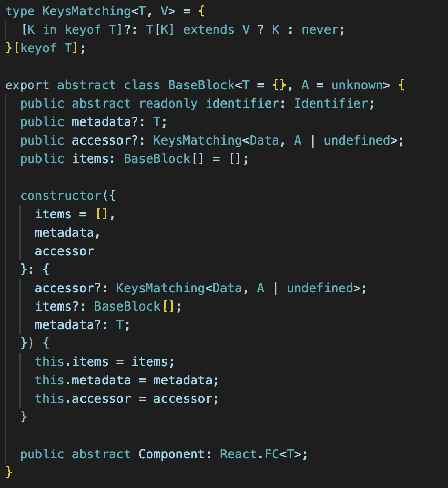

Base block abstract class

每个块都有一个必需属性的列表:`Identifier`和`Component`。此外，我们还有一个`accessor`、`metadata`和`items`。

使用`Identifier` enum，我们可以将块从 JSON 反序列化为正确的具体类实现，其中将有一个`Component`属性，这是该块的实际 UI 的功能。使用`accessor`,我们可以获得块的这个特定实例的值(想想标题块，可能有许多不同的标题，但是块是一个，所以我们只改变访问器)。块是递归的，所以每个块(几乎)都有一个`items`属性，一个子块列表。最后但同样重要的是`metadata`属性，我们需要它来描述块实例的一些具体细节。例如，标题栏可以有不同的样式，如**粗体**、*斜体*等。这就是元数据。

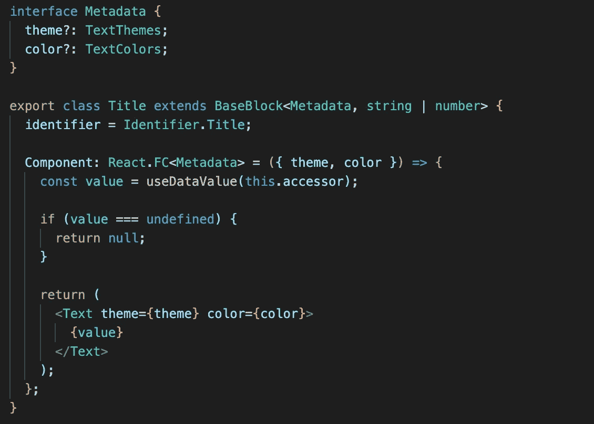

Title block implementation

通过利用块的力量，我们可以为我们想要的文档类型构建一个模式。我们可以定义几个模式，每个模式都是由许多块组成的。一个模式可以描述雇员时间日志的文档结构，另一个模式描述发票的结构。两者都由相同的砌块制成，但结构不同。

**通过拥有可串行化的块数据结构，我们获得了几个好处:**

1.  报告的布局可以动态构建。
2.  我们不仅可以在我们的服务中使用 schema，还可以在用不同编程语言构建的其他服务中使用 schema，以防我们将来需要支持它。
3.  模式可以作为一个简单的 JSON 存储在数据库中，很容易通过网络传输。
4.  我们创建了一组有限的受支持的块，所以这里没有魔法。这也有助于避免模糊的产品需求。
5.  作用域实现，防止不可读的混乱代码结构。

剩下的另一件事是在 React 中呈现模式。你猜怎么着？它之所以如此简单，是因为从渲染的角度来看，每个块都是相同的，它并不关心实际的块实现，它只是进行渲染。

因为这个结构是递归的，所以我们以递归的方式呈现它。只有在相同的嵌套级别上，键优化才是重要的，因此为了简单起见，我们使用一个带有索引的标识符。但是你可以用一些 ID 或者实际值来代替。

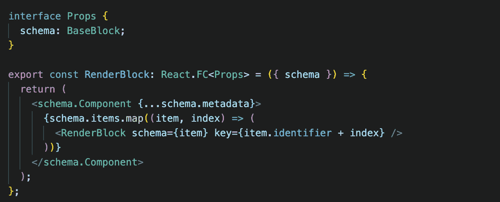

Component to render the Schema

最后，实际的模式只是块实例的多层 JavaScript 对象。我们将把它输入到`RenderBlock`组件中，所有的魔法都在那里完成。整洁！

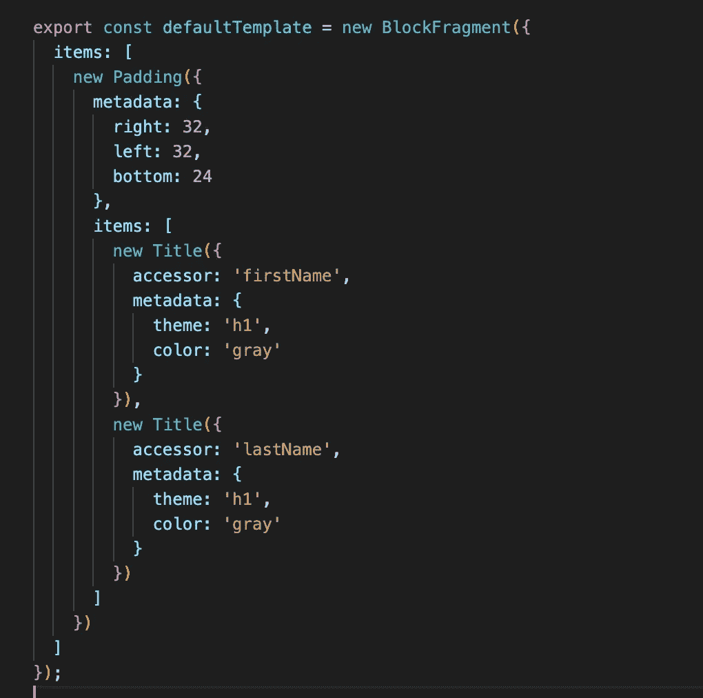

Example of the Schema

## 第三步:数据提供者

将模式从实际数据中分离出来是一件大事，因此它们可以是动态的。谁会需要一个与数据紧密耦合的布局呢？这就是为什么每个块都有一个`accessor`属性。通过访问器，我们可以真正地访问这个特定块实例所需的数据。让我们说，我们可以有几个标题，所以可能的访问者是`firstName`、`lastName`等。

实现这一点的 React 方法很简单——上下文 API。我们的数据对象大部分是平面对象，所以我们避免复杂的访问器(尽管这是可能的，但是更难维护)。提供者组件将包装 RenderBlock 组件。通过这种方式，数据由 DataProvider 提供，可以通过块实现内部的钩子轻松访问，并且布局(模式)是单独提供的。嗯，你应该已经得到了这个想法和好处。

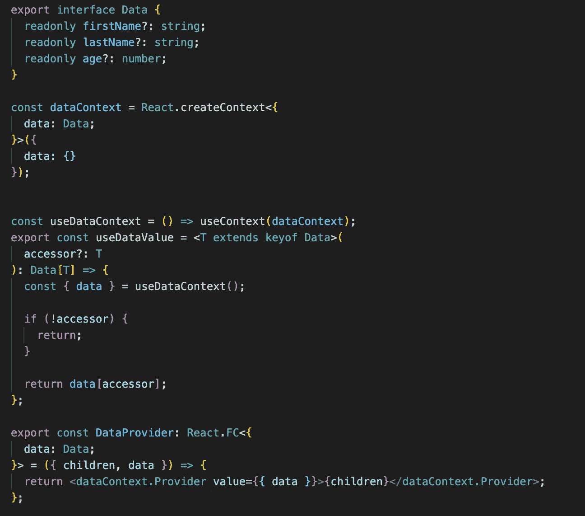

Data provider code

我们能够实现的另一件大事是，TypeScript 不允许我们将未知的访问器推送到块实例。我们用可用访问器及其类型的列表定义了我们的数据对象。让我们尝试使用一个未知的访问器，看看会发生什么。

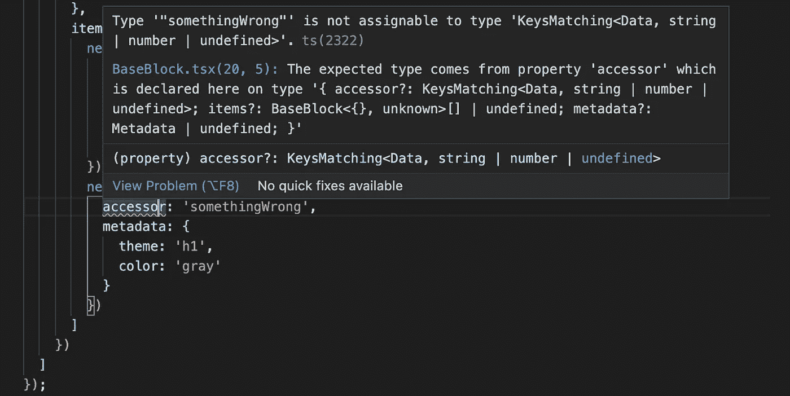

Passing unknown accessor error

谢谢打字稿！这对于防止开发人员的错误非常有用。当然，这只是一个编译时错误，但无论如何都是有帮助的。如果需要的话——我们可以做更多的运行时检查，但是现在，这不是我们的目标。

## 第四步:设置服务器端

我们可以采用直接(express)或结构化(Nest.js)的方法。我更喜欢使用 Nest.js 作为后端服务，因为它有一种干净的开箱即用的方式。不仅如此，这是一个框架，所以我不需要额外的设置步骤。

对于这个简单的用例，我们真正需要的是单个端点。为此，我们将使用模式和数据来推动主体。然后，剩下的工作被转移到服务中。

获得实际 PDF 结果的策略是遵循几个简单的步骤:

1.  通过 REST(不一定)API 接受模式和数据
2.  解析主体并验证它。(检查未知标识符等)
3.  将模式 JSON 反序列化为实际的块实例
4.  将模式提供给`RenderBlock`组件，将数据提供给`DataProvider`组件
5.  将所有内容呈现给 HTML 字符串(或流)。可选地包括必要的 CSS 代码
6.  净化 HTML 结果以消除安全风险
7.  **在 headless Chrome 中使用木偶师渲染 HTML，并使用支持的 API 提取 PDF 文件**
8.  在 HTTP 响应中将 PDF 文件作为流推送到客户端

这些是以这种方式创建 PDF 的基本步骤。当然，我们可以在中间有一些额外的步骤，但这是另一个故事。主要想法是创建一个最终的 HTML，并将其转换成 PDF 使用木偶戏。

如果你不熟悉 puppet er——它是无头 Chrome 或 Chromium 浏览器上的一个 API 抽象层。

在我们的例子中，同样重要的是在 Docker 容器中运行服务。这样我们就可以得到一致的 PDF 文档，而不依赖于它运行的服务器类型。

主体的验证使用起来非常简单。对于我们这里的数据结构，重要的是只检查来自模式的块标识符是否是我们知道的那个，否则，它是有效载荷中的一个错误。如果主体无效，我们将抛出一个异常。在 Nest.js 中，这是通过使用`class-validator`库的验证管道来完成的。

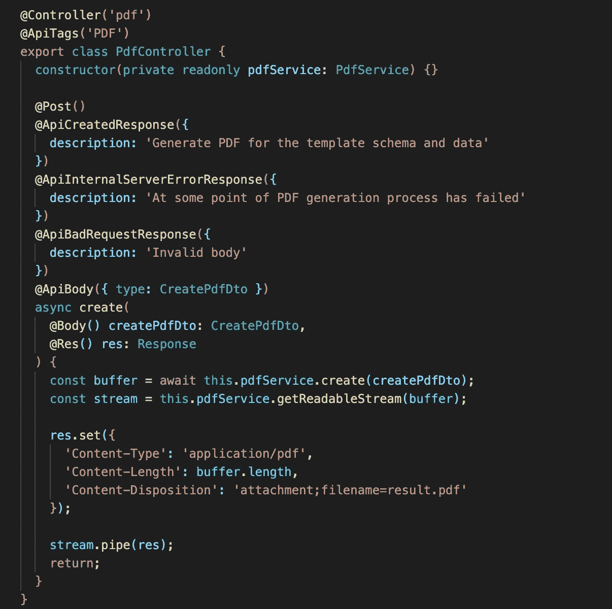

PDF controller with validation

另一部分是反序列化。此时，我们可以确定主体是有效的，所以我们可以简单地将这个普通对象反序列化到实际的块中。我们已经为此做好了准备，在组件库中提供了用于反序列化的函数。将该逻辑保留在组件项目中是有意义的，这样它就被封装起来，服务不需要知道太多关于数据的信息。同样，在 Nest.js 中，我们使用`class-transformer`将每个块转换成普通块(它只有一个实例，但没有实现任何 UI)。普通块很有用，因为我们可以对它们进行验证。之后，我们使用`deserializeSchema`将它们转换成正确的块，并输入到`RenderBlock`组件中。

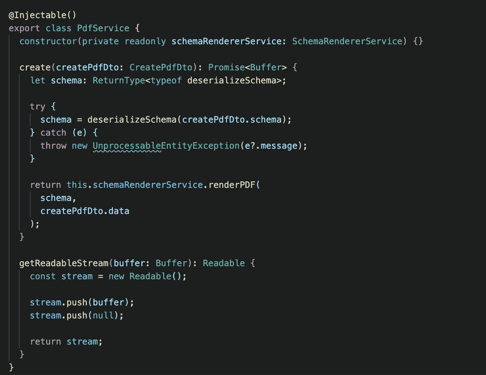

PDF service with deserialization

好的，很好，此时我们已经有了有效的和转换的数据，所以它可以被推进到渲染步骤。

React library 允许我们使用`react-dom/server`包，用它我们能够呈现 UI，但是特别是在服务器上。它可以是字符串或流，但为了简单起见，我们将使用 HTML 字符串。因此，这里的结构很清楚，我们呈现数据提供者和模式，然后将结果 HTML 字符串存储到一个变量中。我们不会在 Nest.js 设置中使用 JSX 来阻止支持该功能的配置。但是如果有必要的话你可以。一旦 HTML 准备好了，你只需要添加一个适当的 HTML 包装，我的意思是头部，身体，风格，如果必要的话。

同样，如果你把它们转换成一个[数据 URL](https://developer.mozilla.org/en-US/docs/Web/HTTP/Basics_of_HTTP/Data_URIs) ，你可以得到图片的支持。

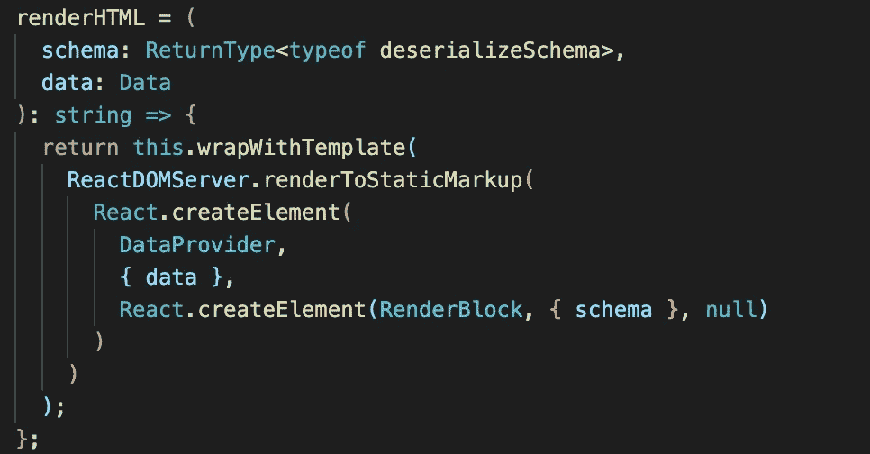

HTML generation

整个 HTML 都准备好了。为了安全起见，你也可以像 [ent](https://www.npmjs.com/package/ent) 一样通过解码器来运行。现在，我们可以把它推进木偶，得到 PDF 文件。还可以为页眉和页脚添加 HTML 模板，但它只支持内嵌 CSS 样式。

要用 PDF 的 UI 打开页面，我们应该用 base64 编码将它转换成数据 URL。

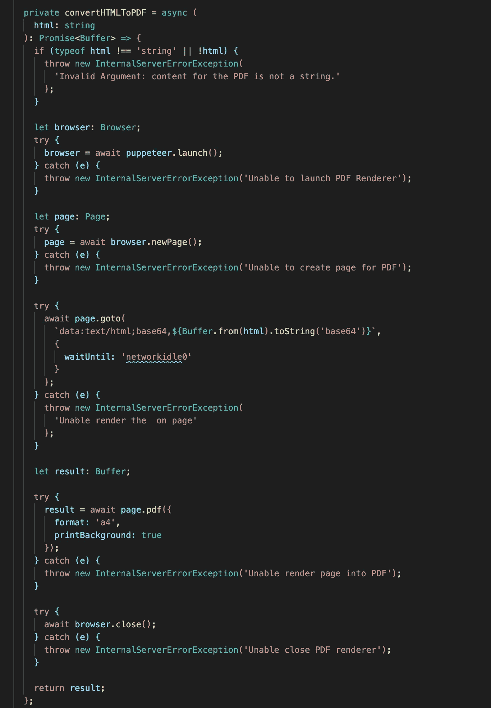

HTML to PDF conversion

结果是一个 PDF 缓冲区，我们可以简单地将它输入到响应流中。当然，您可以将其作为一个普通的 HTML 字符串，但是在流的支持下，我们可以稍微减少内存负载。对于文件流，我们应该用最终文件名指定内容类型、内容长度和内容处置。

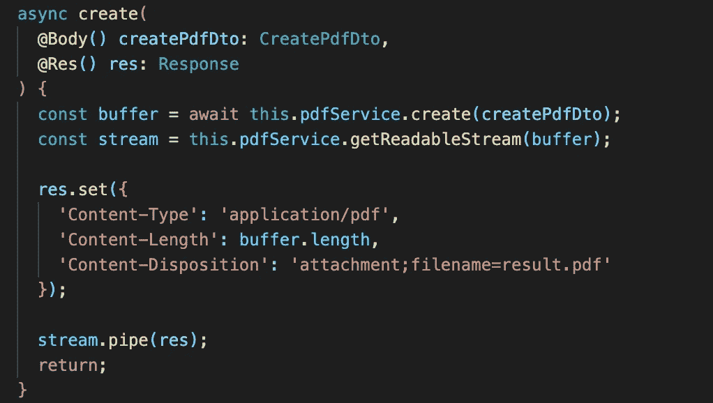

## 第五步:连接 UI 和共享组件

既然 UI 和共享组件都已经可以使用了，现在，我们应该开始连接它们了。很高兴，使用 Lerna，我们可以很容易地在项目之间导入组件，就像使用 PDF 服务一样。

我们现在可以用真正的预览替换 PDF 预览容器内容。所以，正如之前提到的——数据是分离的，模板也是分离的。

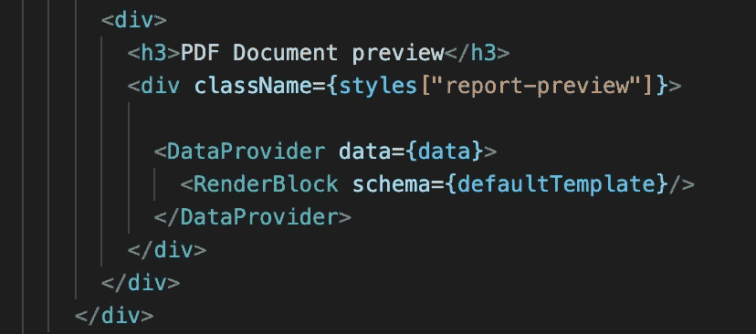

Rendering instant preview of the PDF

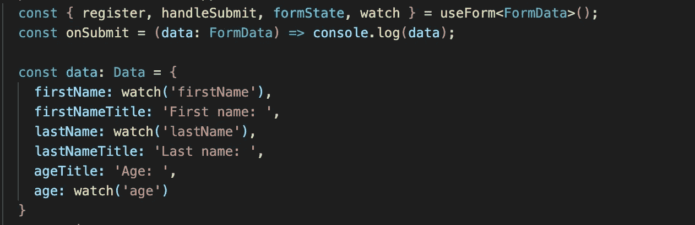

Data payload creation

我们做了很多努力使预览版易于使用。此外，为了简单起见，我们重用包含标题的默认模板。成效显著！所以现在，我们可以从预览中反映的形式中识别出每一个变化。当然，如果有必要，您也可以创建单独的页面模拟。但是在我们的例子中不是这样。

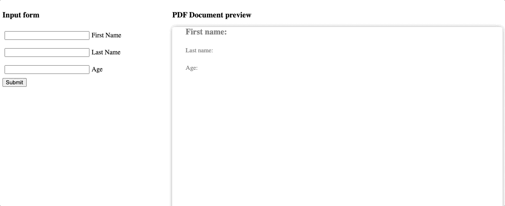

## 第六步:连接 UI 和服务

在这一点上，我们所能做的已经不多了。让我们将 UI 与服务连接起来，并以 PDF 格式查看最终结果！

对于这个简单的例子，仅仅使用`fetch`方法来调用服务就足够了。因此，我们将在新窗口中打开生成的 PDF 文档。但是，你当然可以以任何你想要的方式保存结果 Blob。

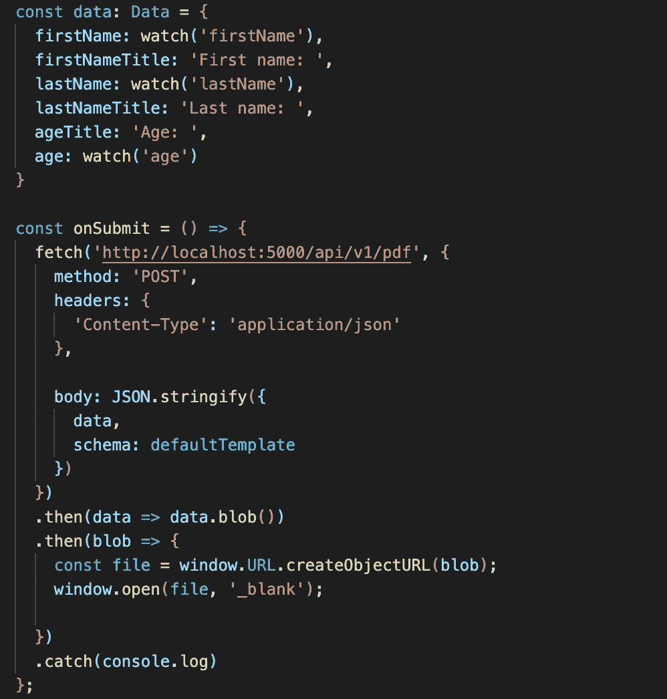

HTTP Request to the PDF service

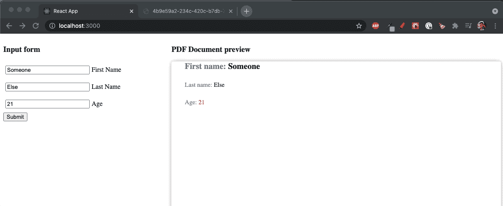

PDF generation

现在你有了！使用 React 组件的 PDF 文件！

## 结论:

您经历了 PDF 生成的整个周期，从基本步骤到最终结果。

当然，还有许多其他可能的生成 pdf 的方法，但是你所经历的这种方法非常适合基于 React 的 UI。

我们能够重用 UI 和 PDF 服务上的组件，这给了我们最终文件的即时预览。我们还创建了一个可预测的块结构(Schema ),这保证了结果报告的一致性。通过利用无头 chrome 和 puppeteer，我们最终能够生成 PDF 文件。在 Nest.js 框架和 TypeScript 的帮助下，使用 REST API 将两边粘合起来。

使用这种方法，您可以创建任何类型的块，动态的或静态的，复杂的或简单的，可重用的或不可重用的。主要思想是展示解决问题的一种可能的方法。

我们还没有真正讨论分页符的问题，但是通过这种方法，你可以使用`[page-break-*](https://css-tricks.com/almanac/properties/p/page-break/)` CSS 属性，这取决于如何放置它们的要求。

所有的代码都可以在 [GitHub](https://github.com/bohdanbirdie/react-pdf-report) 上获得。欢迎向我提出建议、提议甚至批评:)

PS:库也包含了服务的 Docker 设置，代码包含了额外的东西(比如 API swagger 等等)，主题中的例子非常简单。

*更多内容尽在*[***plain English . io***](http://plainenglish.io/)