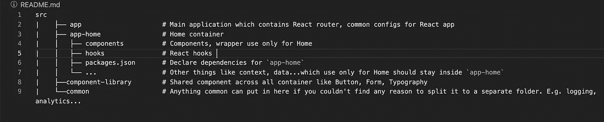

# 使用 TypeScript、Yarn Workspaces、Webpack 和 Babel 构建一个 React 应用程序

> 原文：<https://javascript.plainenglish.io/build-react-app-by-using-typescript-yarn-workspaces-webpack-and-babel-d0ad120e72d9?source=collection_archive---------2----------------------->


Large scale React App. Source [SitePoint](https://www.sitepoint.com/organize-large-react-application/)

# 语境

# **为什么我们需要使用 Yarn 工作空间？**

想象一下，你和另外 3 个开发人员一起在 React 应用程序代码库中工作。你从很小的几个路线、集装箱和组件开始。一切都很平静。但是突然之间，公司赚了很多钱，想要在产品上投资更多的钱，他们雇佣更多的人来加快开发过程。

现在，挑战来了。我们希望有多个团队在每条 React 路线上工作，不同的路线将有不同的依赖关系，我们有另一个团队在开发不同的产品，需要实现一个共享的组件库——这不再是和平的了。每天，你都需要努力工作，找出如何重组你的代码库。那么，为什么不从一开始就以这样一种方式构建一个项目，以便于扩展呢？好吧，开始吧！

**文件夹结构:**



Folder structure for React App

在这个例子中，我按照路线分割项目，我们有路线`/home`、`/about`，所以文件夹将是`app`、`app-home`、`app-about`。

有了这个结构，你可以看到我们在`src`文件夹下有多个独立的项目，这些项目将来可以被分割到不同的存储库中，并把它们作为一个依赖项。这就是为什么在`app-home`下你会看到我有一个名为`package.json`的文件，它声明了该文件夹的依赖关系。

现在，Yarn Workspaces 开始在这里发挥作用。你不想在每个文件夹中都看到`node_modules`吧？Yarn 工作空间将解析整个项目中的所有依赖关系，然后在项目的根级别中只创建一个`node_modules`文件夹。

# 使用别名导入

我总是发现当导入一些东西和重构我的代码时，使用别名非常有帮助。千万不要费心去处理这个点点地狱`../../../../`

但是，当您将一个项目拆分到另一个存储库中，并将其推送到 NPM 时，它会更有帮助。现在它变成了一个依赖项，所以您需要到处更新您的 import 语句。有了别名，您实际上不需要做任何事情，或者只需要简单地解析您想要匹配别名的包名。为了更清楚，我给你举个例子:

```
//app-home/index.ts // It works fine in both way//But with this way, you need to update the path if you split the component-library to become a node_modules dependency.
import { Button } from '../component-library/src/Button'// Minor changes in the config to map the alias again the package.
import { Button } from 'component-library/src/Button'
```

# 使用 Typescript、Babel、Webpack 和 Yarn 工作区创建 React 应用程序:

有很多关于如何用 TypeScript、Babel 和 Webpack 设置 React 的文章，所以我将快速浏览一遍。

# Package.json

将这个文件`package.json` 复制到根级别，它包含编译项目所需的所有开发依赖项。

*   私有:需要真实才能使用 Yarn 工作空间
*   工作空间:在哪里让 Yarn 知道工作空间来自哪里。
*   依赖项:它是空的，因为在根级别，我们的应用程序不需要任何依赖项，每个工作区都有一组自己的依赖项。
*   DevDependencies:所有的 DevDependencies 将留在这里，因为我们用它来编译我们的代码。

创建文件夹目录和工作区

在每个工作空间中，我们需要一个文件“package.json”来声明它的依赖项。例如在`src/app-home/package.json`

注意，我声明`component-library, app-home`是`app-home`的依赖项，因为我们想在使用 alias 时绕过 es-lint 规则。

# tsconfig.json

如果我们想从 VS 代码自动导入，我们需要添加路径到`tsconfig.json:`

# babel.config.json

我们还需要将路径解析器添加到 babel 配置中。在这里，我们使用`babel-plugin-module-resolver`来解析别名。

# 网络包.配置. js

在`babel-loader`中，我添加了`rootMode: upward`来让`src`下的工作空间使用与根项目相同的 babel 配置。您的项目中可能不需要它。

# **如何为项目增加新的依赖:**

在每个项目的`package.json`中，字段`‘name’`会告诉你你正在工作的工作空间的名称，但是基本上，它会与文件夹名称相匹配。

对于为特定工作区添加新的依赖项，我们使用以下命令:

```
yarn workspace <workspace-name> add <packages>
```

例如:我想将`faker`添加到`app-home`，命令将是:`yarn workspace app-home add faker`

# **如何向根级别添加依赖关系:**

有一些依赖项将在我们的项目中使用，比如`webpack`、`jest` …如果我们将它添加到根级别，这将是有意义的。

```
yarn -W add <packages>
```

参见我在 [Github repo](https://github.com/Tony1106/react-mono-repo) 的示例项目

*更多内容尽在* [***说白了***](http://plainenglish.io/)