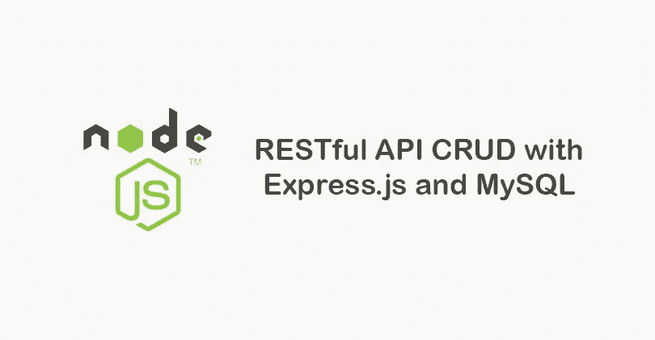
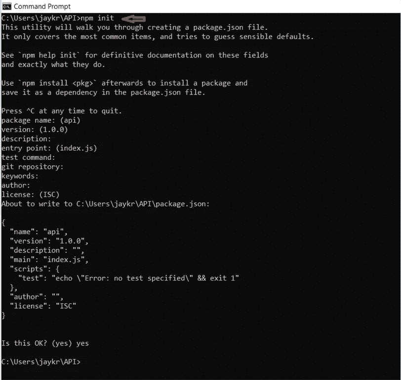
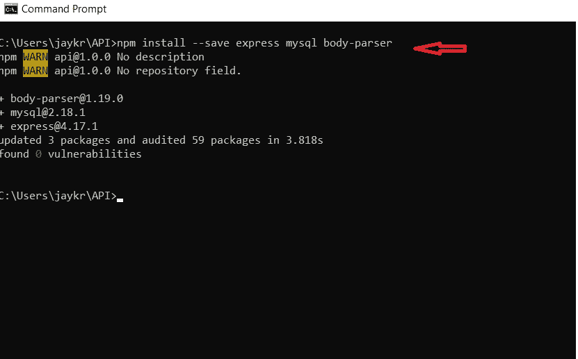
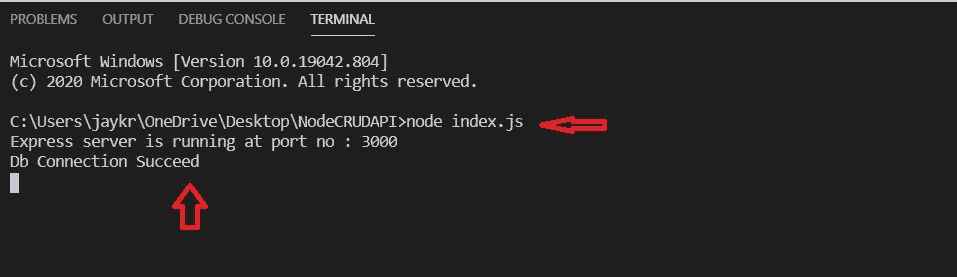
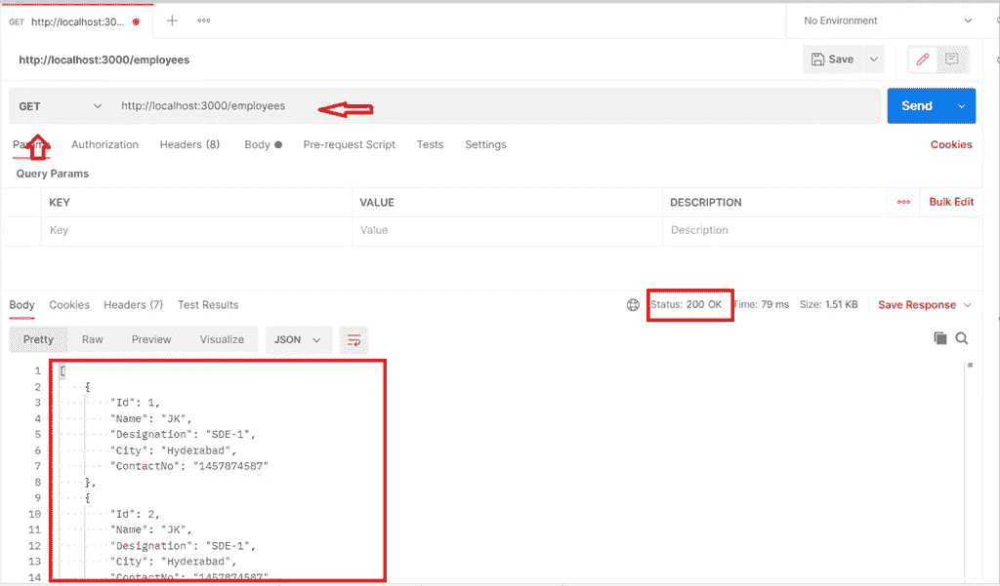
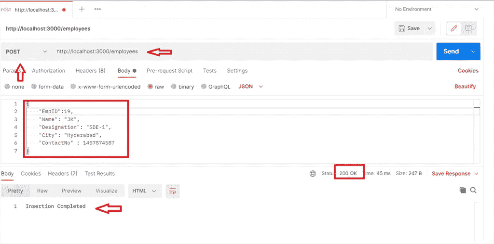
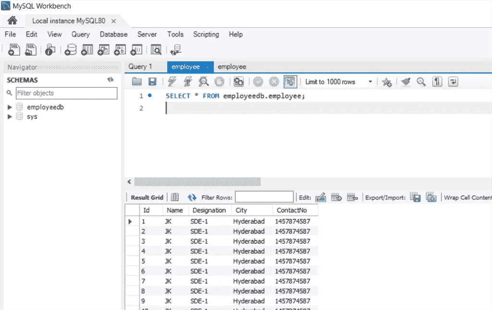

# 如何用 Node.js、Express 和 MySQL 构建 Restful APIs

> 原文：<https://javascript.plainenglish.io/build-restful-apis-with-node-js-express-mysql-271770259530?source=collection_archive---------5----------------------->

在本文中，我们将介绍如何使用 Node.js、Express 和 MySQL 构建 API。

CRud with Node.js

在本文中，我们将介绍如何使用 Node.js、Express 和 MySQL 构建 API。众所周知，JavaScript 是最流行的语言，因为我们可以用它轻松构建前端和后端服务。

## **我们要把什么包括在内？**

*   所需软件包的安装
*   数据库配置设置
*   CRUD 方法
*   存储过程的执行

 [## JayKrishnareddy/NodeCRUDAPI

### 使用 Node - Express - MySQL 构建 Restful 应用编程接口。通过创建一个…

github.com](https://github.com/JayKrishnareddy/NodeCRUDAPI) 

## 第一步

用项目名称创建一个文件夹，并在 Visual Studio Code 中打开该文件夹，在 VS Code 中打开命令提示符(Win + R -> cmd)或终端，然后切换到项目目录。

为了创建 **package.json** 文件，请找到下面的命令，它会要求一些项目配置——只需点击 enter 键。

命令:`npm init`

## **所需包装**

快递:针对服务器。

MySQL:用于与数据库服务器交互。

正文解析器:它允许我们将 JSON 数据发送到 Node.js API。

让我们使用下面的命令一次性安装所有的软件包，安装完所有的软件包后，您会在项目内部的 **package.json** 文件中看到版本相同的软件包。

**package.json** 文件:

让我们在 MySQL 中创建一个数据库，以便通过该数据库执行 CRUD 操作。我使用 MySQL 工作台连接到数据库服务器。

> [我的 SQL 工作台](https://www.mysql.com/products/workbench/) — IDE

创建一个数据库，并在该数据库下创建一个表。

在数据库中创建一个存储过程，以便通过 Node.js API 插入和更新。我对这两个手术都使用了单一程序。

## Node.js 中的数据库配置

我使用了一个单一的 **index.js** 文件来进行所有的配置设置和 CRUD 方法，并且我在每个部分都发表了评论，这样我们就可以清楚地了解我们为什么使用这个工具以及它会对哪里产生影响。

我在 **index.js:** 中遵循的步骤

1.  导入包。
2.  MySQL 的数据库配置和连接字符串设置。
3.  运行项目时检查连接是否成功或失败。
4.  使用端口号运行服务器。
5.  API 方法-获取、放置、发布、删除。

**index.js** 文件 **:**

运行项目:

在终端运行给定的命令:`node index.js`

我们可以在控制台本身中看到我们的 Express 服务器和数据库连接是否成功。

现在我们可以在邮差中测试我们的 API 了。

## 获取和删除请求

这是一个简单的 Get 调用，用于从数据库中获取 JSON 格式的所有员工详细信息。同样，对于 Delete 请求，只需在查询参数中传递**员工 id** 来执行删除操作。

**举例:**[http://localhost:3000/employees/2](http://localhost:3000/employees/2)(删除)

## **发布请求**

同上，但唯一的变化是您需要将 JSON 对象传递给 post-call，以便将记录插入数据库。

最后，您可以在数据库表中看到插入的记录。

我希望这篇文章对你有所帮助。继续学习！

*更多内容请看*[*plain English . io*](http://plainenglish.io/)