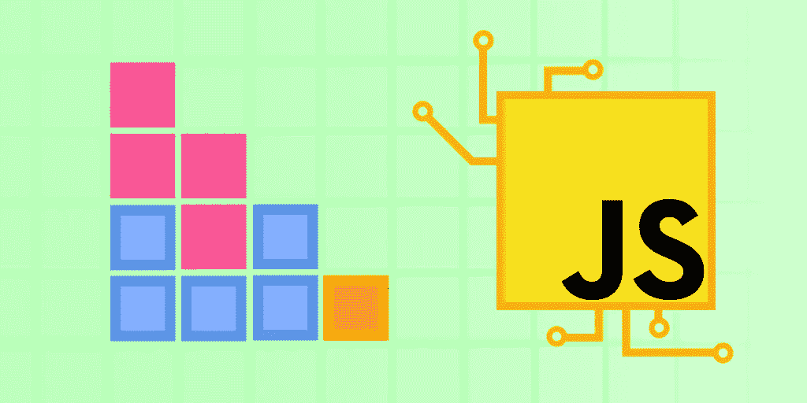
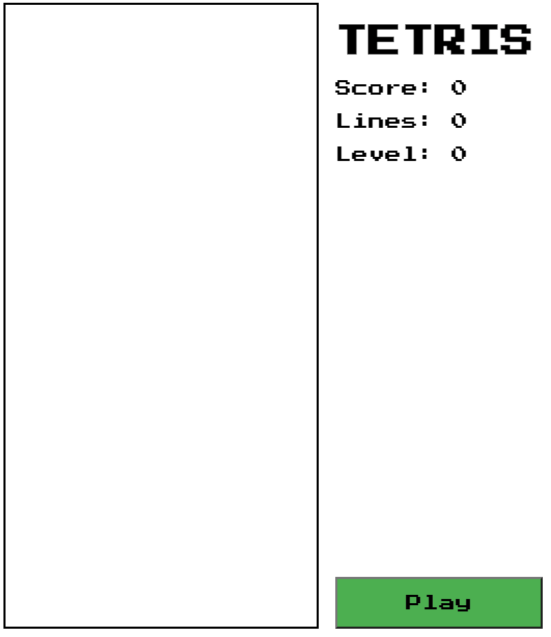
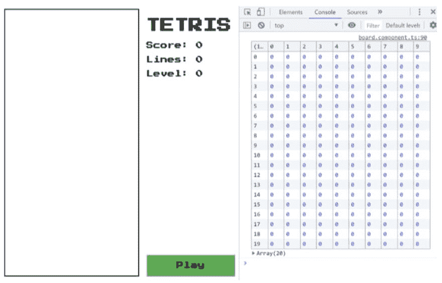

# 用现代 JavaScript 构建俄罗斯方块

> 原文：<https://javascript.plainenglish.io/build-tetris-with-modern-javascript-d631de657b9e?source=collection_archive---------14----------------------->



Image Source: Author

学习一门新的编程语言很难，而且不是每个人都以同样的方式学习。对许多人来说，项目实践探索或互动教程是持久学习的关键。

特别是对于像 JavaScript 这样的直观语言，构建项目有助于为如何以及为什么在不同的应用程序中使用基本概念提供上下文。这也有助于建立你的简历，因为你可以向招聘人员展示一系列了不起的项目，展示你的干劲和开发技能。

今天，我们将帮助您开始一个 JavaScript 游戏开发项目来构建俄罗斯方块。到本文结束时，您将拥有自己继续构建所需的所有基础知识。

**下面是我们今天要讲的内容:**

*   什么是俄罗斯方块？
*   设计游戏
*   设计电路板
*   创建画布
*   游戏的后续步骤

# 什么是俄罗斯方块？

俄罗斯方块是一款经典的街机游戏，由阿莱克西·帕杰诺夫于 1984 年创作。该游戏要求玩家旋转和移动落下的俄罗斯方块。玩家通过完成没有空单元格的水平行块来清除线。如果棋子到达顶部，游戏结束。

俄罗斯方块是一个受欢迎的项目，它让有抱负的游戏开发者在一个简单的环境中练习他们的技能。例如，您将获得基本游戏设计概念的实践，如游戏循环设计，以及实现常见的游戏机制，如用户控制、分数跟踪和碰撞检测。与更复杂的游戏不同，俄罗斯方块的行为和视觉效果非常简单。这可以让你练习在游戏开发中应用 JavaScript 基础知识，而不是弄清楚动画或复杂的玩家行为流程图。

对于这个例子，我们将从使用最简单的工具开始，到最后构建复杂性。

要制作俄罗斯方块，你需要知道:

*   HTML/CSS 样式
*   JavaScript 类、变量和范围
*   箭头功能
*   模板文字
*   展开与静止
*   解构

# 设计游戏

首先，让我们设置基本的 UI 元素:播放区域、开始按钮和跟踪分数、线和水平的读数。我们将使用 [Flexbox](https://www.educative.io/blog/css-flexbox) 和 [CSS 网格](https://www.educative.io/blog/complete-guide-css-positions)来正确定位元素。

```
<!-- index.html -->
<div class="grid">
  <canvas id="board" class="game-board"></canvas>
  <div class="right-column">
    <div>
      <h1>TETRIS</h1>
      <p>Score: <span id="score">0</span></p>
      <p>Lines: <span id="lines">0</span></p>
      <p>Level: <span id="level">0</span></p>
      <canvas id="next" class="next"></canvas>
    </div>
    <button onclick="play()" class="play-button">Play</button>
  </div>
</div>// styles.css
.grid {
  display: grid;
  grid-template-columns: 320px 200px;
}.right-column {
  display: flex;
  flex-direction: column;
  justify-content: space-between;
}.game-board {
  border: solid 2px;
}.play-button {
  background-color: #4caf50;
  font-size: 16px;
  padding: 15px 30px;
  cursor: pointer;
}
```

80 年代游戏的一个基本部分是高度可识别的位图字体。**按下开始 2P** 是谷歌的免费字体，我们可以用它来模拟这种感觉。

要添加字体，我们需要在 HTML 文档的`<head>`部分链接到它，并在 CSS 样式表中将它设置为我们想要的字体。

```
<!--index.html-->
<link
  href="https://fonts.googleapis.com/css?family=Press+Start+2P"
  rel="stylesheet"
/>// styles.css
* {
  font-family: 'Press Start 2P', cursive;
}
```

最后，使用 JavaScript 编写游戏板的基础结构。
您需要在我们的 HTML 文档末尾添加`<script>`元素来导入我们的 JavaScript。

HTML 文档的底部应该是这样的:

```
<script type="text/javascript" src="constants.js"></script>
    <script type="text/javascript" src="board.js"></script>
    <script type="text/javascript" src="piece.js"></script>
    <script type="text/javascript" src="main.js"></script>
  </body>
</html>
```

将包含我们静态 playboard 的代码。无论玩家如何操作，这些值都不会改变。播放板将由 10 列和 20 行组成，块大小为 30。

```
//constants.js
const COLS = 10;
const ROWS = 20;
const BLOCK_SIZE = 30;
```

然后，在`main.js`文件中，我们将包含一些操作文档的代码，它为 HTML 文档提供了一个可编程的接口。这种类型的文档称为**文档对象模型(DOM)** 。

我们可以使用 DOM 调用`getElementByID`,让我们瞄准特定的元素，并自动缩放游戏以匹配用户浏览器窗口的大小。这使用了 HTML5 新增的`canvas`元素，它允许我们轻松地创建和使用 2D 形状。

`main.js`文件应该是这样的:

```
//main.js
const canvas = document.getElementById('board');
const ctx = canvas.getContext('2d');// Calculate size of canvas from constants.
ctx.canvas.width = COLS * BLOCK_SIZE;
ctx.canvas.height = ROWS * BLOCK_SIZE;// Scale blocks
ctx.scale(BLOCK_SIZE, BLOCK_SIZE);
```

最后，您将拥有以下文件:

```
<!--index.html-->
<html>
<head>
  <link
href="https://fonts.googleapis.com/css?family=Press+Start+2P"
rel="stylesheet"
/>
</head><body> <div class="grid">
    <canvas id="board" class="game-board"></canvas>
    <div class="right-column">
      <div>
        <h1>TETRIS</h1>
        <p>Score: <span id="score">0</span></p>
        <p>Lines: <span id="lines">0</span></p>
        <p>Level: <span id="level">0</span></p>
        <canvas id="next" class="next"></canvas>
      </div>
      <button onclick="play()" class="play-button">Play</button>
    </div>
  </div></body>//main.js
const canvas = document.getElementById('board');
const ctx = canvas.getContext('2d');// Calculate size of canvas from constants.
ctx.canvas.width = COLS * BLOCK_SIZE;
ctx.canvas.height = ROWS * BLOCK_SIZE;// Scale blocks
ctx.scale(BLOCK_SIZE, BLOCK_SIZE);//constants.js
const COLS = 10;
const ROWS = 20;
const BLOCK_SIZE = 30;//styles.css
* {
  font-family: 'Press Start 2P', cursive;
}.grid {
  display: grid;
  grid-template-columns: 320px 200px;
}.right-column {
  display: flex;
  flex-direction: column;
  justify-content: space-between;
}.game-board {
  border: solid 2px;
}.play-button {
  background-color: #4caf50;
  font-size: 16px;
  padding: 15px 30px;
  cursor: pointer;
}
```



Image Source: Author

# 设计电路板

现在我们已经为我们的游戏创建了一个容器，是时候开始编码逻辑了。首先，我们需要棋盘能够画出下落的棋子并跟踪游戏状态。

棋盘和棋子都是类的很好的候选者。我们可以在开始一个新游戏时创建一个新的`Board`实例，并在每次新棋子进入游戏时创建一个新的`Piece`实例。

对于`Board`类，我们将创建一个新的`board.js`文件。我们希望每次游戏开始时棋盘都引用画布，所以我们将在`Board`构造函数中包含`ctx`。我们还将包含关键字`this`，让我们在`ctx`中设置和访问属性。

```
//board.js
class Board { 
  constructor(ctx) {
    this.ctx = ctx;    
  } 
}
```

俄罗斯方块棋盘由许多单独的单元组成，这些单元要么是空的，要么是被占用的。我们将用`0`表示空的单元格，用整数`1-7`表示被占用的单元格来表示颜色。

为了表示棋盘的行和列，我们将使用 2D 数组(一个矩阵)。我们用整数数组代表一行，用行数组代表整个棋盘。

因为所有的游戏都是从一个空棋盘开始的，所以我们需要一个返回空棋盘的方法。我们可以使用内置的`fill()`数组方法将每一行的所有元素填充到`0`。构造函数将调用这个方法，所以所有的游戏都是空的。

我们的`board.js`文件现在看起来像这样:

```
//board.js
class Board { 
  constructor(ctx) {
    this.ctx = ctx;
    this.grid = this.getEmptyBoard();
  } getEmptyBoard() {
    return Array.from(
      {length: ROWS}, () => Array(COLS).fill(0)
    );
  }
}
```

最后，我们将返回到`main.js`向播放按钮添加这个新的游戏功能。

```
function play() {
  board = new Board(ctx);
  console.table(board.grid);
}
```

现在我们的游戏板设置好了！你可以使用`console.table()`来查看控制棋盘的矩阵。



Image Source: Author

# 创建画布

现在我们将确保我们的`canvas`元素已经准备好使用。画布为我们的游戏提供了一块空白的画布。

我们还可以在画布上添加 2D 绘图上下文，用于绘制形状、文本、图像和其他对象。它的工作原理类似于 MS Paint 这样的程序，你可以选择你的笔刷类型和颜色，然后使用代码进行绘制。

首先，我们要确保画布大小合适。默认情况下，它是 300x150 像素，但我们希望它使用我们上面添加的代码进行缩放。

为此，我们向我们的`index.html`添加了一个`canvas`元素:

```
<canvas id="canvas"></canvas>
```

然后使用`getElementById`方法在 DOM(文档对象模型)中添加对 HTML `<canvas>`元素的引用。

```
let canvas = document.getElementById('canvas');
```

现在我们将使用 canvas 上下文来呈现一些片段。

我们可以使用`HTMLCanvasElement.getContext()`方法来获取我们渲染图形的画布上下文。这个方法需要一个参数，所以我们将通过`'2d'`来获取 2D 渲染上下文。

```
let ctx = canvas.getContext('2d');
```

在我们画画之前，我们必须使用`fillStyle()`方法选择一种颜色。

```
ctx.fillStyle = 'red';
```

然后，我们可以使用上下文 API 中的`fillRect()`方法绘制一个简单的矩形，用我们选择的红色填充。`fillRect()`接受 4 个参数:形状应该开始的 x 和 y 坐标以及矩形的宽度/高度。

```
ctx.fillRect(x, y, width, height);
```

因为所有的俄罗斯方块都是方块的集合，我们可以对所有的方块使用这种单一的抽取方法！

# 动画片

现在我们有了绘制图形的工具，我们必须能够移动它们。

Canvas 使用**即时渲染**:绘制的形状会立即渲染到屏幕上，但不会存储为形状对象。相反，canvas 只将形状识别为填充的像素，这意味着我们不能整体移动形状。

为了显示移动的形状，我们必须使用`clearRect()`删除旧的形状，并使用`fillRect()`在新的位置重新绘制。画布动画本质上类似于定格动画，因为它们在每一帧中都移动了一点。

看一下这个例子:

```
const {width, height} = this.ctx.canvas;
ctx.fillStyle = 'blue';
ctx.fillRect(0, 0, 10, 10);
ctx.clearRect(0, 0, width, height);
ctx.fillRect(1, 1, 10, 10);
```

这里，我们选择蓝色作为我们的颜色，然后在点`0,0`填充一个矩形。然后我们使用`clearRect()`清除整个画布，并传递整个画布的宽度和高度。最后，我们在`1,1`绘制一个同样大小和颜色的新矩形。

从用户的角度来看，矩形在屏幕上向右下方移动。

现在你已经设置好了画布和绘图工具，你已经拥有了开始编写游戏代码和收集游戏碎片所需的所有工具！

# 游戏的后续步骤

这是你下一个作品集项目的良好开端。现在你已经建立了游戏的基础，你的下一步是创建对象，用自己的颜色绘制每个独特的俄罗斯方块游戏。

每个棋子类型将由一个 3x3 矩阵表示，其中棋子是填充的单元格，周围的空白空间有助于围绕中心单元格旋转。

```
[2, 0, 0],  
[2, 2, 2],  
[0, 0, 0];
```

最好的方法是使用一个`Piece`类。

您还必须添加键盘支持，以便用户可以控制这些部分。最好的方法是使用现代浏览器内置的键盘事件支持。您可以使用`addEventListener()`方法将程序设置为在文档级别监听键盘事件，如`keydown`、`keyup`等。

完成这些步骤后，您将继续添加更多高级功能，如:

*   添加碰撞检测和块随机发生器
*   如果填充了一行，则添加行清除
*   跟踪分数、级别和过去的高分
*   通过异步 JavaScript 提高响应能力

*快乐学习！*

*更多内容请看*[***plain English . io***](http://plainenglish.io)