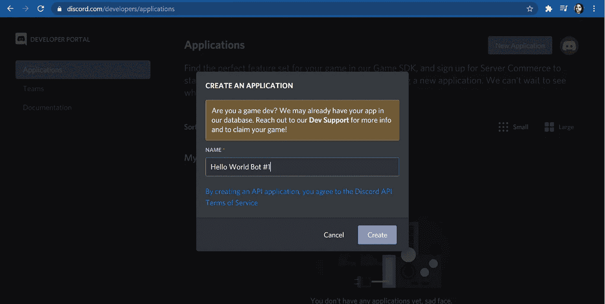
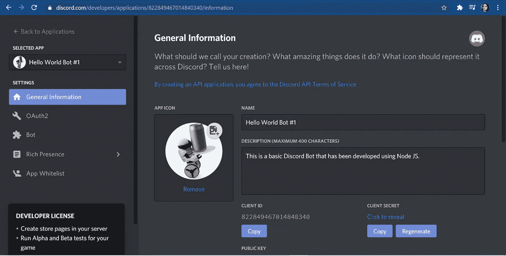
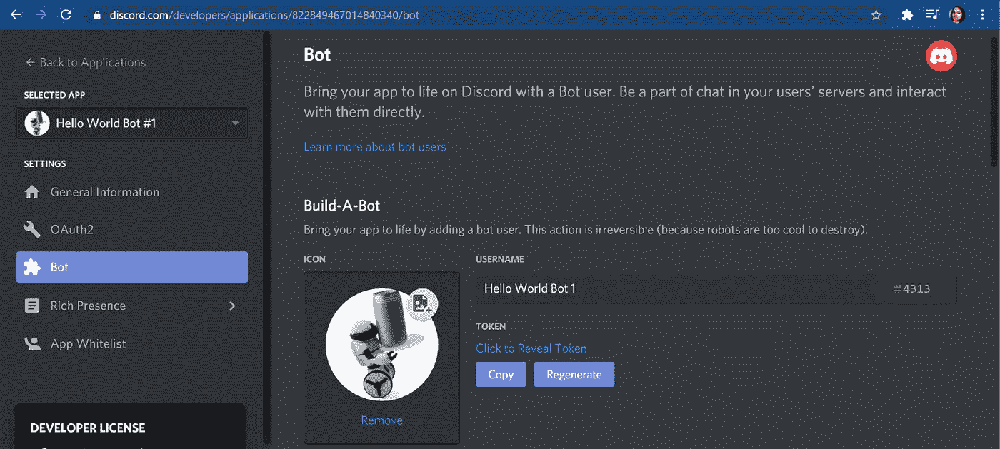
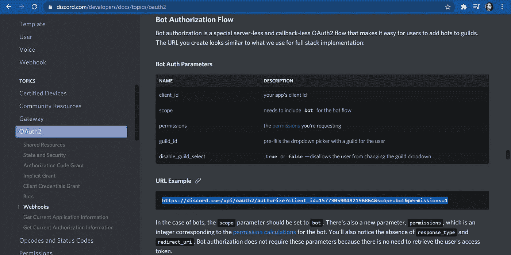
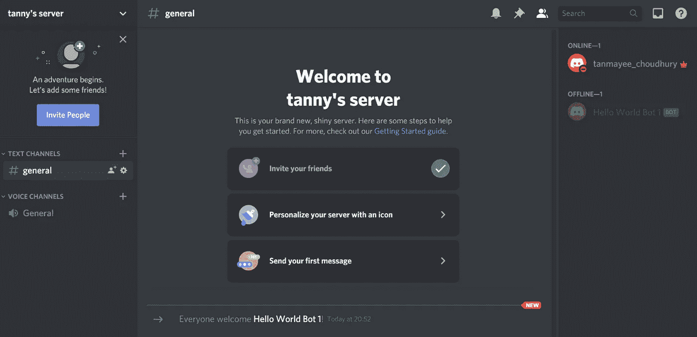
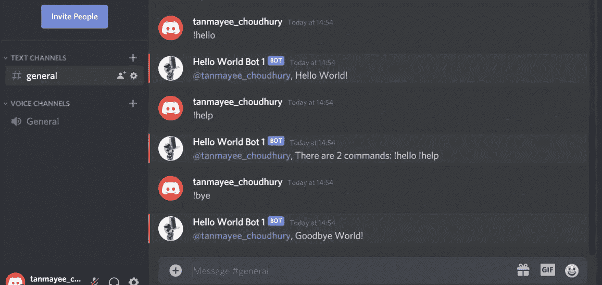

# 用 Node.js 构建你的第一个不和谐机器人

> 原文：<https://javascript.plainenglish.io/build-your-first-discord-bot-with-node-js-82d29ab0fa21?source=collection_archive---------8----------------------->

在这篇文章中，我们将推出一个简单的不和谐机器人在一个非常快速和简单的方式。Discord 机器人可以为你做很多事情，例如从 ex 暴雪网站收集高级 API 数据，显示魔兽世界中的角色信息，跟踪用户编辑或删除消息的时间，或者欢迎新用户加入 Discord 服务器的简单功能。我将指导你创建一个不和谐机器人，开发机器人，最后托管机器人。所以，让我们开始吧！

我们将使用 **Node.js** 来开发 Discord bot。为什么是 Node.js？因为它非常快。此外，它是异步的。这使得它可以更好地运行应用程序。**你只安装你目前需要的软件包**。 **Node.js 轻量高效**。轻量级基本上意味着应用程序不需要在底层框架中运行大量代码来完成它应该完成的任务。

假设我有一个机器人，它会返回一条消息。我真的不需要检查其他不需要的包。它只使用执行所需的东西。以下是我们将使用的每个工具的正确链接。如果你已经下载了它们，请跳过这一部分。

*   **Node.js**

[https://nodejs.org/en/](https://nodejs.org/en/)

*   **Visual Studio 代码**

[https://code.visualstudio.com/](https://code.visualstudio.com/)

## 创建新的 Discord 应用程序

在哪里创建机器人:[https://discord.com/developers/applications](https://discord.com/developers/applications)。在开始之前，你必须有一个不和谐的帐户和自己的服务器。

★点击“新建应用”的蓝色按钮，在网站上创建一个新的 Discord 应用。这将带您到一个弹出窗口，如下所示。给机器人起一个你喜欢的名字，然后点击“创建”。



★点击“创建”按钮后，您将被引导至一个如下所示的窗口:



如果需要，您可以为机器人提供显示图片并添加描述。那完全是**可选**。您将能够看到您的**客户端 ID** ，我们将在开发机器人时使用。

★继续，点击左边导航栏中的机器人选项。在那里你会发现一个“添加机器人”选项。点击它，你就创建了你的第一个 Discord 应用程序！祝贺你迈出了第一步。现在，你必须能够看到一个包含你的**令牌(密码)**的窗口。你可以随时更换你的代币。窗口看起来像这样:



★现在点击上面窗口左上角的“返回应用”。返回后，你会在导航栏中找到一个“文档”选项。单击它，然后从文档窗口的导航栏中选择“主题”下的“OAuth2”选项。现在，向下滚动到“机器人”部分—机器人授权流程。在那里，你会找到你的**邀请链接**。我在下面的图片中突出显示了 URL。将该链接的 ID 替换为您的客户端 ID，这样就万事俱备了！



现在您已经有了您的 ID、令牌和邀请链接，请将它们存储在一个文本文件中，这样您就不会丢失这些重要信息。**使用您自己的客户端 ID，邀请链接和文本文件的令牌。不是照片上显示的那种。**

★为了添加您的 Bot 进行授权，请将您的邀请链接粘贴到浏览器的新选项卡上。这将把你带到一个窗口，你应该选择一个你拥有的服务器，然后点击“授权”。恭喜你。！您已经成功地将机器人添加到您的服务器。当你打开你的服务器时，它应该在右侧显示你的机器人，如下图所示:



## npm 软件包安装

在桌面上创建一个名为 **Hello-World-Bot** 的文件夹，并在 Visual Studio 代码中打开该文件夹。创建一个 **app.js** 文件。这将是我们的主文件，我们将在这里编写所有的代码。但在此之前，我们需要做些事情。在您的 VS 代码窗口的左侧，您的 app.js 文件所在的位置，右键单击并选择“在终端中打开”以打开 **powershell** 窗口。在 powershell 中键入" *npm init"* 。(如果无法识别 npm，请以管理员身份重新启动/更新您的计算机和/或重新启动 visual studio 代码)会有几个问题:

*   对于软件包名称、版本、描述:按 Enter 键
*   入口点:app.js(如果已经编写了 app.js，则按 Enter 键)
*   测试命令，git 存储库:按 Enter 键
*   关键词:你的名，你的姓
*   作者:你的全名，你的服务器名
*   许可证:按 Enter 键
*   这可以吗:键入 yes 并按 Enter 键

现在我们已经成功创建了 package.json 文件。为了在 package.json 文件中包含 discord 依赖项，请键入`npm install discord.js --save` *。*

## 开发不和谐机器人

★要启动节点服务器，也就是 **app.js** 文件，也就是我们的 Discord bot，你在终端/控制台写`node app.js`。要停止节点服务器，即停止我们的 Discord bot，您可以同时按下这些按钮:Windows 系统的**ctrl+c**Windows 系统的**Windows 系统的**，Mac 系统的 cmd + c** 以及 Linux 系统的 **ctrl + c** 。app.js 文件的代码如下所示:**

```
// Require discord.js package**const Discord = require(“discord.js”);**// Create a new client using the new keyword**const client = new Discord.Client();**// We’re using a lot of strings like ready, reconnecting, disconnect, message, etc. So, instead of writing them individually it’s preferable to create an array to store these strings. That’s called a clean code.**const arr = [“./token.json”, “ready”, “message”, “!hello”, “!help”, “reconnecting”,”!bye”];**// Add a safer way to store the token (password)**const {****token****} = require(arr[0]);**// Display a message when the bot comes online. Here, arr[1] i.e. “ready” is an event.**client.on(arr[1], () => {****console.log(`Logged in as ${client.user.tag}!`);****});** //` ` is a template string.// Reconnecting event**client.on(arr[5], () => {****console.log(`This bot is trying to reconnect: ${client.user.tag}!`);****});**// Check for new messages. Here, msg is an object. We get an object in return so we created the msg object.**client.on(arr[2], msg => {**// Failsafe**const msgContent = msg.content.toLowerCase();**// Send back a reply when the specific command has been written by a user.**if (msgContent === arr[3]){****msg.reply(“Hello World!”);****}**// !help command**else if (msgContent === arr[4]){****msg.reply(“There are 2 commands: !hello !help”);****}**// !bye command**else if(msgContent === arr[6]){****msg.reply(“Goodbye World!”);****}****});**// Log in the bot using your token (password)**client.login(token);**
```

该机器人特别试图连接到 websocket，以便通过互联网进行通信。在“重新连接”事件中，机器人并不试图连接到互联网。如果您在任何操作系统(mac、windows、linux 等)上难以浏览 CMD..)，实际上可以打开一个 visual studio 代码的新窗口，通过 visual studio 代码托管 bot。这完全没问题。您可以同时打开多个 visual studio 代码窗口。

## 你可以从下面的链接知道什么是 Websocket 和 TCP:

 [## WebSocket -维基百科

### WebSocket 是一种计算机通信协议，通过单个 TCP 提供全双工通信通道

en.wikipedia.org](https://en.wikipedia.org/wiki/WebSocket) [](https://en.wikipedia.org/wiki/Transmission_Control_Protocol) [## 传输控制协议-维基百科

### 传输控制协议(TCP)是互联网协议族的主要协议之一。它起源于…

en.wikipedia.org](https://en.wikipedia.org/wiki/Transmission_Control_Protocol) 

## **托管不和谐机器人**

只要你能运行一个节点服务器，你可以用任何你想要的方式让 T4 托管这个机器人。

1.  你可以用 **Visual Studio 代码**托管 Discord 机器人，并且能够按照你的意愿开发机器人。这是通过在终端中运行命令`node app.js`来完成的。
2.  您可以通过一个更高效的窗口来托管 bot，这就是 **cmd** (命令提示符)。在 windows 上你按下 **flag+ R** 然后你输入 **cmd** 和**按下 enter** 。现在你已经打开了**命令窗口**。您将需要使用 **cd** 命令进行导航。 **cd** 代表**变更目录**。您需要使用 **cd 后跟文件夹名称**来导航到该文件夹。例如: **cd hello-world-bot** 。要回到上一级，你要写 **cd..**。这个命令窗口一开始会让人望而生畏，需要一段时间才能掌握它，因为它没有可视化的表示，只有文本。但是如果你在桌面上有一个包含机器人文件的文件夹，导航起来就很容易了。**首先打开 cmd 窗口，写入 cd 桌面和 cd 文件夹名。**

## 令牌安全

有一种安全的方法来存储您的 bot 的令牌，这样即使您向任何人展示您的源代码，其他用户也看不到该令牌。这是通过创建一个. json 文件来完成的，在 json 文件中创建一个包含您的 bot 令牌的对象。在 app.js 文件中，我们只需要该文件，并将该文件的数据存储在一个变量中。

在保存 bot 文件的文件夹中创建一个名为 **token.json** 的文件，例如 **app.js** 。

将该代码粘贴到文件中。

`{ "token" : "your_bots_token" }`

如果你能够实现以上所有的东西，恭喜你！！你绝对可以去。一旦你启动你的节点服务器，你的不和谐机器人将在你的服务器上在线，并能够执行它的功能。大概是这样的:



## 结论

我希望这篇文章对所有的技术爱好者有所帮助。我个人很喜欢开发我的第一个不和谐机器人。希望你也一样！