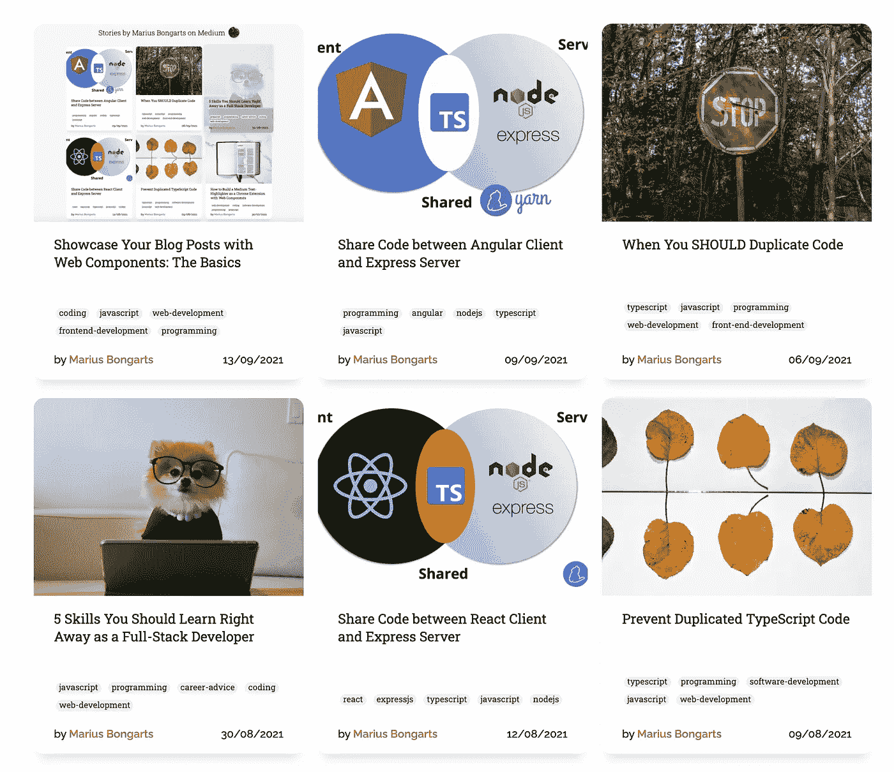
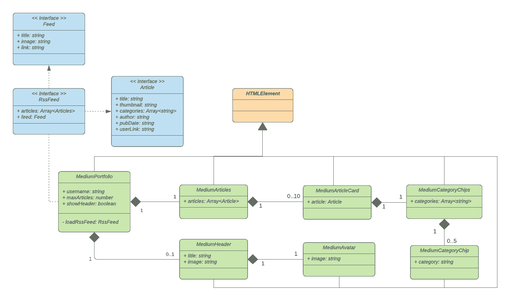
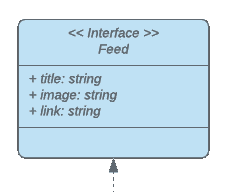

# 用 Web 组件构建自己的博客组合:数据流

> 原文：<https://javascript.plainenglish.io/build-your-own-blog-portfolio-with-web-components-data-flow-6c1a8f09c252?source=collection_archive---------2----------------------->

## 第 2 部分—属性、特性、生命周期回调

作为开发人员，我们都知道应该尽可能地重用代码。重复代码是软件错误的主要原因之一，避免重复代码至关重要。Web 组件帮助我们创建具有封装功能的可重用标记结构。

在这一系列文章中，我们将通过将 Web 组件应用于一个示例来学习它们的基础和高级特性。我们将逐步开发一个投资组合，展示任何媒体用户的媒体文章。

1.  [用 Web 组件构建自己的博客组合*:基础*](/showcase-your-medium-articles-with-web-components-part-1-basics-d2c6618e9482)
2.  用 Web 组件构建自己的博客组合:属性、道具、生命周期回调
3.  [用 Web 组件构建自己的博客组合 *: W* ebpack](https://medium.com/@mariusbongarts11/build-your-own-blog-portfolio-with-web-components-webpack-4f35c8e5d2a9)
4.  [使用 Web 组件构建自己的博客文件夹 *:* 类型脚本](https://medium.com/@mariusbongarts11/build-your-own-blog-portfolio-with-web-components-typescript-adfbcd917d96)
5.  [用 Web 组件构建自己的博客文件夹:Lit Library](https://medium.com/@mariusbongarts11/build-your-own-blog-portfolio-with-web-components-lit-library-2701dffc735f)

在上一篇文章中，我们已经了解了 Web 组件的三种主要技术:**自定义元素**、**阴影 DOM** 和 **HTML 模板**。

掌握它们是实现本文中的应用程序的基础。如果你不熟悉这些技术，我强烈推荐你先看一下[之前的文章](https://medium.com/@mariusbongarts11/showcase-your-medium-articles-with-web-components-part-1-basics-d2c6618e9482)。

# Web 组件—简短概述

Web 组件使我们能够完全独立于前端框架/库进行开发，因为它们是基于官方 web 标准的，并且受到所有主流浏览器的支持。这并不一定意味着我们应该抛弃所有的框架/库。相反，这意味着我们可以外包应用程序的某些部分，以便在 React、Angular、VueJS 等中重用它们。…框架将更像是一个将数据传递给其组件的包装器。

亲自尝试一下，将这段代码片段传递给任何 web 应用程序或任何网站:

Embedded web component

您将看到的是我们将在本文中构建的中型投资组合。看看[现场演示](https://mariusbongarts.github.io/medium-portfolio-1/)或者 [CodePen](https://codepen.io/marius2502/pen/gORmqJz) 。

# 体系结构

在我们继续实现中型产品组合的第一个组件之前，我们将更仔细地看看我们的应用程序的**架构**。这个统一建模语言(UML)图定义了我们的应用程序的各个部分。它包含三个接口(蓝色)、一个超类(橙色)和七个**自定义元素**类(绿色)。

让我们关注一下我们的**自定义元素**(绿色)。

我们的**入口点**是 *MediumPortfolio* 类，它定义了我们的`medium-portfolio`定制元素。该组件获取我们的数据，并将其传递给 *MediumArticles* 和 *MediumHeader* 组件。

*MediumArticles* 组件负责通过为每篇文章呈现多达 10 个 *MediumArticleCard* 组件来显示我们的文章。

此外， *MediumCategoryChips* 和 *MediumCategoryChip* 组件以芯片的形式显示多达 5 个类别。此外，我们将在文章上方显示一个带有*媒体变量*的*媒体标题*。

那么现在，事不宜迟，让我们深入代码来构建我们的中型投资组合。

# 入口组件

看看我们的`MediumPortfolio`类，这是我们应用程序的**入口点**。

Entry Component

这里发生了很多事情。让我们一步一步来看。

## 生命周期回调

在我们的`medium-portfolio`组件中，你可以看到我们再次在构造函数中首先调用了`super`。此外，我们定义了`connectedCallback`方法，这是您可以为定制元素定义的**生命周期回调**之一。这些是在元素生命周期的不同点执行的。

每次将定制元素追加到 DOM 中时，都会调用`connectedCallback`。如果你熟悉 Angular，可以把这个比作`ngOnInit`回调。React 开发人员可以使用`componendDidMount`和 VueJS 开发人员的`mounted`回调作为参考。

以下是引用来自 [MDN](https://developer.mozilla.org/en-US/docs/Web/Web_Components/Using_custom_elements#using_the_lifecycle_callbacks) 的所有回访的概述:

> `*connectedCallback*`:"每次将自定义元素追加到文档连接的元素中时调用。这将在每次移动节点时发生，并且可能在元素的内容被完全解析之前发生。
> 
> `*disconnectedCallback*`:"每次自定义元素从文档的 DOM 断开时调用。"
> 
> `*adoptedCallback*`:“每次将定制元素移动到新文档时调用。”
> 
> `*attributeChangedCallback*`:"每次添加、删除或更改定制元素的属性时调用。在静态 get `*observedAttributes*`方法中指定了哪些要注意变化的属性"

## 获取数据

我们使用`connectedCallback`从`[https://](https://https://medium.com/feed/@mariusbongarts11)medium.com/feed/@mariusbongarts11`获取 *RssFeed* 来加载它。

这个 URL 以 XML 格式返回任何用户的最近十篇文章。此外，我们使用 [rss2json](https://rss2json.com/) API 获取 json 格式的数据。我们的结果对象包含我们的文章和一个 feed 对象，它为我们提供作者的信息，我们将在我们的标题中显示这些信息。为了有一个到媒体用户的链接，我们将映射我们的*文章*也有一个`userLink`。

Fetching our data

## 属性

为了让我们的产品组合为每个媒体用户服务，我们通过向应用程序传递属性来定制我们的应用程序。然后，我们可以通过在自定义元素中调用`getAttribute`来读取它们。

在我们的应用程序中，我们允许开发人员定义这三个属性:

*   `username`:从中加载文章的中等用户名
*   `maxArticles`:设置显示文章数量的选项
*   `hideHeader`:隐藏标题组件的选项

# 展示文章

有四个组件负责呈现我们的实际文章。*中物品*、*中物品卡*、*中物品卡*和*中物品卡*类。我们的每个组件都需要一些数据，这些数据需要由父元素传递。

让我们弄清楚如何将我们的文章数组传递给我们的 *MediumArticles* 组件。

## 属性与特性

要将数据传递给自定义元素，我们有两种选择:

*   属性
*   性能

属性和特性之间的区别一开始可能会令人困惑。所以让我来解释一下。

**属性**

属性是通过 HTML 向自定义元素传递数据的最简单方法。在添加我们的`medium-portfolio`定制元素时，我们已经这样做了:

Attributes

我们将一些字符串属性传递给自定义元素，自定义元素可以使用`getAttribute()`函数访问这些属性。那些属性和我们已经知道的属性没有什么不同:`class`、`src`、`alt`等等

在静态`observeAttributes`和`attributeChangedCallback`的帮助下，我们也可以很容易地监听属性的变化。

> " attributes 是一个由**字符串**组成的键/值对，它表示关于该属性的任何信息。"— [MDN](https://developer.mozilla.org/en-US/docs/Web/API/Element/attributes)

这意味着，我们只能将字符串传递给 HTML 属性。

*问:但是我们如何传递我们的* `*articles*` *数组对象呢？*

*答:我们可以序列化我们的对象，并将其作为字符串传递*

> 将丰富的数据属性反映到属性是不必要的开销，需要序列化和反序列化相同的 JavaScript 对象—[developers . Google](https://developers.google.com/web/fundamentals/web-components/best-practices)e

我想强调的是，这是一种丑陋且效率低下的方式，因为将一个大对象序列化为一个字符串的代价很高，并且任何对象引用都会在这个字符串化过程中丢失。

不过，让我向您展示我们如何使用`JSON.stringify`来实现这一点:

…但是有一个更好的方法—属性。

**属性**

虽然可以使用 HTML 传递属性，但另一方面，属性只能使用 JavaScript 传递。

> "目标是只接受丰富的数据(对象，数组)作为属性."— [developers.google](https://developers.google.com/web/fundamentals/web-components/best-practices)

要设置一个元素的属性，我们可以查询它并像这样设置它:

为了对属性更改做出反应，我们可以在自定义元素中定义 **getter** 和 **setter** ，以便在文章可用时呈现我们的 HTML:

**丑陋的方式**

如果你有任何前端框架/库的经验，你可能习惯于直接在模板中设置属性。这就是为什么我们将在下面的文章中使用小而快的 HTML 模板库 [lit](https://lit.dev/) 库。这允许我们直接在模板中传递属性。

知道了这一点，让我们以丑陋的，但在我看来更可读的方式来完成我们的`medium-articles`部分。请记住，我们稍后会清理这个问题，这个解决方案并不是最有效的。

我们映射我们的`articles`并将一个*字符串化的*和 *URL 编码的*属性传递给我们的`medium-article-card`元素:

为了编码和解码我们的对象，我们使用这些辅助函数:

在我们的 *MediumArticleCard 中，*我们可以轻松地解码我们的对象，并使用 **getter** 使其可访问。现在，我们可以轻松地在组件中呈现所有需要的信息:

注意，我们的`medium-articles`和`medium-article-card`利用影子 DOM 来保持标记和样式与页面上的其他代码分离。

# 显示类别筹码

媒体上的每篇文章最多可以有五个标签，它们将在我们的`article`对象中表示为一个`categories`字符串数组。

在我们的`medium-article`元素中，我们像这样将`categories`传递给`medium-category-chips`元素:

让我们看看我们的*媒体类别芯片*类:

同样，我们附加了一个影子 DOM 来封装我们的组件。此外，我们解码我们的`categories`字符串数组以迭代它，并为每个芯片呈现一个`medium-category-chip`。在元素内部，我们显示相关类别的文本。

如果您密切关注了[上一篇文章](/showcase-your-medium-articles-with-web-components-part-1-basics-d2c6618e9482)，您可能已经注意到我们的 MediumCategoryChip 使用了一个`template`标签，并且它定义了一个`slot`，允许我们在其中显示文本:

这个组件的特殊部分在开头。我们创建一个带有**槽**的`template`元素。如你所知， **HTML 模板**允许我们声明可重用的片段，这些片段保存不立即呈现的 HTML 内容。

在我们的`render`函数中，我们使用模板作为基础创建了其内容的克隆。这里， [lit](https://lit.dev/) 将在下面的文章中简化创建和克隆模板的过程。

# 显示标题

我们还想显示一个标题，显示作者的标题和头像。这两个信息都可以从`Feed`界面读取。

为了使我们的 Web 组件更加灵活，我们允许通过将`hideHeader`属性传递给我们的 entry 组件来隐藏标题。如果没有设置 HTML 属性，`getAttribute`函数将返回`null`。这意味着我们需要有条件地呈现我们的`medium-header`，只要这个 getter 解析为 false:

在我们的`medium-portfolio`中，我们可以使用三元运算符有条件地生成我们的`medium-header`:

Conditional rendering

现在，我们只需要将所需的属性传递给我们的`medium-header`组件，如下所示:

并且`medium-header`组件将图像 URL 提供给`medium-avatar`组件，如下所示:

# 下一步是什么？

在本文中，我们开始实现我们的应用程序，并学习了属性、特性和生命周期回调。

在下一篇文章中，我们将使用构建工具 **webpack** 捆绑我们的代码。之后，我们将使用 **Typescript** 并重构我们的应用程序以使用 [**lit**](https://lit.dev/) 。

1.  [用 Web 组件构建自己的博客组合*:基础*](/showcase-your-medium-articles-with-web-components-part-1-basics-d2c6618e9482)
2.  **用 Web 组件构建自己的博客组合:属性、道具、生命周期回调**
3.  使用 Web 组件构建自己的博客组合 *: W* ebpack
4.  [用 Web 组件建立自己的博客组合 *:* 打字稿](https://medium.com/@mariusbongarts11/build-your-own-blog-portfolio-with-web-components-typescript-adfbcd917d96)
5.  [用 Web 组件构建自己的博客组合:Lit Library](https://medium.com/@mariusbongarts11/build-your-own-blog-portfolio-with-web-components-lit-library-2701dffc735f)

我希望你能遵循这些步骤。我总是很乐意回答问题，也乐于接受批评。请随时联系我😊

也可以看看 [Github 库](https://github.com/MariusBongarts/medium-portfolio-1)。

***关注我不要错过下一篇文章*** 🙏

# 关于作者

Marius Bongarts 是埃森哲互动公司的软件工程分析师。他还创建了 [Web Highlights 扩展](https://chrome.google.com/webstore/detail/web-highlights-+-bookmark/hldjnlbobkdkghfidgoecgmklcemanhm)，允许用户在标签和目录的帮助下组织文本亮点和书签。

通过**[**LinkedIn**](https://www.linkedin.com/in/marius-bongarts-6b3638171/)**与我联系。****

**[**这里是无限制访问介质上每一个内容的链接**](https://medium.com/@mariusbongarts/membership) 。如果你用这个链接注册，我会赚一小笔钱，不需要你额外付费。**

** [## 通过我的推荐链接加入 Medium-Marius bong arts

### 作为一个媒体会员，你的会员费的一部分会给你阅读的作家，你可以完全接触到每一个故事…

medium.com](https://medium.com/@mariusbongarts/membership)** ** [## 如何用 Web 组件构建一个中型文本荧光笔作为 Chrome 扩展

### 我一直喜欢中型荧光笔，它出现在选择文章中的文本时。我认为这将是很好的…

javascript.plainenglish.io](/how-to-build-the-medium-text-highlighter-as-a-chrome-extension-with-web-components-b3feccddcd01)  [## 作为全栈开发人员，你应该马上学会的 5 项技能

### 现在就学习吧，你会后悔错过的

javascript.plainenglish.io](/5-skills-you-dont-get-around-to-learn-as-a-fullstack-developer-409f13c394c7)  [## 何时应该复制代码

### 复制比错误的抽象要便宜得多

javascript.plainenglish.io](/when-you-should-duplicate-code-b0d747bc1c67) 

*更多内容请看*[***plain English . io***](http://plainenglish.io/)**