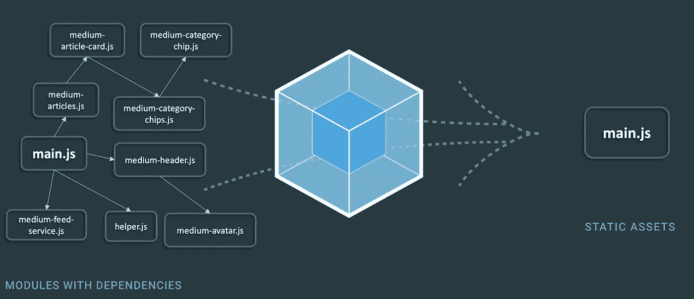
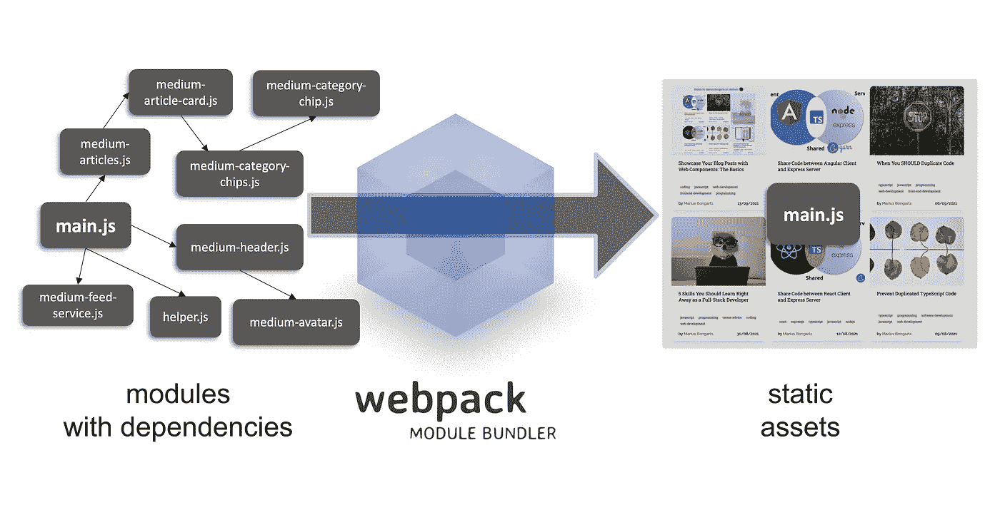
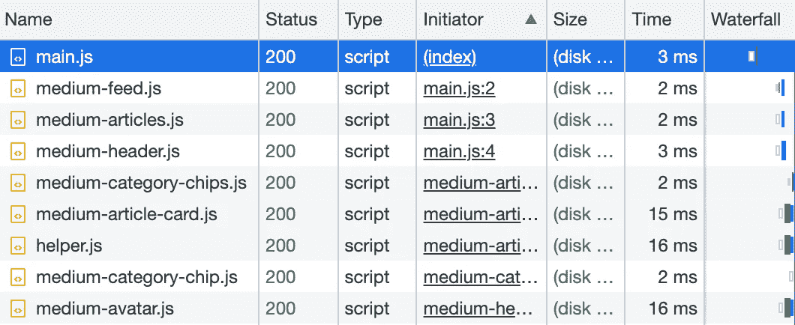
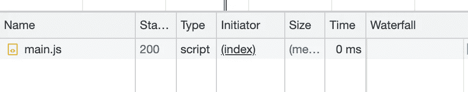

# 用 Web 组件构建自己的博客组合:Webpack

> 原文：<https://javascript.plainenglish.io/build-your-own-blog-portfolio-with-web-components-webpack-4f35c8e5d2a9?source=collection_archive---------7----------------------->

## 第 3 部分—使用 Webpack 捆绑 JavaScript 模块



Image based on: [https://webpack.js.org/](https://webpack.js.org/)

作为开发人员，我们都知道应该尽可能地重用代码。[重复代码](/dry-your-wet-typescript-code-e3c777b3daf9)是软件 bug 的主要原因之一，避免重复代码至关重要。Web 组件帮助我们创建具有封装功能的可重用标记结构。

在这一系列文章中，我们将通过将 Web 组件应用于一个示例来学习它们的基础和高级特性。我们将逐步开发一个投资组合，展示任何媒体用户的媒体文章。

1.  [*用 Web 组件构建自己的博客组合:基础知识*](https://medium.com/@mariusbongarts11/showcase-your-medium-articles-with-web-components-part-1-basics-d2c6618e9482)
2.  使用 Web 组件构建自己的博客组合:数据流(属性、道具、回调
3.  **使用 Web 组件构建自己的博客组合:Webpack**
4.  [用 Web 组件构建自己的博客文件夹 *:* 类型脚本](https://medium.com/@mariusbongarts11/build-your-own-blog-portfolio-with-web-components-typescript-adfbcd917d96)
5.  [用 Web 组件构建自己的博客组合:Lit Library](https://medium.com/@mariusbongarts11/build-your-own-blog-portfolio-with-web-components-lit-library-2701dffc735f)

# 简短介绍

在[第一篇](/showcase-your-medium-articles-with-web-components-part-1-basics-d2c6618e9482)中，我们已经了解了 Web 组件的三种主要技术:**自定义元素**、**阴影 DOM** 和 **HTML 模板**。我们应用这些概念来实现我们在[上一篇文章](https://medium.com/@mariusbongarts11/build-your-own-blog-portfolio-with-web-components-data-flow-6c1a8f09c252)中的应用。看看[现场试玩](https://mariusbongarts.github.io/medium-portfolio-1/)或者 [CodePen](https://codepen.io/marius2502/pen/gORmqJz) 。您可以使用这个 [GitHub 库](https://github.com/MariusBongarts/medium-portfolio-1)作为跟随本文的基础。

如果您成功地完成了这一系列文章，您应该已经有了**七个** JavaScript 文件，其中包含了我们的定制元素定义。那些是 JavaScript 模块，由其他模块导入。此外，我们有两个包含帮助函数的文件。

在本文中，我们将使用 webpack 捆绑我们的文件，使其只有一个静态 JavaScript 文件。



Bundling our JavaScript modules. (Image based on: [north.47.com](https://www.north-47.com/knowledge-base/webpack-the-good-the-bad-and-the-ugly/))

# 模块捆扎机

模块捆绑器是一个工具，它预处理 JavaScript 模块和资源，将它们捆绑到一个文件中。捆绑器允许我们将整个源代码(包括库)捆绑到一个或几个文件中。

## 为什么？

在开始时，我提到我们当前的应用程序包含 9 个 JavaScript 文件，它们是在应用程序渲染时加载的。同样，这意味着我们必须发出相同数量的 HTTP 请求来加载我们的模块。



Network requests to load JavaScript modules

让我们使用开发工具来看看我们的[演示应用程序](https://mariusbongarts.github.io/medium-portfolio-1/)的网络选项卡。

从我们的入门级模块`main.js`开始，每个 JavaScript 文件都被单独加载。发出一个一次性加载所有 JavaScript 的请求会更有效率。

有很多 JavaScript 捆绑器。以下是最受欢迎的几款手机的概述:

*   **网络包**
*   **esbuild**
*   **汇总**
*   **包裹**
*   **积雪场**

在本文中，我们利用 **Webpack** 将我们的模块组合成一个包。

# 网络包

Webpack 可能是最流行的 JavaScript 模块捆绑器。在内部，webpack 从一个或多个**入口点**构建一个依赖图，并将每个模块组合成更多的捆绑包，这些捆绑包是静态资产，用于提供您的内容。

> "就其核心而言，webpack 是现代 JavaScript 应用程序的静态模块捆绑器. "——[webpack.js.org](https://webpack.js.org/concepts/)

开箱即用，webpack 可以预处理 JavaScript 和 JSON 文件。它还可以安装额外的加载程序来处理其他文件类型。例如，在下面的文章中，我们将安装 *ts-loader* 来预处理 **Typescript** 文件。

> "开箱即用，webpack 只理解 JavaScript 和 JSON 文件."——[webpack.js.org](https://webpack.js.org/concepts/)

## 设置

让我们使用 webpack 捆绑我们的应用程序。首先，我们需要通过调用`yarn init`或`npm init`来创建一个`package.json`文件。

之后，我们将安装 webpack 作为开发依赖项:

```
yarn add -D webpack webpack-cli
```

或者

```
npm install webpack webpack-cli --save-dev
```

我们的`package.json`现在看起来是这样的:

package.json

另外，请注意将我们的模块与 webpack 捆绑在一起的`build`脚本。

## 配置

为了让我们的`build`脚本工作，我们必须通过创建一个`webpack.config.js`文件来配置我们的 webpack 配置。首先，让我们定义一个入口点来指示 webpack 应该从哪里开始构建它的内部依赖图:

Webpack configuration file

现在，剩下的唯一事情就是定义 webpack 应该在哪里发出这个包，以及如何命名它。让我们将我们的包命名为`main.js`，并将其放入`./dist`文件夹:

Webpack configuration file

## 建设

我们现在可以通过调用`yarn build`或`npm run build`来捆绑我们的模块。这将在我们的 dist 文件夹中创建捆绑的 JavaScript 文件`main.js`。



JavaScript modules bundled into one file.

查看我们新的[演示](https://mariusbongarts.github.io/medium-portfolio-3/)的 network 选项卡，我们可以看到只需要加载一个 JavaScript 文件来呈现我们的应用程序。

## 开发服务器

让我们安装 webpack dev 服务器来快速开发我们的应用程序，并在浏览器中直接看到我们的更改:

```
yarn add -D webpack-dev-server
```

此外，我们需要在`webpack.config.js`文件中配置我们的开发服务器，告诉 webpack 它应该从哪里为我们的静态文件提供服务。让我们将我们的`index.html`和`index.css`文件移动到一个`public`文件夹中，并相应地配置 webpack:

然后我们可以将一个`start`脚本添加到我们的`package.json`文件中:

Starts the webpack development server

我们现在可以运行`yarn start`或`npm start`，浏览器将在端口 8080 上打开我们的应用程序。我们的 JavaScript 文件中的更改将被直接应用，这使得开发我们的应用程序要快得多。

# 下一步是什么？

在本文中，我们学习了如何将 JavaScript 模块捆绑到一个文件中。在下一篇文章的[中，我们将使用 webpack 的 ts-loader 在我们的应用**中快速使用 Typescript。**之后，我们将重构我们的应用程序，使用小而快的 HTML 模板库](https://medium.com/@mariusbongarts11/build-your-own-blog-portfolio-with-web-components-typescript-adfbcd917d96) [**lit**](https://lit.dev/) **。**

1.  [*用 Web 组件构建自己的博客组合:基础知识*](https://medium.com/@mariusbongarts11/showcase-your-medium-articles-with-web-components-part-1-basics-d2c6618e9482)
2.  [用 Web 组件构建自己的博客组合:数据流(属性、道具、回调](https://medium.com/@mariusbongarts11/build-your-own-blog-portfolio-with-web-components-data-flow-6c1a8f09c252)
3.  使用 Web 组件构建自己的博客组合:Webpack
4.  [使用 Web 组件构建自己的博客文件夹 *:* 类型脚本](https://medium.com/@mariusbongarts11/build-your-own-blog-portfolio-with-web-components-typescript-adfbcd917d96)
5.  [用 Web 组件构建自己的博客组合:Lit 库](https://medium.com/@mariusbongarts11/build-your-own-blog-portfolio-with-web-components-lit-library-2701dffc735f)

我希望你能遵循这些步骤。也可以看看 [GitHub 库](https://github.com/MariusBongarts/medium-portfolio-3)。我总是很乐意回答问题，也乐于接受批评。请随时联系我😊

***关注我不要错过下一篇文章*** 🙏

[**这里是无限制访问媒体上每一个内容的链接**](https://medium.com/@mariusbongarts/membership) 。如果你用这个链接注册，我会赚一小笔钱，不需要你额外付费。

[](https://medium.com/@mariusbongarts/membership) [## 通过我的推荐链接加入 Medium-Marius bong arts

### 作为一个媒体会员，你的会员费的一部分会给你阅读的作家，你可以完全接触到每一个故事…

medium.com](https://medium.com/@mariusbongarts/membership) 

# 关于作者

Marius Bongarts 是埃森哲互动公司的软件工程分析师。他还创建了 [Web Highlights 扩展](https://chrome.google.com/webstore/detail/web-highlights-+-bookmark/hldjnlbobkdkghfidgoecgmklcemanhm)，允许用户在标签和目录的帮助下组织文本亮点和书签。

通过**[**LinkedIn**](https://www.linkedin.com/in/marius-bongarts-6b3638171/)**与我联系。****

**[](/showcase-your-medium-articles-with-web-components-part-1-basics-d2c6618e9482) [## 用 Web 组件构建自己的博客组合:基础

### 第 1 部分—定制元素、阴影 DOM 和 HTML 模板

javascript.plainenglish.io](/showcase-your-medium-articles-with-web-components-part-1-basics-d2c6618e9482) [](/5-skills-you-dont-get-around-to-learn-as-a-fullstack-developer-409f13c394c7) [## 作为全栈开发人员，你应该马上学会的 5 项技能

### 现在就学习吧，你会后悔错过的

javascript.plainenglish.io](/5-skills-you-dont-get-around-to-learn-as-a-fullstack-developer-409f13c394c7) [](/5-more-skills-you-should-learn-right-away-as-a-full-stack-developer-4cb6f935671) [## 作为一名全栈开发人员，你应该马上学会的另外 5 项技能

### 现在就学习它们；你会后悔耽搁了它

javascript.plainenglish.io](/5-more-skills-you-should-learn-right-away-as-a-full-stack-developer-4cb6f935671) [](/when-you-should-duplicate-code-b0d747bc1c67) [## 何时应该复制代码

### 复制比错误的抽象要便宜得多

javascript.plainenglish.io](/when-you-should-duplicate-code-b0d747bc1c67) 

*更多内容看*[***plain English . io***](http://plainenglish.io/)**