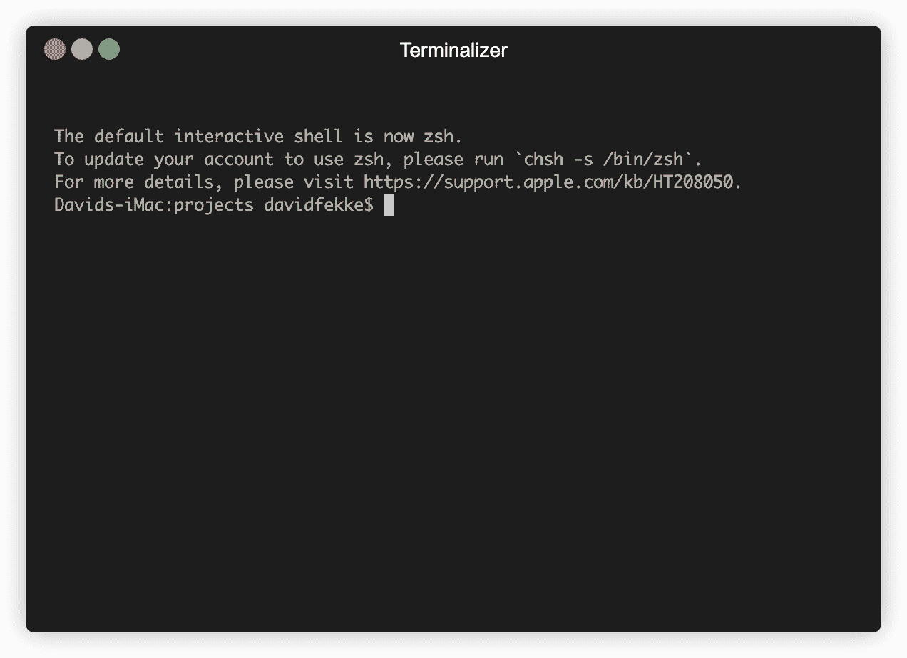

# 在 Node.js 中构建自己的开发人员工具

> 原文：<https://javascript.plainenglish.io/build-your-own-developer-tools-in-node-js-7dab8328e582?source=collection_archive---------14----------------------->

使用 Node.js 来构建可以为命令行快速构建的开发人员工具。


Photo courtesy of Cesar Carlevarino on Unsplash

*最初发布于*[*https://fek . io*](https://fek.io/blog/build-your-own-developer-tools-in-node-js)*。*

几年前，我向 JaxNode 用户组做了一个关于构建自己的工具的演示。作为用户，经常会发现自己一遍又一遍地重复同样的命令。在软件开发中，你经常听说[坚实的原则](https://www.baeldung.com/solid-principles)。其中一个原则是干原则，代表不要重复自己。

如果你不想重复自己是一个开发者，为什么你会想做一个用户呢？这也是我自己搭建工具的原因之一。以下是我在构建自己的工具时遇到的一些任务示例。

*   我创建了一个命令行工具，用于为 iOS 和 Android 应用程序生成缩略图
*   我还创建了一个工具，为新的博客文章生成一个 markdown 文件夹
*   然后我创建了一个工具来生成一个新的 Node.js 项目

# 命令行工具

我已经使用了几个不同的框架来用 Node.js 创建命令行工具。您不必使用 node . js。Python 和 Shell 脚本也很流行用于创建命令行工具。甚至可以用 c。

当使用 Node.js 作为命令行工具时，有两个流行的框架。第一部走红的是 TJ Holowaychuk 的[指挥官](https://github.com/tj/commander.js)。Commander 仍然是一个非常流行的框架。

# 奥克里夫

最近一直在用 [Oclif](https://oclif.io) 。这是由 Heroku 为他们的命令行工具开发的。他们的母公司 Salesforce 随后用它打造了 SFDX。

Oclif 功能丰富，能够创建多个命令，添加插件，并使用 TypeScript 或 JavaScript 来开发您的实用程序。在本文中，我将使用 Oclif 作为例子。

# 在 Node.js 中创建新应用程序

当我测试一个我可能想要使用的新 NPM 包或者测试 Node.js 中的一个新 JavaScript 特性时，我通常会做一些事情来建立一个新项目。我经历的任务通常如下:

1.  创建一个目录并切换到该目录
2.  使用 NPM 初始化一个新项目
3.  创建自述文件
4.  创建一个. gitignore 文件
5.  为我的应用程序的启动创建一个 index.js 文件
6.  初始化 git repo，并提交所有文件

如果我在 shell 中从命令行执行所有这些命令，它将如下所示；

在做了足够多的次数之后，我决定创建一个命令行工具来生成一个新项目。

您可以使用`npx`生成一个新的 oclif 应用程序。Oclif 为您提供了单命令或多命令工具的选项。对于我们的示例应用程序，我们将只使用一个命令。

```
> npx oclif single mytestconsole
```

这将生成一个具有以下目录结构的新项目；

```
MYTESTCONSOLE
--bin
  --run
  --run.cmd
--node_modules
--src
  --index.js
.editorconfig
.gitignore
package-lock.json
package.json
```

`index.js`文件将包含设置和命令行应用程序的主要入口点。

从上面生成的文件中可以看到，它包含一个用异步`run`函数扩展命令类的类。它还包含描述和标志配置。`run`功能是我们控制台 app 的主要功能和起点。

`description`属性是 oclif 的自文档部分的一部分。您在该属性中输入的任何文本都将显示在应用程序的帮助中。

`flags`对象属性是您配置不同标志的地方，用于从命令行控制逻辑。

# SetupNodeProject (snp)

对于我的`Setupnodeproject`应用程序，我添加了一个标志，用于在生成新应用程序时创建新文件夹。最终的对象定义将如下所示；

正如你在上面的例子中看到的,`folder`标志被定义为一个布尔值。如果用户不使用该标志，它将默认为 false。

现在我们需要定义创建文件夹的函数。

为了创建这个文件夹，我使用 Node.js fs/promises 模块，并在我的“index.js”文件的开头需要它。

```
const fsPromises = require('fs/promises');
```

为了创建`.gitignore`文件，我将从我的项目的根级别的一个模板中复制它。

对于其余的命令，我需要使用 Node.js 中的`exec`模块来对系统执行命令行工具。为此，我将创建一个异步函数，它可以执行我的命令。

`execPromise`函数是一个返回承诺的箭头函数。在 JavaScript 中，承诺和异步/等待函数是可以互换的。现在我可以在我的`createGitIgnore`函数中使用这个函数了。

从上面的函数中我们可以看到，我们执行了`npm init -y`命令。这将生成 package.json 文件。我想做一个小的修改，允许我使用 Node.js 中可用的导入/导出语法。我需要添加一个值为“module”的“type”键。为此，我将使用以下函数:

我需要做的最后三件事是创建一个空白的“index.js”文件，一个“README.md”文件，并初始化 git 存储库，以便将我的项目保存到 git 源代码控制中。

现在我们可以从`run`函数中调用所有这些函数来创建我们的应用程序。

如果您查看我们创建文件夹的逻辑，我有一个命令将工作目录更改为我们刚刚创建的目录。如果我们没有为我们的新应用程序创建目录，我们可以让工作目录保持不变，这样它就可以使用与我们运行命令行时相同的目录。

我们甚至可以通过 NPM 在全球安装来测试和运行它。

```
> npm i -g
```

我可以在 [Github](https://github.com/davidfekke/setupnodeproject) 上查看这个当前的项目。

[](https://github.com/davidfekke/setupnodeproject) [## davidfekke/setupnodeproject

### 通过在 GitHub 上创建帐户，为 davidfekke/setupnodeproject 开发做贡献。

github.com](https://github.com/davidfekke/setupnodeproject) 

已经有很多不同的项目用于生成一个节点项目。一个受欢迎的项目叫做约曼，或“约”。但是正如你所看到的，使用 Node.js 创建我们自己的自动化工作流工具是非常容易的。



Creating a simple Node.js project using ‘snp’

*更多内容尽在*[*plain English . io*](http://plainenglish.io/)