# 用 Node.js 从头开始构建自己的代理服务器

> 原文：<https://javascript.plainenglish.io/build-your-own-forward-and-reverse-proxy-server-using-node-js-from-scratch-eaa0f8d69e1f?source=collection_archive---------2----------------------->

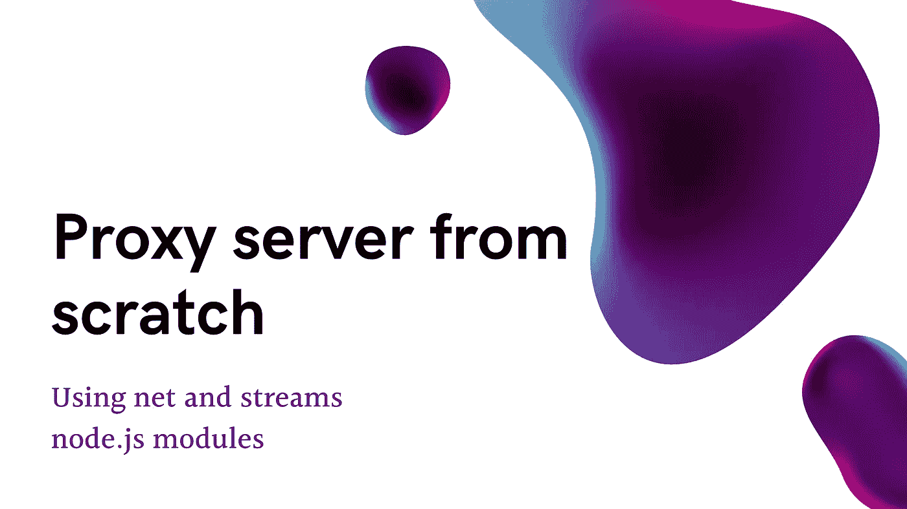

代理是客户端和整个互联网之间的网关。但是代理有几个用例。例如:如果你在一个公司网络中，有 99%的可能性你在一个代理后面，这个代理通过允许和限制你能访问什么和不能访问什么来控制你对互联网的访问。这种代理被称为*转发代理。*

如果我们讨论服务器端，假设您有一个应用程序部署在一些服务器上，并暴露在 internet 上，但您希望实现一个中间人来防止您的应用程序服务器直接暴露在 internet 上，您可能希望有一个代理服务器，它可以从 internet 上的客户端接收请求，并将它们转发到您的应用程序服务器，然后将响应发送回它们。这种代理被称为*反向代理*。

# 前向代理的概念

我们通过一个简单的例子来理解这一点。你在一家拥有计算机 A、B 和 C 的公司，这些计算机想要访问网站 X，但是为了公司安全，管理员已经阻止了对因特网的直接访问，但是他已经设置了代理服务器 P，通过该代理服务器可以访问因特网。

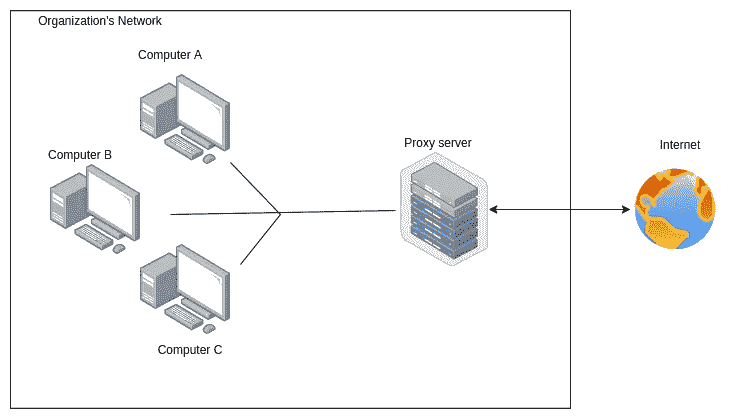

Forward proxy graphical representation

上述场景中的代理服务器是*转发代理*服务器。

# 反向代理的概念

假设你是一个客户端 C，正在访问一个网站 w。但是网站管理员阻止了对服务器的直接访问，并实现了一个代理 P，它接收来自你的请求并将其转发给实际的服务器，然后接收它们的响应并发送给你。您以为您是在直接访问网站 C -> W，但实际上，您是在访问代理服务器，而代理服务器又将您的请求转发给实际的应用服务器，即 C -> P -> W。表示如下:

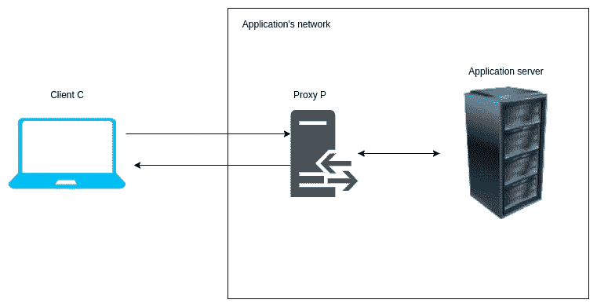

Reverse proxy graphical representation

上面场景中提到的代理服务器是*反向代理*服务器。

# 代理服务器编码

**完整代码可以在 github 找到:**[**https://github.com/kasattejaswi/nodejs-proxy-server**](https://github.com/kasattejaswi/nodejs-proxy-server)

理论讲够了，让我们直接进入代理服务器的编码。对于开发，我们将使用网络的某些 node.js 内置模块。第一个是**网络模块，**第二个是**流模块。**在继续编码之前，先看一下这些模块是很重要的。有关这些模块的文档和精确解释，您可以参考以下链接:

## 网络模块:

1.  官方文件:[https://nodejs.org/api/net.html](https://nodejs.org/api/net.html)

## 流模块:

1.  官方文件:[https://nodejs.org/api/stream.html](https://nodejs.org/api/stream.html)
2.  很干脆的解释:[https://www . freecodecamp . org/news/node-js-streams-everything-you-need-to-know-c 9141306 be 93/](https://www.freecodecamp.org/news/node-js-streams-everything-you-need-to-know-c9141306be93/)

现在，为了开始，请确保您的系统中已经安装了 node.js，并且所有 IDE 都已准备好。

首先，我们将把 net 模块导入到代码中，并调用 createServer()

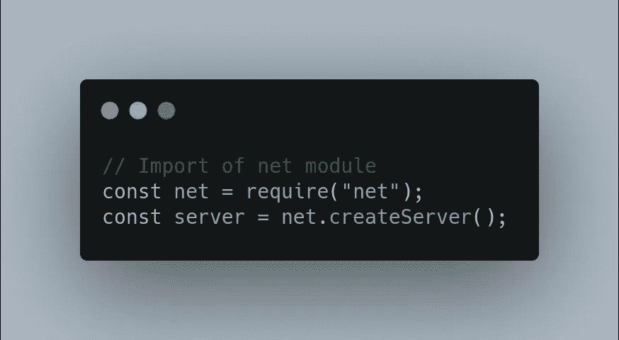

一旦我们的服务器被初始化，我们可以监听 0.0.0.0 主机(用于接受来自所有 IP 的传入请求)和 8080 端口，并且在回调中，我们可以记录服务器正在 0.0.0.0:8080 上运行

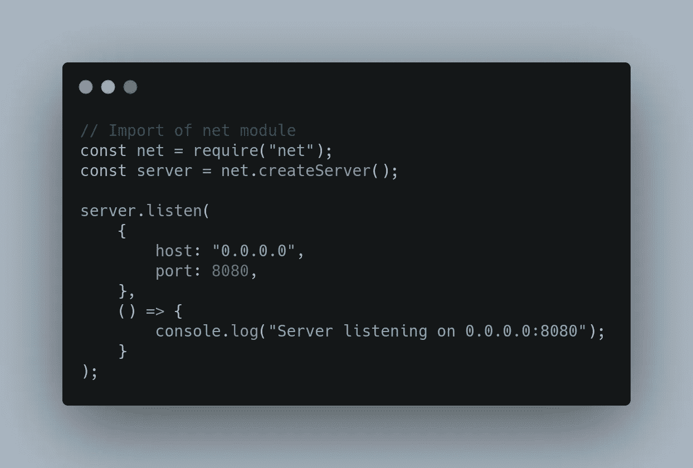

每当新的请求到达服务器时，Net 模块就触发某些事件。现在我们要监听“连接”、“错误”和“关闭”事件。对于这些，我们来补充一些听众。

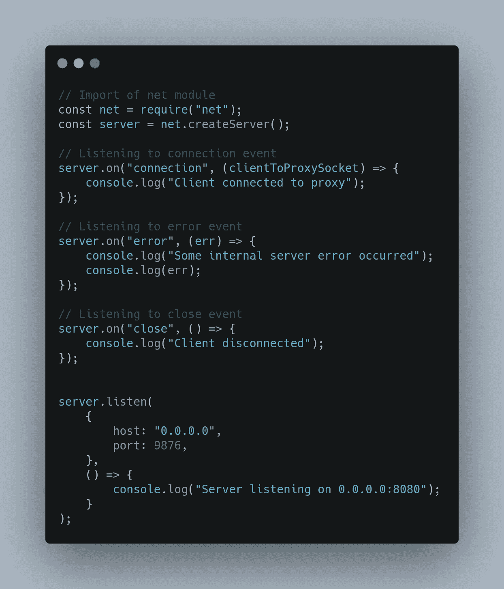

连接事件为我们提供了一个 socket 对象，其中包含了服务器捕获的请求的详细信息。错误事件为我们提供了一个在回调中传递的错误。所以在上面的例子中，我们已经记录了数据。

在上面的代码中，一旦收到数据，clientToProxySocket 还会触发一个事件“data”。对于每个请求，因为我们只需要获取一次数据，所以我们将只监听一次“数据”事件，只监听第一次，并从中收集足够的数据。

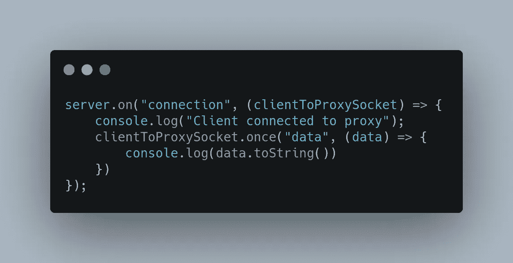

至此，我们已经设置了一个简单的服务器，它将接收请求并在控制台中打印请求的详细信息。为了测试它，我们需要首先设置我们的测试环境。

## 设置测试环境

为此，我将使用 Mozilla Firefox。然而，您可以使用任何浏览器，程序将是相同的。

在地址栏中，输入 about:preferences，一个设置页面就会打开

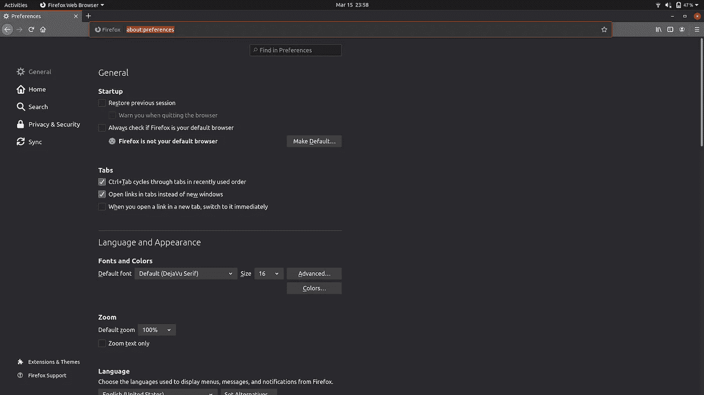

在搜索框中搜索代理，代理选项将被过滤掉。

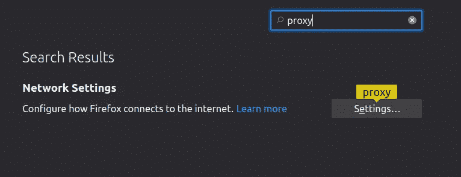

点击设置，代理设置页面将会打开。选择“手动代理配置”。在中，对于 HTTP 代理，将本地主机和端口指定为 8080，并选中“也将此代理用于 FTP 和 HTTPS”复选框。它们现在看起来会像这样。

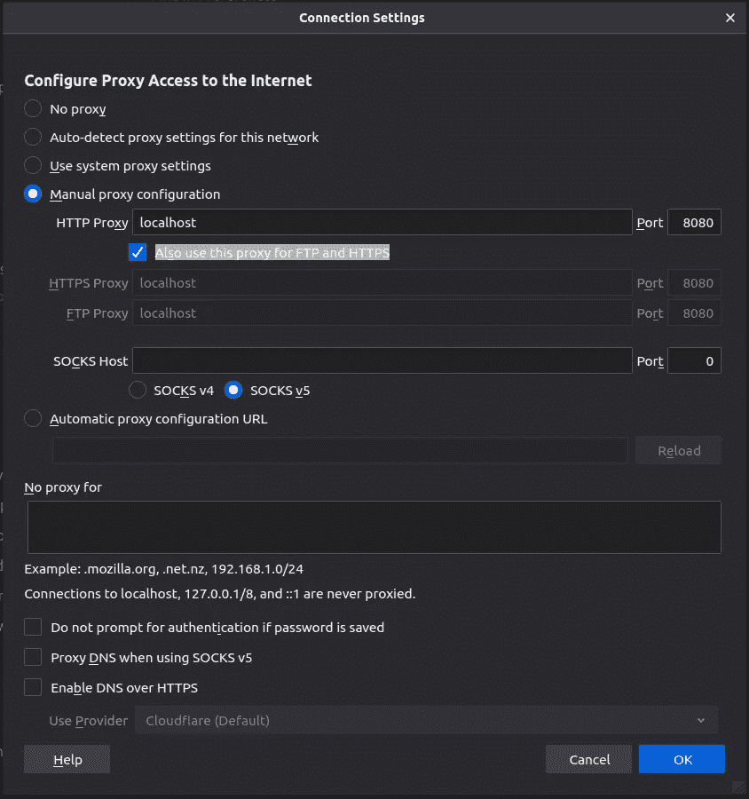

单击 OK，您就完成了测试环境的设置。

## 获取请求详细信息

现在，既然我们的基本服务器和测试环境已经准备好了，让我们第一次运行它，看看我们在请求中得到什么细节。我们将发出两个请求——一个是 http，另一个是 https。

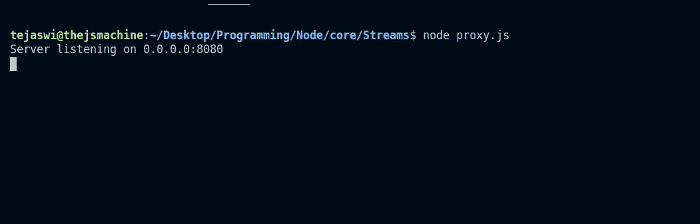

Running our server file named proxy.js in console

正如您在这里看到的，我们的服务器监听日志现在已经打印出来了，可以接受传入的请求了。

为了测试，我们将使用 linkedin.com 作为 http 和 https URL。

当我们进入 linkedin.com 时，我们得到了以下数据:

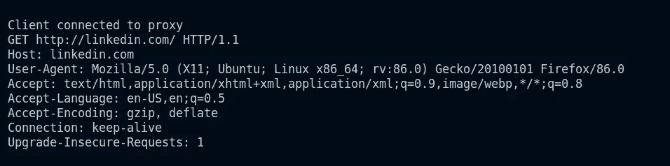

Data on entering linkedin.com in firefox

现在，让我们试试 https://linkedin.com 的[。](https://linkedin.com.)我们得到了以下数据:

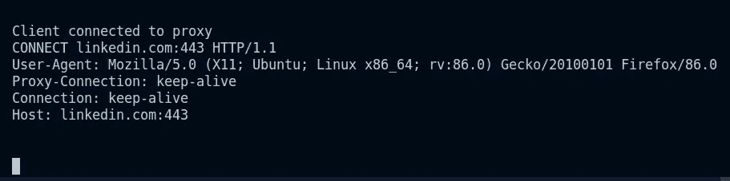

Data on entering https://linkedin.com in firefox

这里，两个请求有一个主要的不同。对于 http，我们得到了地址中包含 http 的 GET 请求。对于 https，我们使用 443 端口号进行连接。因此，我们将使用它来检查请求是 http 还是 https，并相应地分配端口。我们将假设目标网站遵循标准方法，使用端口 80 进行 http 连接，使用端口 443 进行 https 连接。我们现在不会涉及自定义端口，但可以通过类似的方式获得它们。

到目前为止，如果你检查你的浏览器窗口，页面将继续加载和加载，并最终超时，因为它从来没有得到我们的代理服务器的响应。

为了检查连接是 http 还是 https，我们将使用请求中的连接字符串。让我们添加代码。

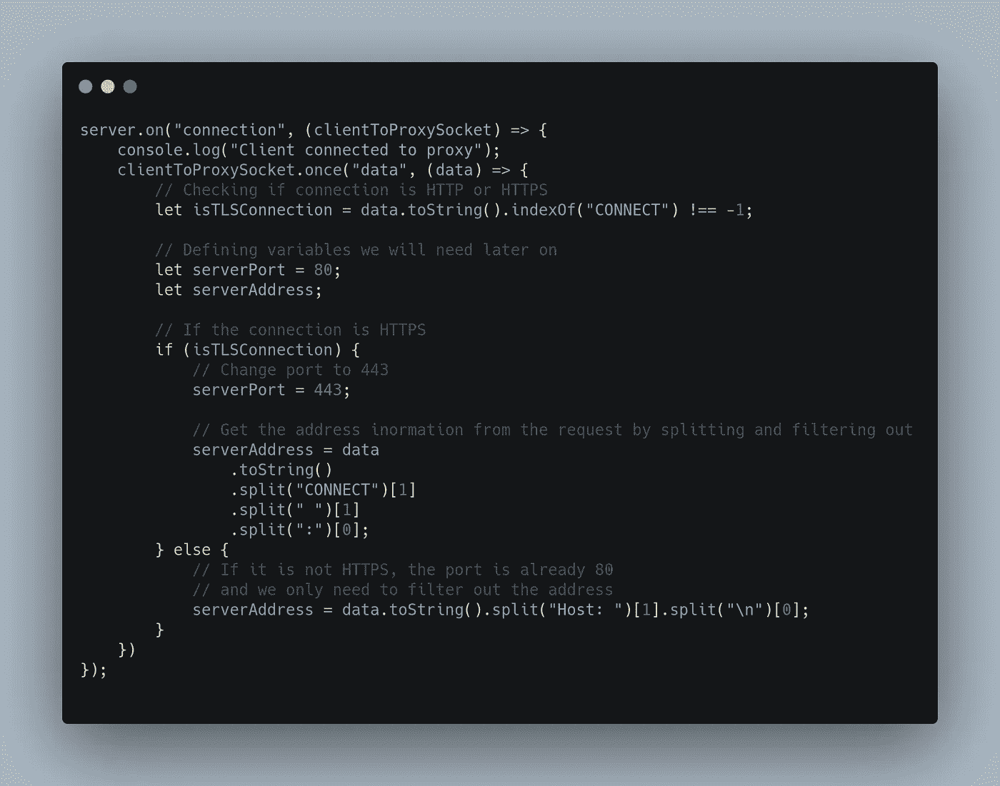

Further code for fetching address and port details from request

至此，我们已经获得了将请求转发到目的地的所有必要信息。但是怎么做呢？答案是 node.js streams。如果我们谈论从客户端到代理服务器的请求，它是一个*可读流*，如果我们谈论到目的地的代理，它是一个*可写流*。但是当数据从目的地接收到代理时，它将是一个*可读流*，然后当它从代理服务器发送回客户端时，它将是一个*可写流*。如果我们执行管道，我们可以将请求转发到两端。

因此，让我们从使用 createConnection()方法创建一个从代理服务器到目的地的连接开始，使用 net 模块和我们从客户机请求中提取的主机和端口。

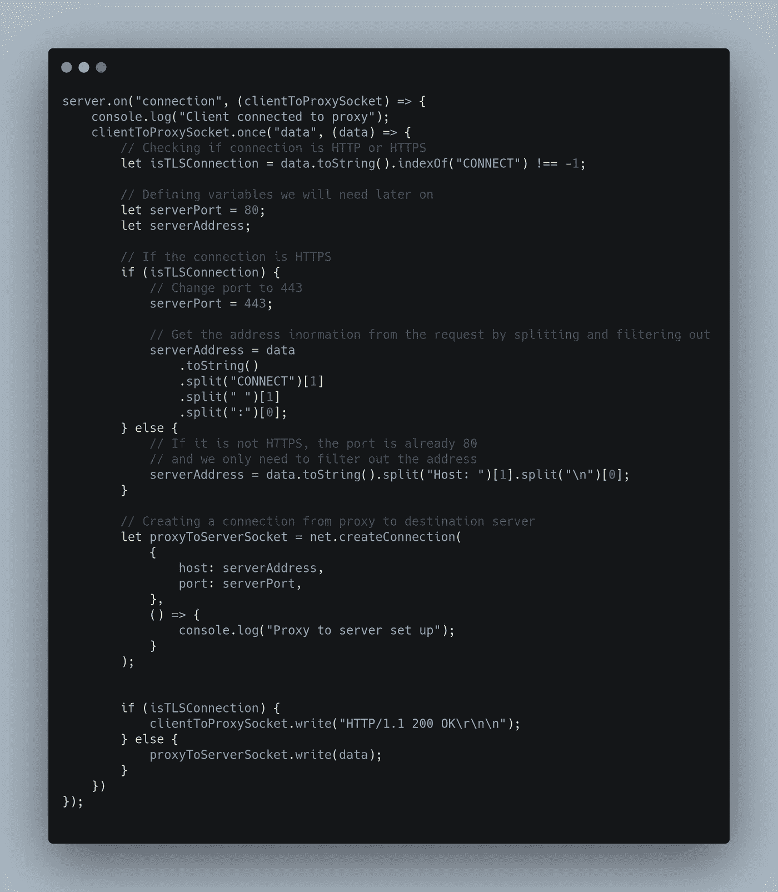

现在，我们可以简单地通过管道传输流，并捕获客户端到代理和代理到目的地的任何错误。

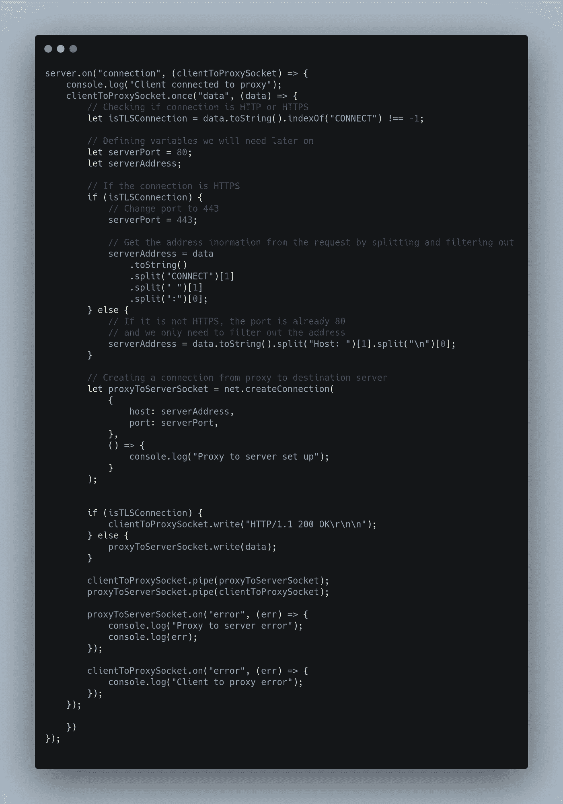

仅此而已。我们成熟的代理服务器已经准备好了。

让我们现在运行它并访问我们的网站。

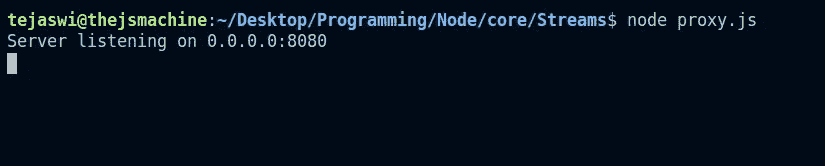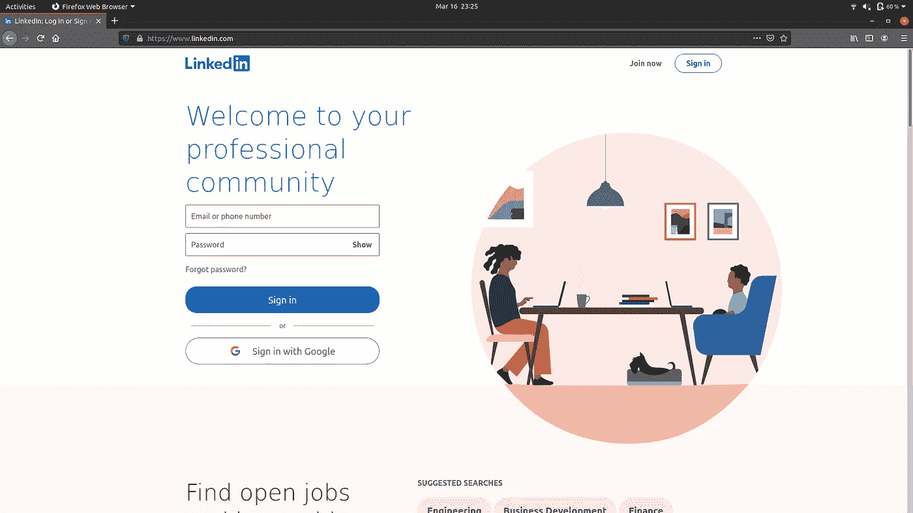

Linkedin 页面已成功打开。如果我们看到控制台，我们正在打印大量的请求。

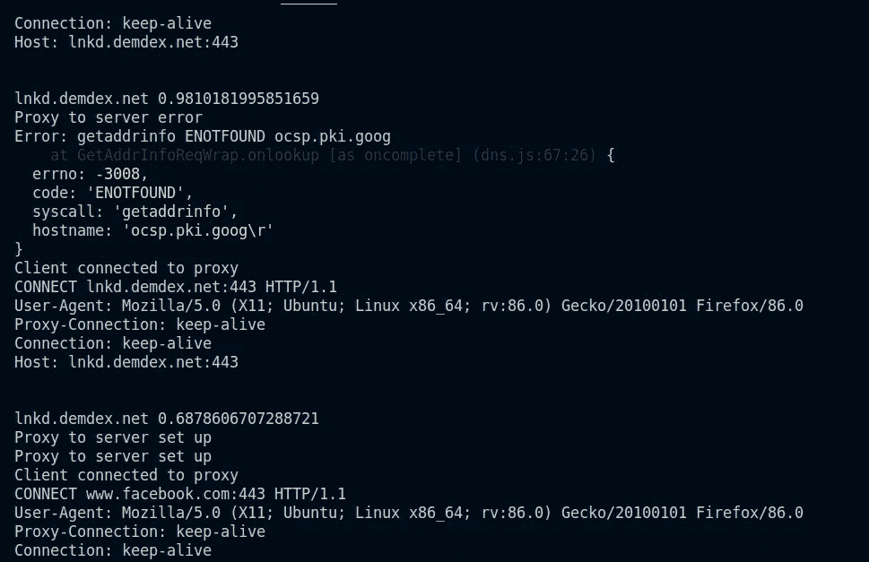

这表明我们的代理服务器工作正常。在这段代码中，我们还可以做更多的增强。我们可以通过在服务器上运行它并相应地定制它来将其用作反向代理。

完整的代码可以在 github 找到:[https://github.com/kasattejaswi/nodejs-proxy-server](https://github.com/kasattejaswi/nodejs-proxy-server)

*感谢您阅读本文，如果您想阅读更多关于 JavaScript 的文章，请不要忘记关注:*[*https://thejsway.medium.com/*](https://thejsway.medium.com/)

## 进一步阅读

 [## 如何将代理与 Python 请求集成

### 本教程将向您展示如何使用代理服务器来利用 Python 请求模块。为了避免他们的 IP…

简明英语. io](https://plainenglish.io/blog/how-to-integrate-proxy-with-python-requests) 

*更多内容请看*[***plain English . io***](https://plainenglish.io/)*。报名参加我们的* [***免费周报***](http://newsletter.plainenglish.io/) *。关注我们关于*[***Twitter***](https://twitter.com/inPlainEngHQ)*和*[***LinkedIn***](https://www.linkedin.com/company/inplainenglish/)*。查看我们的* [***社区不和谐***](https://discord.gg/GtDtUAvyhW) *加入我们的* [***人才集体***](https://inplainenglish.pallet.com/talent/welcome) *。*