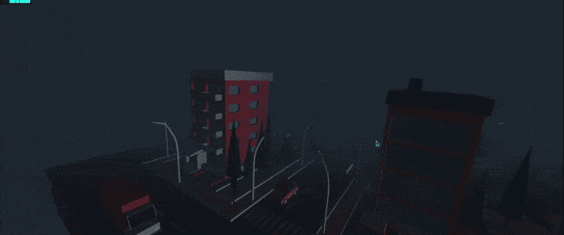
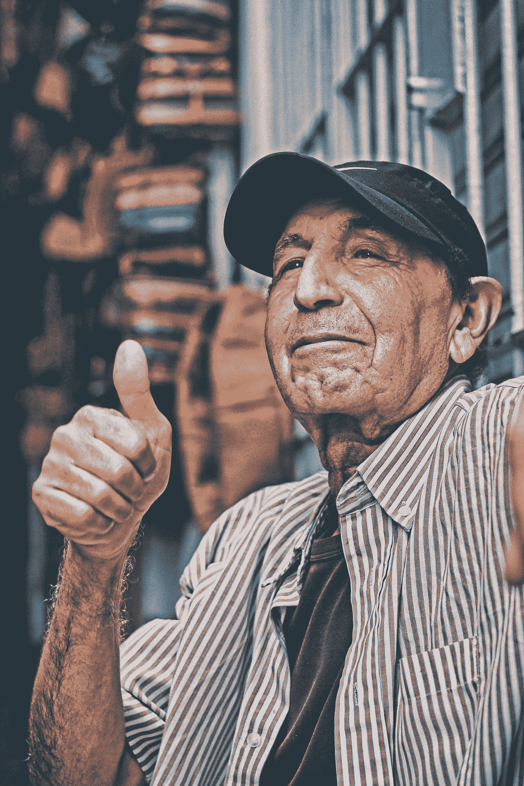

# 用 JavaScript 构建你自己的鬼城

> 原文：<https://javascript.plainenglish.io/build-your-own-ghost-city-in-javascript-dc08260b796a?source=collection_archive---------11----------------------->

利用 GSAP 和 Three.js 的力量来建造自己的城市。



Three.js 和 GSAP 是用 JavaScript 创建高度互动网站的最好的库，对于那些使用 Flex boxes 和 CSSGrid 以及其他 CSS3 动画的人来说，GSAP 和 three.js 的结合就像魔术一样。

在你的职业生涯中，应该有一段时间，你应该从正常的布局走向前进，思考如何最大限度地发挥你内心的创造力。

**我们用来在浏览器中实现这种效果的高级工具**

首先，我们有一个非常基本的场景，我们添加了一些灯光，包括环境光和平行光，以及加载到我们的应用程序中的纹理，这是一个 GLTF 3d 模型，这是可以导入到我们的 three.js 应用程序中的许多 3d 结构之一。

提示:如果你决定从互联网上获取一些东西，事先使用某种可视化工具来查看你的 3D 模型，否则这将是毫无意义的调试，可能会试图修复你的代码，而不是发现模型是问题所在。

在加载了 GLTF 模型后，感谢 three.js 文档，这是一个很棒的网站，有很棒的工作示例和实际使用案例和样本。

**让我们过一遍这些步骤，我们只用很少几行代码就能实现这种 3d 效果。**

```
var w = window.innerWidth;
var h = window.innerHeight;
var container, stats;
var camera,
  controls,
  scene,
  renderer,
  boxes = [];
```

# **1。渲染器**

创建一个基本的渲染器，它可以用于任何类型的 Three.js 设置。

```
renderer = new THREE.WebGLRenderer({ antialias: true });
renderer.setPixelRatio(window.devicePixelRatio);
renderer.setSize(w, h);
container = document.getElementById("container");
container.appendChild(renderer.domElement)
```

# **2。相机**

我们使用透视相机来模拟人眼的深度处理和角度等等。

```
// camera
  camera = new THREE.PerspectiveCamera(60, w / h, 1, 1000);
  camera.animAngle = 0;
  camera.position.x = Math.cos(camera.animAngle) * 400;
  camera.position.y = 180;
  camera.position.z = -400;
```

# **3。场景**

我们的场景将在这个设置中运行，我们的摄像机将在 UI 中查看。

```
scene = new THREE.Scene();
  scene.fog = new THREE.FogExp2(0x1e2630, 0.002);
  renderer.setClearColor(scene.fog.color);light = new THREE.DirectionalLight(0xfffffff);
  light.position.set(-1, -1, -1);
  scene.add(light);
  light = new THREE.AmbientLight(0x222222);
  scene.add(light);
```

# 4.GLTF 是我们城市的榜样

我们将与之互动并基于我们的互动而移动的城市。

```
const loader = new THREE.GLTFLoader();
  loader.load(
    "[https://threejsfundamentals.org/threejs/resources/models/cartoon_lowpoly_small_city_free_pack/scene.gltf](https://threejsfundamentals.org/threejs/resources/models/cartoon_lowpoly_small_city_free_pack/scene.gltf)",
    function (object) {
      object.scene.scale.x = 0.5;
      object.scene.scale.y = 0.5;
      object.scene.scale.z = 0.5;
      scene.add(object.scene);
    }
  );
```

# 5.用户交互滚动(GSAP)

有不同的方式与我们的 3D 世界互动，我选择的是添加一个由 GSAP GSAP 提供的滚动触发著名插件，如果你不知道，这是一个惊人的库，用于处理动画，时间线，插值和类似的东西。它不仅仅是生产就绪，而且已经在许多高质量的网站中被证明是健壮的。

Three.js 也有自己的内置控件。

```
gsap.registerPlugin(ScrollTrigger);
gsap.to(camera.position, {
    x: "-=460",
    z: "+=200",
    y: -10,
    ease: "Power2.easeInOut",
    scrollTrigger: {
      trigger: renderer.domElement,
      start: "top top",
      end: "+=100%",
      pin: true,
      scrub: true,
    },
    onUpdate: function () {

    },
  });
  gsap.to(camera.rotation, {
    y: 2,ease: "Power2.easeOut",
    scrollTrigger: {
      trigger: renderer.domElement,
      start: "top top",
      end: "+=100%",
      pin: true,
      scrub: true,
    },
    onUpdate: function () {

    },
  });
```

一个动画用于制作摄像机位置的动画，另一个用于制作旋转的动画，从而产生无人机效果。

# 6.重新播放动画

我们有办法再次运行动画来渲染新的帧。

```
function animate() {
  requestAnimationFrame(animate);
  renderer.render(scene, camera);
}
```

我还添加了一些雾来提供更真实的效果。

就这样



Photo by [Aziz Acharki](https://unsplash.com/@acharki95?utm_source=medium&utm_medium=referral) on [Unsplash](https://unsplash.com?utm_source=medium&utm_medium=referral)

完整脚本

包含所有依赖项的 HTML 文件

只用很少的几行代码，我们就可以实现这个很酷的效果，代码非常直观，不像我们为图形渲染编写自己的颜色。

快乐的编码和忙碌！！！

*更多内容尽在*[*plain English . io*](http://plainenglish.io/)