# 用 Ably 和 AWS 构建您自己的实时聊天 Web 组件

> 原文：<https://javascript.plainenglish.io/build-your-own-live-chat-web-component-with-ably-and-aws-62fc8cadcbcd?source=collection_archive---------12----------------------->

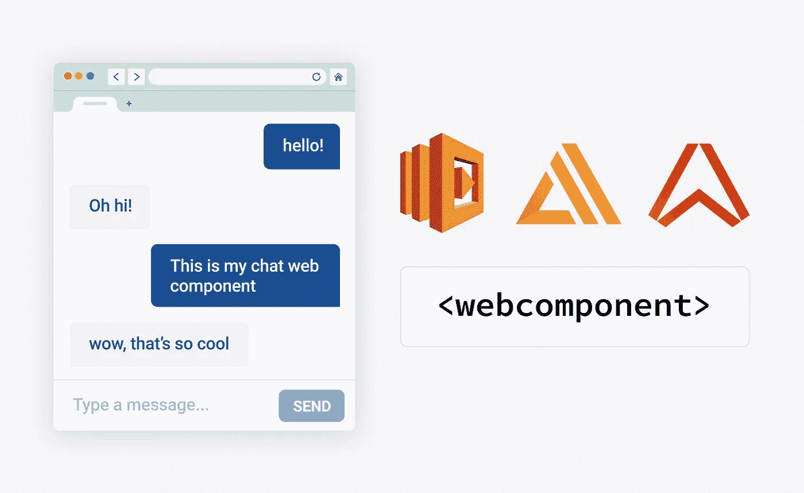

Web 组件是构建可在不同网页和 web 应用程序中使用的可重用功能的好方法。想象一下在 React、Vue.js 或 Next.js 等不同框架之间共享组件！在这篇文章中，我们将深入研究 web 组件，并向您展示如何使用 Ably 构建一个聊天 Web 组件，以及如何在使用 AWS Amplify 和 AWS Lambda 构建的应用程序中使用它。

Web 组件是 web 技术的集合，在浏览器中标准化，以简化可重用标记和功能的编写。它们是定制元素、[阴影 DOM](https://developer.mozilla.org/en-US/docs/Web/Web_Components/Using_shadow_DOM) 和 [HTML 模板](https://developer.mozilla.org/en-US/docs/Web/API/HTMLTemplateElement)的组合。当它们一起使用时，它们被统称为 [Web 组件](https://developer.mozilla.org/en-US/docs/Web/Web_Components)。Web 组件是特定于框架的组件重用方法(如 React 组件和 Vue.js 模板)的替代方法。Web 组件很有趣，因为它们没有绑定到任何运行时框架，并且所有现代浏览器都支持它们。web 组件的竞争方法是在 Web 组件被广泛支持之前建立的，这导致许多框架开发了自己的重用和封装方法。Web 组件提供了一种独立于框架的方式来为浏览器构建可重用的功能。

当谈到 Web 组件时，大多数人指的是自定义 HTML 元素，因为它们是最接近 React 或 Vue 中的组件模型的东西。自定义元素可以:

*   通过设置自己的 innerHTML 属性来呈现 HTML。
*   通过将数据存储为自身实例的属性来封装数据。
*   跟踪存储在其属性中的数据的变化，并触发重新渲染。
*   允许您编写在 DOM 中添加和删除它们时触发的代码。

在这篇文章中，我们要做的第一件事是创建一个自定义元素的例子，显示一个按钮被点击的次数。为了创建这个定制元素，我们需要创建一个新的 JavaScript 文件，我们可以从我们的 web 页面引用它。首先创建一个名为 *index.js* 的新文件。我们将为定制元素定义一个类，并将其命名为`CountComponent`。这将扩展 HTMLElement(浏览器所有元素的基本类型):

在这个类中，我们需要为`change tracking`定义要观察的属性。为了这个演示，我们将返回一个单字符串的数组——属性名`count`:

接下来，我们需要定义一些定制属性及其行为。我们为自定义的“计数”属性创建了一个`getter`，在函数中，属性值`count`被加载了一个对`getAttribute`的调用，默认为*字符串* `"0"`。一旦数据被加载，我们就从 JSON 解析它——我们这样做是因为我们存储的任何数据都必须是字符串。

我们还需要为我们的属性创建一个 *setter* ，这里我们将值序列化为 JSON 并在我们的元素上设置它:

尽管自定义元素被定义为类，但是除了调用`super`来触发 HTML 元素类的基本逻辑之外，不能将任何逻辑放入它们的构造函数中。*添加任何其他逻辑，或者错过调用 super，您将在控制台中看到一个错误，元素将无法工作*。

因为我们不能在构造函数中做任何有意义的工作，定制元素提供了[生命周期回调](https://developer.mozilla.org/en-US/docs/Web/Web_Components/Using_custom_elements#using_the_lifecycle_callbacks)——可以在组件生命周期的不同部分实现的功能。我们将使用`connectedCallback`功能。实现这个回调将导致代码在组件被添加到 DOM 时运行——这类似于 React 的`componentDidMount`函数。在 connectedCallback 中，我们为计数器设置了一个默认值，并调用了一个函数，我们稍后将会看到这个函数叫做`setContent`:

我们可用的下一个生命周期回调函数是`disconnectedCallback`(这里显示只是为了说明，因为我们没有运行任何代码)。当您的元素从 DOM 中移除并销毁时，这个函数中的代码就会执行。

自定义元素也为我们提供了一个`attributeChangedCallback`。每当`observedAttribute`改变时，我们将使用该函数执行代码:

`setContent`是一个函数，当组件被添加到 DOM 时，以及当更新发生时，组件调用该函数。上面代码中的 click 处理程序可以使用`this`关键字访问元素的属性，所以每次单击，我们都会增加值，从而触发重新呈现。*注意:这个演示并不特别关注性能，因为它设置了整个 innerHTML，并在每次调用按钮时连接一个 click 处理程序。这不是我们构建生产应用程序的方式！在实际的应用程序中，您不会重置整个 DOM。相反，您只需更改 UI 中需要更新的部分。此外，*[*Shadow DOM API*](https://developer.mozilla.org/en-US/docs/Web/Web_Components/Using_shadow_DOM)*可以用于对性能更敏感的场景。*

最后，在 JavaScript 文件的末尾，我们调用浏览器的[custom elements . define API](https://developer.mozilla.org/en-US/docs/Web/API/CustomElementRegistry/define)——为元素提供一个标记名，并引用我们刚刚定义的类。

现在可以将自定义元素 JavaScript 文件作为一个模块引用，并使用我们定义的标记名将我们刚刚创建的元素添加到页面中:

并且该组件呈现如下:

我们将通过构建*两个*定制元素来构建一个文本聊天组件——Ably Chat 组件:

*   js——封装交互的基础组件
*   AblyChatComponent.js —继承自 AblyBaseComponent 并在 Ably 之上实现聊天逻辑的元素。

基本组件被严格设计为构建在 Ably API 密钥管理和订阅通道的基础之上，并且封装了 Ably API 密钥管理和订阅通道的基本需求。使用这个基础组件，我们可以构建任何依赖于实时消息传递的定制元素。

为了连接到 Ably，你需要一个 Ably 账户和一个 API 密匙。

# 构建基础组件

基本组件从标准定制元素样板开始— AblyBaseComponent 扩展 HTMLElement，并调用其构造函数。

在 connectedCallback 函数中，我们调用`this.connectToAblyChannel`(我们将很快对此进行研究):

disconnectedCallback 函数循环通过`this.subscribedChannels`(我们将在`connect`函数中创建)并取消订阅任何已使用的 Ably 频道:

`connectToAblyChannel`函数是大量实际工作发生的地方。我们从加载一些配置开始——我们将建立一个约定，我们期望用户提供*他们的 Ably API 密钥，或者一个 API 的回调 URL，该 API 使用 Ably 令牌认证请求进行响应。为了提供这些值，并且因为我们正在创建 HTML 元素，**我们希望当在标记中创建元素时，它们被设置为元素的属性**。*

为了在连接元素时读取数据属性，我们希望元素看起来如下:

接下来，我们需要设计一种方法来配置 Ably 客户端。在常规 JavaScript 中，您可能会使用[文档 API](https://developer.mozilla.org/en-US/docs/Web/API/Document) 来与 DOM 中的元素进行交互——但是因为我们实际上是在自定义元素内部*,所以我们可以使用 DOM API 调用，比如从`this`对象调用 [getAttribute](https://www.w3schools.com/jsref/met_element_getattribute.asp) 。*

这段代码试图加载`data-api-key`和`data-get-token-url`。如果找到一个 API 键，它就优先，否则，我们创建一个包含“authUrl”属性的 JavaScript SDK 配置对象。现在我们有了一个配置对象(或者是 API 键或者是 URL)，我们可以创建一个实时 JavaScript SDK 的实例。*需要指出的是，这个定制元素依赖于包含它的页面，该页面在执行之前已经使用一个脚本元素包含了 Ably JavaScript SDK。*在`connectToAblyChannel`函数中，下面的代码是在配置之后出现的:

一旦我们有了存储在变量`this.ably`中的 SDK 实例，我们还将创建一个名为`subscribedChannels`的空数组。

我们将以 AblyBaseComponent 中的两个附加函数来结束——一个`publish`函数和一个`subscribe`函数。

一旦您调用了`ably.channels.get(channelName)`来获得一个通道，常规的 Ably SDK 就会公开发布和订阅功能。对于这个聊天示例，我们希望让 AblyChatComponent 决定它将在哪些通道上发布和订阅，从而有效地扩展 Ably SDK 的 API 表面积(API 可以做的事情的集合)。

增强的发布和订阅功能在开始时接受一个额外的参数——频道名称——然后将其余的参数传递给 Ably SDK 来为我们完成所有的艰苦工作。我们通过析构 *arguments* 数组并忽略第一个元素来做到这一点。这允许我们在新定义的变量`args`中捕获除第一个参数之外的所有参数:

然后，我们可以在 Ably SDK 的发布或订阅调用中使用`.apply`,将剩余的变量传递给 SDK 来发布或订阅消息。

我们将使用第一个参数`channelName`来获取正确的通道并跟踪它，这样当我们从 DOM 中卸载时就可以取消订阅。下面的代码将放在`publish`函数中，参数赋值的下面。订阅功能的工作方式类似

如你所见，`publish`和`subscribe`实际上是相同的函数——除了我们分别传递给它们对`channel.publish`或`channel.subscribe`的调用。

这看起来有点像框架，但这意味着在这个基类之上构建 Ably 组件的开发人员可以在调用开始时使用额外的`channelName`参数调用`publish`或`subscribe`，而不用担心与 Ably 通道的连接或断开。

这个基类包含了我们所有的代码，现在我们可以在它的基础上构建令人兴奋的组件了，所以让我们创建第二个组件，AblyChatComponent。

# 构建聊天组件

这些组件被设计为作为 ES6 模块导入——其中您在 HTML 中使用的脚本标签将`type="module"`作为属性。当使用 ES6 模块时，我们可以在浏览器组件中使用`import`,所以从这里开始，我们导入 AblyBaseComponent 来扩展它。

接下来要做的是为元素设置一些样板代码。定义一个名为“消息”的属性，并将其设置为可观察的。接下来，设置`constructor`，它又通过调用`super();`来调用 **AblyBaseComponent** 的构造函数。

我们可以使用`connectedCallback`来配置聊天应用。我们调用`super.connectedCallback`来触发基本组件的所有配置逻辑。以下代码位于`AblyChat`类的右括号内的`constructor`下方:

我们调用在基础上定义的`super.subscribe* *`函数来订阅名为`chat`的通道上的消息。正如我们前面指出的，其余的参数都是标准的 JavaScript SDK 参数——我们只订阅主题为`chat-message`的消息。当收到一条消息时，我们调用一个名为`this.onAblyMessageReceived`的函数(稍后我们将实现它)，将收到的消息作为参数传递。

为了确保应用于页面的任何 CSS 样式不会影响组件，反之亦然，在`connectedCallback`的主体内，我们将生成一个随机字符串，并将其分配给一个名为`id`的属性:

接下来，我们调用一个名为`renderTemplateAndRegisterClickHandlers`的函数，我们很快就会看到它。

最后，我们将浏览器焦点放在一个名为`this.inputBox`的元素上，该元素是在呈现模板时生成的，以便使用聊天 UI 的人能够立即开始输入。

接下来，当收到消息时，我们使用`attributeChangedCallback`来更新聊天窗口中聊天气泡的 innerHTML。当属性改变时，设置`this.chatText`的`innerHTML`并滚动到视图中。我们使用一个名为`formatMessages`的函数，它获取消息历史，并将其转换为适合显示的 HTML 元素:

接下来，我们设置了`renderTemplateAndRegisterClickHandlers`函数，该函数因其用途而得名！这个函数调用另一个名为`defaultMarkup`的函数，它接受一个参数——元素的* id *,并返回我们想要在屏幕上显示的 innerHTML 一个空的聊天框元素。

一旦元素被呈现到 DOM 中，我们就可以使用`querySelectorAll`来查找 chatText、inputBox、sendButton 和 messageEnd 元素，以便在我们的代码中使用它们:

在内部，我们还为 sendButton 上的点击和输入框中的每一次按键连接 eventListeners，以便我们可以处理用户输入。

我们之前在订阅 Ably messages 时提到过`onAblyMessageReceived`函数——这个函数从`this.messages`获取当前的消息历史，确保它最多有 199 条消息长，并将最新的消息添加到数组的末尾:

这个新数组然后被分配给`this.messages`，这触发 UI 重新呈现，因为`this.messages`是一个被观察的属性。

当按下回车键或点击发送消息的按钮时，会调用`sendChatMessage`函数。因为我们扩展了 AblyBaseComponent，所以它调用了`super.publish`函数，传递了通道名和 Ably 消息有效负载:

您可以看到它还负责清除文本框并关注它，以便用户可以继续聊天。

每次按键都会触发`handleKeyPress`功能。如果按键是回车键*并且*聊天框中有消息，则发送聊天消息:

`formatMessages`函数负责将 Ably 消息历史映射到 span 元素中。这里有一点逻辑来检测消息是否是由应用程序的当前用户发送的，方法是对照`ably.connection.id`属性检查`message.connectionId`属性，并添加一个可以将样式应用于的`me`或`other` CSS 类。消息中的`data`属性用于携带接收到的文本消息。

上面总结了自定义元素类。自定义元素类结束后，我们有两个函数。第一个是`uuidv4()`函数——它为组件生成一个唯一的`id`:

第二个是`defaultMarkup`,它接受一个参数——组件的 ID——并用它来设置生成的 HTML 的`id`属性。

一旦我们设置了这个`id`属性，我们就可以将专门针对这个元素 ID 的 CSS 直接嵌入到输出代码中。这意味着如果自定义元素的多个实例出现在同一页面上，它们不会有冲突的*id*或*样式*。

在下一个代码片段的底部，您可以看到组件的标记——一个用于保存消息历史的`div`,一个用于捕获用户输入的`form`,以及之前在我们的*查询选择器调用*中使用的*类名*。

当然，很像我们开始的示例元素，我们调用`customElements.define`来注册 HTML 标签:

自定义元素现在在功能上是完整的，只要 AblyBaseComponent.js 和 AblyChatComponent.js 文件都包含在 web 应用程序中，就可以通过引用我们的 AblyChatComponent.js 作为模块来使用它们。

为了使用现在注册的定制元素，我们像使用任何旧的 HTML 标记一样使用它，并为它提供正确的属性:

该元素在页面中呈现为这样，当用 API 键或 get-token-url 配置时，它就工作了！

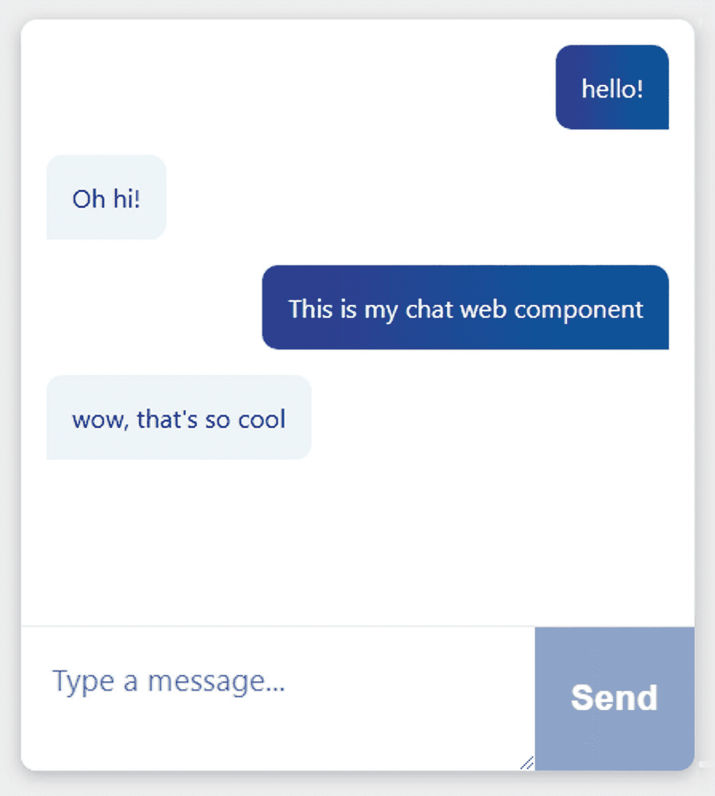

# API 密钥管理

正如上面所暗示的，我们需要讨论 API 密钥管理。虽然这个定制元素支持直接从您的标记中读取 Ably API 键——这对本地开发和调试非常好——但是您绝对不应该在您的标记中存储 Ably API 键，否则，它们可能会被窃取和误用。

在前端使用 API 密钥的推荐方式是使用 [Ably 令牌认证](https://ably.com/documentation/core-features/authentication/#token-authentication)。令牌身份验证是一种交换机制，在这种机制中，您使用真正的 API 密钥来生成有限使用的令牌，这些令牌可以传递回您的客户端以在前端使用。

为了以这种方式使用令牌认证，我们需要在某个地方创建一个 API，从前端调用，其中存储了您真正的 Ably API 密钥。然后，我们可以使用 Ably SDK 中的一个函数将您真正的 API 密钥交换为一个令牌，该令牌将返回给 Ably JavaScript SDK。JavaScript SDK 为您管理这个令牌交换过程。当您提供一个指向将返回令牌的 API 的 URL 时，SDK 将根据需要管理和刷新令牌，因此您无需担心。这个演示将通过使用 AWS Lambda 函数和 AWS API 网关来实现这一点。

以下示例 AWS Lambda 函数提供了必要的令牌交换功能。我们所需要做的就是要求 Ably JavaScript SDK，并创建一个从 *process.env.ABLY_API_KEY 传递 Ably API key 的`Ably.Realtime`客户端实例。*

我们使用`client.auth.createTokenRequest`来生成一个临时令牌，并将其返回给客户端。

API 密匙的所有者有责任确保请求临时令牌的用户能够访问聊天——您可以以任何方式验证请求，这与任何其他 lambda 函数中的验证没有什么不同。在下一节中，我们将在 AWS Lambda 上进行托管

# 使用 AWS Lambda 进行身份验证

为了部署到 AWS Lambda，我们需要创建一个名为/api/createTokenRequest 的新目录，其中包含两个文件——package . JSON 和 index.js

这是 index.js 文件

AWS Lambda 运行时需要这两个文件以及它们的 node_modules。我们将使用 npm 来恢复节点模块，然后将/createTokenRequest 目录的内容压缩到一个 zip 文件中。在终端中执行以下操作:

之后，压缩 createTokenRequest 目录的内容(这个过程依赖于操作系统)。我们将使用 AWS UI 创建一个 Lambda 函数，并将这个 zip 文件作为源代码上传。

我们现在将完成这一过程。您需要首先[登录您的 AWS 账户](https://aws.amazon.com/free/):

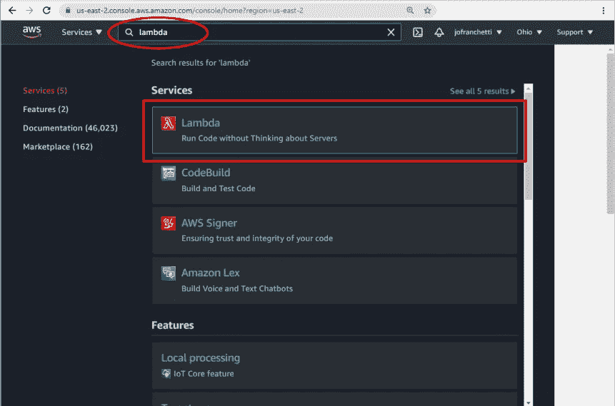

1.  在服务搜索栏中搜索 lambda，然后单击显示在结果中的 Lambda 服务框。

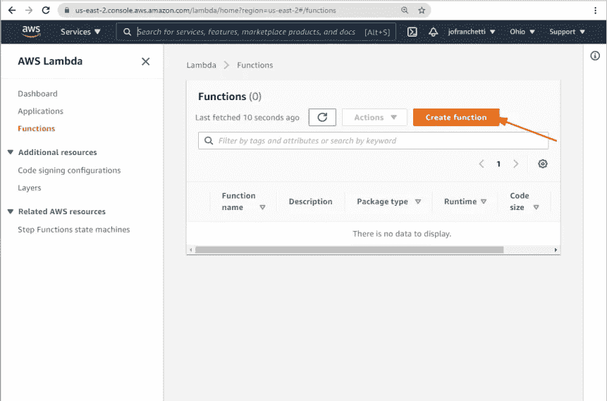

2.单击“创建函数”按钮创建一个新的 Lambda 函数。

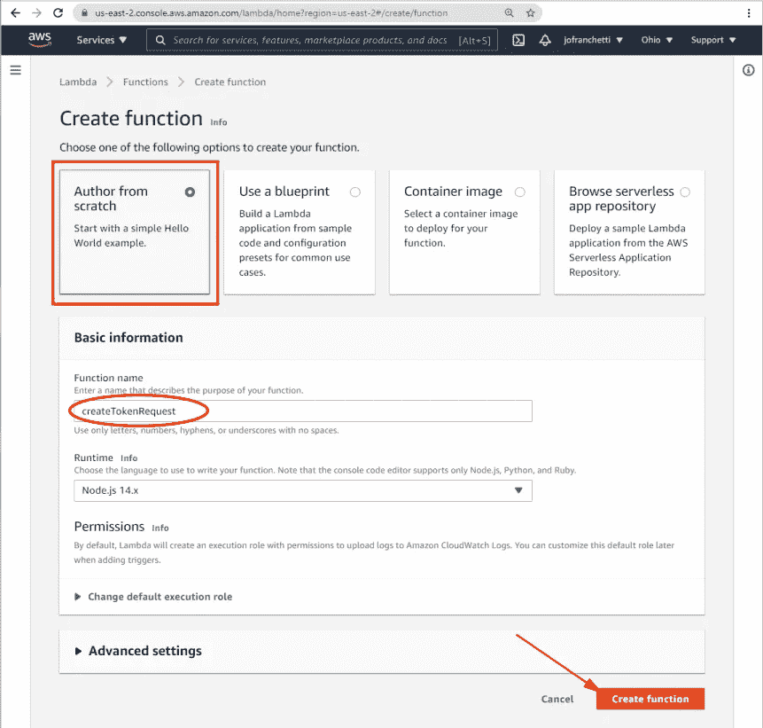

3.选择“从头开始创作”并给你的函数起一个名字，然后点击“创建函数”。

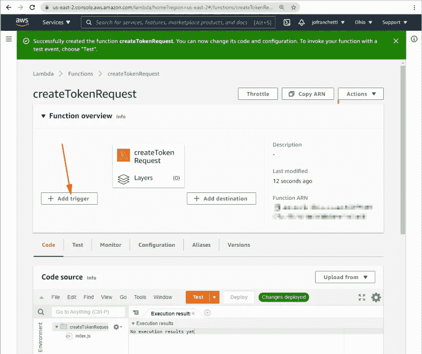

4.创建函数后，单击“添加触发器”使 Lambda 函数可以通过 HTTP 访问。

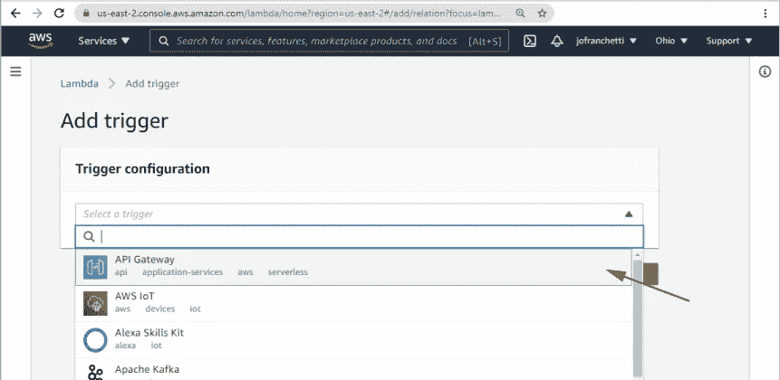

5.从“触发配置”下拉列表中选择“API 网关”。

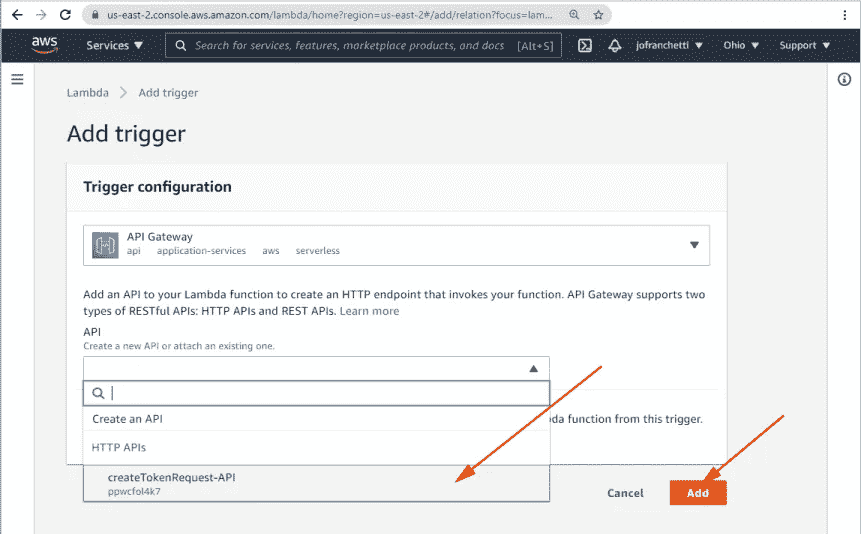

6.在出现的页面上，从下拉列表中选择您的功能，然后单击“添加”。

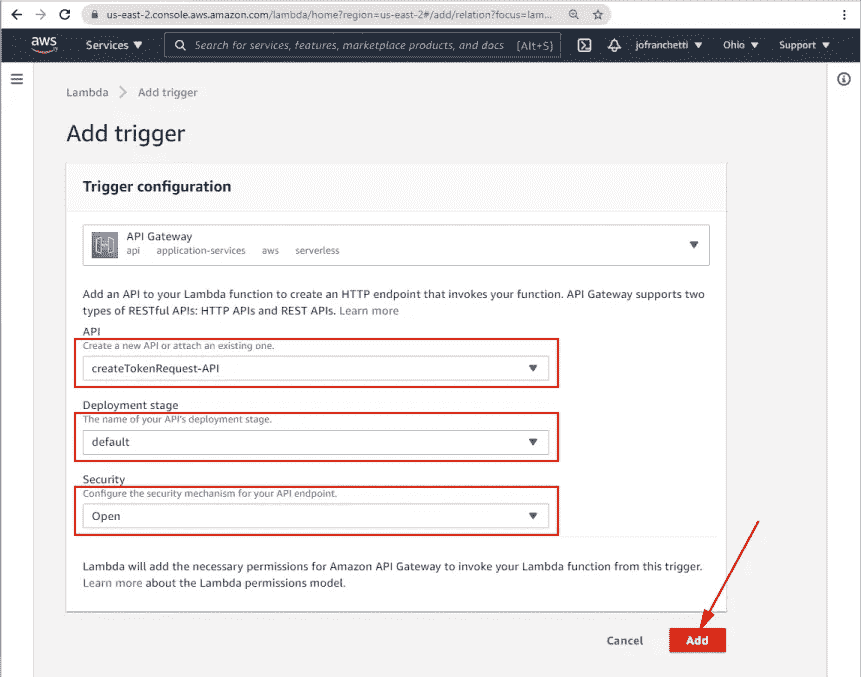

7.将部署阶段设置为默认，将安全性设置为打开，然后单击“添加”。

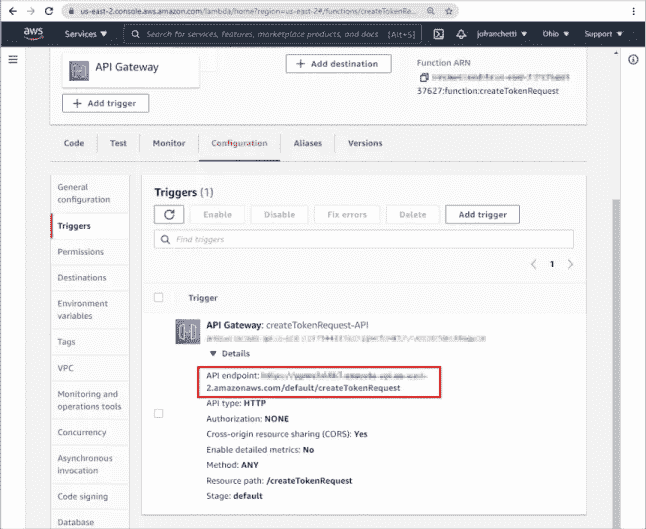

8.添加触发器后，UI 会在“配置”下的“触发器”选项卡中显示一个 URL。(这是当您在 HTML 中使用您的组件时，您将作为 data-get-token-url 参数添加的内容，但是我们还有一些设置要做！)

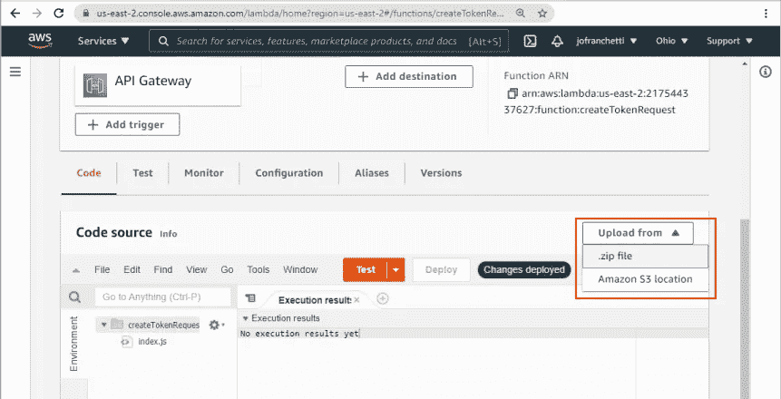

9.现在您需要上传我们之前创建的 zip 文件。单击“代码”选项卡，然后单击“上传自”并选择”。zip 文件”。

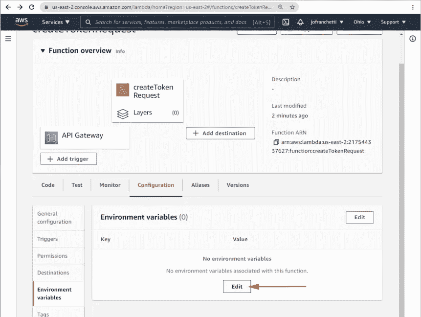

10.一旦 zip 文件被上传，您将需要用 Ably API 键设置您的环境变量。在“配置”下，选择“环境变量”，然后单击“编辑”按钮

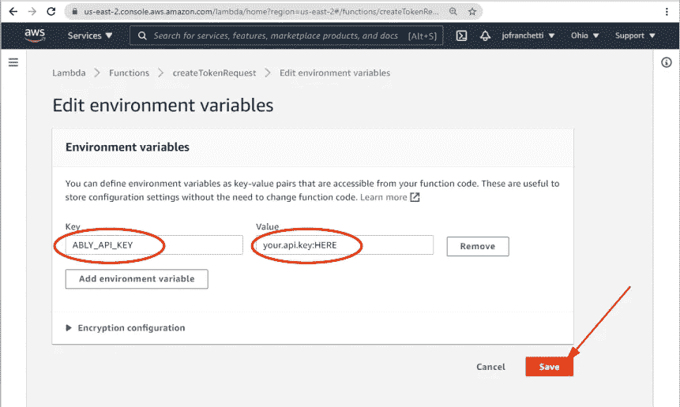

11.将 Ably API 键添加到“环境变量”设置中。

**就这样，你的 Lambda 设置好了！**

在我们从`process.env.ABLY_API_KEY`开始读取的 index.js 文件中。您将需要[生成一个新的 ably API 键](https://knowledge.ably.com/setting-up-and-managing-api-keys)，然后使用 AWS UI 中的键值定义这个环境变量(或者使用您喜欢的自动化工具)。

一旦我们的 lambda 函数被创建，我们将需要添加一个 AWS API 网关触发器来为我们的 Lambda 提供一个外部可访问的 URL。这是一个 URL，我们可以在 HTML 标记中安全地配置它来代替实际的 API 键。Ably SDK 会处理剩下的事情。

# 在 Amplify 上托管您的 Web 组件

现在我们可以在 Amplify 上托管你的组件，Amplify 是 AWS 的静态网络托管服务。

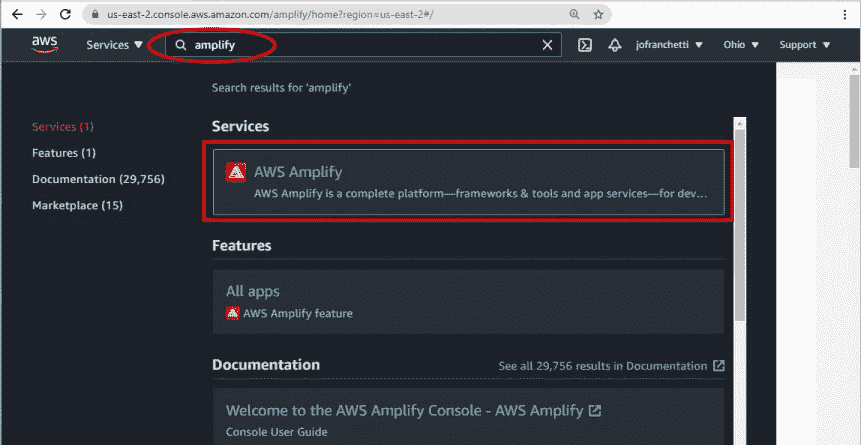

1.  在服务搜索栏中搜索 Amplify，然后点击出现的 AWS Amplify 链接。

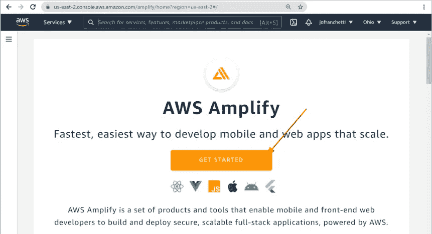

2.点击“开始”。

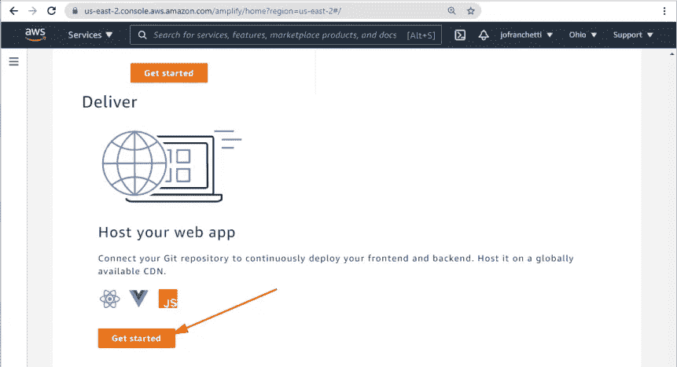

3.向下滚动结果页面至“托管您的 web 应用程序，然后点击“开始”。

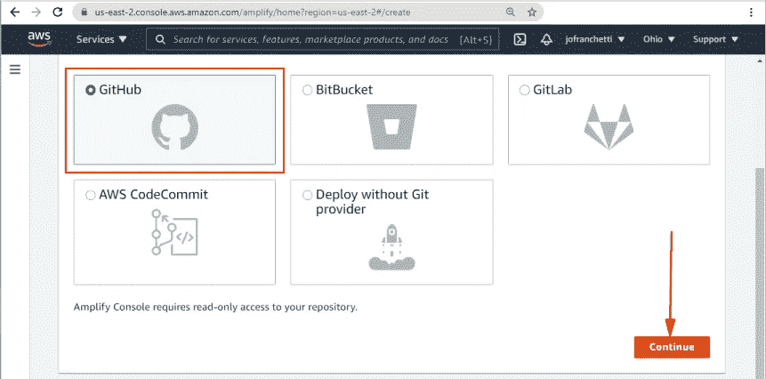

4.使用您的 GitHub 帐户验证 AWS Amplify。

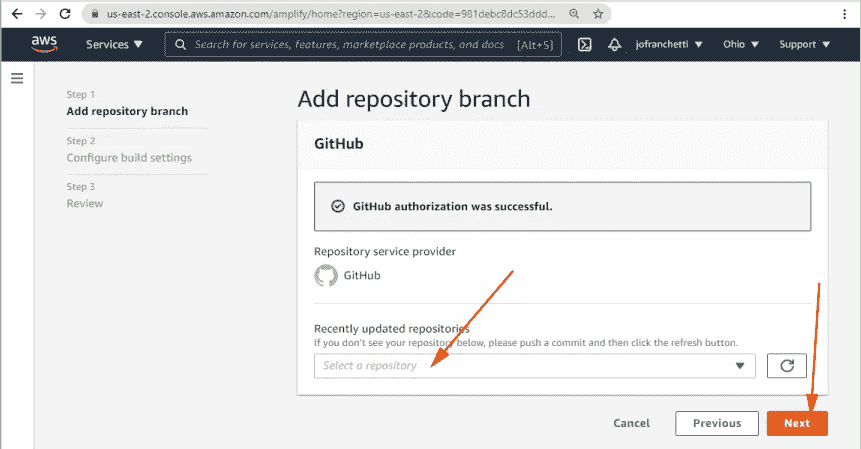

5.选择 web 组件的存储库。

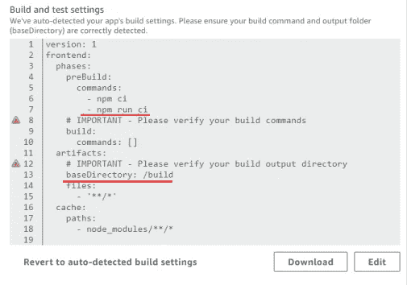

6.编辑您的构建设置，将 npm run ci 作为预构建命令包含在内，并将 baseDirectory 设置为“/build”。

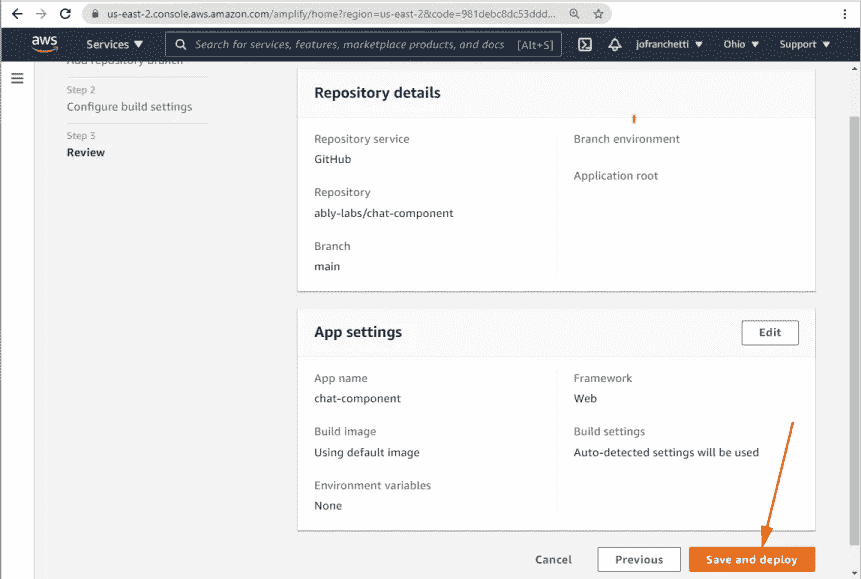

7.单击“保存并部署”按钮来托管您的组件。

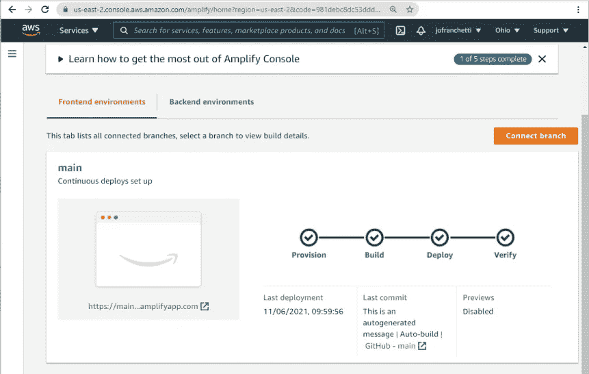

8.如果一切顺利，组件将会成功地供应、构建和部署。UI 将为您提供一个 URL 来查看您托管的组件。

托管的 web 组件看起来会像这样:

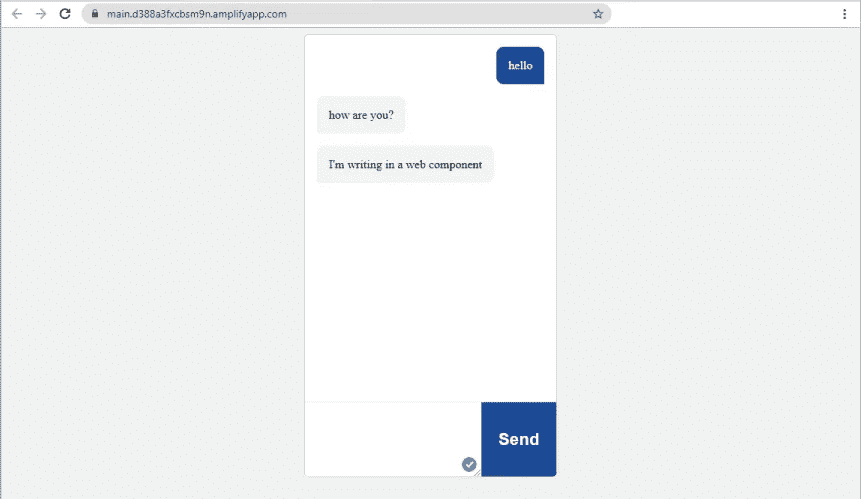

因为组件是作为普通的旧 JavaScript 构建的，所以我们可以使用 NPM 和各种浏览器友好的方式将 NPM 包添加到您的前端来分发和消费组件。

在 Ably 这里，我们[已经将这个组件作为 ably-chat-component 发布给 NPM](https://www.npmjs.com/package/ably-chat-component) ，你可以使用*的 Skypack* CDN 直接引用它。这确保了包是浏览器兼容的。

您需要引用客户端 Ably SDK 来使组件工作。然而，一旦你完成了这些，你就可以引用我们组件的 Skypack URL，将 ably-chat 标签添加到你的页面中，设置你的 API 密匙，一切都将正常工作。

这是在开发模式下使用该组件的最简单的支持方式。然而，如上所述，您将需要*切换出您的 API 密钥*来获得您自己的令牌请求 URL。

# 组件架构

概略地说，组件架构可以描述如下:

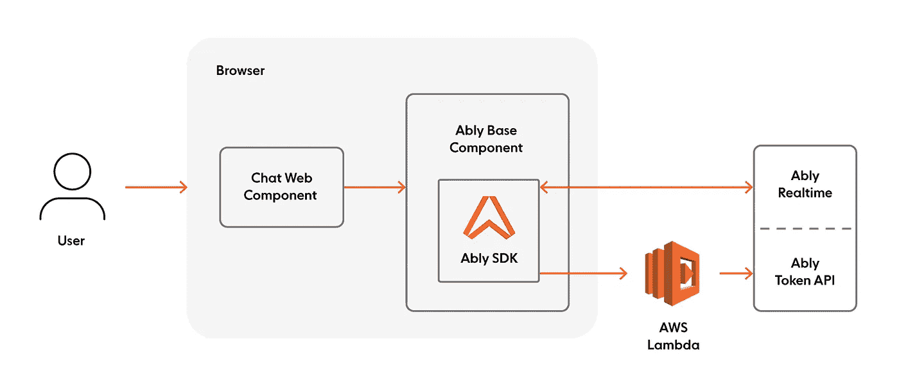

有相应的序列图:

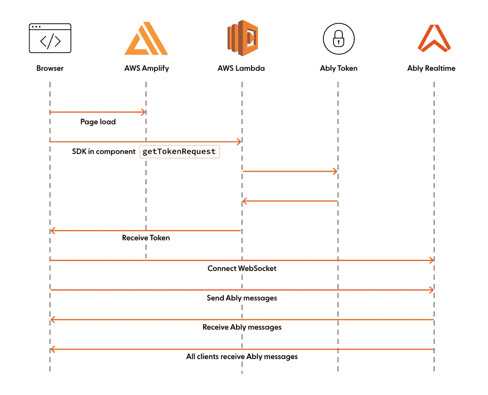

在这篇文章中，我们分析了 web 组件的工作原理，探索了 Web 组件，并演示了如何使用 AWS Amplify 和 AWS Lambda 来托管支持实时聊天的应用程序。

如果你已经有了一个 web 应用程序，并且知道如何托管它，我们也谈到了你如何使用 Skypack 来[包含这个直接来自 NPM](https://www.npmjs.com/package/ably-chat-component) 的组件。

聊天只是您使用实时消息和 Web 组件的一种方式，我们很想看看您能用这个代码库做些什么。

# 差不多

巧妙地提供 API 来实现应用程序中实时特性的[发布/订阅](https://ably.com/topic/pub-sub)消息。您还可以获得现成的全球分布式可扩展基础架构，以及一套服务。这些功能包括[在线](https://ably.com/documentation/core-features/presence)——显示各种参与者的在线/离线状态、[在间歇性网络问题的情况下自动重新连接和恢复消息](https://knowledge.ably.com/connection-state-recovery)、[消息排序和保证交付](https://ably.com/four-pillars-of-dependability#integrity)，以及[与第三方 API](https://ably.com/integrations)集成的简单方法。

巧妙地启用发布/订阅消息，主要通过 [WebSockets](https://ably.com/topic/websockets) 。[通道](https://ably.com/documentation/core-features/channels)的概念允许您对数据进行分类，并决定哪些组件可以访问哪些通道。您还可以为这些通道上的各种参与者指定[功能](https://ably.com/documentation/core-features/authentication#capabilities-explained)，如仅发布、仅订阅、消息历史等。

[了解更多关于 Ably 平台的信息](https://ably.com/)

*最初发表于*[https://ably.com/blog/ably-aws-web-components](https://ably.com/blog/ably-aws-web-components)。

*更多内容请看*[*plain English . io*](http://plainenglish.io/)