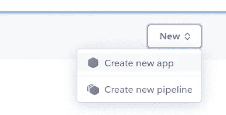
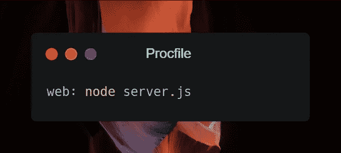
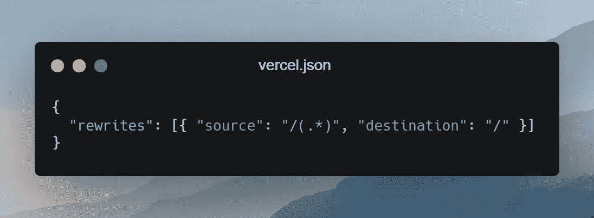

# 使用 MERN 堆栈构建您自己的实时聊天应用程序

> 原文：<https://javascript.plainenglish.io/build-your-own-realtime-chat-app-with-mern-stack-1f2f0c022576?source=collection_archive---------10----------------------->

## 第 3 部分:部署应用程序


Photo by [Franck](https://unsplash.com/@franckinjapan?utm_source=medium&utm_medium=referral) on [Unsplash](https://unsplash.com?utm_source=medium&utm_medium=referral)

*如果你需要赶上第一和第二部分:*

[](/build-your-own-realtime-chat-app-with-mern-stack-c5908ba75126) [## 使用 MERN 堆栈构建您自己的实时聊天应用程序

### 第 1 部分:设置后端

javascript.plainenglish.io](/build-your-own-realtime-chat-app-with-mern-stack-c5908ba75126) [](/build-your-own-realtime-chat-app-with-mern-stack-f203af2e066e) [## 使用 MERN 堆栈构建您自己的实时聊天应用程序

### 第 2 部分:用 React 创建前端

javascript.plainenglish.io](/build-your-own-realtime-chat-app-with-mern-stack-f203af2e066e) 

在故事的这一部分，我们将使用部署我们创建的应用程序，以便我们可以将链接发送给我们的朋友，并每天使用它。我们使用的所有技术都将永远免费。

部署将分为两个阶段。在第一阶段，我们将把后端部署到 [Heroku](https://www.heroku.com/) ，之后，使用 [Vercel](https://vercel.com/) ，我们将部署我们的前端。我们可以将它们部署到同一个服务中，但是为了向你们展示更多的方法，我将同时使用这两个服务。

# 1.将后端部署到 Heroku

在这个阶段，我们将把应用的后端部署到 Heroku。要做到这一点，请确保您在 Heroku 上有一个帐户，并且在您的 PC 上安装了 Git。你可以从这个网站下载 Git。

现在我们已经有了 account 和 Git，是时候开始部署过程了。

要创建 Heroku 应用程序，请点击*新建*下拉菜单，然后选择*创建* n *ew 应用程序。*



Create an app with Heroku

给应用程序命名，然后选择服务器位置。我将应用程序命名为 *chatter-backnd* ，并选择服务器位置为欧洲。但是，您应该选择离您最近的服务器。然后，点击*创建应用*，你就有了 Heroku 项目设置。

要上传后端，我们需要安装 Heroku。我们将使用 NPM 在全球范围内安装它。只需打开一个终端，并移动到后端的根。然后，使用下面的命令安装它。

```
npm install -g heroku
```

您可以使用`heroku --version`命令检查是否安装了 CLI。

使用`heroku login`命令，登录 Heroku，现在，我们准备上传文件。在项目的根目录下创建一个文件，命名为`Procfile`，不带扩展名。然后把下面的命令放进去。



在后端的根目录中，我们必须初始化一个 Git 存储库，并提交我们创建的所有文件。如果你按照我做的设置，你已经有了一个`.gitignore`文件。如果没有，可以从这里坐[那辆](https://www.toptal.com/developers/gitignore/api/node)。在终端中，逐一运行下面的命令。

```
git init
heroku git:remote -a chatter-backnd
git add .
git commit -am "let's deploy backend"
git push heroku master
```

在最后一个命令之后，您应该等待一两分钟，直到所有的文件都上传到 Heroku。就是这样！如果您单击*打开应用程序*按钮，您应该会被重定向到一个 URL，并看到*服务器已启动并正在运行…* 消息提示，因为我们在第一部分将它发送到客户端以测试服务器。

我们成功地将后端部署到 Heroku，现在你可以在世界任何地方访问它。

# 2.将前端部署到 Vercel

在这个阶段，我们将把我们在第 2 部分中创建的前端部署到 [Vercel](https://vercel.com/) 。在此阶段，您需要一个安装了 Vercel 和 Vercel CLI 的帐户。现在去在 [Vercel](https://vercel.com/) 上创建一个免费账户。然后使用以下 NPM 命令全局安装 Vercel CLI。

```
npm install -g vercel
```

要检查它是否已安装，请键入以下内容:

```
vercel --version
```

因为我们正在部署一个单页面应用程序，并且路由是在客户端处理的，所以我们必须配置 Vercel，以便所有的路由都被重定向到`/`并且我们可以使用我们的路由器。在客户端目录中，创建一个`vercel.json`并将下面的代码块放入其中。



Create a vercel.json in the /client directory

之后，进入文件`Constants.js`，你指定的后端的 URL 是`http://localhost:3000`，并改变它为在前面部分部署的后端的 URL。对我来说，是`chatter-backnd.heroku.app`。

然后，在终端中，确保你在`/client`目录中并输入`vercel --prod`。再次登录，对所有提示说是。就是这样！您已经成功部署了前端。转到 Vercel dashboard 并访问您刚刚部署的站点。

如果你需要完整的源代码，你可以访问这个[库](https://github.com/XenoverseUp/chatter)。

# 结论

恭喜你！现在，您可以向您的朋友发送一个链接，并拥有一个单独的聊天应用程序。我真的很喜欢创造它，我希望你也是。如果你喜欢，一定要鼓掌，如果你有什么问题，不要犹豫，留下你的评论。

敬请关注接下来的故事。

*更多内容请看*[***plain English . io***](http://plainenglish.io)