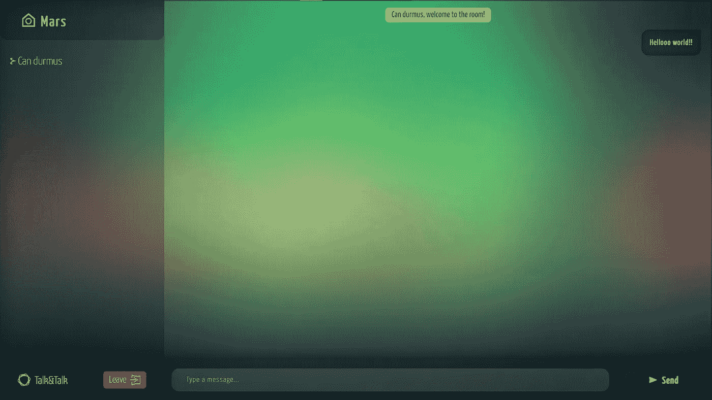
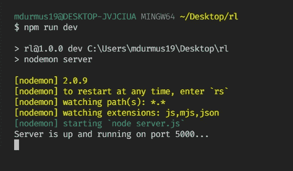

# 使用 MERN 堆栈构建您自己的实时聊天应用程序

> 原文：<https://javascript.plainenglish.io/build-your-own-realtime-chat-app-with-mern-stack-c5908ba75126?source=collection_archive---------2----------------------->

## 第 1 部分:设置后端


Photo by [Volodymyr Hryshchenko](https://unsplash.com/@lunarts?utm_source=medium&utm_medium=referral) on [Unsplash](https://unsplash.com?utm_source=medium&utm_medium=referral)

当我第一次开始开发 web 应用程序时，我真的很喜欢重新创建我日常使用的应用程序，如社交媒体应用程序、消息应用程序或简单的游戏。在研究实时数据流时，我遇到了 Socket.io，并决定试一试，尝试创建一个类似 WhatsApp 的实时聊天应用程序。

这将是 3 部分的故事。在第一部分中，我们将使用 NodeJS 创建应用程序的后端，在第二部分中，我们将使用 React 构建我们的前端，最后在第三部分中，我们将部署我们的应用程序，以便您可以使用您创建的应用程序与您的朋友聊天。



Here is the final app I created. You can try it from [here](https://5f077488f4de1a93ec3c9cd9--xenodochial-goldberg-be9fd0.netlify.app/).

# 我们将在本教程中使用的技术

## 节点. js

在构建后端时，我们将在 Node.js 的基础上构建它。因此，请确保您的计算机上安装了 Node.js。如果不是，可以从[这里](https://nodejs.org/en/)下载。

## 表达

Express 将帮助我们构建 REST API 来响应来自前端的请求。

## Socket.io

这个库使得创建实时应用程序非常容易。我们将使用 Socket.io 在客户端之间接收和发送消息。在幕后，Socket.io 使用 WebSockets API 来提供实时数据流。你可以从他们的网站上了解更多信息。

## 克-奥二氏分级量表

这个小小的库可以让我们毫无问题地将我们的后端与任何其他前端一起使用。你可以从[这里](https://developer.mozilla.org/en-US/docs/Web/HTTP/CORS)了解更多。

## Nodemon(开发依赖性)

每当我们进行更改时，Nodemon 都会重新启动服务器，这样我们就不必每次都手动执行。

让我们通过在项目根目录中键入`npm init -y`来开始我们的项目。然后使用下面的代码片段安装所需的依赖项。

```
npm install express socket.io cors --save
npm install nodemon --save-dev
```

之后，我们可以在根目录下创建我们的主文件`server.js`，并配置`package.json`文件。在`package.json`中，我们将删除`test`脚本，添加`start`和`dev`脚本，如下所示:

```
...
"main": "server.js",
"scripts": {
  "start": "node server",
  "dev": "nodemon server",
},
... 
```

现在，我们可以动手做一些编码工作了。让我们打开`server.js`文件，要求所有必要的库，并定义我们的`**PORT**`。

```
const express = require("express")
const http = require("http")
const socketio = require("socket.io")
const cors = require("cors")const **PORT** = process.env.PORT || 5000
```

定义`**PORT**`时，首先检查`process.env.PORT`很重要，因为当我们部署应用程序时，它将是真正的端口号。

现在我们已经有了所有的导入，是时候通过调用`express`来创建 express 应用程序了。然而，由于我们将在 Socket.io 中使用它，我们应该创建一个封装在`http.createServer()`中的服务器。因此，将`app`传递给`createServer`方法，并将其命名为`server`或任何您想要的名称。

```
const app = express()
const server = http.createServer(app)
```

之后，在`server`使用`listen`方法启动服务器。

```
server.listen(PORT, () =>
  console.log(`Server is up and running on port ${PORT}...`)
)
```

如果您在根目录下运行`npm run dev`，您应该会看到这些提示，我们的服务器现在已经启动并运行了。恭喜你。



为了检查我们是否可以通过我们的浏览器访问它，让我们在`listen`方法的右边写一个`GET`处理程序并发送一条消息。

```
app.get("/", (req, res) => res.send("Hello World"))
```

现在，如果你使用浏览器访问`http://localhost:5000/`地址，你会在屏幕上看到 *Hello World* 的提示。太完美了。我们的服务器现在能够响应请求了。在处理实时数据之前还有一件小事要做，就是`cors`。在初始化`app`变量之后，编写这个代码片段，并将`cors`添加到 express 应用程序中。

```
app.use(cors())
```

# 设置实时数据功能

在上一节中，我们导入了 Socket.io 库，并将其命名为`socketio`。现在，我们将使用它来接收和向连接到特定房间的客户端发送消息。首先使用下面的代码片段初始化`server`变量下的库。

```
const io = socketio(server, { wsEngine: "ws" })
```

然后我们可以在`io`变量上使用`on`方法编写一个*连接*处理程序。该方法的第一个参数是事件名称，第二个参数是一个回调，它为我们提供了一个已连接的套接字实例。

```
io.on("connection", socket => {...})
```

现在我们可以访问各个客户端的套接字实例，我们可以在这个单独的实例上使用相同的`on`方法来监听来自前端的特殊定制事件，例如*消息、send-message、join、left* 。

首先，处理用户加入。在`io.on`的回调函数体内，监听一个名为 *join* 的事件。不要忘记，这些事件是自定义的，因此它们的名称可以是您想要的任何名称，但是在这种情况下，将其称为 *join 是非常符合逻辑的。*回调采用两个参数。第一个是通过来自前端的事件传递的数据，以及来自前端的回调。在这种情况下，我们将发送用户名和房间名作为数据，因为我们不会使用回调，所以我们不会发送它。

为了存储所有的实用函数，比如`addUser, removeUser, getUsers`，让我们创建一个名为`utils.js`的文件。并从中导入`addUser`函数。我们稍后将创建这些函数。

```
socket => {
  socket.on("join", (data) => {
    const { name, room } = data
    const { user, error } = addUser({ id: socket.id, name, room })

    if (error) **return** 
  })
}
```

之后，我们可以发出自定义事件来通知用户，比如谁已经加入或者问候。

在*加入*事件体中，我们将发出一个*消息*事件来问候加入的用户，另一个事件用于通知其他用户该用户已经加入。要向仅加入的套接字发出事件，我们将在套接字上使用`emit`方法，要向房间中的所有用户发出事件，有一个`broadcast`方法。

最后，为了将用户与房间关联起来，我们将使用`join`方法，并将`room`作为参数传递，并用*房间数据*事件发回房间数据。

```
socket.on("join", data => {
  ... socket.emit("message", {
    user: "admin",
    text: `${user.name}, it's great to see you in here.`
  }) socket.broadcast.to(user.room).emit("message", {
    user: "admin",
    text: `${user.name} has just landed to the room.`
  })  socket.join(user.room) io.to(user.room).emit("room-data", {
    room: user.room,
    users: getAllUsers(user.room),
  })
})
```

在`utils.js`内部，让我们创建第一个效用函数`addUser`并将其导出。为了存储当前活跃的用户，我们将不使用数据库，因为这是一个相对简单的项目。

相反，我们将创建一个名为`users`的数组，并将用户对象放入其中。

```
// utils.jslet users = []const addUser = ({id, name, room}) => {
  name = name.trim().toLowerCase();
  room = room.trim().toLowerCase(); const userExists = users.find(user => 
    user.name === name && user.room === room
  ) if (!user || !room || userExists) 
    return { error: "error" } const user = { id, name, room }
  users = [...users, user] **return** { user }
}module.exports = { addUser }
```

在本教程中，我没有费心按类型处理所有的错误和响应。但是您可以将这个功能添加到您的系统中，并根据错误类型发出定制事件，比如*用户已经存在的*。

既然我们可以将用户添加到房间中，我们应该在他们失去连接或离开房间时删除他们。该过程将类似于添加它们。

我们将监听一个名为 *left* 的事件，在主体中，如果用户存在，我们将从`users`数组中删除它，断开套接字并发出消息通知其余的用户。

```
socket.on("left", () => {
  const user = removeUser(socket.id) user && io.to(user.room).emit("message", {
    user: "admin",
    text: `${user.name} has just left!`
  })
}
```

而这就是`utils.js`中的`removeUser`功能。基本上，用户从`users`中移除并返回以通知房间中的其他人。

```
// utils.jsconst removeUser = id => {
  const i = users.findIndex(user => user.id === id)
 **return** i !== -1 ? users.splice(i, 1)[0] : null
}
```

我们设置了大部分后端，但仍然有一个功能缺失，这是一种(！)对这个项目很重要。监听*发送消息*事件，并将消息发送到适当的聊天室。

为了实现这一点，我们将再次在`socket.on("connection", ...)`的主体中创建一个事件监听器，并发出带有作为数据传递的文本消息的*消息*事件。

首先，我们将使用`socket.id`获取用户信息。因为我们将数组用作数据库，所以没有必要编写一个异步函数并等待数据库的响应——但是如果您这样做了，您应该尝试一些异步编程。

获得用户信息后，现在我们可以发出带有适当数据(消息、用户名、房间……)的*消息*事件，这样我们就可以在前端将其捕获回来。

```
socket.on("send-message", (message) => {
  const user = getUser(socket.id) io.to(user.room).emit("message", { 
    user: user.name, 
    text: message 
  }) io.to(user.room).emit("room-data", { 
    room: user.room, 
    users: getAllUsers(user.room)
  })
})
```

在上面的代码片段中，有两个实用函数:一个用于获取用户对象，另一个用于获取当前房间中的所有用户。

```
// utils.jsconst getUser = id => users.filter(user => user.id === id)[0]
const getAllUsers = room => users.filter(user => user.room === room)
```

我们做到了！您已经完成了本系列的第一部分，现在您已经拥有了实时聊天应用程序的全功能后端。在下一部分中，我们将设置项目的客户端，并使用 React 创建用户界面。如果你愿意，你可以在 Github 库[这里](https://github.com/XenoverseUp/chatter)找到代码。

[](https://mailchi.mp/a45f8fb96cc9/subscribe)

Subscribe to get your **free *subscriber-exclusive*** story.

我希望你已经发现这是有用的。感谢您阅读**。**敬请关注文章接下来的部分。

[](/build-your-own-realtime-chat-app-with-mern-stack-f203af2e066e) [## 使用 MERN 堆栈构建您自己的实时聊天应用程序

### 第 2 部分:用 React 创建前端

javascript.plainenglish.io](/build-your-own-realtime-chat-app-with-mern-stack-f203af2e066e) 

## 进一步阅读

[](/i-built-a-serverless-live-chat-app-with-next-js-fauna-and-wundergraph-for-graphql-live-queries-b671d9646f6) [## 我用 Next.js、Fauna 和 WunderGraph 为 GraphQL 实时查询构建了一个无服务器的实时聊天应用程序

### 使用无服务器技术创建可扩展的实时聊天应用程序的分步指南，来自…

javascript.plainenglish.io](/i-built-a-serverless-live-chat-app-with-next-js-fauna-and-wundergraph-for-graphql-live-queries-b671d9646f6) 

*更多内容请看*[***plain English . io***](http://plainenglish.io)