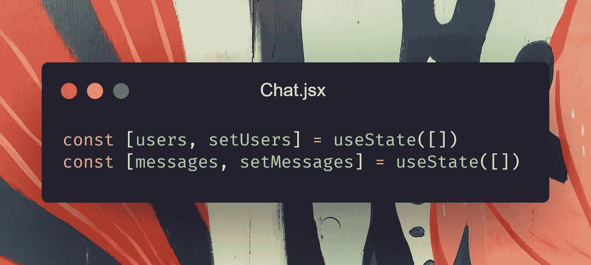

# 使用 MERN 堆栈构建您自己的实时聊天应用程序

> 原文：<https://javascript.plainenglish.io/build-your-own-realtime-chat-app-with-mern-stack-f203af2e066e?source=collection_archive---------0----------------------->

## 第 2 部分:用 React 创建前端


嗨，伙计们，这是三部分故事的第二部分。如果你没有阅读我设置后端的第一部分，请确保通过下面的链接阅读。

[](/build-your-own-realtime-chat-app-with-mern-stack-c5908ba75126) [## 使用 MERN 堆栈构建您自己的实时聊天应用程序

### 第 1 部分:设置后端

javascript.plainenglish.io](/build-your-own-realtime-chat-app-with-mern-stack-c5908ba75126) 

在故事的这一部分，我们将使用 React 和 hooks 设置项目的前端。此外，我们将连接到后端，并最终能够通过我们的聊天应用程序发送消息。


You can visit and try the finished project [here](https://5f077488f4de1a93ec3c9cd9--xenodochial-goldberg-be9fd0.netlify.app/).

# 我们将在本教程中使用的技术

## 轻快地

这是下一代前端构建工具。我们将使用它来创建和构建 React 应用程序。你可以在这里阅读更多关于 Vite [的内容。如果你对我为什么选择维特而不是 CRA 感到好奇，你可以阅读这篇文章。](https://vitejs.dev/)

[](https://medium.com/codex/you-should-choose-vite-over-cra-for-react-apps-heres-why-47e2e7381d13) [## 对于 React 应用程序，你应该选择 Vite 而不是 CRA，原因如下

### 对于许多初学者、中级甚至一些专家程序员来说，Create React App 是开始和…

medium.com](https://medium.com/codex/you-should-choose-vite-over-cra-for-react-apps-heres-why-47e2e7381d13) 

## 反应路由器 DOM

这个库将帮助我们创建应用程序的客户端路由。使用它，我们将创建并呈现`Lobby`和`Chat`页面。

## Socket.io 客户端

我们将使用 Socket.io 客户端与我们在上一部分中创建的后端进行连接和通信。

## 反应挂钩形式

高效处理输入、值和提交的库。

## 反应滚动到底部

使用这个库，每当有消息时，容器将滚动到底部，并保持收到的消息在视图中。

让我们开始使用 Vite 创建前端。移动到项目的根目录，键入`npm init vite`，然后将其命名为 client，并选择 React 作为框架。之后，你会在根目录下看到`/client`目录。在用代码弄脏我们的手之前，我们应该配置 Vite 以保持项目简单。使用`npm`，安装`vite-preset-react`和`sass`(这是可选的，可以使用任何预处理器)作为开发依赖。

```
npm install vite-preset-react sass --save-dev
```

安装完成后，打开`vite.config.js`，删除`reactRefresh`导入和插件。把它从`package.json`里也删掉。现在您可以如下初始化`vite.config.js`中的`vite-preset-react`:


使用这个插件而不是默认插件将为我们提供像 HMR 刷新这样的功能，并且没有必要在 JSX 文件中导入 React。但之后，别忘了去掉`main.jsx`和`App.jsx`中 React 的导入。

现在配置已经完成，是时候下载依赖项并开始我们的前端项目了。

```
npm install react-router-dom socket.io-client react-scroll-to-bottom react-hook-form
```

让我们打开 App.jsx 并删除所有未使用的内容，因为我们将设置路由器和路由。从`react-router-dom`导入`BrowserRouter, Switch, Route`并把它们放在返回的`BrowserRouter`中作为根，然后是`Switch`，然后是`Route`组件。我们将有两条路线，第一条将包含一个提交我们的姓名和房间名称的表单。另一条路线将包括一个活跃用户列表和一个用户可以与之交互的聊天框。


如果你想知道我是如何从一个文件夹中导入这两个组件的，你可以在这里了解更多。

[](https://medium.com/nerd-for-tech/3-extremely-useful-react-tips-to-speed-up-the-development-process-c4c966814c52) [## 3 个非常有用的 React 技巧来加速开发过程

### 如今，React 已经慢慢成为了 web 应用程序的新标准，而且看起来它不会有任何发展…

medium.com](https://medium.com/nerd-for-tech/3-extremely-useful-react-tips-to-speed-up-the-development-process-c4c966814c52) 

我们可以首先通过在`/src`中创建一个`/components`目录来开始创建我们的组件。在组件内部，创建一个`Form.jsx`来设置我们的第一条路线。

在*表单*组件中，我们将有一个包含两个名为*姓名*和*房间的文本输入的表单。*我们将使用 React Hook 表单来处理这些输入，并将它们重定向到适当的路径。如果你想了解更多关于 React Hook Form 的知识，你可以在[官方网站](https://react-hook-form.com/)阅读更多。

为了使我们的表单起作用，我们将从 React Hook 表单导入`useForm`，并使用`register`引用输入。然后，使用`useForm`的`handleSubmit`方法，我们将用适当的[查询字符串](https://en.wikipedia.org/wiki/Query_string)将用户重定向到聊天室。要重定向用户，从 React 路由器 DOM 导入`useHistory`并初始化它。


在本教程中，我不会处理应用程序的样式，因为它不是一个 CSS 教程。你可以随心所欲地设计它。您也可以处理可能的错误。

现在我们已经有了*表单*设置，我们可以设置*聊天*组件并开始与服务器对话。

在对*聊天*组件进行了基本设置之后，我们必须解析来自 URL 的查询参数。为了使这个过程可以在许多项目中重用，我将创建一个定制的`useQueryParams`钩子。

为了得到参数，我会使用`URLSearchParams` Web API 将参数一个一个地赋给钩子的状态。


在*聊天*组件中，我们将使用这个自定义钩子来获取*房间*和*名称*，以便我们可以向正确的房间发送消息。

在组件的顶部，我们将声明两个状态，它们将保存关于用户和消息的所有数据。



之后，使用一个`useEffect`，我们将连接到我们的后端并处理断开。在这个组件中，我们将有一个名为`END_POINT`的常量，我更喜欢将这些常量保存在一个单独的文件中。所以，我会在`src`目录下创建一个`Constants.js`并导出`http://localhost:5000/`。这是完全可选的，您可以直接在组件中编写端点。


在`useEffect`的主体内部，我们发出了一个将由服务器处理的 *join* 事件，并且每当 *Chat* 组件被卸载时发出一个 *left* 事件，以便我们可以断开服务器上的套接字。

为了处理传入的数据，我们将使用另一个`useEffect`来监听来自服务器的事件，并相应地设置状态。


既然我们已经从其他用户那里得到了消息，那么是时候创建*聊天*组件的标记了。在用户界面中，将有两列。第一个将持有房间名称和活跃的用户，另一个将包括聊天屏幕和发送消息部分。


我们可以开始用 *Info* 组件构建用户界面。正如我所说，我不会处理样式，所以，我将只分享核心标记，使其功能，你可以处理其余的任何你想要的。

在该组件中，我们将提示房间名称，并在其下方映射当前活动的用户。在底部，我们将放置一个离开按钮来断开插座，并将用户重定向到*表单*组件。


最后，还有一件事我们必须处理，那就是聊天视图。在这个组件中，我们将提示收到的消息，并在底部放置一个发送消息的表单。为了显示用户每次收到的消息，我们将使用 *React 滚动到底部。*


为了处理消息输入和提交，我们将使用`useForm`钩子。在句柄函数内部，如果消息不为空，那么我们将发出一个带有有效负载内容的*消息*事件。


就这样，伙计们！现在你有了一个聊天应用程序，可以在客户端之间发送消息。希望你喜欢。

在下一部分，我们将把它部署到 Heroku 和 Vercel 上，这样你就可以和你的朋友分享链接和聊天了。你可以在这里找到项目[的代码。](https://github.com/XenoverseUp/chatter)

[](/build-your-own-realtime-chat-app-with-mern-stack-c5908ba75126) [## 使用 MERN 堆栈构建您自己的实时聊天应用程序

### 第 1 部分:设置后端

javascript.plainenglish.io](/build-your-own-realtime-chat-app-with-mern-stack-c5908ba75126) 

如果你喜欢，一定要鼓掌，并期待下一部分。

*更多内容尽在*[***plain English . io***](http://plainenglish.io/)