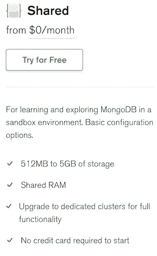
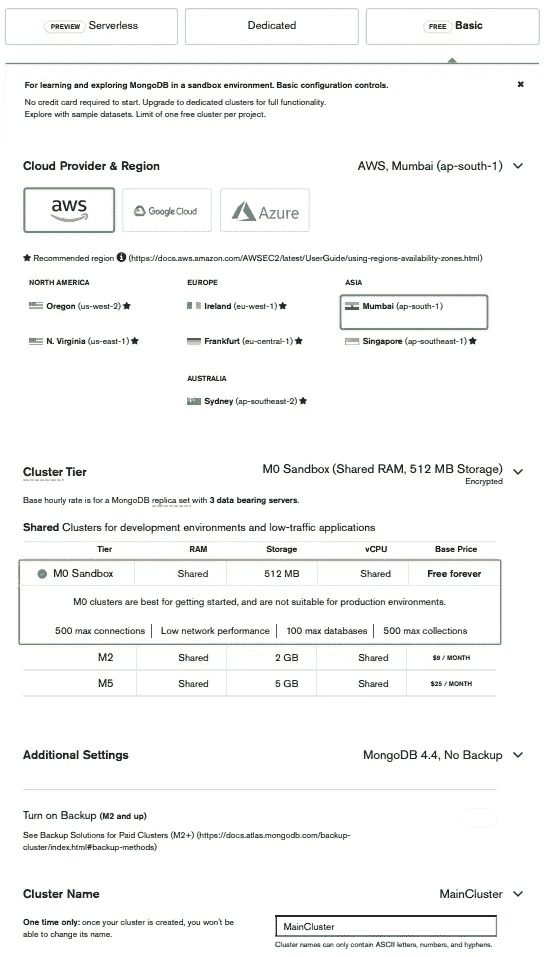
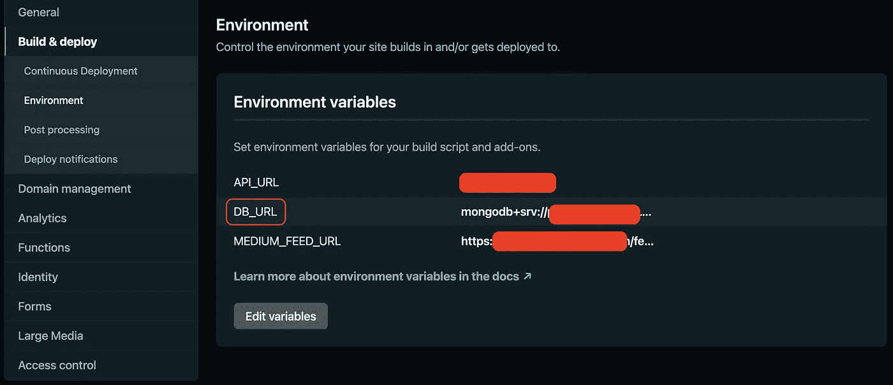
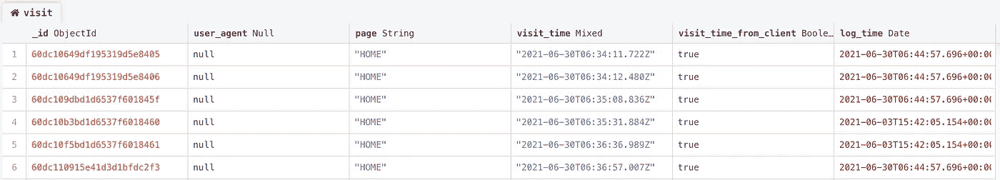
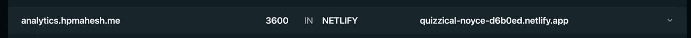
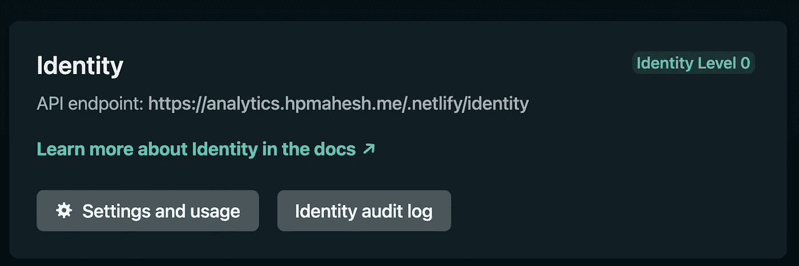
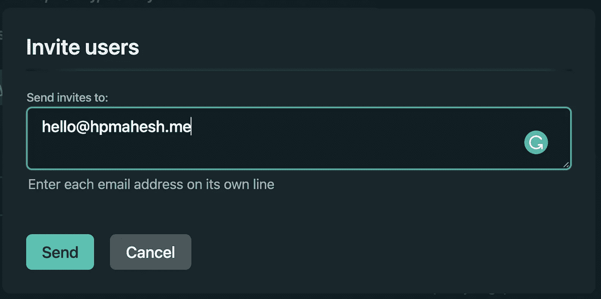
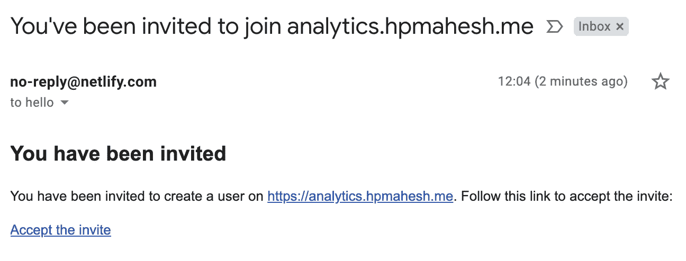
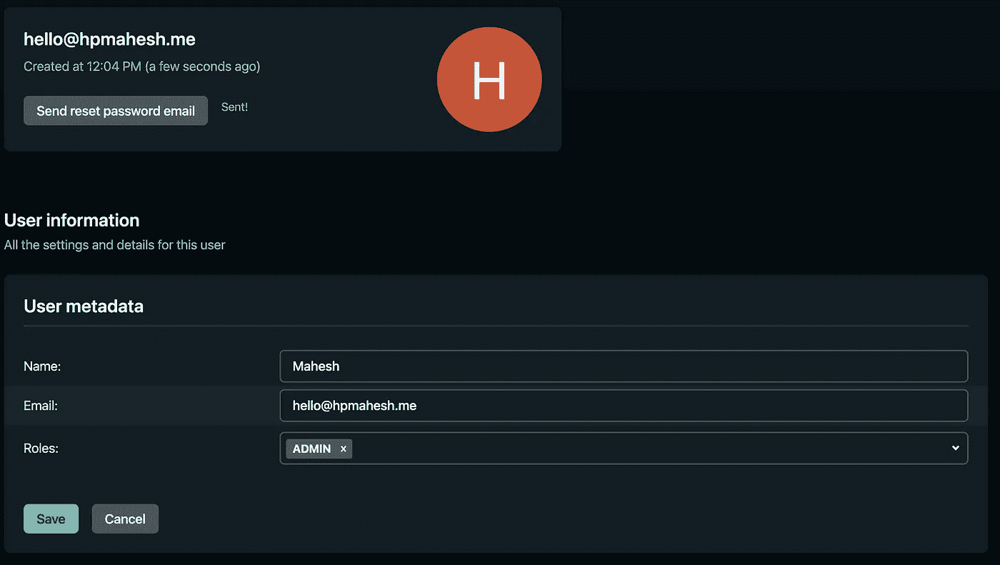
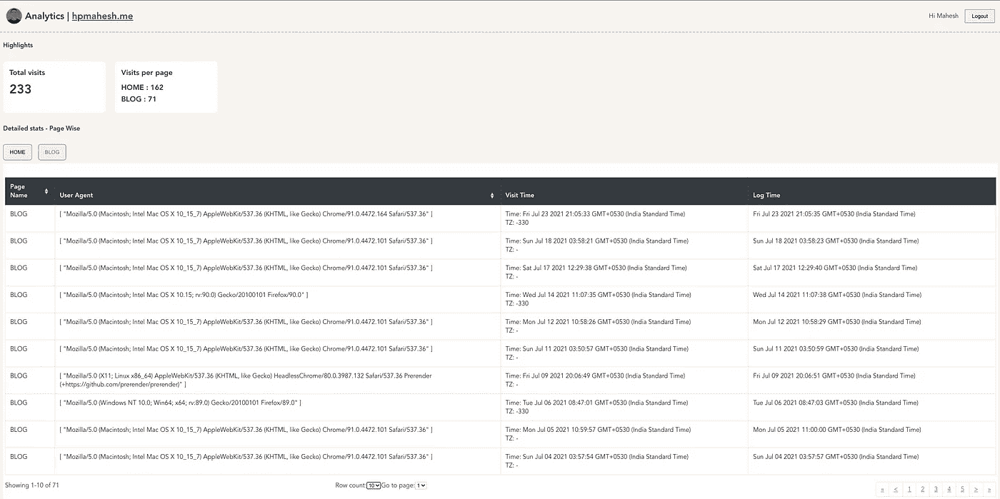

# 用 JavaScript、MongoDB 和 Netlify 函数构建自己的网站分析解决方案

> 原文：<https://javascript.plainenglish.io/build-your-own-website-analytics-solution-with-javascript-mongodb-and-netlify-functions-70152f31e138?source=collection_archive---------1----------------------->

## 如何创建自己的简单网站分析

Photo by [Markus Winkler](https://unsplash.com/@markuswinkler?utm_source=medium&utm_medium=referral) on [Unsplash](https://unsplash.com?utm_source=medium&utm_medium=referral)

自从我把我的个人网站+博客迁移到[svelet-Sapper](https://sapper.svelte.dev/)后，我就想有某种形式的分析来跟踪访问者的数量和一些简单的指标。虽然有很多解决方案，比如功能丰富的[谷歌分析](https://analytics.google.com/)和注重隐私的 [Fathom](https://usefathom.com/) ，但我不想使用它们，主要是因为以下原因:

*   他们中的大多数在网站上识别和追踪访问者
*   每个产品都需要在您的源代码中设置特定的代码片段，这将您与它们的平台联系在一起
*   有些是付费解决方案
*   它们提供了太多我可能永远不会用到的功能！

在研究开源解决方案时，我看到了这篇有趣的文章——[用 Netlify 函数构建自己的分析](https://oliverjam.es/blog/diy-analytics-netlify-functions/)——它解释了一个简单的设置来跟踪访问，甚至不需要网站上的 JS！这看起来像一个完美的解决方案，但我想有更多的功能，所以从中汲取灵感，我想出了一个简单的设置我的网站。

对于实施，我们将使用以下内容:

*   **Netlify 函数**运行我们的后端数据收集代码。(可以在任何无服务器平台上运行，或者作为 NodeJS 服务器运行)
*   **MongoDB (Atlas)** 用于存储分析数据。(可以使用任何 JSON 数据存储)
*   **简单的 JS** 代码，用于从 Netlify 上运行的前端进行分析调用。
*   基于 **VueJS** 的仪表板，用于查看分析数据。(完全可选，您可以随时直接从数据库查询以查看数据)

***免责声明:*** *撰写本文内容主要是为了在实施自己的分析解决方案时作为参考。内容与我的日常工作没有任何关系，所有观点都是个人观点！*

在我们深入实施之前，让我们看看一些无需放置跟踪 cookies 就可以轻松收集的数据点，以及它们的用处:

*   **页面名称** —如其所述，它只是被访问页面的名称，帮助我们跟踪每页的访问量。
*   **用户代理** —可用于识别用户访问的设备和浏览器。
*   **IP 地址** —这将允许我们识别唯一的用户访问。(不推荐，因为这样可以非常容易地唯一识别用户！)
*   **时间** —访问时间让我们看到发布下一篇博客的最佳时间！
*   **客户端时区** —这将允许我们计算出用户访问我们网站的国家。

跟踪这些指标，尤其是这些指标的组合，可以唯一地跟踪用户。这被广泛称为[浏览器指纹](https://www.avast.com/c-what-is-browser-fingerprinting)，需要我们**征得用户明确同意才能在许多国家追踪他们**。在开始跟踪用户之前，请确保您已经阅读并遵守这些法律要求！

我个人在我的网站上只跟踪了上述数据点的很小一部分。

# 履行

以下是我们可以实施该解决方案的四个阶段。开始编码吧！

## **数据库**

因为我们需要一个 DB 实例来存储我们的结果，所以让我们从提供一个 MongoDB 实例开始。我在 [MongoDB Atlas](https://www.mongodb.com/cloud/atlas) 上使用了**免费共享实例**，因为它足以满足我的数据存储需求。

MongoDB Atlas free tier

设置很简单，只需以下步骤:

*   一旦我们注册，我们将被提示创建一个组织。让我们继续创建一个。
*   在“项目”选项卡下，选择“新建项目”。为项目提供一个名称，然后继续。
*   我们会被要求添加成员和设置权限，这可以根据我们的需要跳过。点击“创建项目”。
*   创建项目后，单击“Build a Database”按钮创建一个新的数据库。选择免费共享选项并继续。
*   系统会提示我们选择云提供商、地区和其他平台选项。以下是我的选择，请选择最符合您需求的选项。

DB Cluster options

*   单击“Create cluster ”,数据库部署应该开始。设置完成后，我们转到“数据库访问”并添加一个新的数据库用户。提供用户名和强密码并创建用户。
*   设置好数据库集群后，返回到“Databases”并选择主集群上的“Connect”。系统会提示我们添加连接 IP 地址。选择“允许从任何地方访问”(如果我们知道 Netlify 函数的 IP 范围，我们可以稍后将其限制到特定的 IP 地址)并继续。
*   为 connection 选择 NodeJS 选项，并复制所示的连接字符串。我们以后的联系会需要这个。

## **网站访问记录者**

在我们想要添加分析的网站上，我们必须创建一个 Netlify 函数，记录对 MongoDB 的每个页面访问。关于功能的 [Netlify 文档](https://docs.netlify.com/functions/overview/)很好的解释了如何配置功能，请参考相同并为项目启用功能。一旦启用，我们就可以编写记录每次访问的函数。我们需要首先将 MongoDB 访问 URL 设置为 Netlify 站点中的环境变量。还记得我们之前保存的连接字符串吗？让我们复制该字符串，并在站点设置中创建一个环境变量“DB_URL ”,如下所示。用实际密码替换<密码>并保存。

Site environment variables

我们可以对访问日志函数使用以下代码，并根据需要调整参数:

Visit logger function

## **记录来自网站的访问 API 调用**

现在我们的函数正在运行，我们可以通过对函数进行 POST 调用来开始记录我们网站的页面访问。通常，调用的 URL 将采用格式 *https://your-website-url/。netlify/functions/name-of-fn-file-without extension*。我们可以使用下面的函数为每个页面访问进行 API 调用，根据需要调整 API 调用体中的参数:

Visit log call from the website

一旦部署了这些更改，我们就可以访问网站上的不同页面，并检查数据库中的条目。下载 [MongoDB Compass app](https://www.mongodb.com/products/compass) 并使用我们之前使用的相同 DB 连接字符串连接到数据库。一旦连接上，如果我们从“pageVisit.visit”集合中获取记录，我们应该能够看到如下记录的访问。

Visits logged in MongoDB

如果直接通过 MongoDB Compass 查看就足够了，那么可以认为设置已经完成。但是，我希望有一个更加用户友好的仪表板，向我显示一些关键指标和格式化数据。将这一需求与我学习 VueJS 的强烈愿望结合起来，我创建了一个简单的仪表板来格式化和显示数据。

## **仪表盘**

对于分析仪表板，我们将在 Netlify 上作为一个单独的站点托管，为了方便起见，我们将其作为一个单独的存储库。在我们开始处理 UI 之前，让我们在这个项目下编写另一个 Netlify 函数，这次以我们想要的格式从 DB 中获取我们记录的数据。我们需要全局安装 Vue，然后通过执行`vue create` CLI 命令初始化一个新项目。一旦创建好了，让我们把它推到 GitHub 或任何 git 平台上，让我们从这个库在 Netlify 上创建一个新的站点。

我希望我的仪表板可以通过我的主站点的子域访问，要实现这一点，我们所要做的就是将我们想要的子域作为自定义域添加到仪表板站点，一旦我们这样做了，*，*转到您的主域的 DNS 设置，并验证 DNS 记录中是否存在如下所示的 NETLIFY 记录。

DNS record for the subdomain

网站运行后，我们可以继续启用功能，像以前一样添加 DB 连接字符串作为环境变量，并编写 Netlify 函数的代码来获取我们的分析数据。由于分析数据可能包含敏感信息，因此使用某种形式的身份验证来保护这些信息是一个很好的做法。为此，我们可以使用 Netlify 的“身份”功能。

让我们从为站点启用身份开始。启用后，我们应该会收到如下所示的 auth API 端点:

Analytics identity URL

一旦我们得到它，我们需要邀请我们自己作为一个用户:

Invite ourselves as a user

完成后，我们应该会收到一封注册邮件。暂时不要点击链接。我们会这样做，一旦我们的网站运行。

Invitation mail

回到我们的 Netlify 仪表板，我们可以从列表中转到该用户的设置，并添加一些元数据，如下所示。这将有助于我们以后的认证。

User metadata update

现在，我们可以继续编写用于获取数据的 Netlify 函数。由于我们已经启用了身份，Netlify 将自动验证 JWT 令牌并将用户元数据附加到上下文。我们将使用它来选择性地只允许管理员获取数据。

对于 UI，我们可以通过使用 [Netlify 的身份小部件](https://github.com/netlify/netlify-identity-widget)来集成 auth。它作为 NPM 模块提供。我们所要做的就是导入它，用我们之前收到的 auth URL 初始化它，并处理来自小部件的事件。回购链接有许多关于如何实现的框架的例子。

我开发了一个简单的仪表板用户界面，代码可以在这里找到。下面是它的一个示例:

Analytics dashboard

一旦我们完成了仪表板 UI 的开发，我们就可以部署站点并转到我们之前收到的邀请电子邮件，然后单击链接来创建用户。它将带我们到我们的网站，并要求我们为我们的帐户设置密码。设置完成后，我们将登录，可以看到带有数据的控制面板。现在，每当我们想访问该网站，我们所要做的就是登录用户帐户，我们都设置好了！

既然我们已经看到了如何将简单的分析添加到我们的站点中，我们可以在 sockets 的帮助下扩展设置以包括实时用户，添加图表以查看时间线的表示，添加图表以进行国家级划分，等等。而且选择是无穷无尽的！但是，如果我们想毫不费力地获得如此广泛的功能，那么使用现成的产品会更容易，只要我们对他们的服务条款满意。

让我知道你的分析设置是如何工作的，以及我们如何以不同的方式实现它的想法！

# 有用的资源

*   我的灵感来自于:[https://oliverjam.es/blog/diy-analytics-netlify-functions/](https://oliverjam.es/blog/diy-analytics-netlify-functions/)
*   网络生活入门:【https://docs.netlify.com/】T2
*   更多关于 MongoDB 图集:【https://docs.atlas.mongodb.com/ 
*   如果你觉得谷歌分析更适合你的需求:[https://www.youtube.com/watch?v=8XWn2SO_V0Y](https://www.youtube.com/watch?v=8XWn2SO_V0Y)
*   关于追踪和用户同意的合法性:[https://www . terms feed . com/blog/legal-requirements-device-fingerprinting/](https://www.termsfeed.com/blog/legal-requirements-device-fingerprinting/)
*   [https://piwik . pro/blog/device-fingerprint-tracking-in-the-post-gdpr-era/](https://piwik.pro/blog/device-fingerprint-tracking-in-the-post-gdpr-era/)

*更多内容请看*[***plain English . io***](http://plainenglish.io)