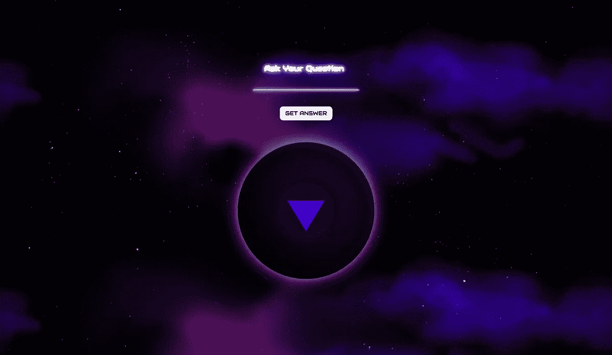
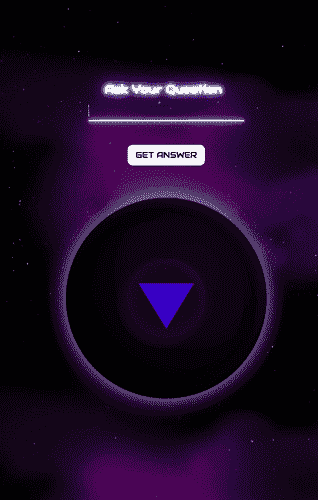

# 构建您的 Web 开发组合||是还是不是 API 挑战

> 原文：<https://javascript.plainenglish.io/build-your-web-development-portfolio-the-yes-no-api-challenge-f0af82b21b7a?source=collection_archive---------18----------------------->



Project’s end result

# 介绍

大家好，我是丹妮拉，我最近创建了一个名为 [**的项目，这是一个终极 api 挑战**](https://theultimateapichallenge.com/) ，在这个项目中，我想“打破”我们和 API 之间的坚冰，向大家展示如何使用不同的技术堆栈、文档、API，并创建有趣、超酷、有趣的 API 项目，这些项目可以添加到您的 web 开发组合中。

我不会讲太多细节，如果你有兴趣了解更多——看看第页的[或者下面的介绍视频🔽](https://theultimateapichallenge.com/about)

# 为什么这篇文章

每个挑战都会有一个视频代码，但我也在 Instagram 上问了一些文字形式的报道是否有帮助，你可能会猜到，答案是*是的*😄

我不会将视频中的内容复制成文本格式，因为…嗯…那只是转录它，其中的本质是什么？但是我会试着像我希望的那样深入地讨论视频中没有涉及的一些要点，或者在观看视频后可能出现的一些问题。

> 值得一提的是——如果有些链接没有包含在这里，你一定会在挑战赛的网站上找到它们——[https://theultimateapichallenge.com/](https://theultimateapichallenge.com/)

# 挑战

在这…嗯…集(？)选择的技术是 HTML、CSS、JS (ES6)和 fetch，我们将使用 **Yes-No API** ，其官方文档可在[此处](https://yesno.wtf/#api)找到，以构建:



UI Preview

在起始文件中(可以在 GitHub 上找到，链接在挑战赛的网站上)，你会看到非常标准的文件——html、css 和 javascript，以及一些助手，如`.prettierrc`(用于使代码看起来更漂亮的扩展，*需要手动添加到代码编辑器中*)和`.gitignore`(告诉哪些文件不应该自动添加到你的文件夹中，*如果你要将自己的存储库推送到 GitHub* )。

为了得到这个项目，你可以打开存储库或者下载 zip 文件，不管什么最适合你，然后在你选择的代码编辑器中打开它们(我使用 VSCode)。由于项目的样式和框架已经包含在内(HTML 和 CSS)，直接跳到 JS 文件— `script.js`。在那里，你会看到我在视频中也遵循的步骤(虽然不完美)，但它们仍然为从哪里开始和去哪里提供了某种指导。

首先，API 和文档。如果您访问文档，您会看到我们有一个`GET`端点`/api`，它翻译成`https://yesno.wtf/api`并且告诉我们一旦请求完成我们将会得到什么。 **GET** 是浏览器在做什么，当你给它一个要访问的地址时，它试图获取某个地址的页面。

> 你知道你可以去`[https://yesno.wtf/api](https://yesno.wtf/api)`看看 API 会用什么来回应你吗？

我们希望有相同的行为，但是用 JavaScript 编写，为此，在这个挑战中，我们将使用一个叫做 **FETCH** 的东西。

Fetch 是一个原生的(改进的)界面，使用起来非常简单，所以一开始它就像是一个完美的界面！如果您查看关于 fetch 的 MDN 文档，您会发现更深入的解释，但是现在，请查看如何使用它的示例:

```
fetch('https://yesno.wtf/api')
  .then(data => data.json())
  .then(data => console.log(data));
```

现在您已经有了这个，创建一个函数，并在加载时调用这个函数(在您的 JavaScript 文件的底部)。

要验证它是否有效，请在浏览器中打开 index.html 文件，右键单击(或根据鼠标设置单击)页面并选择“检查器”(至少在谷歌浏览器中是这样的，但我相信在其他浏览器中也是如此)，然后导航到一个名为“控制台”的选项卡。你应该在那里看到你的数据！

下一件事是将*两个*事件侦听器连接起来——一个连接到按钮元素，另一个连接到输入字段。您可以搜索 MDN 文档或查看网站上“有用资源”部分的第 2 个链接。

创建事件侦听器后，您需要调用发出 API 请求的函数，但是！需要记住的事情:

*   提交请求时，输入字段不应为空
*   只需按“Enter”键就可以触发输入字段监听器(提示:事件监听器给我们的`event`是这里的 ***键*** 😉)

一旦你成功地创建了上面列出的，就该把 API 的响应输出到我们的球里了！为此，您需要找到哪个元素正在期待它(提示:元素的 ***id*** 可以指导您)，首先找到元素——您可以参考控制台，但这次是在“元素”选项卡中，或者在代码编辑器中打开`index.html`文件。

*如果响应的输出不居中，则将其包装在< p >标签*中

现在是向用户添加一些视觉反馈的最佳时机，它可以包括使用 setTimeout 和从元素中添加/删除 css 类。

*   摇 _ _ 球类是你的朋友在这里，玩它
*   想想正在发生的一连串事件——用户提交的请求>获取>接收响应>清除它
*   在清除了球的响应后，不要忘记也清除输入字段！

最后但同样重要的是，当用户试图在输入字段中不输入任何内容的情况下提交请求时，添加一条错误消息。

如果你发现自己在任何阶段被卡住了，不要犹豫，参考视频中的代码，那里有章节，所以你可以直接跳到你被卡住的地方！

如果你正在做，请给我贴上标签，如果你有任何问题、建议等，请告诉我。！希望下一部能见到你👋