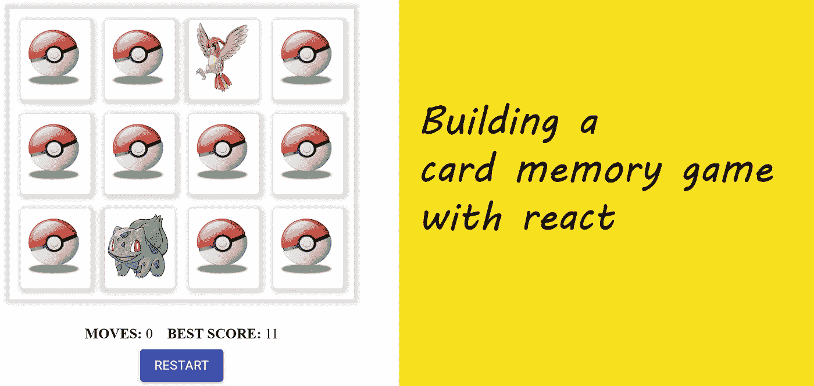
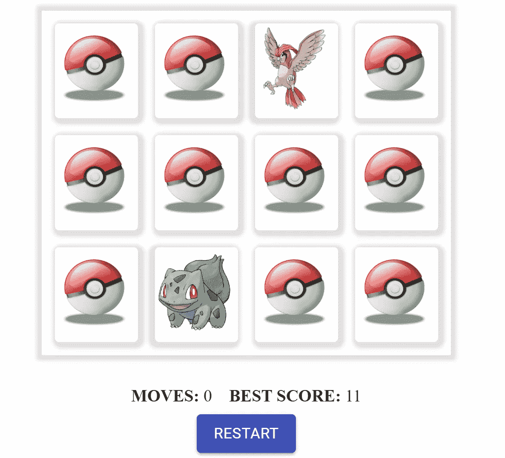

# 用 React 构建一个卡片记忆游戏

> 原文：<https://javascript.plainenglish.io/building-a-card-memory-game-in-react-e6400b226b8f?source=collection_archive---------0----------------------->



我们经常遇到小游戏，想知道它有多复杂？我们能建造它吗？我们通常不会超越它。然而在本帖中，我们将构建一个简单的记忆游戏，这个游戏很容易玩，也很容易开发。

卡片记忆游戏是一个简单的测试玩家记忆力的游戏。在一副成对的牌中，玩家需要在连续的回合中选择一对匹配的牌。当所有匹配对都被选择时，玩家赢得游戏。

一个简单的用户界面可能是这样的:



## 让我们来确定游戏规则

除非我们知道规则，否则我们无法制作游戏。所以让我们在这里陈述它们:

*   我们需要一套洗牌的纸牌。我们这副牌中每张牌必须有一对。
*   游戏必须翻转玩家点击的牌。一次最多显示两张卡片。
*   游戏将处理匹配和不匹配的卡片。不匹配的牌在短时间后会被翻回来。匹配的牌从这副牌中取出。
*   每当玩家选择一对，游戏将增加当前移动计数
*   一旦所有配对都被找到，玩家会看到一个带有分数的确认对话框。
*   游戏提供了重新启动的功能。

## 那么我们还在等什么呢...让我们开始吧。

我们首先定义我们的卡结构。对于卡片，我们创建一个具有类型属性和图像源的对象。

```
{
   type: 'Pickachu',
   image: require('../images/Pickachu.png')
}
```

现在下一步是洗牌。啊，是的，这是最重要的一步。如果我们不洗牌，这就不是真正的记忆游戏

## **1。洗牌**

我将使用 [**Fisher-Yates 洗牌算法**](https://en.wikipedia.org/wiki/Fisher%E2%80%93Yates_shuffle) 来洗牌，但我们可以使用任何给我们一个随机数组的算法或代码。

Fisher Yates shuffle algorithm to shuffle our card deck

## 2.一副牌的渲染板

在本例中，我们使用了 12 张卡(6 对)。洗牌后，我们将它们呈现为一个 3x4 的网格。你可以选择将你的卡片分成 3 组，每组 4 个物品，然后使用嵌套贴图或者 CSS flexbox 或者 grid 来渲染。我将使用 CSS Grid 来渲染它，因为用一维数组更容易处理更新。

Layout Component

Grid container CSS

## 3.翻转卡片，评估匹配和计算移动

下一步是为用户提供一个交互来翻牌并评估是否匹配。为此，我们维护以下状态

*   **openCards** 追踪玩家已经翻出来的牌
*   **清除的牌**用于跟踪已经匹配并需要从该副牌中移除的牌
*   **移动**跟踪玩家的移动。

Handling Flip and evaluate

一次我们最多只能保持两张卡处于**打开卡**状态。因为我们有一个静态数组，我们实际上并没有从我们的原始卡牌数组中删除任何东西，我们可以只存储在 **openCards** 状态下打开的卡牌的索引。基于**打开的卡片和清除的卡片**状态，我们分别传递一个 prop**is lipped**或 **isInactive** 到我们的卡片组件，然后它将使用该组件添加各自的类。

> 一定要看看[这篇精彩的博客](https://3dtransforms.desandro.com/card-flip)，它解释了如何处理翻转卡片动画。
> 
> **注意**:由于我们为翻牌添加了动画，我们在几秒钟后评估一场比赛，以允许翻牌过渡。

## 4.检查游戏完成情况

每次我们评估一个匹配，我们检查是否所有的配对都被找到了。如果是，我们向玩家展示一个完成模型。

## **5。最后，我们的重启功能**

嗯，重启很简单，我们只需**重置**我们的状态，然后重新洗牌。

万岁！这就是我们基本的记忆卡游戏。

Codesandbox playground

## **结论**

我很高兴我们走到了这一步。我们创建了一副混洗的牌，将其呈现在一块板上，添加了翻转功能，并对其进行了配对评估。我们可以扩展这个例子来添加一个计时器，添加玩家的最佳分数，并支持更高数量的卡。

你可以查看这个 Github 库中的完整代码。

*更多内容请看*[***plain English . io***](https://plainenglish.io/)