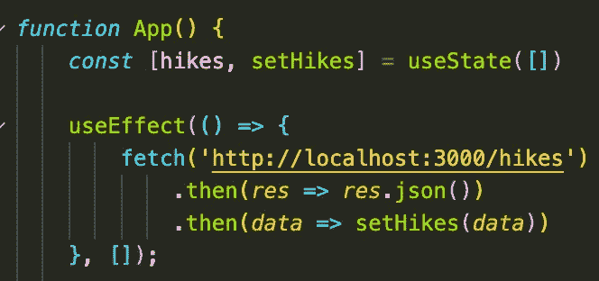
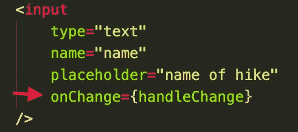
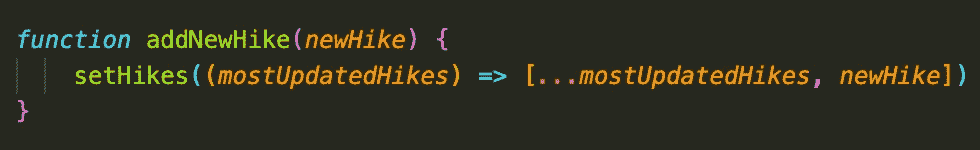
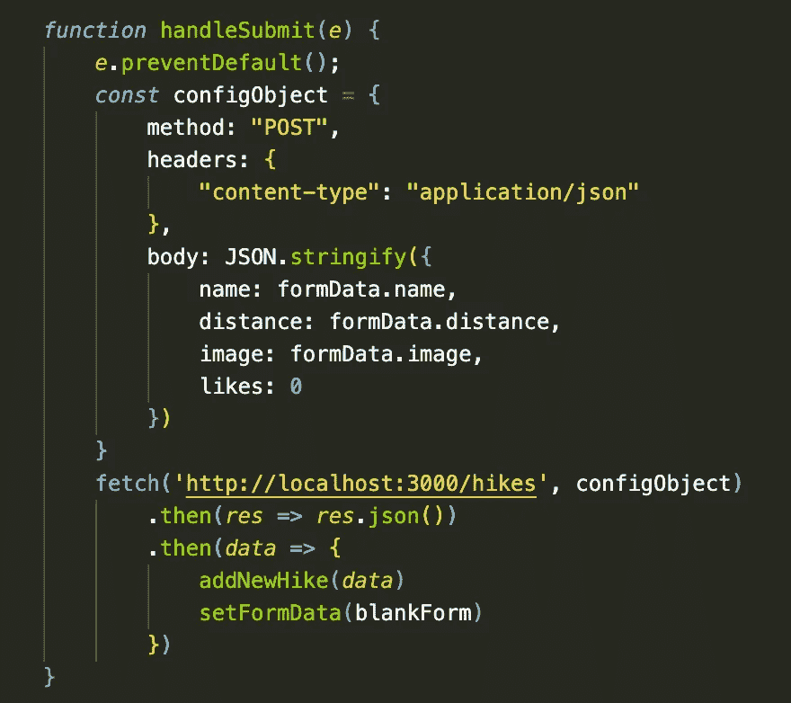
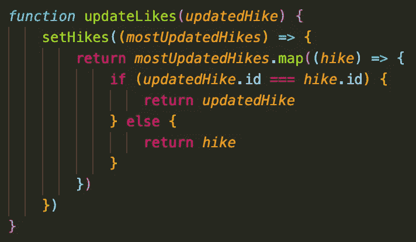
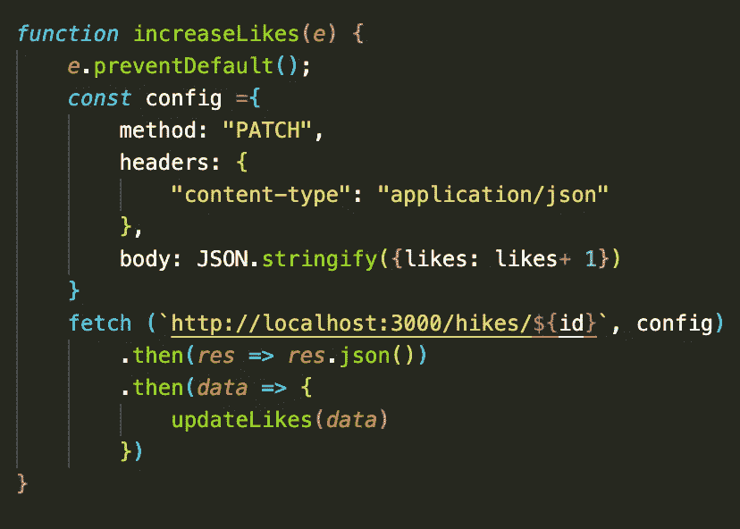
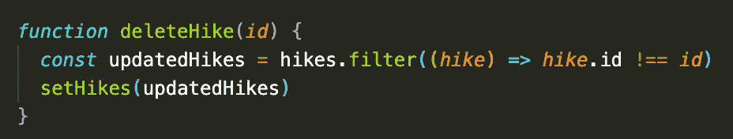
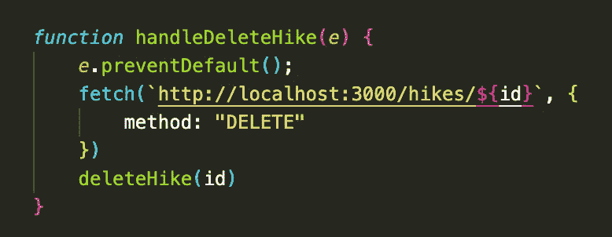

# 在 React 中构建 CRUD 应用程序

> 原文：<https://javascript.plainenglish.io/building-a-crud-app-in-react-js-96e884fe87f5?source=collection_archive---------9----------------------->

Photo by [AltumCode](https://unsplash.com/@altumcode?utm_source=medium&utm_medium=referral) on [Unsplash](https://unsplash.com?utm_source=medium&utm_medium=referral)

在本教程中，我将带您完成使用 React 构建 CRUD 应用程序的过程。

我们将使用一个非常简单的应用程序，我将其命名为*hicking Social*，人们可以在这里发布远足的照片，以及远足的名称和距离。人们还可以给远足添加“赞”，最后，出于本教程的目的，我们还将实现一个删除按钮来演示 CRUD 中的 D(删除)(创建、读取、更新、删除)。

这篇博客假设读者了解 JavaScript 和 React 基础知识，包括获取数据、使用有状态变量、事件和钩子。我们将以完整的功能组件结构开始本教程。如果您希望熟悉并从第二次提交开始跟进，请参考[回购](https://github.com/charcodes24/hiking-social)。

# 第一步:获取

我们的应用程序的组件结构非常简单:App 是 Header、NewHikeForm 和 HikesContainer 的父类。HikesContainer 是 HikeItem 的父级。由于 NewHikeForm 和 HikesContainer 是兄弟，并且需要访问我们最初获取的数据，因此在 App 中使用有状态变量来保存这些数据是最有意义的。

为了在打开我们的应用程序时获取和显示我们的数据，我们将使用 React 钩子，UseEffect。在第二个承诺中，我们将设置有状态变量来保存数据。一旦我们的有状态变量保存了数据，这是一个对象数组，我们将把它传递给需要访问这些数据的子组件。

# 第二步:获取(POST)

在我们的应用程序中添加一个徒步旅行的功能将会处理 CRUD 中的创建部分。为了完成这项任务，我们首先必须创建一个受控的表单，在其中我们可以跟踪我们想要发送到后端数据库的数据。通过将事件侦听器 onChange 添加到表单输入字段，并将引用传递给一个函数，该函数将有状态变量 formData 的值设置为等于您的输入，可以创建一个受控表单。

一旦我们的受控表单成功地捕获了输入字段中的文本，我们需要创建一个函数，它将获取表单数据并将其作为一个新的 hikes 添加到 hikes 数组的末尾。因为这个函数需要访问我们的 hikes 数组，该数组保存在我们的父组件 App 中，所以我们将在 App 中编写这个函数，并将其作为一个道具传递给我们的 NewHikeForm 组件。

这个函数将接受一个 newHike 参数，一旦在我们的 NewHikeForm 组件中调用它，它将被设置为等于我们的表单数据。然后，我们将使用 spread 操作符将 hikes 数组设置为等于“mostUpdatedHikes”数组，并在末尾添加 newHike。我们现在准备张贴！

当我们在 NewHikeForm 中提交表单时，我们的 POST 将发生，因此我们将在该组件中创建函数 handleSubmit()，并在事件侦听器 onSubmit 中传递对该函数的引用，我们将把该函数添加到我们的

handleSubmit 函数内部是我们的 fetch (POST)所在的地方。在我们的第二个承诺中，我们将把我们的数据传递给我们的 addNewHike 函数，作为 NewHike 参数。瞧啊。现在，在 db.json 中 hikes 数组的末尾有了一个新 hike，并且在 DOM 中显示了一个新 hike。您可以通过创建一个等于空 form data 的变量来重置表单数据，并在添加新远足后将其传递到 setFormData 中。您必须向输入字段添加值属性，并将这些属性设置为与输入字段对应的 formData[key]。

# 第三步:获取(补丁)

我们现在将添加功能到一个喜欢按钮，这将允许我们添加喜欢远足和持久化这些变化到我们的后端。我们的获取请求将存在于我们的 HikeItem 组件中，因为我们将喜欢单个徒步旅行并需要访问他们的 id。但是，我们必须在我们的应用程序组件中编写我们的 addLikes 函数，它将访问我们的徒步旅行数据，然后将其作为道具传递给我们的 HikesContainer，最后传递给我们的 HikeItem，在那里它将被执行。

在我们的 updatedLikes 函数中，我们将把 updatedHike 作为一个参数传递，这个参数就是我们的 fetch 返回给我们的数据。在这个函数中，我们将把 updatedHike 的 id 与 mostUpdatedHikes 数组中的每次远足进行比较。如果我们遇到匹配，我们将返回 updatedHike，它包含对 like 计数的更新，否则我们将返回原始 Hike。

我们现在准备打补丁了！在我们的 HikeItem 组件中，我们将编写创建一个函数 increaseLikes，它将作为对按钮上的事件处理程序 onClick 的引用被传递。

在这个组件中，我们可以访问 hike 的 id，它将被插入到我们的 fetch 请求的 URL 中，这样我们就可以准确地知道 hike 喜欢更新哪个。我们的身体会反映出我们想更新的那部分徒步旅行。在这种情况下，喜欢。

然后，我们接收到的对 fetch 的响应数据将被传递给我们的 updateLikes 函数，我们将该函数作为一个属性传递下去。再来一次-瞧！我们现在可以在喜欢与远足对应的按钮时增加对远足的喜欢。

# 第四步:获取(删除)

对于我们最终的 CRUD 可交付物，我们将向删除按钮添加功能，这将导致 hike 从 DOM 中删除，但也将更改保存到我们的后端数据库中。

这个最后的函数还需要访问我们在 App 中的 hikes 数组，所以我们将再次在 App 中编写初始函数，并将该函数作为一个道具传递给 HikeItem。

在我们的 deleteHike 函数中，我们可以在 HikeItem 组件中访问一个参数“id”。我们将在函数中声明一个新变量，并将它设置为 hikes 数组中 id 不等于我们作为参数传入的 id 的每一次 hikes。一旦我们剔除了不希望包含在新数组中的远足，我们将在 setHikes 函数中传递新数组。

我们现在准备删除！在我们的 HikeItem 组件中，我们将编写一个名为 handleDeleteHike 的函数，它将作为对添加到 delete 按钮的 onClick 事件处理程序的引用被传递。

就像我们的补丁获取一样，我们的删除获取也会将 id 插入到 URL 的末尾。没有响应或承诺要添加到提取中。相反，我们只是调用我们的 deleteHike 函数，并将 id 作为参数传入。

就这样，我们在 React.js 中创建了一个完整的 CRUD 应用程序。

*更多内容看*[***plain English . io***](http://plainenglish.io/)