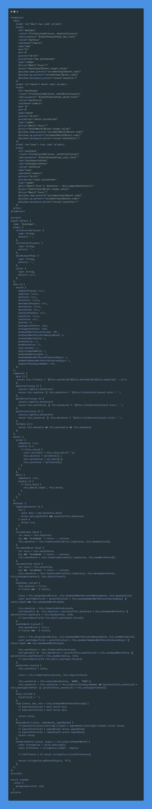
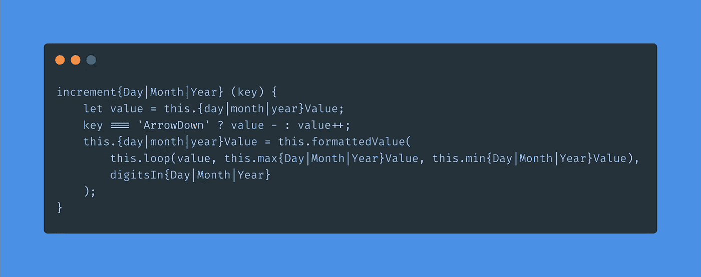
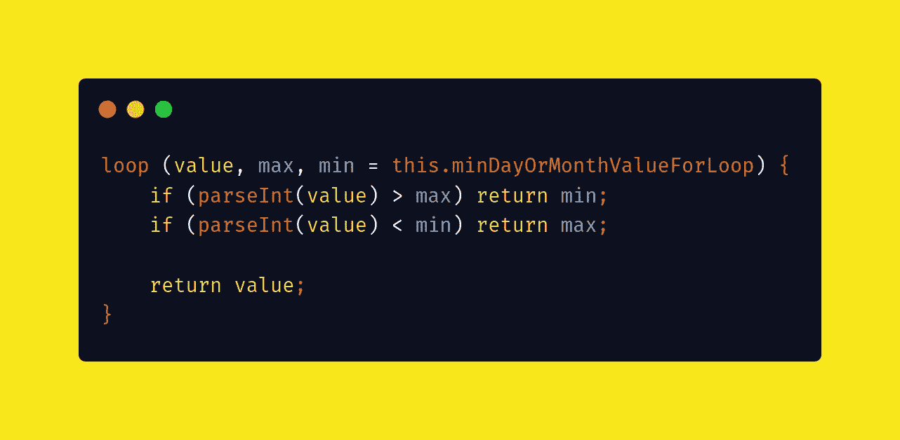
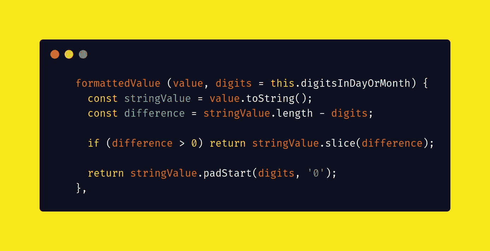
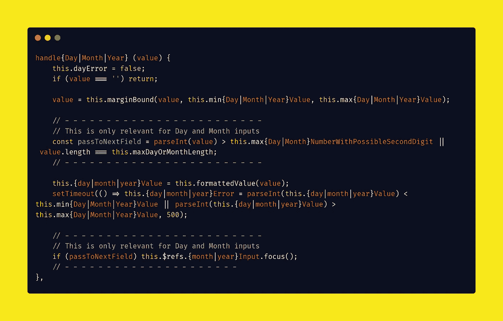
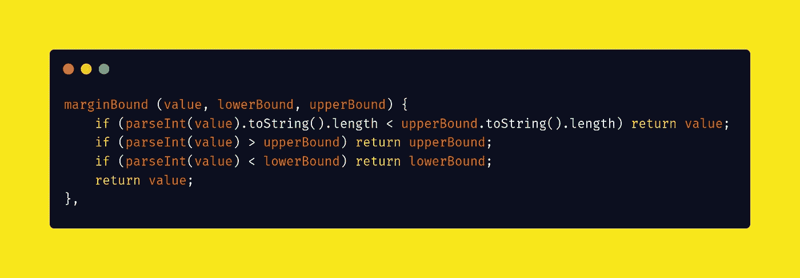
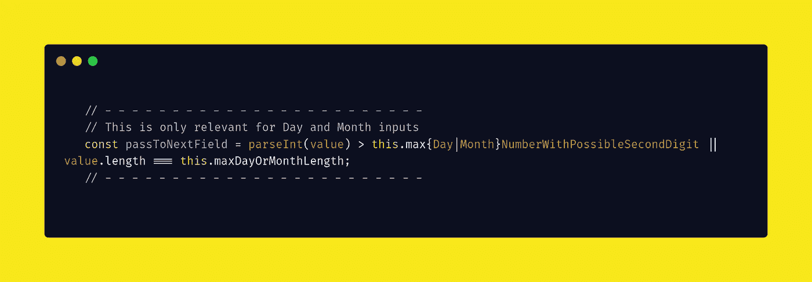
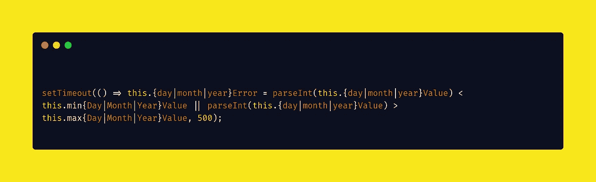
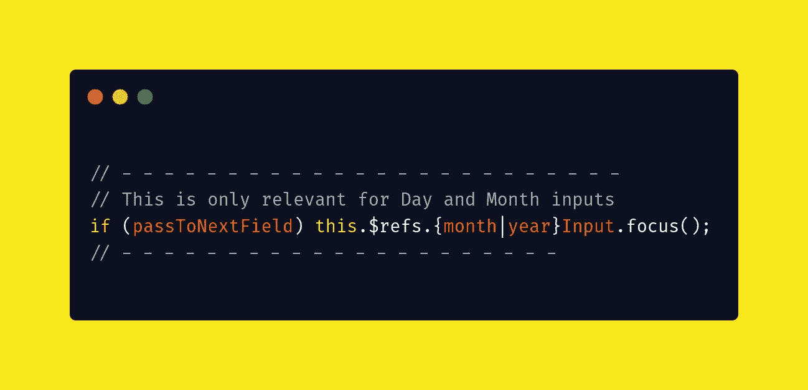
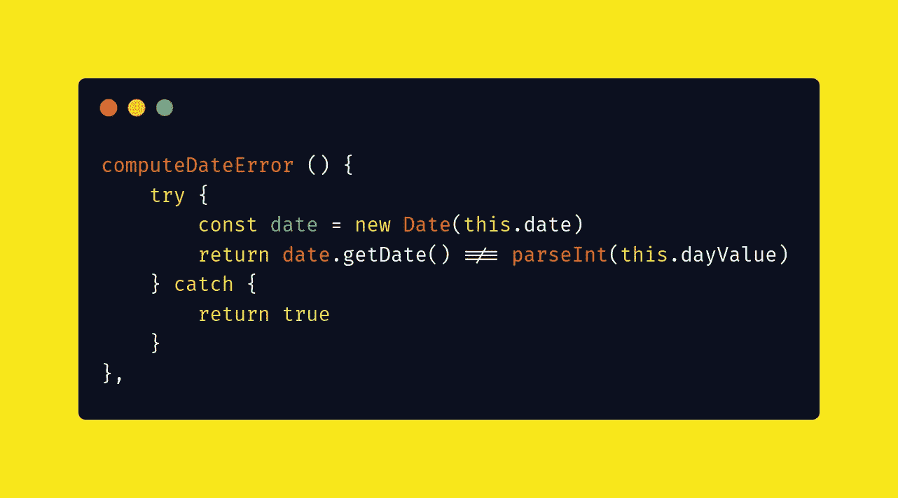

# 在 Vue.js 中构建一个自定义日期输入组件

> 原文：<https://javascript.plainenglish.io/building-a-custom-date-input-component-in-vue-js-b5641b7b7c2b?source=collection_archive---------7----------------------->


Photo by [Waldemar Brandt](https://unsplash.com/@waldemarbrandt67w?utm_source=medium&utm_medium=referral) on [Unsplash](https://unsplash.com?utm_source=medium&utm_medium=referral)

最近，我们有理由重新设计收集生日的方式(以及在塞拉菲恩的其他日期)。虽然默认的浏览器实现在开始时可以做到这一点，但我们面临着几个问题:

1.  并非所有浏览器的实现都是一致的。
2.  大多数浏览器打开的日历输入都聚焦于今天的日期，这让我们的用户很难输入他们的生日。

我们决定创建日期输入组件来解决这个问题(使用 Vue.js)。

虽然结果非常好，但它确实让我问自己，如果我们用普通的 Javascript 编写相同的行为，会有什么不同。

因此，这是本系列的第一篇文章，展示了我在 Vue.js. [中的自定义日期组件。在第二部分](https://pablo-curell-mompo.medium.com/bulding-a-custom-date-component-using-vanilla-javascript-4cb6e8f547a)中，我们将探索如何用普通的 javascript 构建相同的组件，我们将通过比较这两者来结束本系列。

# 规格

我们的 DateInput 组件的规范表现为浏览器上的本地日期输入减去日历选择，即:

*   我们只能输入两位数来表示日和月。
*   我们只能输入四位数的年份。
*   这一天应该在 1 到 31 之间
*   月份应该在 1 到 12 之间
*   年份应该在 1900 年到 2100 年之间(这个是我们的，不是浏览器的)
*   我们需要通过直接输入数字或者用箭头键上下移动来输入日期。
*   如果我们用箭头键输入日期，并达到上限或下限，显示的数字应该循环。
*   如果我们通过输入数字来输入日期，输入应该是有边界的(max(输入，高边界)或 min(输入，低边界)
*   我们应该以直观的方式让用户进入下一个领域。
*   我们应该证实日期是正确的。

# Vue.js 中的 DateInput 组件

下面是日期输入的代码(你也可以在这里找到)。你应该能够复制粘贴它，并使用它:)



Code of DateInput.vue

# 关注关键要素:

日、月和年的逻辑是相似的，所以让我们深入研究一下如何处理用户输入。

三个输入中的每一个都有两条路径:

## 增量{日|月|年}(键)

当我们使用箭头键时，可以访问该路径，并且将:

1.  根据您按下的箭头键，将该值增加或减少 1。



2.查看它是否在允许的值范围内，并相应地循环。



3.设置数值的格式，使其具有正确的位数。



## 处理{日|月|年}(值)

正如您所看到的，当用户通过输入数字来输入日期值时，事情会变得更加复杂。让我们剖析一下正在发生的事情:



1.  我们查看新值是否在允许的最大值和最小值范围内。



2.如果日值大于 3，或者月值大于 1(并且这些值足够长)，我们设置一个标志，在最后转到下一个字段。



3.我们将该值格式化为正确的数字。


4.我们在现场检查错误。



5.如果前面讨论的标志为真，我们传递到下面的字段。



## 错误检查

有一个小的复杂问题，当我们想要查看用户是否输入了正确的日期时，我们需要有点厚脸皮。例如，用户不能输入 30/02/1990 作为有效日期。

您可能会认为“新日期(' 30–02–1990 ')在不同浏览器之间的行为是一致的，但是您错了。

至少在 Firefox 和 Chrome 之间存在差异。

```
// Firefox =>new Date(‘30–02–1990’) => Error Date Invalid// Chromenew Date(‘30–02–1990’) => 02/03/1990
```

因此，为了验证正确的日期，我们在模糊年份输入时使用 computeDateError:



简而言之，如果日期抛出异常，我们将为错误返回 true。如果日期没有抛出异常，我们检查日期是否相同。

# 我应该用这个吗？

如果您正在使用 Vue.js，并且不想导入一个奇特的日期选择器库，或者只是想要一个没有让用户使用日期选择器的选项的输入，这是一个相当容易实现并且使用直观的方法。

如果可能的年份范围相对较大(因为在日期选择器中更改年份通常很麻烦)，那么与日期选择器相比，该组件甚至更有帮助。

# 结论

在 Vue.js 中制作一个定制的日期组件相当复杂，但最终相当简单(我们花了大约 3-4 天来实现，我们花在这上面的大部分时间是搞清楚规格和重构我们的代码。

如果使用日期选择器对用户来说有问题，您也许可以使用这样的组件。

请继续关注第 2 部分，并在 Twitter 上关注 [@pcurell](https://twitter.com/PCurell) 以了解我何时发布它:)

*更多内容看* [*说白了。在这里注册我们的*](http://plainenglish.io/) [*免费周报*](http://newsletter.plainenglish.io/) *。*