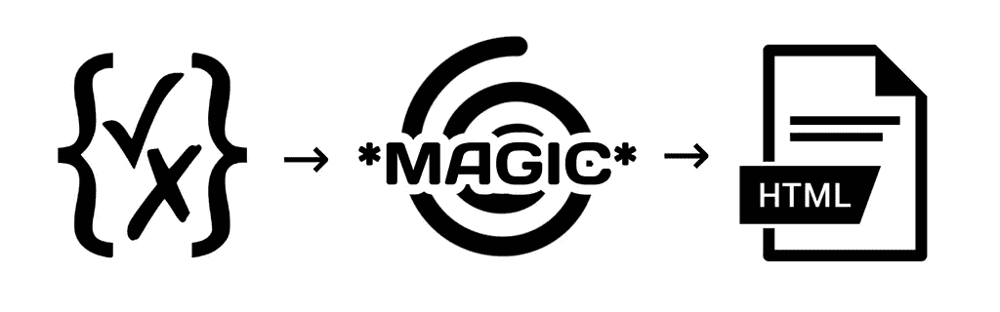
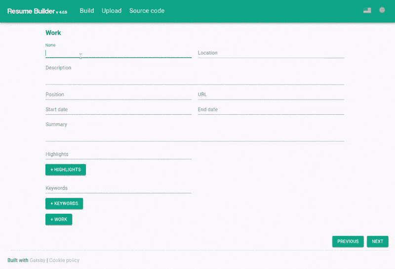

# 用 Formik 从 JSON 模式构建动态表单

> 原文：<https://javascript.plainenglish.io/building-a-dynamic-form-from-a-json-schema-37f0e2543c3b?source=collection_archive---------3----------------------->

大约 6 个月前， [Gatsby v3 发布了](https://www.gatsbyjs.com/blog/gatsbyconf-product-announcements)，我已经超级兴奋地将这个博客升级到 v3 并开始使用[增量版本](https://www.gatsbyjs.com/docs/reference/release-notes/v3.0/#incremental-builds-in-oss)，但是【可悲的是】[我的个人博客](https://pablo.gg/en/)有太多的定制，所以升级到 Gatsby v3 并不是一件容易的事情。

幸运的是，我的开源项目 [Resume Builder](https://github.com/blopa/Resume-Builder) 没有太多定制，所以我能够通过简单地运行`ncu -u`(由 [npm-check-updates](https://github.com/raineorshine/npm-check-updates) 发出的命令)将其升级到 Gatsby v3。但是在升级到 Gatsby v3 之后，我有点忘乎所以，决定实现一些新功能，比如从 2018 年开始我就一直在积压的[随函编辑器](https://github.com/blopa/Resume-Builder#cover-letter-editor)。

# 什么是简历生成器？

Resume Builder 是一个免费的开源项目，允许任何人使用电子表格或 JSON 文件作为数据源，轻松地维护和创建任何类型的简历。由于这个项目，我被雇佣去国外生活，正如我已经在另一篇博客文章中解释的那样。

这个项目最大的缺陷之一是，你必须已经有一个你的简历数据源，没有办法从头开始创建你自己的简历。

# 福米克

几天前，我看了贾里德·帕尔默的一个演讲，我确信我应该尝试一下 Formik，我有一个完美的特性。

# JSON 模式

我需要表单是动态的，这样用户可以添加他们想要的工作经验，既然我已经在使用来自 json-resume 项目的 [JSON 模式，为什么不用它来为我编程构建表单呢？](https://github.com/jsonresume/resume-schema/blob/81d9e75a3d7b599e202e7c3e31c55e634c7f1e39/schema.json)

在编码之前，我决定用我的 UML 知识来画一个如何工作的图表:

对于这篇博文，让我们使用 json-resume 项目中 JSON 模式的一个简单版本。

# 遍历 JSON

我使用的 JSON 模式中有 3 种不同的数据类型，`object`、`array`和`string`，所以遍历起来应该相当简单。

对于大多数情况，当 JSON 中没有重复的键，也不需要用户输入无限的数据时，这就足够了。

# 使用唯一键

现在事情开始变得有点复杂，为了确保每个字段都有唯一的键，我将在节点中累积键，例如对于对象`{ foo: { bar: '' } }`,`bar`节点的键将是`foo-bar`。我对此并不超级自豪，但我随时可以在以后重构它。

# 动态添加更多字段

为了动态添加字段，我决定创建一个局部变量，根据输入的惟一键来保存输入应该显示的次数。

将这段代码包装到 React 组件中后，我可以这样使用它:

这段混乱代码的结果如下所示:

您可以在 GitHub 上查看表单的[实际代码，好消息是下次 json-resume 模式改变时，我不需要做任何事情。](https://github.com/blopa/Resume-Builder/blob/4.0.7/src/components/DynamicForm.jsx#L48)

在[简历制作网站](https://resume-builder.js.org/en/build)上亲自尝试这份表格。

*原发布于*[*https://pablo . gg*](https://pablo.gg/en/blog/coding/building-a-dynamic-form-from-a-json-schema/)*。*

*更多内容请看*[***plain English . io***](http://plainenglish.io)