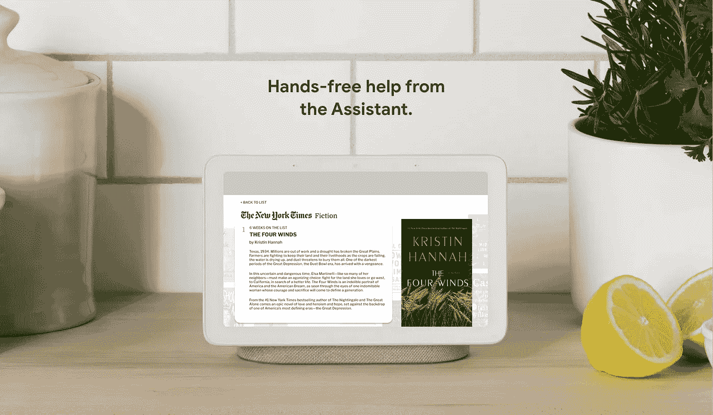
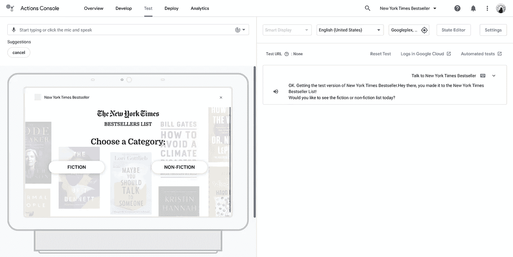
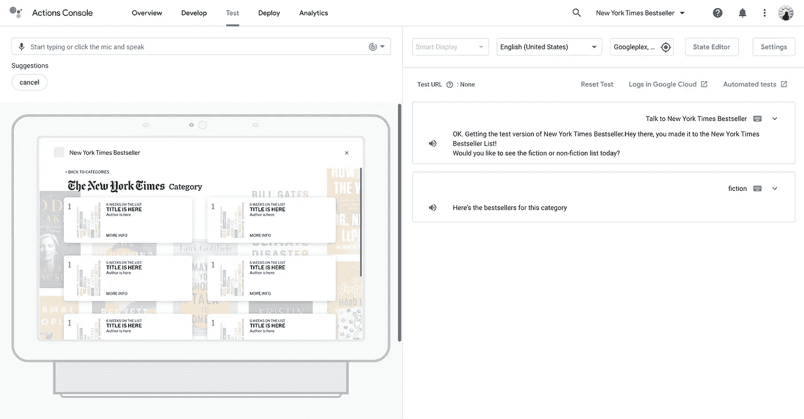
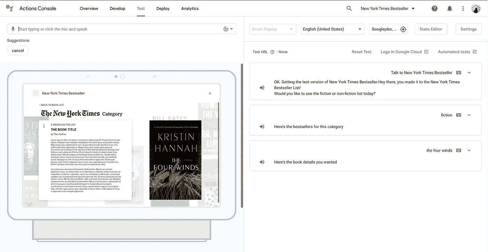
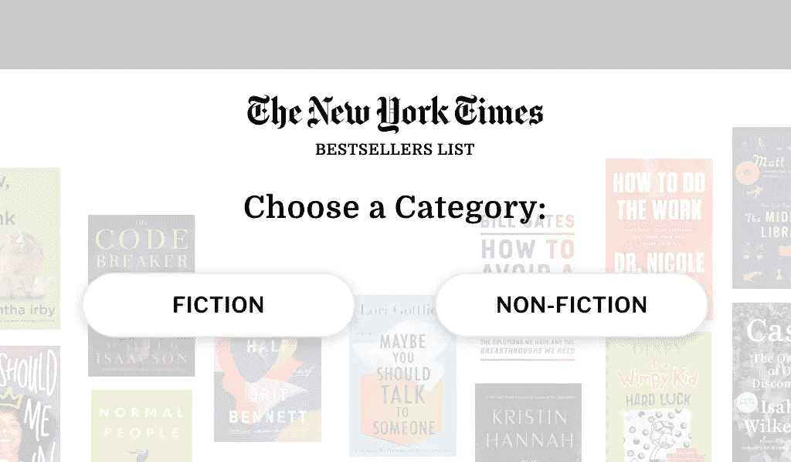
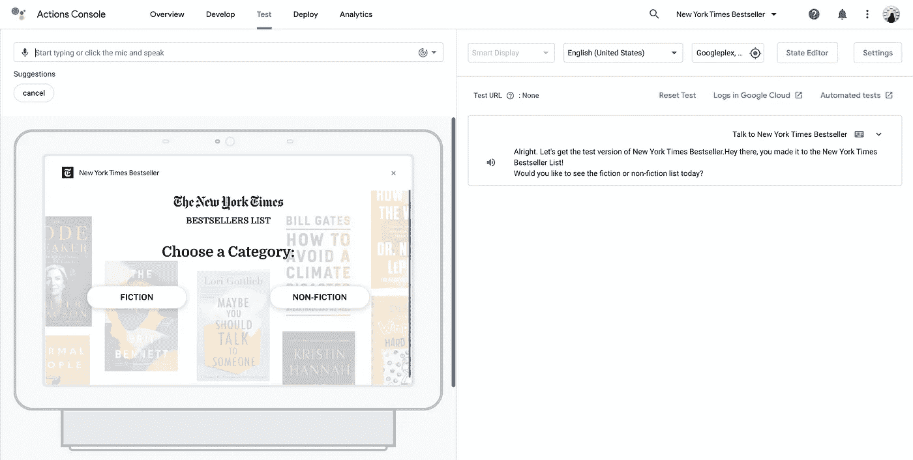
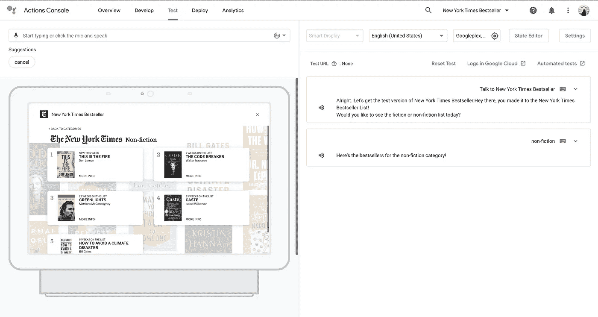
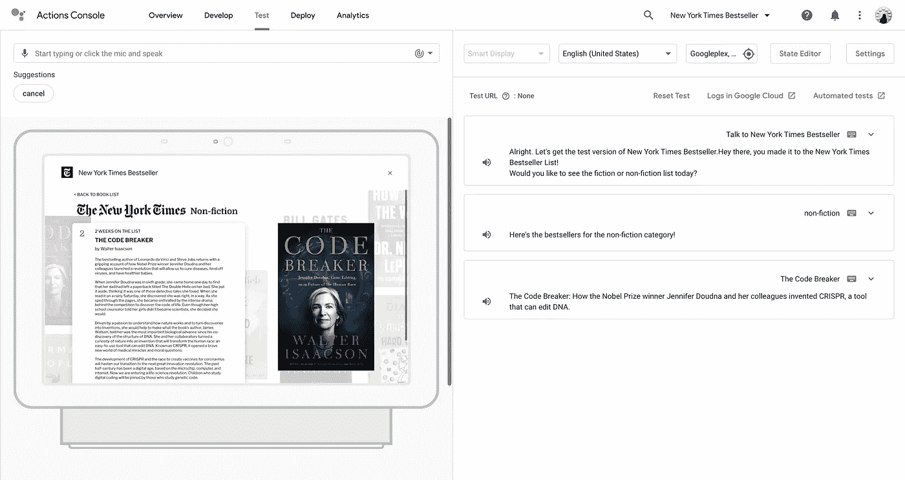

# 用交互式画布构建一个谷歌助手并作出反应

> 原文：<https://javascript.plainenglish.io/building-a-google-assistant-with-interactive-canvas-and-reactjs-part-3-5eaa14f48b6c?source=collection_archive---------12----------------------->

## 第三部分

欢迎来到本教程的最后一部分。在这里，我将介绍如何将参数从你的机器人传递到你的 ReactJS 应用程序，并向你的应用程序添加 onClicks！

在本文结束时，我希望您能够正确地部署您的《纽约时报》畅销书机器人并与之交互——从点击到跟踪会话参数。

如果你还没有看过前两部分，给他们看一看，尝试一下，因为第三部分将建立在已经完成的基础上！

**第一部分:**

 [## 用交互式画布和 ReactJS 构建谷歌助手——第 1 部分

### 如果你一直在探索谷歌助手及其产品，你应该见过谷歌巢枢纽，并可能阅读其…

celiaongsl.medium.com](https://celiaongsl.medium.com/building-a-google-assistant-with-interactive-canvas-and-reactjs-part-1-5e290eccfdbd) 

**第二部分:**

 [## 用交互式画布和 ReactJS 构建谷歌助手——第 2 部分

### 在上一部分中，我介绍了一些事情，比如您将需要的工具的基本设置以及在…

celiaongsl.medium.com](https://celiaongsl.medium.com/building-a-google-assistant-with-interactive-canvas-and-reactjs-part-2-3aa88584d4cd) 

假设您已经遵循了，甚至可能创建了自己的页面和设计，您可能会以下面的流程结束:

正如您所看到的，我们仍然到处都有`lorem ipsums`和占位符数据。

所以让我们先从这个开始。

# 将会话变量作为参数发送和跟踪到 ReactJS 应用程序

由于我不会介绍如何将 API 连接到您的机器人，我们将创建一些模拟数据供我们使用。

## 设置模拟数据

我将在`sdk` > `webhooks` > `ActionsOnGoogleFulfillment` > `index.js`中添加虚拟数据。

关于书籍封面图片，有很多方法可以存储它们，你可以选择自己喜欢的方式。从最简单的开始:

1.  只需将图像添加到您的`public`文件夹中，然后调用→注意，这意味着您调用的是您的`src`文件夹中的图像，而不是您的`sdk`文件夹中的图像
2.  上传到一些免费的图像托管网站，如 ImgBB，并使用生成的 HTML 网址
3.  用这个项目设置你的 Firebase 存储，把你的照片存储在里面，然后调用(但是要注意限制，比如 10GB 的存储空间，直到它开始让你付出代价)

我将使用 ImgBB，但你可以简单地用你喜欢的任何方法替换 URL。

以上是我的数据的一个片段，完整版本在我的存储库中。

我有一个短摘要和一个长摘要，以便机器人将读出短摘要，长摘要显示在屏幕上。

一旦你有了你的数据设置，你现在可以添加逻辑，这样当你的对话进入一个意图时，机器人知道如何处理它，并在屏幕上显示它。

## 向 React 应用程序发送参数

当用户在`Welcome`场景中说“看看小说列表”时，我们只想选择小说列表并将其解析到前端。

注意这里要做的 3 件事:

1.  `conv.session.params.book_categories_options`用于让我们知道用户选择了哪个类别。这与在`Welcome`场景中完成的填充缝隙相关联。
2.  `handleTypeOverride`使用`conv.session.typeOverrides`来覆盖我们最初在谷歌控制台上列出的`books_options` `Types`。这里，我们需要列出类型中的条目及其`name`和`synonyms`。这样，每当我们有新数据时，我们就不必手动更新`Types`。
3.  `new Canvas`已经通过`params`了。`params`是 React 应用程序用来更新屏幕的。

对于`book_details` webhook，我们不需要覆盖类型，但是我们需要知道用户选择了哪本书，并再次通过`params`将细节传递给 React 应用程序。

既然已经解决了 webhook，让我们看看如何在 ReactJS 应用程序中使用它。

## 在我们的 ReactJS 应用程序中使用 BE 中的参数

如果您还记得第 2 部分，我们的`Canvas.js`是这样的:

注意这里调用的`dataEntry.params`。我们将用它来设置`this.state.params`并将`params`传递给我们需要的任何组件。

**就这样！简单地对你的其他组件/页面重复同样的操作(如果你需要参数的话),现在你已经成功地将数据从机器人传递到你的 ReactJS 应用程序了。**

我要介绍的最后一件事(也是可选的)是在应用程序中添加 onClicks，这样用户可以点击屏幕来触发一个意图。

# 在 ReactJS 应用程序中添加 onClicks

让我们再次以用户在`Welcome`场景中点击虚构和非虚构按钮为例。

我们要做的就是:

1.  在按钮上添加 onClicks
2.  利用`interactiveCanvas.sendTextQuery(query)`

**就这样！**

# 总结

如果你已经完成了教程，这里应该是这样的！

如果你需要我的资料库，这里是:

 [## celiaongsl/纽约时报-畅销书

### 这个项目是用 Create React App 引导的。在项目目录中，您可以运行:在…中运行应用程序

github.com](https://github.com/celiaongsl/new-york-times-bestseller) 

我已经把各部分分解成各自的分支，这样你就可以看看你需要什么了。

当然，你可以为测试者甚至公众使用部署你的机器人。但我相信这应该很容易操作！

请在评论中告诉我你的想法！

我相信随着谷歌改进他们的产品，许多事情可能会改变，嘿，你甚至可以找到更好的方式来写东西！但希望这将是你进入交互式画布的第一步，并探索它能做什么！

万事如意:)

*更多内容尽在*[***plain English . io***](https://plainenglish.io/)