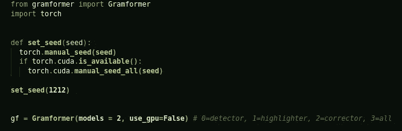
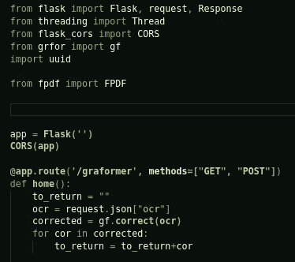
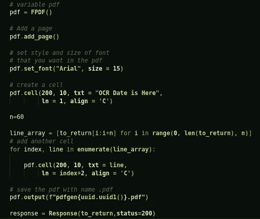
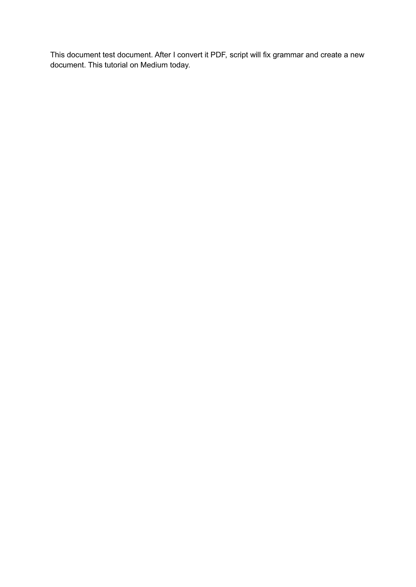
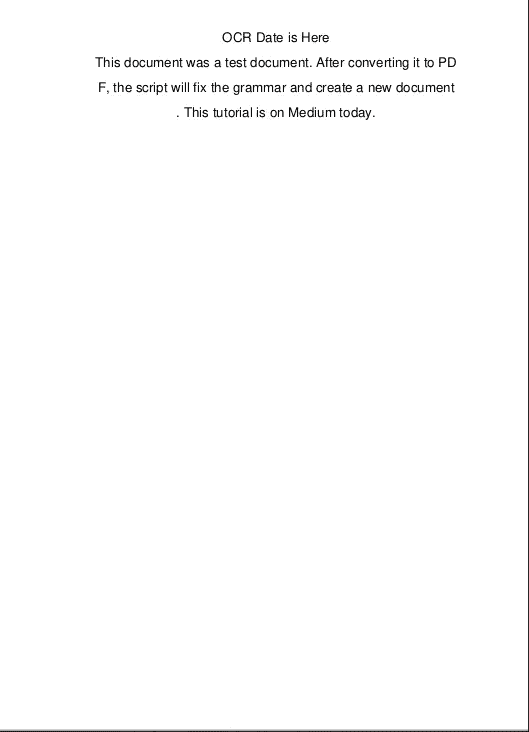

# 用 React、Python、Flask、Tesseract 和 Gramformer 构建一个语法修正器应用程序…

> 原文：<https://javascript.plainenglish.io/building-a-grammar-corrector-app-with-react-python-flask-tesseract-and-gramformer-13883f37b0ea?source=collection_archive---------18----------------------->

Photo by [Anne Nygård](https://unsplash.com/@polarmermaid?utm_source=medium&utm_medium=referral) on [Unsplash](https://unsplash.com?utm_source=medium&utm_medium=referral)

2021 年 6 月 24 日

大家好！今天，我将向您介绍一个应用程序，它允许您获取一个图像文件，将其上传到 React 前端，对其应用 OyCR(光学字符识别),将其发送到 Flask 后端，然后“gramformer”库将检查并更正语法，然后我们将使用更正的文本创建一个新的 PDF。

你可以在这里找到源代码[，这里我不再解释 React 和 OCR 部分。你可以在我以前的帖子](https://github.com/eren23/react-python-ocr-gramformer)[这里](/full-stack-sentiment-analysis-application-with-react-flask-and-tesseract-ea2de9200169)找到。如果你感兴趣，你也可以在我提供的链接中关注 React OCR——情感分析应用程序。

为了能够使用“gramformer”，你可以从链接[这里](https://github.com/PrithivirajDamodaran/Gramformer)进入 GitHub repo，并按照说明进行操作。“Gramformer”依赖于“pytorch”，你也需要预先安装它。如果你还没有它，使用[链接](https://pytorch.org/get-started/locally/)并安装它。

一切准备就绪后，我们可以开始开发我们的应用程序了。

我们首先将手动种子设置为 torch，然后在校正器设置和 GPU 禁用的情况下启动我们的“gramformer”类，如果您愿意，您也可以启用它，但不启用它也可以正常工作。

然后在不同的文件夹中，在我的例子中是 server.py，您应该首先导入依赖项，然后我们可以创建我们的服务器。在这个特定的例子中，我们的“/graformer”端点将接受“GET”和“POST”请求，但是“GET”请求在这里并不特别重要。在我们的有效载荷中，如果请求中有一个“ocr”字段，我们就可以这样做，如果有，我们就进行语法纠正，并将纠正列表中的正确字段添加到“to_return”字符串中。除了 Flask，我们唯一需要的依赖项是“fpdf ”,你可以在这里得到它。

然后我们创建我们的“pdf”对象，添加一个页面，添加我们的标题。处理更长的字符串有点棘手，我选择计数每个字符，然后在一定数量的字符后在 pdf 中放入一个新行，为此我创建了一个每行有一个成员的列表，然后遍历列表并创建了 PDF。我还返回了正确的文本以及 200 状态代码。

结果:我使用的输入图像如下图所示。

我们得到的输出是这个。有趣的是，我意识到我的硬编码 PDF 标题也是狗屎，可以使用“gramformer”更正。:D

无论哪种方式，结果对我来说都很不错，尤其是付出了这么少的努力。我希望它对你也真的有用。

直到我们再次见面，照顾好自己，继续学习。:)

*最初发表于*[*【https://blog.akbuluteren.com】*](https://blog.akbuluteren.com/blog/grammar-corrector-react-flask-tesseract-)*。*

*更多内容请看*[***plain English . io***](http://plainenglish.io/)