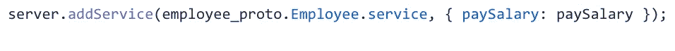

# 用 Node.js 构建 gRPC 客户端和服务器

> 原文：<https://javascript.plainenglish.io/building-a-grpc-client-and-server-with-node-js-1722fd46bf28?source=collection_archive---------1----------------------->

几个月前，我在做一个项目，在这个项目中，我被要求使用 gRPC 来获取一些数据。对我来说，是第一次听说这个名词 **gRPC。**


When in doubt, google !

我联系了一些人，但没有得到多少帮助。我在 Googled 上搜索了 Node.js 中的 gRPC 实现，但是没有找到详细实现的正确来源。

经过大量的研究，在网上几乎没有资源的情况下，我终于完成了我的工作。

在本文中，我将分享如何用 Node.js 设置 gRPC 服务器和客户机。


# gRPC 是什么？

gRPC 是 Google 远程过程调用，它只是一个像 REST 一样获取或发送数据的协议。如果你想了解更多关于 gRPC 的信息，你可以在这里阅读。我不会谈论使用 gRPC 相对于 REST 的好处，反之亦然。


Source: [https://grpc.io/](https://grpc.io/)

# 概念

gRPC 与服务合作。服务只是一个可以用参数和返回类型远程调用的方法。我们可以在`.proto`文件中定义我们的服务。

salary.proto

在`proto`文件中，我定义了两条消息`EmployeeRequest`和`EmployeeResponse`。在`EmployeeRequest`中，我们接受一个叫做`employeIdList`的字段，它可以是一个整数数组，而`EmployeeResponse`中有一个叫做`message`的字段。

我定义了一个名为`Employee`的服务，它有一个`rpc`函数`paySalary`来检查工资是否已经发放。

让我们假设我的后端服务器已经设置好了，我只需要打一个电话并得到响应。

要在客户机上设置 gRPC，我需要安装一些依赖项来运行它。

```
- [@grpc/grpc-js](https://www.npmjs.com/package/@grpc/grpc-js)
- [@grpc/proto-loader](https://www.npmjs.com/package/@grpc/proto-loader?activeTab=readme)
```

client.js

如上所述，gRPC 使用在`.proto`文件中定义的服务。在上面的代码片段中，我们用`loadSync`方法加载了`.proto`文件，并将`loadSync`的输出传递给 gRPC 的`loadPackageDefinition`。

# 对 gRPC 服务器的请求

让我们看看如何连接到远程服务器并获取数据。

在上面的代码片段中，我定义了一个名为`main`的函数，它负责在没有身份验证的情况下连接到服务器。
我将雇员 id 的虚拟列表`employeIdList:[]`传递给我们的 RPC 函数`paySalary`，在成功连接和客户端请求之后，我们在回调中得到响应😃。

即将发生🤩。从远程 gRPC 服务器获取数据只需进行最少的设置。


现在让我们看看如何用 Node.js 创建 gRPC 服务器。

# 服务器设置

在深入了解创建服务器所需的每个组件的细节之前，让我们先检查一下实现。

我已经安装了依赖项。但是创建、启动和保持服务器运行需要一些重要的方法。

下面是列表:
**—** `**server()**`它将创建服务器。
**—** `**bindAsync()**`将指定地址和端口来监听客户端传入的请求，在回调中，我正在启动 RPC 服务器。
**—** `**addService()**`它将添加带有相应实现的服务。

pay_salary.js

在上面的代码片段中，我定义了传递给服务的方法实现。它接收来自客户端请求的数据`employeeIdList`，对其进行处理，并将响应发送回客户端。



我的服务器能够监听客户端的请求并发回响应。是啊！我们完了！😃😃😃😃让我们庆祝一下！


我已经分享了用 Node.js 创建和启动一个服务器，以及创建一个 gRPC 客户机向 gRPC 服务器发送请求所需的最小设置。
本文将让您开始探索更多关于 gRPC 及其实现的内容。

我希望你喜欢阅读这篇文章。

***如果你喜欢这个，一定要关注我的*** [***推特***](https://twitter.com/aatifbandey) ***！***

# 参考

[https://grpc.io/docs/languages/node/basics/](https://grpc.io/docs/languages/node/basics/)

*更多内容请看*[***plain English . io***](http://plainenglish.io/)