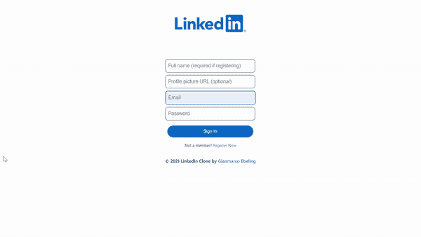
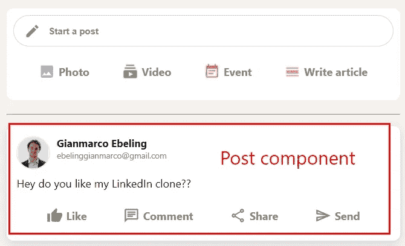
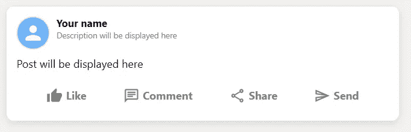
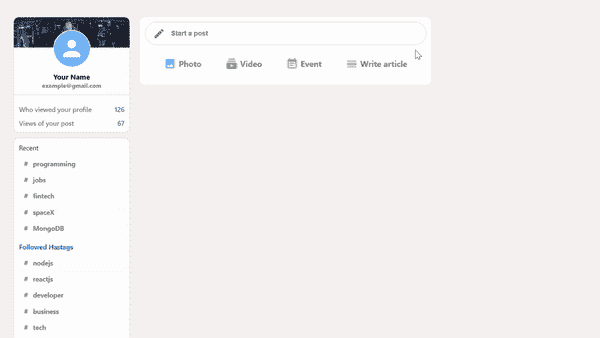
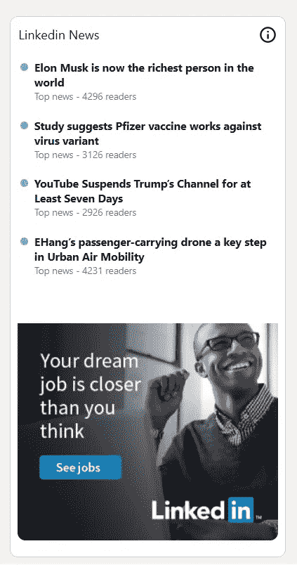

# 打造 LinkedIn 的复制品

> 原文：<https://javascript.plainenglish.io/building-a-linkedin-clone-1d44652f162e?source=collection_archive---------7----------------------->

## 第 3 部分:完成提要并构建小部件组件。



Eyes on the prize: this will be the final result.

你是想让你的开发者技能更上一层楼，还是想给你未来的雇主留下深刻印象？然后打造这个 [**LinkedIn 克隆**](https://linkedin-clone-5ebs.web.app/) **！**

如果你卡住了，不要担心！我将在每一节的结尾为您提供完整的代码。此外，在本教程的最后一期中，我将让您访问我的 GitHub 上的完整源代码。

# 第三部分

在本系列的第 2 部分中，我们完成了标题组件，构建了侧边栏组件，并完成了提要组件的顶部。

在这一部分中，我们将总结提要并构建小部件组件。

# 1.—完成进给组件

为了完成我们的`<Feed/>` 组件，我们必须构建`<Post/>` 组件。



The post component

*   在`Feed`文件夹中，创建一个名为`Post.js`的文件。
*   一旦你在文件中，键入`rfce` 使用片段从 *ES7 片段。*
*   仍然在`Pages` 文件夹中，制作一个`Post.css`文件，导入到你的`Post.js`组件中。
*   `<Post/>` 组件将有四个道具作为参数:`name`、`description`、`message`和`photoUrl`。
*   在 post 容器中添加两个`<div>`子容器，分别为`post__header` 和`post__body` *。*
*   在 *post__header* `<div>`中增加一个来自物料 UI 的`Avatar`组件。
*   至此，您的`Post.js`文件应该如下所示:

*   回到`Feed.js`文件，导入并渲染`<Post/>` 组件，为道具传递以下值:

为了创建帖子按钮*【赞】**【评论】【分享】**【发送】*，我们将使用`InputOption`组件，为道具传递不同的值。

*   回到你的`Post.js`文件，添加一个`<div>`与**`className`的*post _ _ 按钮。*在 if 内部，粘贴以下代码:**

*   **从物料 UI 导入`InputOption`组件和图标组件。**
*   **在您的`Post.css`文件中添加一些样式:**

**做得好，你的`<Post/>` 组件准备好了！**

****

# **2.—将 Feed 组件连接到 Firestore**

**到目前为止，提要组件中的所有数据都是硬编码的。
为了从****Firestore 数据库**中获取数据，我们将使用一些钩子和我们在第一集中创建的`firebase.js`文件。****

*   ****在终端中键入以下内容，然后按 Enter 键。****

****`npm install firebase`****

*   ****回到`Feed.js`文件，从 React 导入 UseState。****
*   ****在**进给**函数中定义状态，给它一个空数组作为初始值:****

```
**const [posts, setPosts] = useState([])**
```

*   ****从`firebase.js`文件导入数据库。****

```
**import { db } from ‘../../firebase’;**
```

*   ****在下面的代码中添加一个`useEffect`钩子:****

****这将允许您的应用程序连接 Firestore 中的“posts”集合，在每次“posts”集合发生变化时访问和更新该集合的快照。****

*   ****将`<Post/>`组件更改如下:****

****这样，我们将通过 posts 数组进行映射，返回带有从 Firestore 数据库中检索到的值的`<Post/>`组件。****

*   ****创建一个名为`sendPost`的函数:****

****该功能将以对象形式在 Firestore 数据库中添加帖子。****

*   ****要更新**进给**状态，创建另一个状态:****

```
**const [input, setInput]= useState(“”)**
```

*   ****在表单内部将 **<输入>** 的值设置为{input},并将一个箭头函数添加到 ***onChange*** 事件中。每当用户在表单中键入内容时，这个函数就会被触发，将输入的值更改为用户所写的内容。****

****此时，您的`Feed.js`文件应该如下所示:****

****让我们通过创建一个新帖子来测试它:****

********

****干得好，Feed 组件现在已经连接到 Firestore 了！****

# ****3.—构建小部件组件****

*   ****在`Widgets` 文件夹中，创建一个名为`Widgets.js`的文件。****
*   ****进入文件后，键入`rfce`使用来自 *ES7 片段的片段。*****
*   ****还是在`Widgets` 文件夹中，做一个`Widgets.css`文件，导入到你的`Widgets`组件中。****
*   ****在`Widgets.js`文件中，用*小部件的`className`创建一个`<div>`容器。*这将包含另一个`<div>`子控件与 *widgets__header 的`className`。*****
*   ****在 widgets _ header`<div>`中呈现 MateriaUI 中的一个`<h2>`和一个`<Icon>`****

****为了创建新闻列表，我们将使用一个名为`recentItem`的函数，该函数将标题和副标题作为参数，并返回 JSX 代码。****

*   ****至此，您的`Widgets.js`文件应该如下所示:****

*   ****为了给我们的`Widgets`组件添加一些样式，打开`Widgets.css`并添加以下代码:****

****我们刚刚构建了小部件！****

********

# ****结论****

****这部分到此为止。让我们总结一下到目前为止我们所做的工作:****

1.  ****构建了提要组件。****
2.  ****将 Feed 组件连接到 Firestore。****
3.  ****构建了小部件组件****

****在下一篇文章中，我们将设置 Redux，构建登录页面，并将我们的应用程序部署到 Firebase。敬请期待！****

*****考虑* [***成为一个中等成员***](https://ebelinggianmarco.medium.com/membership)**如果你喜欢阅读这样的故事，并且想帮助我这个作家。每月 5 美元，你可以无限制地访问媒体内容。如果你通过* [***我的链接注册，我会得到一点佣金。*T57**](https://ebelinggianmarco.medium.com/membership)*****