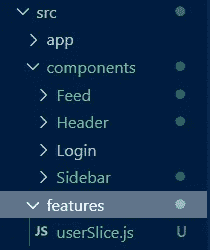
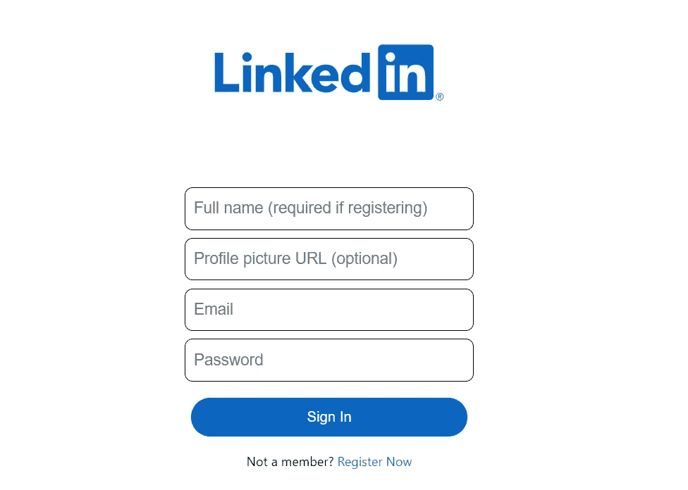
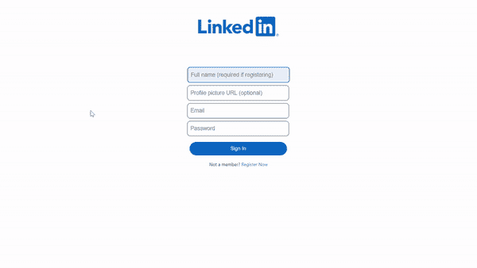
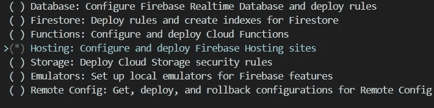
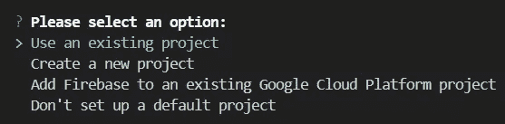
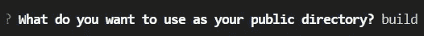

# 构建领英克隆

> 原文：<https://javascript.plainenglish.io/building-a-linkedin-clone-302206776137?source=collection_archive---------5----------------------->

## 第 4 部分:Redux 设置，构建登录页面，并部署到 Firebase。


Photo by [inlytics | LinkedIn Analytics Tool](https://unsplash.com/@inlytics?utm_source=unsplash&utm_medium=referral&utm_content=creditCopyText) on [Unsplash](https://unsplash.com/s/photos/linkedin?utm_source=unsplash&utm_medium=referral&utm_content=creditCopyText)

你想让你的开发技能更上一层楼还是想给你未来的雇主留下深刻印象？那就建立这个 [**领英克隆体**](https://linkedin-clone-5ebs.web.app/) **！**

# 第 4 部分

在本系列的[第 3 部分](/building-a-linkedin-clone-1d44652f162e)中，我们构建了 Feed&Widgets 组件，并将 Feed 组件连接到了 Firestore。

在最后一篇文章中，我们将设置 Redux 来管理用户状态，构建登录页面，最后部署到 Firebase！

# 1.—设置 Redux

Redux 是一个用于管理应用程序状态的 JavaScript 库。在第一集里，我们用**[**Redux Toolkit**](https://redux-toolkit.js.org/introduction/quick-start)**创建了一个 **React** 应用启动器。**这创建了一个模板来使用 Redux with reaction。在继续之前，我们必须重新组织由模板创建的文件夹。**

*   **从`counter`文件夹中删除`Counter.module.css`和`Counter.js`文件。**
*   **将`counterSlice.js`文件移到`features`文件夹。**
*   **删除`counter`文件夹，将`counterSlice.js`文件重命名为`userSlice.js`。**

****

*   **将`userSlice.js`中的代码替换为:**

*   **用以下内容替换`store.js`文件中的内容:**

**Redux 创建了一个数据层，通过该层我们可以将用户的信息传递给其他组件，从而避免了正确钻孔的问题。登录页面将收集来自用户的信息(如姓名、电子邮件、个人资料图片)，这些信息可以被从 Redux 创建的数据层中提取数据的其他组件使用。此外，我们还可以控制用户的状态，管理`login`、`logout`动作。**

**当用户注销时，用户的状态将等于`null`，而当用户登录时，状态将等于`action.payload`，一个包含用户信息的对象。**

*   **现在转到`App.js`并添加以下代码:**

```
const user = useSelector(selectUser)
```

**这将从数据存储中提取数据。**

*   **在`App.js`中，如果用户已登录，使用三元运算符显示主应用程序，或者如果用户已注销或没有个人资料，则显示登录页面。**

**您的`App.js`文件现在应该看起来像这样:**

**我们现在必须创建登录页面。**

# ****2。—创建登录页面****

****

**The login page.**

*   **在`Login` 文件夹中，创建一个名为`Login.js`的文件。**
*   **一旦你在文件中，输入`rfce` 来使用来自 ES7 片段*的片段。***
*   **还是在`Login` 文件夹中，做一个`Login.css`文件，导入到你的`Login.js`组件中。**
*   **最终的`Login` 组件将是这样的:**

**登录页面由徽标、一个带有四个不同`<input>`的`<form>`、一个按钮和一个`<span>`组成。
为了跟踪用户的电子邮件、姓名和密码，我们使用 React 钩子`useState`。这些状态的初始值将是一个空字符串。添加一个`onChange`事件，我们可以将这些状态的值设置为用户输入的值。**

**使用 [Firebase 认证](https://firebase.google.com/docs/auth/web/password-auth)和`createUserWithEmailAndPassword`通过箭头功能`register`管理注册。**

**使用 [Firebase 认证](https://firebase.google.com/docs/auth/web/password-auth)和`signInWithEmailAndPassword`通过箭头功能`loginToApp`管理认证。**

**用`UseDispatch()`钩子将从用户那里收集的信息推送到 redux store 中。**

*   **为了给我们的`Login.js`组件添加一些样式，打开`Login.css`并添加以下代码:**

****

**登录组件现在可以工作了！**

**为了完成我们的应用程序，我们现在必须添加注销功能，在用户登录后保持登录，并在来自****Firestore 数据库的提要组件中显示数据。******

*   ****回到`App.js`组件，添加以下代码:****

****`onAuthStateChanged`监听器监视用户是否登录。****

*   ****现在转到`HeaderOption.js`并将`onClick`事件添加到`HeaderOption`函数中。****
*   ****转到`Header.js`并添加以下代码:****

****这将为“注销”按钮添加注销功能。****

*   ****现在转到`Sidebar.js`文件，将内容改为如下:****

*   ****转到`Feed.js`文件，将内容更改如下:****

****`useSelector()`钩子允许我们使用选择器函数从 Redux 存储状态中提取用户的数据。这样，数据不再是硬编码的，而是从 **Firestore 数据库中获得的。******

****恭喜你！您刚刚构建了一个 LinkedIn 克隆版！！****

# ****3.—部署到 Firebase****

****部署前，确保安装 [Firebase 工具。](https://firebase.google.com/docs/cli#install_the_firebase_cli)****

*   ****要部署我们的项目，请转到控制台并键入命令**“firebase init”******

********

*   ****选择使用现有项目****

********

*   ****在公共目录中键入“ **build** ”****

********

*   ****配置为单页应用程序****
*   ****现在在控制台中运行命令" **npm run build** "****

****这将创建应用程序的优化版本，以便在线托管。****

****构建完成后，在控制台中键入“ **firebase deploy** ”。****

****完成后，你应该会得到一个在线托管你的应用的 URL。在这里看看我的:https://linkedin-clone-5ebs.web.app/。****

****恭喜你！！！您刚刚在 Firebase 主机上部署了您的 Google 克隆！！****

********

****Your LinkedIn clone is done!****

# ****结论****

****太神奇了！你刚刚实现了一个 LinkedIn 克隆！我希望你有乐趣建设这个项目，你达到了最终的结果！****

****如果你一路上迷路了，这里有链接到[第一部分](/how-to-build-a-linkedin-clone-683e392ee406)、[第二部分](/build-a-linkedin-clone-9d22d863805b)、& [第三部分](/building-a-linkedin-clone-1d44652f162e)以及我的 GitHub 上的[完整源代码！](https://github.com/5ebs/LinkedIn-Clone)****

*****考虑* [***成为中等成员***](https://ebelinggianmarco.medium.com/membership)**如果你喜欢看这样的故事，并且想帮助我这个作家。每月 5 美元，你可以无限制地访问媒体内容。如果你通过* [***我的链接注册，我会得到一点佣金。***](https://ebelinggianmarco.medium.com/membership)*****