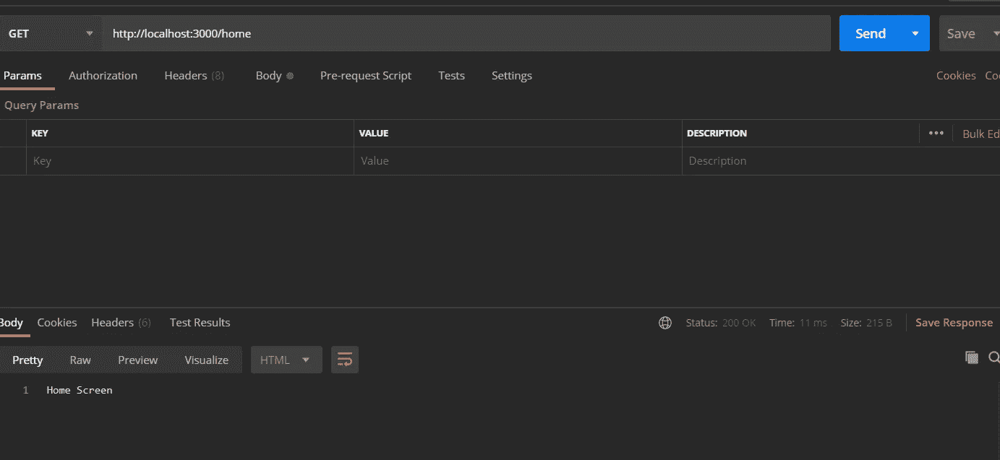
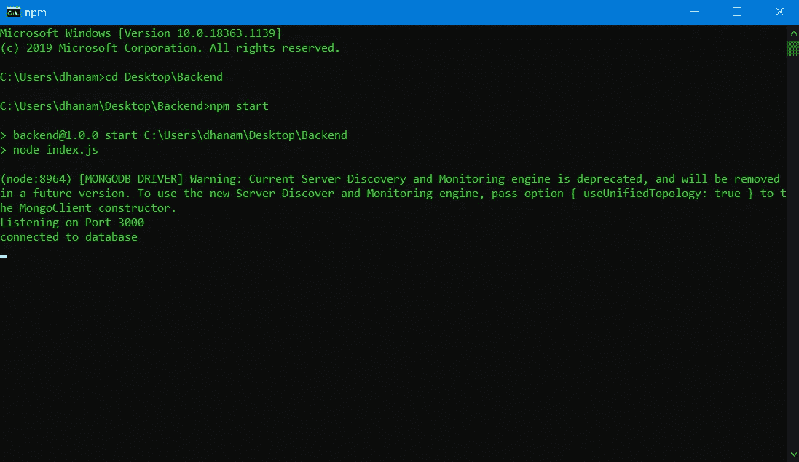
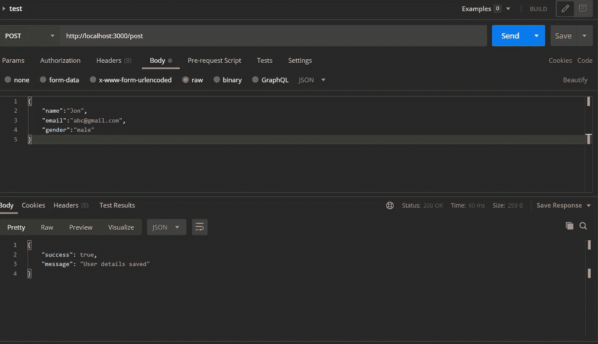
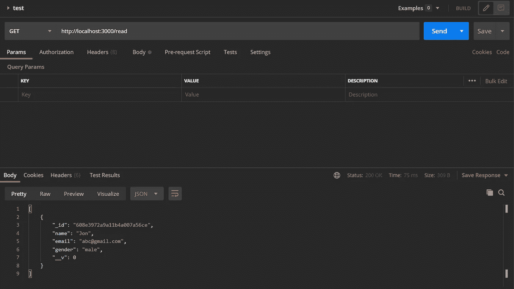

# 使用 Node.js 和 MongoDB 构建移动应用后端。

> 原文：<https://javascript.plainenglish.io/building-a-mobile-app-backend-using-node-js-and-mongodb-64ea6b5c7571?source=collection_archive---------1----------------------->

## 如何使用 Node.js 和 MongoDB 为移动应用程序构建后端的演练。


Photo by [abillion](https://unsplash.com/@abillion?utm_source=medium&utm_medium=referral) on [Unsplash](https://unsplash.com?utm_source=medium&utm_medium=referral)

# 为什么要在应用程序中使用 Node.js？

还有其他各种各样的选择来作为你的应用程序的后端框架。最受欢迎的是 **Firebase** 。这是一个由谷歌提供的平台，可以用来构建一个小型到中级的应用程序。然而，当您构建一个复杂的应用程序时，它开始变得有问题，因为在 Firebase 实时数据库中执行复杂的查询变得越来越困难。此外，一旦您的应用程序开始获得一些吸引力，价格就会飙升。

**另一方面，Node.js** 提供了更多的自由和简单的可扩展性。您可以很容易地使用 Node.js 进行设置和运行。此外，Node.js 由于其异步特性，在开发数据密集型应用程序时是一个更好的选择。

# 本教程中使用的技术和库。

1.  **Express:** 该库将帮助我们构建 API。这些 API 用于接收来自前端(Android Studio)的请求并发回响应。
2.  **MongoDB Compass:** 本地 MongoDB 数据库桌面应用程序。
3.  **猫鼬:**一个帮助我们构建收藏模式的 ODM 库。
4.  **邮差:**帮助我们测试 API 的工具。

# 我们开始吧:

我们将首先创建一个 REST API，它将接受来自 Android Studio 的请求，并发回一个响应。在 Android Studio 中，您可以使用凌空或改装库向我们的后端发送请求，并获得回复。接下来，我们将构建 MongoDB 数据库，并对其执行读/写操作。

## 第 1 步:初始化您的项目

您可以使用自己选择的任何文本编辑器。我正在使用 Visual Studio 代码。创建一个新项目，启动终端，并编写以下命令。

```
npm init
```

现在你将被要求填写一些关于这个项目的数据。完成后，将创建 **package.json** 文件。接下来，我们将安装所需的库。

```
npm install express mongoose
```

现在，您的 package.json 文件应该如下所示。

请注意，我们更改了脚本块。Index.js 将是我们构建 API 的主文件。所以“node index.js”将在我们运行项目时运行 index.js 文件。

## 第 2 步:创建 REST API:

在这一步，我们将构建一个返回字符串的基本 REST API。

首先，我们导入 express 库并初始化它。然后我们用端点 */home 创建一个应用编程接口。*所以当一个 get 请求被发送到这个端点时，我们将返回字符串“主屏幕”。最后，在最后一行，我们制作了 a *pp* 来监听端口 3000 的请求。

现在让我们用邮递员测试这个应用编程接口。



Screenshot by Author.

在向我们的 */home* 端点发送 get 请求时，我们成功地获得了“主屏幕”字符串作为响应。

## 第三步:**配置 MongoDB** 数据库:

启动您的 MongoDB Compass 并创建一个新的数据库。我们将使用 Mongoose，它是 MongoDB 和 Node.js 的对象数据建模(ODM)库。

我们导入 mongoose 库，然后与名为*后端的本地数据库建立连接。*你可以用你的数据库名替换*后端*。在运行服务器时，如果连接成功，我们应该“连接到数据库”。



Screenshot by Author.

正如我们所看到的，当我们运行 index.js 文件时，我们得到“连接到数据库”作为输出。因此，我们已经成功地连接到我们的数据库。

## 步骤 4:对数据库执行操作。

为了执行这些操作，我们需要创建 API，这些 API 将接收来自接口的请求，访问/发送数据库中的数据，并发回响应。

最初，我们需要将一些数据放入数据库。我们将使用 Mongoose 定义这个数据的模式。

我们将有一个名为 users 的集合(表),它将存储用户的姓名、电子邮件和性别。现在让我们构建一个将数据放入这个集合的 API 和另一个读取集合中所有数据的 API。

我们正在导入我们在上面第 4 行创建的用户模式。在下一行中，我们添加了 *app.use(express.json())* 以便它能够识别包含我们的用户数据的 json 对象，我们将随请求一起发送这些数据。然后，我们创建两个新的 API，如端点 */read* 和 */post 所讨论的。*

当点击 */read* 端点时，它将读取集合中的所有用户数据。

点击时的 */post* 端点将读取主体中的 JSON 数据，并将其保存在我们的集合中。

现在让我们测试这两个 API。首先，我们将向 */post* 发送一个 post 请求以及用户数据，如下所示。



Screenshot by Author.

我们收到一条成功消息，这意味着我们的数据成功地存储在我们的集合中。为了确认这一点，我们可以向 */read* 发送一个 get 请求来检查我们是否检索到了存储的数据。



Screenshot by Author.

如上所述，我们取回了数据，这证实了我们的数据已被存储。

# 结论:

我们最终创建了一个运行在端口 3000 上的后端服务器。我们构建了我们的 MongoDB 数据库，它将存储用户的数据和两个 API，它们将添加/读取存储的数据。在未来，有必要将我们的服务器和数据库托管在云上，这样就可以随时访问。

[*更多内容尽在 plainenglish.io*](http://plainenglish.io/)