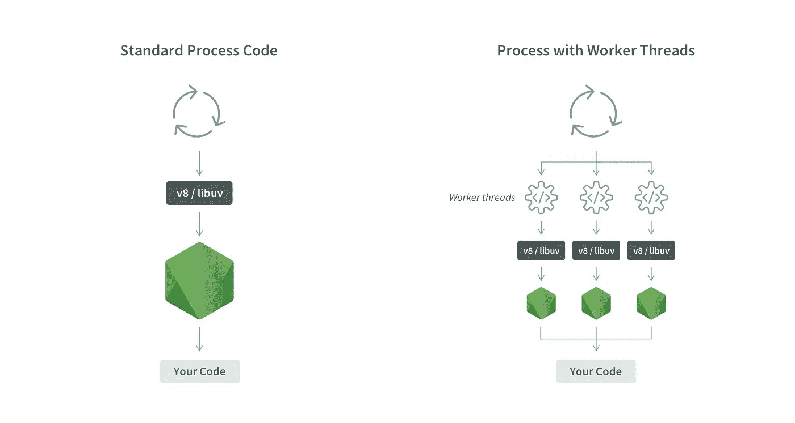
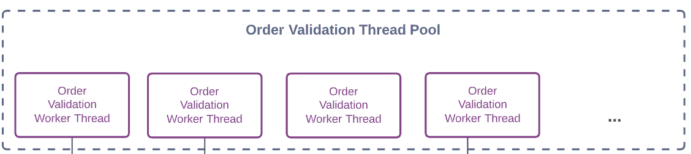
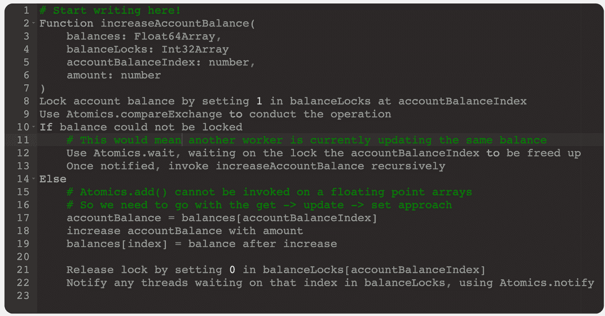
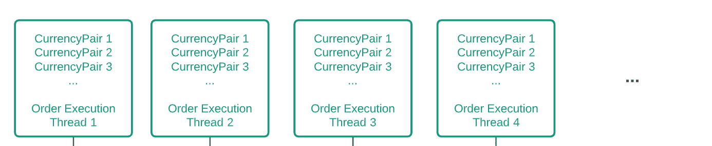
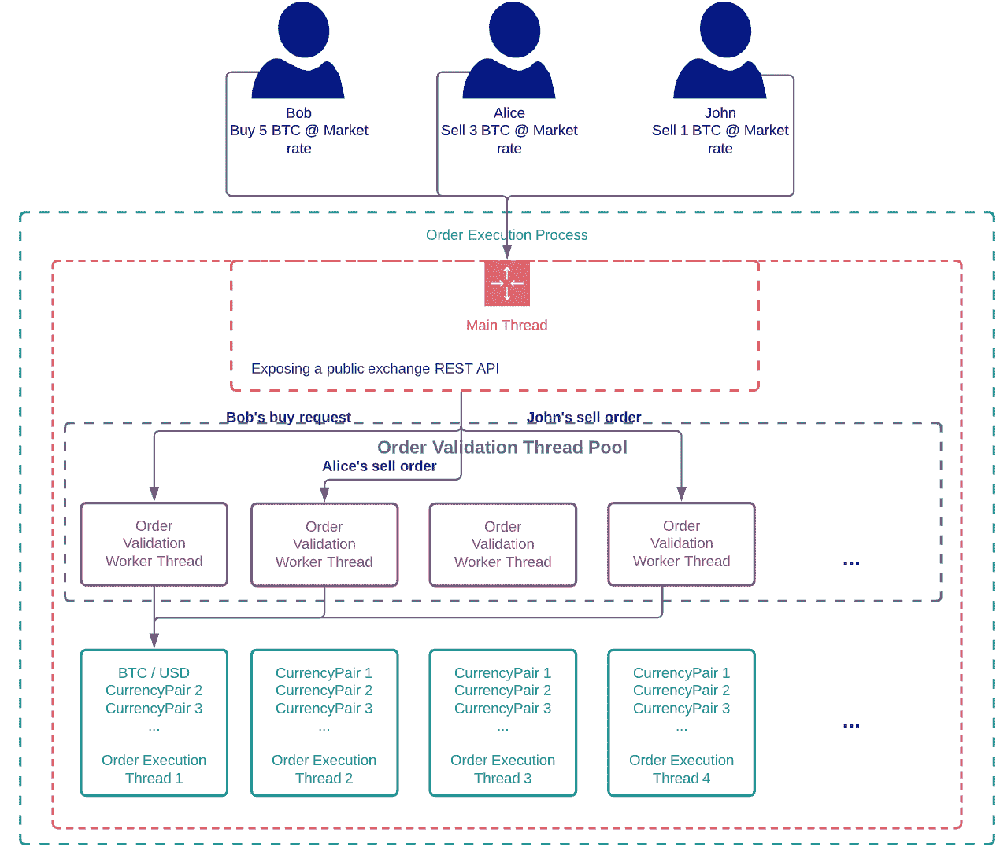

# 在 Node.js 中构建多线程加密交换

> 原文：<https://javascript.plainenglish.io/building-a-multithreaded-crypto-exchange-in-nodejs-part-2-c0375dabe114?source=collection_archive---------4----------------------->

## 第二部分

Source [https://nodesource.com/blog/worker-threads-nodejs/](https://nodesource.com/blog/worker-threads-nodejs/)

欢迎来到“[在 Node.js](https://medium.com/p/e30c13bcbfb8?source=post_stats_page-------------------------------------) 中构建多线程加密交换”三部曲的第 2 部分(如果您还没有看完第 1 部分，可以在这里[看一下](https://shekerovborislav.medium.com/building-a-multithreaded-crypto-exchange-in-nodejs-part-1-e30c13bcbfb8))。在本文中，我们将深入探讨我们的开发团队实现的多线程 Node.js 解决方案，以帮助解决加密交易平台的性能难题。

该团队必须想出一个解决方案(从头开始)，确保所有现有的业务规则仍然适用，因为该平台已经在生产中运行了一年多。如第 1 部分所述，团队必须解决的最大问题是在订单执行流程中引入延迟的大量 I/O 操作。

## **第一步。在同一个流程中完成**

为了消除用于连接订单执行服务的中间件所带来的所有延迟(在重构之前，该流程包含 3 个服务),决定将所有业务逻辑放入同一个流程中。

由于团队的目标是最佳吞吐量，订单执行时间在毫秒范围内，我们必须确保该流程受 CPU 限制(以前严重受 I/O 限制)。

首先想到的是将运行订单和信用验证所需的所有数据放入 exchange 服务的内存中——毕竟计划是将 exchange 部署到一个具有高 CPU 和内存参数的[高性能 AWS EC2](https://aws.amazon.com/ec2/instance-types/c5/) 实例上。将所有数据都存储在进程内存中，就不需要通过网络从其他服务获取数据。

因此，随着内存限制的消失，团队面临着一些新的更复杂的问题:

*   在 Node.js 单个应用程序线程上，如何在保证高度并发性的同时扩展受 CPU 限制的进程？
*   如何确保缓存在内存中的数据总是与实际的数据源保持一致？

为了回答这些问题，我们将从头到尾深入了解订单执行流程的不同阶段。

## **第二步。分而治之…使用工作线程**

订单请求验证和帐户信用检查是订单执行流程的初始部分，我们必须验证帐户是否有资格交易特定的货币对，确保指定的金额和价格对交易的货币有效，最重要的是，确保帐户有足够的余额来下订单(也称为信用检查)。

如[第 1 部分](https://shekerovborislav.medium.com/building-a-multithreaded-crypto-exchange-in-nodejs-part-1-e30c13bcbfb8)所述，这些操作通常涉及对集群内其他服务的网络调用，例如 ABM(账户余额管理)服务对其数据库执行信用检查。

如果所有必要的数据都已经缓存在内存中，就不再需要执行任何 I/O 操作，如果没有工作线程，我们的单线程进程就会承受高负载。

订单请求验证阶段非常通用，因此非常适合分布在多个工作线程上，这里可能有 *n* 个线程，每个线程并行处理一个不同的请求。

Figure 1 — The order validation thread pool responsible for validating new order requests

为了避免在收到新请求时动态生成工作线程的开销，实现了一个工作线程池，允许在应用程序启动时创建 *n* 个工作线程，由中央*OrderValidationThreadPool*实体管理(您可以在这里查看我们线程池实现的起点[)。](https://nodejs.org/api/async_hooks.html#async-resource-worker-pool)

作为多线程环境，Node.js 中的工作线程面临的一个难题是跨工作线程共享数据的机制有限。在 Node.js 中，工作线程几乎就像独立的微进程，每个都有自己的事件循环和内存堆，在工作线程初始化时从主线程传递的数据在工作线程的内存堆中复制(你可以在这里阅读更多关于工作线程如何工作的信息[)。](https://nodesource.com/blog/worker-threads-nodejs/)

话虽如此，Node.js 确实以 [ArrayBuffer](https://developer.mozilla.org/en-US/docs/Web/JavaScript/Reference/Global_Objects/ArrayBuffer) (及其支持的[类型化数组数据结构](https://developer.mozilla.org/en-US/docs/Web/JavaScript/Reference/Global_Objects/TypedArray))的形式提供了在工作人员之间共享静态数据的方法，只要有一点创造性，就可以解决重复数据问题。

共享静态数据被证明是一项微不足道的任务，更复杂的是提出一种对缓存的内存中余额进行原子更新的策略。

如前所述，为了避免我们的余额管理服务依赖网络，我们决定提前提取所有用户可用的余额，在 exchange 服务内存中创建一个内存实时快照。

在应用程序启动时，为了确保 exchange 缓存中余额数据的活性，我们还必须做的一件事是建立一个进入余额管理服务的 [websocket](https://en.wikipedia.org/wiki/WebSocket) 通道，将任何更新(例如用户存款)流式传输，以确保内存中的 exchange 缓存始终是最新的。

我们可以将余额视为基于账户的字典，其中账户 *x* 可以有以 *n* 货币表示的交易余额，其中 *n* 是交易所支持的货币数量(例如，美元、BTC、瑞士法郎等)。

这里的第一个复杂性是由于不支持以允许原子更新的方式在工人之间共享任何复杂的类似对象/字典的数据结构。

我们手头仅有的结构是[类型的数组数据结构](https://developer.mozilla.org/en-US/docs/Web/JavaScript/Reference/Global_Objects/TypedArray)，我们必须使用它来在工作人员之间共享余额数据。

将余额存储在数字数组中(每种货币一个)，数组是基于索引的结构，这意味着我们将丢失帐户标识符(UUID)上下文，因此我们还需要为每种货币维护一个支持的*帐户标识符- >数组索引*字典，以便快速访问存储给定帐户余额的*索引*。

NodeJS 内置了对类型化数组的[原子数值更新](https://developer.mozilla.org/en-US/docs/Web/JavaScript/Reference/Global_Objects/Atomics)(仅限**整数**)的支持，允许轻松的比较和设置乐观锁定算法实现，这在 90%的情况下都是足够的。

基于货币的数字数据可以很容易地存储在一个[uint 16 array](https://developer.mozilla.org/en-US/docs/Web/JavaScript/Reference/Global_Objects/Uint16Array)/[uint 32 array](https://developer.mozilla.org/en-US/docs/Web/JavaScript/Reference/Global_Objects/Uint32Array)数组结构中，使用货币的最小面额(例如，美分代表美元，便士代表英镑)，利用跨工人的原子更新。

这是我们碰到的下一块石头，因为使用最小的分母来存储加密数值意味着我们在任何索引上可以存储的最大数量是非常有限的。

例如，存储 BTC 值(在 uint 32 数组中)意味着 BTC 余额可以达到的最大值是 21.47483647，这不符合我们的业务需求。

由于无法使用方便的 [Atomics](https://developer.mozilla.org/en-US/docs/Web/JavaScript/Reference/Global_Objects/Atomics) 操作符，使用 [Uint32Array](https://developer.mozilla.org/en-US/docs/Web/JavaScript/Reference/Global_Objects/Uint32Array) ，我们必须想办法在使用 [Float64Array](https://developer.mozilla.org/en-US/docs/Web/JavaScript/Reference/Global_Objects/Float32Array) 时自动更新值，不幸的是 Atomics 不支持。

由于 Node.js 中的多线程没有内置对互斥的支持(例如信号量、显式锁管理)，我们被锁定在使用一个联合的 [Atomics.compareExchange、](https://developer.mozilla.org/en-US/docs/Web/JavaScript/Reference/Global_Objects/Atomics/compareExchange) [Atomics.wait](https://developer.mozilla.org/en-US/docs/Web/JavaScript/Reference/Global_Objects/Atomics/wait) 和 [Atomics.notify](https://developer.mozilla.org/en-US/docs/Web/JavaScript/Reference/Global_Objects/Atomics/notify) 以及一个存储要操作的锁的支持 Uint32Array。该算法的伪代码如下所示。

Pseudocode 1 — A sample algorithm for atomic updates of floating point arrays in NodeJS

当对新订单进行信用检查时，执行相同的算法来减少帐户余额。

在保留新订单请求所需的信贷(减少帐户的可用余额)后，订单请求被传递以根据打开的订单簿执行。

与订单请求验证不同，在订单请求验证中，线程池中的任何工作线程都可以处理任何订单请求，订单执行流需要顺序处理请求，因为不可能出现针对同一货币对的两个订单针对同一订单簿并行执行的情况。

因此，我们不能应用相同的工人池逻辑，这里需要不同的工人群设置:

Figure 2— The OVTH, the fleet of worker threads responsible for executing validated requests against the current state of the order book

执行线程池中的每个工作线程负责一组货币对，只处理这些货币对的新订单请求(已经通过了上一步的验证)或订单取消请求。

货币对的实际选择必须考虑市场波动性，例如，处理 BTC /美元请求的线程必须与波动性较小的货币对捆绑在一起。

这造成了一些设置的复杂性，因为每个订单执行工作者必须公开 *n* 个入站端口，其中 *n* 是订单请求验证线程的数量，允许从任何订单验证线程推送执行请求。

考虑到这一点，这里是:

在上面的场景中，我们可以看到 3 个用户下了 3 个不同的订单，同时点击我们的 REST API。

一旦订单到达负责订单执行的 REST 控制器，订单请求将被传递到订单验证线程池管理器，该管理器将新订单请求分配给一个空闲的订单验证工作线程(如果没有工作线程空闲，请求将被排队)。

上面描述的场景假设池中有足够的空闲工作线程，因此 3 个请求由 3 个不同的订单验证工作线程实例并行处理。

通过订单请求验证后，请求将沿着 3 个不同的 [MessagePort](https://developer.mozilla.org/en-US/docs/Web/API/MessagePort) 实例传递到同一个订单执行线程(负责 BTC /美元对的线程)，在该线程中，请求将根据请求接收时间顺序处理。

Node.js 一直是 I/O having 进程的主要选择，现在它能够提供多线程机制，可用于解决上述 CPU 受限进程的复杂问题。

也就是说，如果该平台希望为开发人员提供工具，使他们在实现复杂的多线程管道时更加轻松，那么它肯定有需要迭代改进的地方。

*下周和我一起，我们将回顾我们在工作线程中所学的课程。*

*更多内容尽在*[***plain English . io***](http://plainenglish.io)