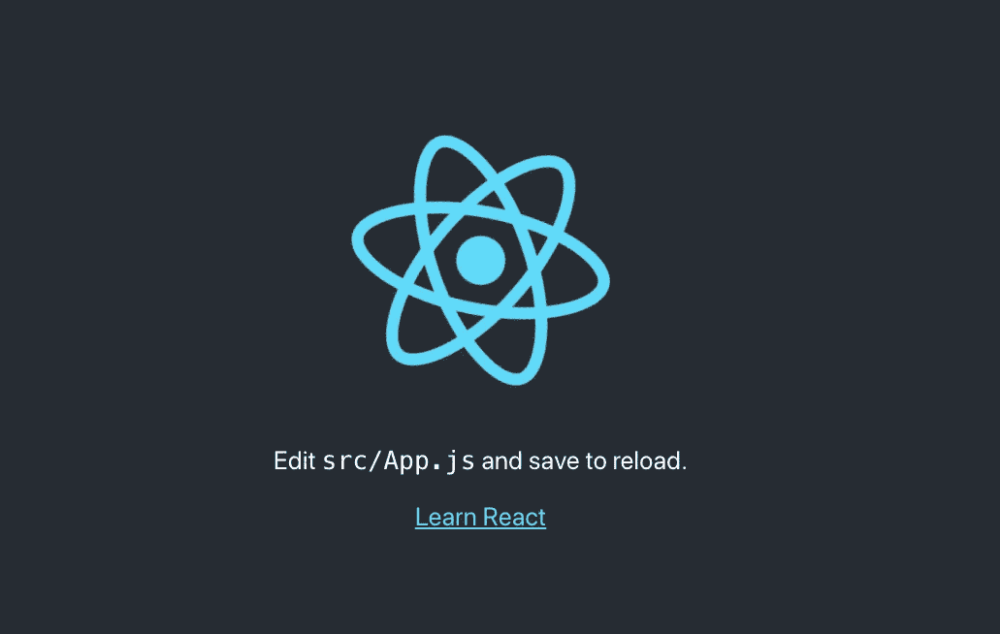
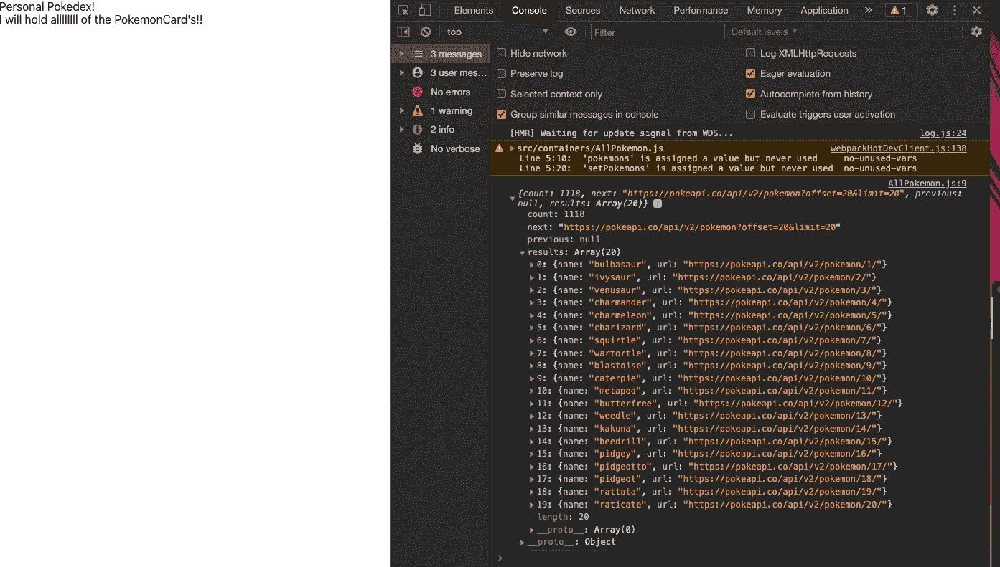

# 用 React 构建 Pokedex

> 原文：<https://javascript.plainenglish.io/building-a-pokedex-with-react-7b7410db441a?source=collection_archive---------1----------------------->

## 必须抓住他们！


Photo by [Thimo Pedersen](https://unsplash.com/@thimo?utm_source=unsplash&utm_medium=referral&utm_content=creditCopyText) on [Unsplash](https://unsplash.com/s/photos/pokemon?utm_source=unsplash&utm_medium=referral&utm_content=creditCopyText)

嗨黑客们！我决定使用 Pokemon API 构建一个 React 应用程序，只是为了好玩。我认为这将是展示 React 有多强大的一个很好的方式，并且对任何刚入门的人来说都是一个有趣的教程。这个博客将有多个部分，因为我也将在这个系列中包括造型。说了这么多，让我们开始把他们都抓起来。

## 用户故事

我收到的最重要的建议之一是学习如何“在反应中思考”我们希望在进入构建部分之前就获得应用程序的良好结构。对于这个个人 Pokedex，我希望用户能够看到所有可用的口袋妖怪。然后，我希望他们能够导航到每个口袋妖怪的个人页面，查看更多有关它的信息，然后也能够“抓住”口袋妖怪说。最后，正如项目标题所暗示的，我希望用户能够查看他们的个人 Pokedex，里面有他们所有“被抓”的口袋妖怪。

## 组件树

既然我们已经知道了我们的应用程序应该为用户做什么，让我们开始“反应式思考”React 是基于组件的。以下是 React 的官方术语:

> 从概念上讲，组件就像 JavaScript 函数。它们接受任意输入(称为“props”)并返回描述屏幕上应该显示什么的 React 元素。

我们将需要这个项目的一些不同的组件和容器。在我看来，我们需要一个`AllPokemon.js`容器来负责包含名为`PokemonCard.js`的单个组件。每个`PokemonCard`应该有一个`onClick`监听器，这将允许我们导航到他们的个人页面，这将是一个名为`Pokemon.js`的组件。最后，我们将需要一个`Pokedex.js`，它将是一个容器，有条件地只呈现“捕获的”`PokemonCard` s。

## 创建-反应-应用

好了，我们对这个项目应该如何运作和一个总体结构有了一个想法。我将在博客的底部分享我的代码，给那些想边写边检查的人。先从`create-react-app`开始吧。这是一个让你的项目快速启动并运行的好工具。`create-react-app`在引擎盖下做大量工作，帮助快速行动。关于这些工作的更多信息，你可以在这里查看文档。

第一步是在您想要的位置运行以下代码:

```
npx create-react-app personal-pokedex
```

完成后，您应该会在终端中看到一条成功消息。确保你在正确的目录中。一旦你这样做了，你就可以运行`yarn start`或`npm start`。我将在整个项目中使用`yarn`终端命令，但两者都可以，这完全是个人喜好。如果一切正常，您应该会看到这个可爱的屏幕:



create-react-app welcome screen

厉害！！现在，让我们删除提供的样板文件来清理一下。在`App.js`我们可以删除一堆代码。

我们可以删除提供的样板文件中第 6 行`div`之后的所有代码。我们还可以删除徽标和 CSS 文件的导入。您可以随意从目录中删除这两个文件，因为我们将在教程的后面编写自己的 CSS。

一旦你删除了所有的样板文件，让我们添加一个测试标题到我们的`div`中，以确保一切都正确连接，我们可以看到我们有多棒。

让我们也通过使用箭头函数将我们的`App.js`函数调用转换成 ES6 语法。

我的`App.js`现在长这样:

我已经从文件树中移除了`App.css`和徽标文件。呜！现在让我们做些东西吧！

## 制作我们的第一个容器

好的，还记得很多个月前我们讨论组件树的时候，让我们开始制作那些坏男孩吧。首先，在`src`中，我将创建一个名为`containers`的文件夹。是的，超级原创！在`containers`里面，我会做一个名为`AllPokemon.js`的文件。我将使这个容器成为一个功能性的容器。GeeksForGeeks 在区分功能组件和类组件方面做得很好，这些信息可以在这里找到。下面是我的`AllPokemon.js`:

现在，我知道你不能在浏览器中看到它，所以让我们把它连接起来！在`App.js`中，我们可以进行第一次导入。要导入组件，请使用以下语法:

```
import ComponentName from './containers/AllPokemon
```

`./`指的是我们的文件路径。因为我们在`App.js`中，它只是松散地挂在我们的`src`控制器中，所以我们必须向上一级(`./`)进入我们的容器文件夹并找到`AllPokemon.js`。您可以将`.js`从导入调用中去掉，因为 React 会自动计算出来。一旦导入了文件，就可以使用像这样的自结束标签在代码中引用它。

您现在应该会看到类似这样的内容:

在你的浏览器中，“私人口袋妖怪”和“我拥有所有口袋妖怪!”！!"应该显示出来。现在我打赌你想看那些可爱的口袋妖怪！所以我们去捡吧！

## 获取到 PokeApi

在`src`文件夹中，我将创建一个文件夹来保存我们的服务调用，这样我们就可以在容器和组件之外进行获取。我将这个文件夹命名为`services`，在里面我将有一个文件，它对于每次读取都是不同的。对于我们的`AllPokemon` fetch 调用，我将有一个名为`pokemons.js`的文件(是的，我知道 Pokemon 的复数就是 Pokemon，我也讨厌它，但我不知道还能叫它什么！).我首先将 URL 声明为文件顶部的`const`,然后发出一个获取请求。获取文档真的很棒，我在这里[链接了那个](https://developer.mozilla.org/en-US/docs/Web/API/Fetch_API/Using_Fetch)给那些想要更多信息的人。我也写了一篇关于 Fetch 的博客，链接[这里](https://medium.com/swlh/javascript-lets-make-fetch-happen-9cfda0c40ef4)。

下面是我们的第一个获取请求:

我们正在导出`getPokemons`获取请求，现在可以将它导入到其他组件和容器中。所以我们就这么做吧。在`AllPokemon.js`中，我们需要导入一些东西来启动和获取这个容器。首先，因为这是一个功能组件，我们将使用 React 钩子来进行 fetch 调用。这是有意的，因为我打算在整个教程中使用钩子。所以让我们导入以下内容:

```
import React, { useState, useEffect } from 'react';
```

我们还需要从我们的服务文件夹中导入我们的 fetch 函数，该导入如下所示:

```
import { getPokemons } from '../services/pokemons';
```

这样，我们就可以开始写代码了！

## 使用我们提取的数据

访问我们的数据的第一步是通过`useEffect`钩子。效果挂钩允许我们处理任何可能导致副作用的事情。如果一个函数试图修改它体外的任何东西，据说它会有副作用，但是它修改的是什么呢？嗯，我们知道我们将需要访问我们所有的口袋妖怪，所以让我们`useState`！有关 React 挂钩的更全面的文档，请访问[文档](https://reactjs.org/docs/hooks-intro.html)。

`useState`钩子返回一对值:当前状态和更新它的函数。在我们的例子中，当前状态是`pokemons`，更新它的函数是`setPokemons`。我们的`useState`调用将如下所示:

```
const [pokemons, setPokemons] = useState([]);
```

我们将一个空数组传递到`useState`钩子中，为我们的`pokemons`状态变量设置默认值。

接下来，我们需要使用`useEffect`钩子，从 API 中获取数据。如果你熟悉基于类的组件，`useEffect`的操作很像`ComponentDidMount`或`ComponentDidUpdate`。目的是用我们从 PokeApi 获取的信息更新我们的状态。首先，让我们通过控制台记录来看看数据。注意在`useEffect`调用之后的空数组。注意`useEffect`在组件安装和更新时运行。如果你不把一个依赖数组传入`useEffect`，它将不断更新。如果您将一个空的依赖数组传递到调用中，它将只在组件挂载时运行一次。

下面是我的控制台显示的内容！20 个口袋妖怪嵌套在一个物体里！



哇哦。我们做到了。我们有 POKEMON！我们只有 20 个，因为 PokeAPI 是用分页设计的，但我认为目前 20 个是个不错的数字。我们可以想出以后如何访问更多的口袋妖怪。

好了，现在我们需要在`useEffect`钩子中处理我们的获取。让我们在钩子内部调用`setPokemons`并将数据传递给它。记住`setPokemons`是我们传递给负责更新`pokemons`状态变量的`setState`钩子的函数。所以现在我们可以 console.log `pokemons`并且我们应该从 API 中看到我们的对象！太酷了。下面是迄今为止的`AllPokemon.js`情况:

## 我们来渲染一下口袋妖怪吧！

我们需要做的第一件事是制作一个我们之前讨论过的组件`PokemonCard.js`。我在`src`文件夹中做了一个名为`components`的文件夹，并添加了`PokemonCard.js`文件。这个组件的目标是，我们希望它为我们结果中的每个口袋妖怪进行渲染。组件可重用性是 React 的关键特性之一。

如果你仔细看看我们的`console.log(pokemons)`的结果，你会看到我们得到了一个对象。Javascript 允许我们用一个名为`Object.entries()`的方法解析对象，在这个方法中，我们将把对象作为参数传入。您可以`console.log(Object.entries(pokemons)`查看您现在可以访问哪些数据。您应该在控制台中看到 4 个数组，其中一个指向名为 results 的数组。那是我们想要的。它始终位于索引 3 处。所以让我们试试另一个 console.log。

```
console.log(Object.entries(pokemons)[3])
```

现在我们应该只看到结果数组，但是等等，口袋妖怪在数组索引 1 处被进一步嵌套。

```
console.log(Object.entries(pokemons)[3][1])
```

现在你可能真的得到了你想要的结果，但是刷新页面，整个事情就完了。什么鬼东西？我们看到了结果，但现在我们无法实现它们。请记住，状态更新是异步发生的，这意味着更新状态不会阻止应用程序的其余部分顺利呈现和运行。如果我们在获取口袋妖怪时整个应用程序停止工作，那就糟了。没人会想用它。所以为了修正这个错误，我们必须做一些叫做短路的事情。基本上，我们必须首先检查 pokemon 对象是否被填充，然后才能调用它。[这里的](https://dev.to/2spacemilk/short-circuit-evaluation-with-react-3dn4)是一个很棒的博客，更深入地讨论了这个问题。

```
console.log(Object.entries(pokemons)[3] && Object.entries(pokemons)[3][1])
```

是的。成功，我们终于访问了我们的口袋妖怪数组。现在我们可以使用可靠的`.map`方法来呈现我们的`PokemonCard`组件。下面是一个在 JSX 使用`.map`方法实现的完整的`AllPokemon.js`组件。

好吧！我们做到了，伙计们。前往`PokemonCard.js`实际渲染口袋妖怪的名字。在我们的`PokemonCard.js`中，我们现在可以访问`props`，这是 React 允许我们在父组件和子组件之间动态共享信息的方式。上面我们展开了我们的口袋妖怪数组，并复制了一份作为我们组件中的道具。确保像这样将道具传入组件`const PokemonCard = (props) => {}`，然后尝试一个`console.log(props)`。你应该看到你的个人口袋妖怪。你可以看到我们这里有两个键，名称和 url。让我们更新控制台日志:

```
console.log(props.name)
```

您应该会在您的控制台中看到一个口袋妖怪名称列表。使用 JSX，让我们动态渲染这些口袋妖怪。我将制作一个`h3`元素来显示口袋妖怪的名字。下面是我的`PokemonCard`组件:

等等，没有可爱的口袋妖怪图片。这是站不住脚的！不幸的是，PokeAPI 没有图像，但是不同的 API 有。我们可以将`img`标签的`src`设置为如下:

```
src={`https://pokeres.bastionbot.org/images/pokemon/${props.id}.png`}
```

现在等等，我们没有`id`的`prop`。让我们把指数作为道具传下去。对我们来说幸运的是，口袋妖怪是根据他们被揭露的顺序来给他们的 id 的。因此，有史以来第一批 151 个口袋妖怪的顺序是 1-151，随后的每一个口袋妖怪都紧随其后。所以，我们可以简单地将索引作为 id 道具传递，并加上 1，因为没有第零个口袋妖怪。通过道具后，`AllPokemon.js`向我们的`PokemonCard`添加另一个道具:

```
return <PokemonCard key={index} {...pokemon} id={index + 1} />
```

现在我们可以创建一个`img`标签并使用上面提供的`src`。我们的`PokemonCard`组件现在应该是这样的:

哇，这么多可爱的口袋妖怪！现在，图像太大了，而且很简单。我将在下一篇博客中讨论造型。我们的目标是拥有漂亮的可点击的小口袋妖怪卡片。下周见，希望你喜欢！

这里有一个[回购](https://github.com/jordles113/personal-pokedex)的链接。这里是本教程中用到的所有[要点的链接。](https://gist.github.com/jordles113)