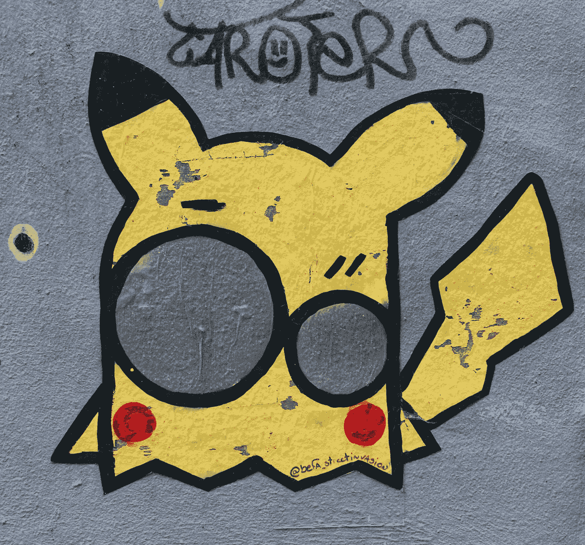
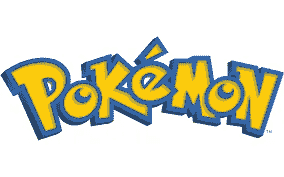

# 用反应构建 Pokedex 第 2 部分

> 原文：<https://javascript.plainenglish.io/building-a-pokedex-with-react-d3381b968ce2?source=collection_archive---------10----------------------->

设计主页！



Photo by [Pascal Bernardon](https://unsplash.com/@pbernardon?utm_source=unsplash&utm_medium=referral&utm_content=creditCopyText) on [Unsplash](https://unsplash.com/s/photos/pokemon?utm_source=unsplash&utm_medium=referral&utm_content=creditCopyText)

嘿，各位，对于那些还没有读过博客第一部分的人，我把它链接到了这里。我们将继续在这里构建个人 Pokedex 应用程序。我们停止显示一些口袋妖怪，但图像太大，页面非常简单。在这个博客中，我们将设计`PokemonCard.js`和主页。

## 基本全局样式

我将在这个教程中使用 Sass，因为我觉得它非常干净和高效。有很多种方法可以在你的项目中建立 Sass，但是我写了两个关于一般原则和实践的博客，链接在这里和这里。我将从为我所有的 Sass 文件创建一个目录并连接开始。我不会再重复整个过程，就像我在其他博客中详细描述的那样。我的 Sass 文件结构如下所示:

```
Sass/
|
|– abstracts/
|   |– _variables.scss    # Sass Variables
|   |– _mixins.scss       # Sass Mixins
|   |– _functions.scss    # Sass Functions
|
|– base/
|   |– _typography.scss   # Typography rules
|   |– _animations.scss   # Animation rules
|   |– _utilities.scss    # Utility rules
|   |– _base.scss         # Base rules|– layout/
|   |– _navigation.scss   # Navigation
|   |– _header.scss       # Header
|   |– _footer.scss       # Footer
|
|– components/
|   |– _buttons.scss      # Buttons
|   |– _pokemonCard.scss  # PokemonCard
|
|– pages/
|   |– _home.scss         # Home page style
|   |– _pokedex.scss      # personal pokedex page style
|   |– _show.scss         # Show page style
|
 – main.scss              # Main Sass input file
```

好的，让我们从在`_base.scss`文件中定义一些基本的样式并导入到`main.scss`开始。

这些小小的造型将带我们走很长的路。首先:

`*`是 HTML 文件中所有元素的全局选择器。

`*::before`在内容选择之前插入某物

**`*::after`在内容选择后插入**

****第一个代码块确保所有元素的默认`padding`和`margin`被删除。它使所有伪元素(`::before`和`::after`)继承其父元素的`box-sizing`，而不是总是使用`content-box`。这决定了像`padding`这样的属性是向内应用(保持元素宽度)还是向外应用(增加元素宽度)。例如,`<p>`会自动给出上下边距，而`body`会根据标准设置边距。****

****接下来，我想改变默认的字体大小，这样我就可以很容易地计算出我的`rem`单位。默认字体大小为`16px`。`Rem`是响应字体大小的单位，所以如果我不调整这里的字体大小，每个`rem`就是`16px`。`2rem`是`32px`以此类推。通过调整默认字体，我可以更容易地计算 rem 单位的增量`10px`(数学很难)。****

****最后，我正在为身体设置一些基本的造型。将文本居中，赋予整个 body 元素一个`3rem`或`30px`的`padding`，并将上面提到的父`box-sizing`属性设置为`border-box`。`box-content: border-box`应该是标准(在我看来)。这意味着填充被计入元素的宽度/高度。****

****好了咻，这是我们开始使用 Sass 并让我们的`rem`单位正确计算所需的基本材料。有了这一小段代码，我们就能确保我们从一个公平的竞争环境开始，不会有任何烦人的`padding`、`margin`或`box-sizing`问题困扰我们。****

****确保将您的`_base.scss`导入到您的`main.scss`中，并将以下脚本添加到您的`package.json`中的`script`部分:****

```
**"scripts": {"start": "react-scripts start","build": "react-scripts build","test": "react-scripts test","eject": "react-scripts eject",//Add this line to your package.json"compile:sass": "node-sass sass/main.scss src/index.css -w" },**
```

****然后在您的终端中运行:****

```
**yarn run compile:sass**
```

****您应该在终端中看到绿色成功消息。该脚本正在观察您的 Sass 文件的变化，并将其编译到您的`index.css`中。如果你打开浏览器，你应该会看到你的文本非常小，所有的内容都被居中！呜！走吧我们。****

## ****设计我们的口袋妖怪卡片****

****这些最初的卡片将是可点击的，并带我们到一个实际的浏览器大小的口袋妖怪卡片，它将根据口袋妖怪的类型进行定制，但稍后会有更多的定制。首先，让我们在 Sass 的`components`文件中创建`_pokemonCard.scss`。在这个文件中，我们希望添加以下 Sass 代码来帮助我们开始:****

****导入到你的`main.scss`里看一些格式化的卡片！接下来，让我们确保给我们的元素适当的`classnames`以确保我们的 Sass 被连接起来。****

****这是我们的`PokemonCard.js`:****

****这是我们的`AllPokemon.js`:****

****有了它，我们的卡应该连接起来！****

****他们看起来不太好，但这是一个开始。让我们在`_variables.scss`文件中创建一些颜色变量，让我们开始口袋妖怪配色方案。我的变量文件如下所示:****

****我有一个超级方便的扩展，我使用它来帮助我可视化颜色。我已经在这里链接了它。有了这些，让我们对`_pokemonCard.scss`文件做一些修改。我还添加了一些额外的样式，让我们的卡片看起来更整洁、更大。****

****好吧，这好多了，但是我们所有的牌都是一长串。我认为 flexbox 是完美的解决方案。Flexbox 是一个非常棒的工具。我会在这里简短地讨论它，但我真的建议你花点时间看看它能帮助你完成你的造型的所有奇妙的东西。[此处](https://css-tricks.com/snippets/css/a-guide-to-flexbox/)是指向有用的 flexbox 指南的链接。****

****让我们在名为`home.scss`的`pages`目录中做一个部分，因为我们的主页会显示所有的口袋妖怪。在该文件中，添加以下代码:****

****我们正在做的是使用 flexbox 将我们所有的卡排成一行。默认情况下，flexbox 将`flex-direction`设置为`row`。如果你愿意，你可以把`flex-direction`改成`column`，但是对于我们的目的来说，`row`非常好用。这个容器元素包含了我们所有的卡片，因此这将把它们排成一长行。所以我们需要设置一个 wrap 属性来确保卡片移动到下一行，而不是无限地继续下去。然后 flexbox 给了我们两种在 x 轴和 y 轴上对齐内容的方法。当`flex-direction`为`row`时，`justify-content`处理 x 轴，当设置为`column`时，处理 y 轴。另一方面，我们让`align-items`属性在`flex-direction`为`row`时处理 y 轴，在 `flex-direction`为`column`时反转。所以在我们的例子中，我们将 x 轴上的内容调整为`space-around`。这让我们的牌在各方面都有了喘息的空间。还有其他的`justify-content`属性，比如`space-between`，它将内容推到最外面的边缘。`start`是另一个调整 flex 容器开头内容的方法。我对 Flex 越来越有诗意了。认真检查一下，很棒。****

****等等，为什么没用？我们需要对我们的卡做一些修改。我们不再需要设置这么大的宽度。Flex 会用`flex`速记属性为我们处理这些。基本上，我想看到每行有 3 张口袋妖怪卡片，中间有一些漂亮的间隔。Flex 允许我们这样做:****

```
**flex: none | [ <'flex-grow'> <'flex-shrink'>? || <'flex-basis'> ]**
```

****这些属性允许元素增长并迫使周围的其他元素收缩，收缩并让其他元素增长以填充空间，或者您可以提供每个元素的基础或大小。我们希望基数为 24%,以确保我们有 3 张牌排成一行。下面是新卡的`scss`代码:****

****好的，很好！我们有一些漂亮的卡片整齐地显示在屏幕上。这太棒了，但我想添加一些更多的铃铛和口哨来打动人们，并使应用程序更加直观和互动。现在，当我们悬停在一张卡片上时，什么也没有发生，人们怎么知道我们想要他们点击它呢？让我们改变这一点。****

## ****让卡片互动****

****首先，让我们从给卡片在`hover`上添加阴影效果开始，这样用户就能意识到它们是互动的。为此，我们可以使用一个名为`box-shadow`的 CSS 属性。`box-shadow`属性接受以下值:****

```
**box-shadow: /* offset-x | offset-y | blur-radius | color */**
```

****所以在我们的例子中，我们想要一个`0`的`offset-x`(意味着我们不想在`x-axis`上有任何偏移阴影)`1rem`的`offset-y`、`4rem`的`blur-radius`和一个`rgba`颜色值。在这种情况下，我们使用`rgba`来控制阴影的不透明度。我还想让`cursor`变成`hover`上的指针，以便于访问。最后，我希望卡在悬停时在`y-axis`上稍微向上移动。为此，我将使用`transform`属性。****

****属性为我们提供了很多选项，但是我在这里使用的是`translateY()`。`translateY()`无非是想让它说。它将移动`y-axis`上的元素。当使用`transform`时，在元素上使用属性`transition`是很重要的。这就是为什么:****

> ****过渡是 CSS 变换轮子中的润滑油。如果没有转换，被转换的元素会突然从一种状态变为另一种状态。通过应用过渡，您可以控制变化，使其平滑和渐进。****

****有关这方面的更多信息，请查看这篇[文章](https://thoughtbot.com/blog/transitions-and-transforms#:~:text=Transitions%20are%20the%20grease%20in,making%20it%20smooth%20and%20gradual.)。****

****接下来我想改变的是`:active`和`:focus`。我想让这张卡片沿着`y-axis`向下移动一点，通过调整`box-shadow`的扩散和不透明度，让它看起来更接近背景。我认为这看起来超级酷，因为看起来你真的在按它！****

****我们的卡片代码现在应该是这样的:****

## ****修复卡片标题和导入字体****

****太棒了，那些卡片看起来很棒，但是普通的字体有点乏味，口袋妖怪的名字也不太特别。让我们从导入一些可以在整个应用程序中使用的字体开始。通过谷歌字体导入字体轻而易举。首先，导航到[谷歌字体](https://fonts.google.com/)。我选择了两种有趣且易读的字体。一旦你进入谷歌字体网页，你会看到一个搜索。搜索 Miltonian 和 Lato。特别是米尔顿纹身。点击它，它应该带你到一个字体系列屏幕。米尔顿纹身只有一种字体粗细。单击+选择此字体，将其添加到您的收藏中。您应该会看到一个侧边栏弹出，它会给你一个脚本链接和一个 CSS `font-family`代码片段。对 Lato 做同样的操作，选择下列字体粗细:300，400，700。我在这里链接了一篇关于常用和广泛使用的谷歌字体的文章。****

****现在复制侧边栏中的脚本标签，并将其添加到`<head></head>`中的`index.html`中。然后导航到您的`_variables.scss`来创建一些字体变量。它们应该是这样的:****

```
**//FONTS$title: 'Miltonian Tattoo', cursive;
$default: 'Lato', sans-serif;**
```

****太棒了，让我们使用它们。在您的`_pokemonCard.scss`中，让我们声明一个名为`font-family`的属性，并将其设置为我们的`scss`变量`$title`。我认为这种字体很像口袋妖怪的标志字体，我们会在应用程序中为了好玩而少用它。****

********

****Pokemon Logo****

****让我们也在标题上设置一个`text-transform`属性，这样名字就大写了。设置好`text-transform: capitalize;`，我们就可以开始了！****

****卡`scss`代码现在看起来像这样:****

## ****设计标题样式****

****好吧，我们的“个人 Pokedex”标题看起来有点小和无聊。让我们增加它的味道。首先，导航到您的`base sccs`目录中的`_typography.scss`文件。在这个文件中，我们将为不同的头声明可重用的类。我们将设计`primary-heading`的样式，我们可以在整个应用程序的所有页面上重用它。确保你添加了一个`<h1>`元素到`App.js`包装标题，并给它一个`className`的`primary-heading`。然后在排版中添加以下代码:****

****好的，我们在这里使用了一些有趣的 CSS 东西。我们将`background-image`属性设置为`linear-gradient()`，然后将其裁剪为我们已经设置为`transparent`的文本。这意味着我们实际上正在使用`background-image`来设置我们的文本颜色。最后，我们使用`stroke`属性勾勒出文本的轮廓，使其看起来像口袋妖怪的标志。很酷的东西。****

## ****添加背景图像****

****最后，让我们添加一个背景图片到身体。我已经用这个[网站](https://www.toptal.com/designers/subtlepatterns/)为我们的背景找到了完美的 png。这是很好的和微妙的，但使背景不那么鲜明的白色，给它一些自然的纹理。在网站上搜索名为“棕榈叶”的 png 在你的`src`中创建一个名为 images 的文件。我们将在稍后导入一些精灵时使用它。最后，在您的`_base.scss`中，添加以下代码:****

## ****结论****

****干得好！下次再见，更多的反应。我们将添加一个`header.js`、`footer.js`，添加`react-router`包并创建一个`onClick`。****