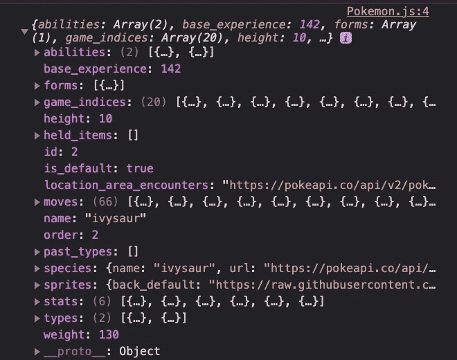
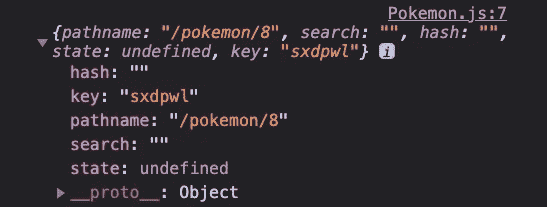

# 用 React 构建 Pokedex

> 原文：<https://javascript.plainenglish.io/building-a-pokedex-with-react-part-3-d4681db83ecb?source=collection_archive---------11----------------------->

## 第 3 部分:构建路由器和显示页面


Pokemon Fan Art — [https://funnyjunk.com/channel/vidyagaems/Pokemon+fan+art/xgBMMkt/](https://funnyjunk.com/channel/vidyagaems/Pokemon+fan+art/xgBMMkt/)

好的，你们在这里做第三部分。如果你参加聚会迟到了，你可以跟着第一部分[和第二部分](/building-a-pokedex-with-react-7b7410db441a)[一起去。在这一期中，我们将添加 React-Router 并获取我们的个人口袋妖怪数据，以便我们可以呈现一个显示页面。React-Router 是一个客户端路由库，我们可以在 React 中使用它来帮助我们的 URL 反映 UI 中的变化，它是我们在这个 SPA 中使用的一个重要工具。我写了一篇关于 React-Router 链接的博客](/building-a-pokedex-with-react-d3381b968ce2)[这里](https://medium.com/weekly-webtips/react-client-side-routing-90873b96b429)。文件指出:

> “React Router 使您的用户界面与 URL 保持同步。它有一个简单的 API，内置了强大的功能，如惰性代码加载、动态路径匹配和位置转换处理。让 URL 成为你的第一个想法，而不是事后的想法。”

首先，让我们导入包:

```
yarn add react-router-dom 
```

添加后，我们就可以开始使用它了。我们需要两条路线。一个给我们所有的口袋妖怪导航到我们的网站，第二个当有人点击口袋妖怪卡查看更多信息。我们的路线将位于我们的`App.js`中，如下所示:

这里需要注意的一点是，我们从 React-Router 导入了一些东西，但主要是利用了交换机和路由器，它们将按照文档中的说明完成以下工作:

> 当一个`<Switch>`被渲染时，它搜索它的`children` `<Route>`元素来找到一个其`path`与当前 URL 匹配的元素。当它找到一个时，它渲染那个`<Route>`并忽略所有其他的。这意味着你应该把更具体(通常更长)的`<Route>` s 放在不太具体的 s 之前。

接下来我们需要做的是将我们的卡变成一张`<Navlink />`。React-Router 给了我们两种手段`<Link/>`和`<Navlink />`。两者之间唯一显著的区别在于造型。更多信息，你可以在这里查看文档[。让我们将它导入到我们的`PokemonCard.js`中。这是导入语句:](https://reactrouter.com/web/api/NavLink)

```
import { NavLink } from 'react-router-dom';
```

现在将带有`‘card’`的`className`的包装`div`改为`<Navlink>`元素。你仍然希望它缠绕在`<h3>`和``上。您还需要添加一个`to=`/pokemon/${props.id}``，我们将使用`id`的`props`将正确的口袋妖怪 id 插入到我们的 URL 中。我们还需要确保我们将道具传递给那个组件，但是我们需要一些新的道具。我们目前的道具只是让我们访问一个名字和另一个网址，其中有关于那个特殊口袋妖怪的更多信息。这意味着我们必须再次获取新的 URL，将数据保存到 state 中，并将该状态传递给我们的新组件`Pokemon.js`。`Pokemon.js`应该是功能组件。

## 获取特定数据

让我们在我们的`services`目录中创建一个名为`pokemon.js`的新文件。在这个文件中，我们将编写可导出的函数来处理获取请求的开始。这看起来与我们的第一个获取请求几乎相同。以下是我的代码:

最大的不同是我们给这个函数传递了一个`pokeId`,以确保我们的 URL 显示正确的口袋妖怪 id。就这样，我们把这个函数导入到`PokemonCard.js`中，导入`useState`和`useEffect`。我们将需要`useState`并设置状态，以将这些新属性传递给我们的`Pokemon.js`组件。

现在我们有了一个状态，包含了关于口袋妖怪的所有更详细的信息。但是等等，我们如何将道具传递给一个`<Navlink>`元素呢？我们在`<Navlink>`元素的`to=''`语句中这样做。这是一个关于它如何工作的非常有用的博客。以下是我们的 Navlink 代码:

```
<NavLink className='card'
to={{ pathname: `/pokemon/${props.id}`, pokemon: { ...pokemon } }}
>
```

这样，我们现在可以通过`location`访问以下数据。在`Pokemon.js`中，您可以使用`console.log()`进行测试。

```
console.log(props.location.pokemon)
```



console.log

## 使用我们的数据

哇！看看那些可爱的口袋妖怪数据！我知道我想让这个页面看起来几乎像一个真正的口袋妖怪卡，或者至少是类似的东西。所以我想得到下面的数据并将其销毁。析构是一个 JavaScript 特性，它允许我们从一个数组或对象中提取多段数据，并将它们赋给自己的变量。由于我们的数据的性质，每次我们想要访问一个新的属性时，我们都必须键入`props.location.pokemon.someProperty`,这是重复且耗时的。作为黑客，我们很懒，想做最少的工作。我们也希望我们的代码非常简洁易读。析构是一个很好的工具。关于解构的更多信息，请看这个[博客](https://medium.com/@lcriswell/destructuring-props-in-react-b1c295005ce0)。我们的析构道具应该是这样的:

现在，我们可以在 JSX 中简单地使用道具名称，而不必输入长长的道具链。

回头看看之前的`console.log()`数据，我们可以看到我们的三个属性是数组中的嵌套对象。因此，我们必须在数据中进行映射，并找到我们希望显示的对象的键/值对。下面是我为`Pokemon.js`编写的代码。

让我们深入研究一下我们的一张地图，以了解到底发生了什么。在我们的能力数组中，我们映射并定位数组中的每个能力对象。在每一个能力对象中，我们都有一个能力键，它让我们可以访问这个名字的值。使用括号符号([这里](https://rossbulat.medium.com/react-native-working-with-objects-aff45bff6832)是一个关于在 React 中使用对象的有用博客)，我们可以访问该值，并在能力数组中显示每个能力对象的值。有了那个，我们应该可以点击一个口袋妖怪卡片，看到各种新的数据！太棒了。但是如果我们刷新页面会发生什么呢？？？哦不！一切都坏了。

## 重构

我很想说我把这一切都计划成一个学习的机会，但我没有。哈哈，这只是我一路上忘记的事情。唉，这对我们所有人来说都是一次很好的学习经历！一切都崩溃了，因为我们不再能够访问 id 来传递给我们的 fetch 请求，那么我们该如何做呢？

让我们首先将我们的`useState`和`useEffect`移动到实际的`Pokemon.js`中。一旦我们这样做了，我们将能够停止在我们的析构中使用`props.location.pokemon`。我们将使用一个名为`useLocation`的 React-Router 钩子来代替。`useLocation`钩子由 React-Router 提供给我们，需要导入到我们的`Pokemon.js`文件的顶部。

```
import { useLocation } from 'react-router-dom';
```

如果我们`console.log(location)`，我们看到我们有一个看起来像这样的物体:



console.log(location)

好吧，酷。我们知道，当我们获取时，我们当前正在内插`id`，但是如果我们只是使用`pathname`来内插我们的 URL，那么在刷新时，我们将传入当前的`location.pathname`而不是`id`。

现在让我们改变我们的获取来获取`pathname`而不是`id`。

你可能会得到一些映射属性(能力，属性和类型)的错误。我们将不能析构这些属性，因为我们必须短路(这在本系列的第一篇博客中已经讨论过了)。这是我们`Pokemon.js`的最终代码。

这样，我们就有了口袋妖怪展示页面的所有数据！这真是太棒了！它看起来很粗糙，但是很实用。敬请期待一些造型。我希望让这些看起来像实际的口袋妖怪卡，并根据类型改变背景颜色。我们还将增加一些生活质量的改善，如后退按钮，以便用户可以返回到所有口袋妖怪的页面。希望这是有帮助的，你和我一起建立这个有乐趣！😁

这里是 Github 上[库](https://github.com/Jordeks/personal-pokedex)的链接。

*更多内容请看*[***plain English . io***](https://plainenglish.io/)