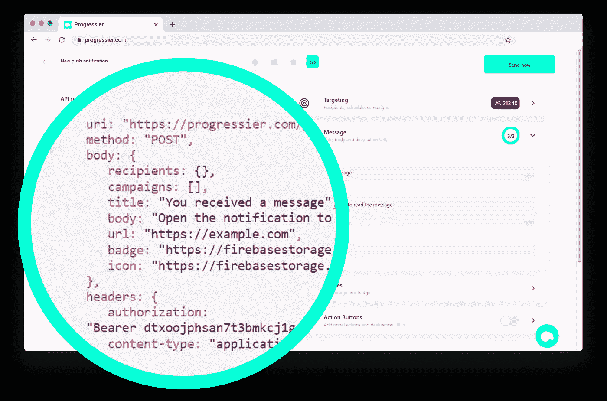

# 使用 Firebase 构建可扩展到 100 万用户的推送服务

> 原文：<https://javascript.plainenglish.io/building-a-push-service-that-scales-to-1m-subscribers-with-firebase-958b502a2a3d?source=collection_archive---------7----------------------->

在我们通常称之为*渐进式网络应用* (PWA)的功能网络中，有一个我一直觉得特别有趣:**推送通知**。

我构建了 [**Progressier**](https://progressier.com?ref=m0623) 来帮助开发者不用写任何代码就能把任何网站变成 PWA。所以，在这个过程中，我必须构建一个推送解决方案。哦，天哪…这可不容易。

在本文中，我将带您了解我们在 Firebase/GCP 开发过程中遇到的一些挑战，以及我们是如何克服这些挑战的。请注意，本文不包含任何代码片段。

# 挑战 1:个性化与营销

推送通知…它们是干什么用的？嗯，向用户发送推送通知主要有两种情况:

**一个**。个性化的应用内事件，例如*有人对自己写的帖子发表了评论*。

**B** 。营销活动，例如*您刚刚为所有用户发布了一项新功能*

一些解决方案(如 [OneSignal](https://onesignal.com/) 或[Subscribers.com](https://subscribers.com/))特别适合第二种用例。您向一大群订户发送相同的通知。第一个用例需要个性化—每个特定通知通常只有一个收件人。

[**Progressier**](https://progressier.com?ref=m0623) 意在成为 PWA 功能的一体化解决方案。因此，您应该能够向某个特定用户或整个用户群发送通知——同样容易。

Progressier has a dashboard that lets you preview your notification on different devices

需要注意的是，使用*用例 B* ，通知是可预测地发送的。因此，你只需登录 [**Progressier**](https://progressier.com?ref=m0623) 仪表盘，当你有值得推送的内容*要说时(一个功能发布，你的黑色星期五销售，等等)，就可以向所有订阅者发送通知。*

*有了*用例 A* ，你的方法必须是程序化的。你不知道用户什么时候会评论另一个用户的帖子。所以你需要一个 API。您需要将该 API 与您自己的代码集成在一起。每当*值得推送的*事件发生时(一个用户给你发了一条私人消息，你的信用卡过期了，有人喜欢你的帖子，等等)，你调用我们的 API 来通知细节。*

*因为[**Progressier**](https://progressier.com?ref=m0623)**是一个无代码解决方案，它必须适应两种用例。因此，当你注册 [**Progressier**](https://progressier.com?ref=m0623) 时，你就可以同时访问仪表盘和 API。所以不管你对代码有多精通，这个解决方案都会为你工作。***

***挑战是[不重复我们自己](https://en.wikipedia.org/wiki/Don%27t_repeat_yourself)。一般来说，设计架构时尽可能减少维护工作量是一个好主意。所以我们首先构建了 API。然后，我们围绕 API 设计了仪表板。所以在幕后，仪表板实际上只是 API 的前端。这实际上使得测试 API 更加容易。***

******

***Neat little trick: the dashboard lets you preview what the request would look like if you directly used the API. And when you click “Send now”, this is the exact request it will make.***

# *****挑战 2:连接用户数据*****

***大多数推送服务允许你根据地理位置、浏览器或设备对用户进行细分。细分通常是一个瓶颈。你更有可能用特定的电子邮件、特定的类型(例如免费还是付费)或特定的计划向用户发送通知。***

***一旦你在你的应用中嵌入了 [**Progressier**](https://progressier.com?ref=m0623) (实际上只有一行代码)，你就可以在 [**Progressier**](https://progressier.com?ref=m0623) 的匹配用户档案中添加你自己的用户数据。因此，当需要发送通知时，您可以将刚刚连接的数据锁定为目标用户。用户登录后，您只需在客户端代码中调用以下方法。***

******

***Call progressier.add with your user data to add it to Progressier***

***挑战在于 Firestore 的数据查询选项有限。所以目前我们只支持*精确匹配查询*。您可以向其*用户类型*为"*免费*"、其*电子邮件*为"*john@example.com*"或其*国家*为"*德国"*"的任何人发送通知。或者两者的混合。但比如你不能针对订阅费*大于* 10 美元的用户。您不能在用户配置文件中添加任何不是数字/布尔值/字符串的内容。虽然有限，但仍然比大多数推送服务提供的要多——通常只是让你给用户订阅*主题。****

# ***挑战 3:统计用户数量***

******

***我们的分析功能可让您随时跟踪订阅和应用安装情况。尽管看起来相当简单，但在幕后，它真的很复杂。***

***首先，没有检测应用程序安装的实际方法。不同浏览器的应用程序安装构成也不同。因此，这主要是一个猜测游戏，虽然没有完美的解决方案，但我们的方法是对实际在设备上安装给定 PWA 的用户数量的一个很好的估计。***

***其次，我们的一些客户每天都有 1000 多名新订户在他们的应用程序中注册推送通知。因此，我们的分析不能只是在我们的客户打开分析页面时计算所有订户。这将导致非常昂贵和缓慢的查询。***

***当有人注册推送通知时，具体会发生什么:***

*   ***推送订阅的端点保存在 Progressier 的用户配置文件中***
*   ***我们随机增加我们为那一天创建的 500 个分布式计数器中的一个。我们需要很多计数器，因为不建议每秒更新一个 Firestore 文档[超过一次](https://cloud.google.com/firestore/docs/best-practices)。因此，通过每天为每个应用程序创建 500 个计数器，我们可以在许多不同的文档上传播更新。***
*   ***在每天结束时(大约 00:05 GMT)，一个预定的函数检索所有 500 个计数器，并将它们变成一个，然后将当天的最终订阅/安装数保存在一个新文档中***
*   ***在该预定功能期间，我们还增加了一个全局计数器，用于跟踪该特定应用的订阅/安装总数。所以你可以看到你的总数，而不必每天加载。***

# *****挑战 4:发送给 100 万用户*****

***下面是发送推送通知在幕后如何工作的一个小提示:***

1.  ***您要求用户允许您的应用程序中的通知。如果他们点击“*允许*，你会得到一个唯一的端点。根据数据库中的用户配置文件保存该端点。***
2.  ***要向该特定用户发送通知，您需要从数据库中查询用户配置文件，并向该端点发出一个 HTTP 请求，其中包含推送通知的详细信息。***

***总而言之，向用户发送推送通知并不比向任何随机端点发出 POST 请求复杂多少。更困难的是同时发送给多个用户。***

***20 个用户？还是容易。您只需遍历您的用户列表并发出 20 个 HTTP 请求。***

***100 万用户？你需要一个完全不同的策略。***

***秘制酱的具体配方我就不透露了，不过在 [**Progressier**](https://progressier.com?ref=m0623) 中，涉及到[云任务](https://cloud.google.com/tasks)、 [Firestore 触发器](https://firebase.google.com/docs/functions/firestore-events?hl=en)、 [Firestore 分页](https://firebase.google.com/docs/firestore/query-data/query-cursors?hl=en)。***

***一旦您在 [**Progressier**](https://progressier.com?ref=m0623) 仪表板中点击 *Send* (或使用我们的 API)，通知的详细信息就会保存在数据库中。Firestore 触发器侦听该事件，然后调用一个函数来检索应该接收该事件的所有用户的分页列表——基于您的目标。***

***然后，对于分页列表中的每个用户，服务器在云任务队列中创建一个任务。然后进入下一页用户。***

***然后，云任务队列中的所有任务都以预定义的速率一个接一个地被处理(这样我们就不会因为一次发送给太多用户而导致整个系统崩溃！).***

***为此寻找合适的基础设施是一项挑战。以及更多的测试。幸运的是，我们[也拥有一个超过 10 万用户的应用](/building-a-pwa-was-our-best-idea-ever-b7b233726b41?source=your_stories_page-------------------------------------)我们可以在上面测试 [**Progressier**](https://progressier.com?ref=m0623) 。***

# ***结论***

***所以，如果你想为自己或其他开发者建立一个推送服务。希望这篇文章能帮助你理解你将要面临的一些挑战。***

***如果你不想花费时间和资源来建立一个，你也可以注册 [**Progressier**](https://progressier.com?ref=m0623) 并在 5 分钟内让它在你的网站上运行。😉***